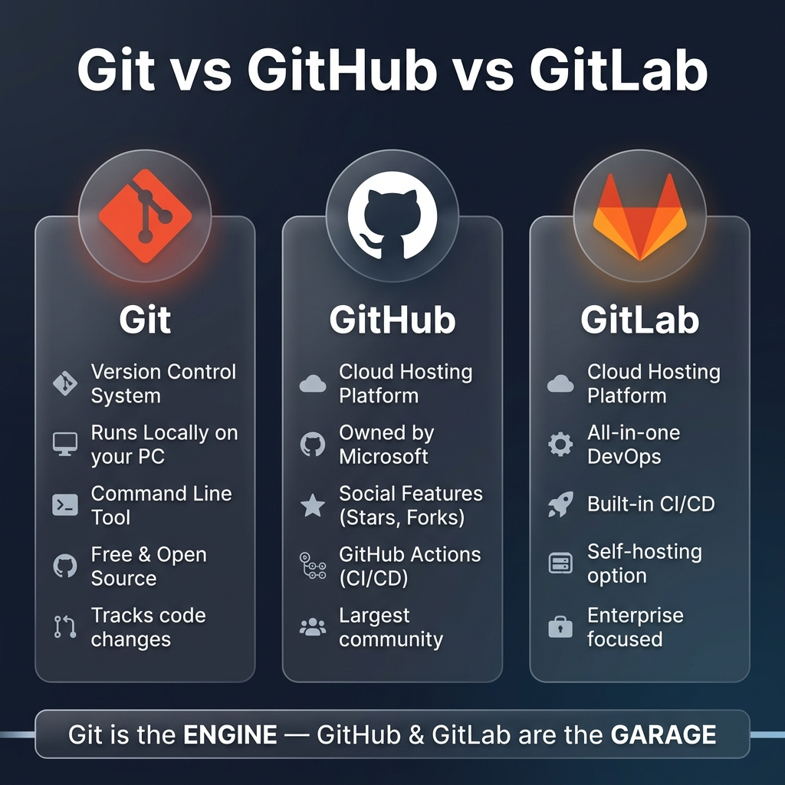
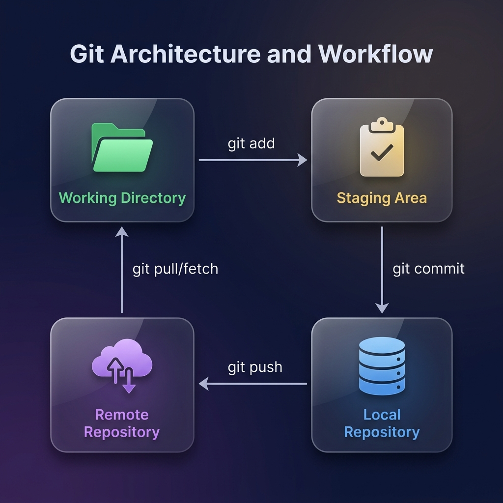
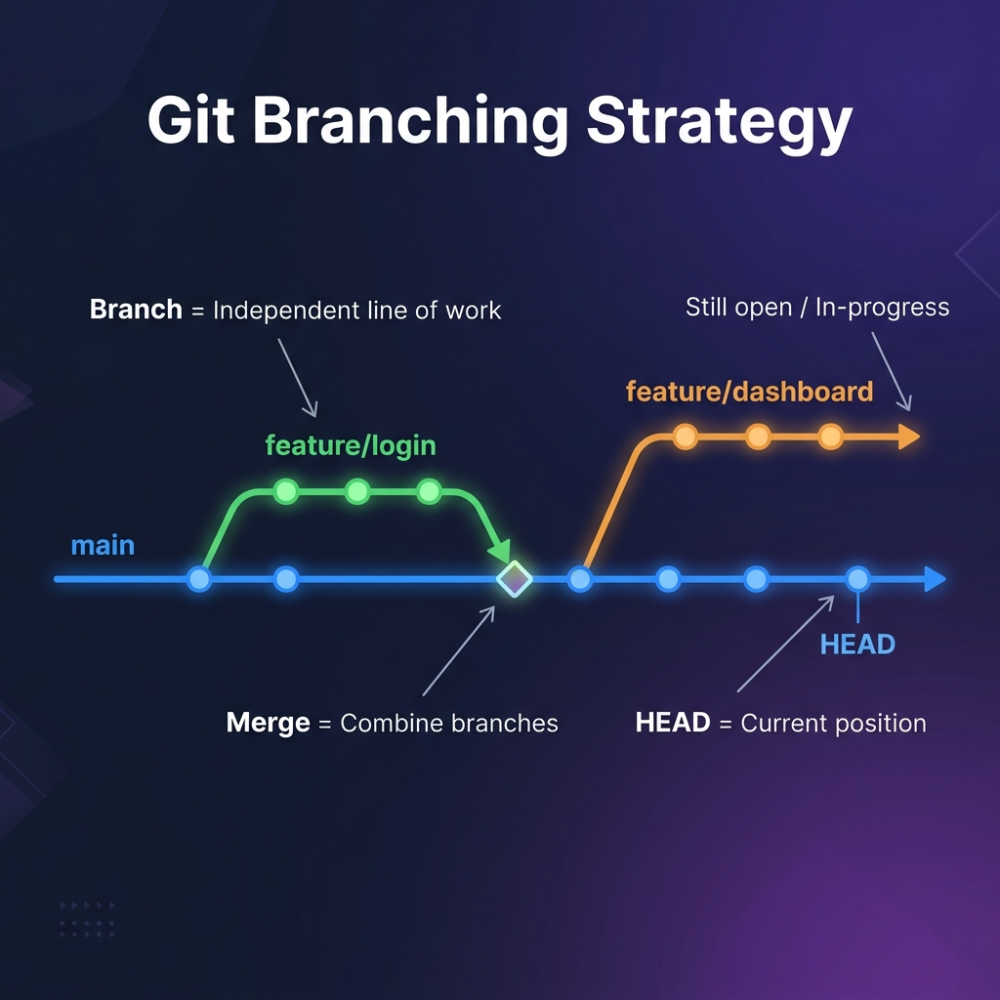
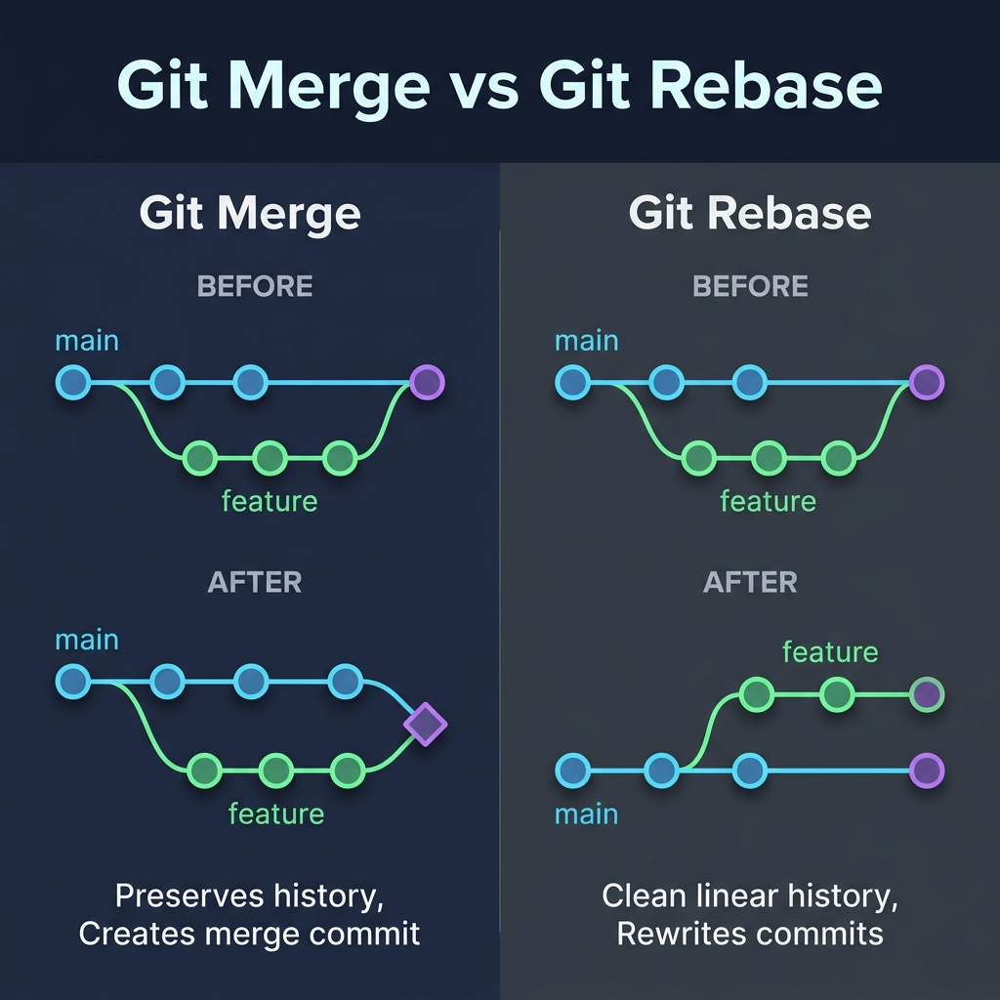
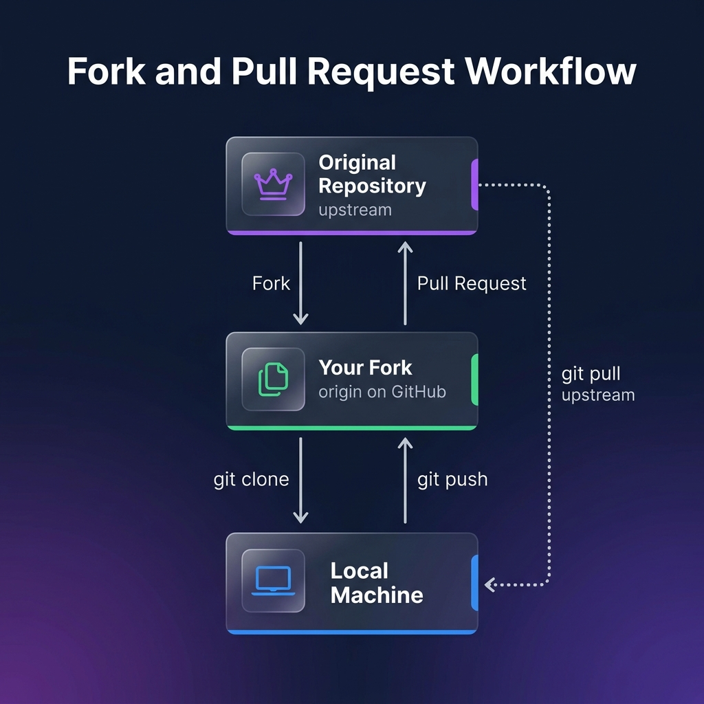

# Git — Complete Learning Notes

## 📋 Table of Contents

1. [What is Version Control?](#1-what-is-version-control)
   - [Why Do We Need It?](#why-do-we-need-it)
   - [Types of Version Control Systems](#types-of-version-control-systems)
2. [What is Git?](#2-what-is-git)
   - [A Brief History](#a-brief-history)
   - [Key Features of Git](#key-features-of-git)
3. [Git vs GitHub vs GitLab](#3-git-vs-github-vs-gitlab)
   - [Comparison Table](#comparison-table)
   - [Which One Should You Use?](#which-one-should-you-use)
4. [Installing Git](#4-installing-git)
   - [Verify Installation](#verify-installation)
   - [First-Time Configuration](#first-time-configuration)
5. [Git Architecture — The Three Areas](#5-git-architecture--the-three-areas)
   - [Working Directory](#1-working-directory)
   - [Staging Area (Index)](#2-staging-area-index)
   - [Local Repository (.git)](#3-local-repository-git)
   - [Remote Repository](#4-remote-repository)
6. [Your First Repository](#6-your-first-repository)
   - [git init — Creating a New Repo](#git-init--creating-a-new-repo)
   - [git clone — Copying an Existing Repo](#git-clone--copying-an-existing-repo)
7. [The Core Workflow — add, commit, push](#7-the-core-workflow--add-commit-push)
   - [git status — Checking the State](#git-status--checking-the-state-of-your-files)
   - [git add — Staging Changes](#git-add--staging-your-changes)
   - [git commit — Saving a Snapshot](#git-commit--saving-a-snapshot)
   - [git push — Uploading to Remote](#git-push--uploading-to-the-remote)
   - [git pull — Downloading Updates](#git-pull--downloading-updates)
8. [Understanding .gitignore](#8-understanding-gitignore)
9. [Viewing History](#9-viewing-history)
   - [git log](#git-log--viewing-commit-history)
   - [git diff](#git-diff--seeing-what-changed)
   - [git show](#git-show--inspecting-a-commit)
10. [Branching](#10-branching)
    - [What is a Branch?](#what-is-a-branch)
    - [Creating & Switching Branches](#creating--switching-branches)
    - [Listing & Deleting Branches](#listing--deleting-branches)
11. [Merging](#11-merging)
    - [Fast-Forward Merge](#fast-forward-merge)
    - [Three-Way Merge](#three-way-merge)
    - [Merge Conflicts](#-merge-conflicts)
12. [Rebasing](#12-rebasing)
    - [Merge vs Rebase](#merge-vs-rebase)
    - [Interactive Rebase](#interactive-rebase)
    - [The Golden Rule of Rebasing](#-the-golden-rule-of-rebasing)
13. [Undoing Changes](#13-undoing-changes)
    - [git restore — Discard Working Directory Changes](#git-restore--discard-working-directory-changes)
    - [git reset — Unstage or Rewind Commits](#git-reset--unstage-or-rewind-commits)
    - [git revert — Safely Undo a Commit](#git-revert--safely-undo-a-commit)
    - [git stash — Temporarily Save Work](#git-stash--temporarily-save-work)
14. [Remote Repositories](#14-remote-repositories)
    - [Remote, Origin, Upstream](#remote-origin-upstream)
    - [git remote](#git-remote--managing-remotes)
    - [git fetch vs git pull](#git-fetch-vs-git-pull)
15. [Forking & Pull Requests](#15-forking--pull-requests)
    - [Fork Workflow](#the-fork-workflow)
    - [Creating a Pull Request](#creating-a-pull-request)
    - [Keeping Your Fork in Sync](#keeping-your-fork-in-sync)
16. [Tagging](#16-tagging)
17. [Cherry-Pick](#17-cherry-pick)
18. [Git Blame](#18-git-blame)
19. [Git Aliases (Shortcuts)](#19-git-aliases-shortcuts)
20. [Git Hooks](#20-git-hooks)
21. [Common Branching Strategies](#21-common-branching-strategies)
    - [Git Flow](#git-flow)
    - [GitHub Flow](#github-flow)
    - [Trunk-Based Development](#trunk-based-development)
22. [SSH vs HTTPS](#22-ssh-vs-https)
23. [GitHub Actions — CI/CD Basics](#23-github-actions--cicd-basics)
24. [Best Practices](#24-best-practices)
25. [Common Mistakes & How to Fix Them](#25-common-mistakes--how-to-fix-them)
26. [Terminal / Shell Commands (macOS)](#26-terminal--shell-commands-macos)
27. [Complete Git Cheat Sheet](#27-complete-git-cheat-sheet-)

---

# 1. What is Version Control?

Version Control is a system that **records changes** to a file or set of files over time so that you can recall specific versions later. Think of it like an **unlimited Undo button** for your entire project — but smarter, because it also lets multiple people work on the same project at the same time without stepping on each other's toes.

### Why Do We Need It?

Imagine you're writing a school essay. You save it as:
- `essay_v1.docx`
- `essay_v2_final.docx`
- `essay_v2_FINAL_FINAL.docx`
- `essay_v2_FINAL_FINAL_really_final.docx`

Sound familiar? 😅 That's manual version control — and it's a nightmare. Now imagine doing this with a project that has **hundreds of files** and **multiple people** editing them. It would be total chaos.

A Version Control System (VCS) solves all of this by:
- 📸 **Tracking every change** — Who changed what, when, and why?
- ⏪ **Allowing you to go back in time** — Made a mistake? Roll back to a working version.
- 👥 **Enabling teamwork** — Multiple people can work on the same project simultaneously.
- 🔀 **Managing parallel work** — Different features can be developed separately and combined later.

---

### Types of Version Control Systems

| Type | Full Form | How It Works | Examples | Drawback |
|------|-----------|-------------|----------|----------|
| **Local VCS** | Local Version Control System | Saves versions in a local database on your computer | RCS (Revision Control System) | Only works on one machine, no collaboration |
| **CVCS** | Centralized Version Control System | One central server stores all versions; everyone connects to it | SVN (SubVersioN), Perforce | If the central server goes down, nobody can work |
| **DVCS** | Distributed Version Control System | Every person has a **full copy** of the entire project history | **Git**, Mercurial | Slightly more complex to learn (but worth it!) |

> 💡 **Git is a DVCS (Distributed Version Control System)** — this means even if the server crashes, every team member has a complete backup of the entire project history on their own computer!

#### 📖 Full Forms of All Abbreviations

| Short Form | Full Form | What It Is |
|------------|-----------|------------|
| **VCS** | Version Control System | A tool that tracks changes to files over time |
| **CVCS** | Centralized Version Control System | One central server holds all the code |
| **DVCS** | Distributed Version Control System | Everyone has a full copy of the code |
| **RCS** | Revision Control System | An old local-only version control tool |
| **SVN** | SubVersioN (Apache Subversion) | A popular centralized version control system |
| **GPL** | General Public License | A free software license — means anyone can use, share, and modify the software for free |
| **SHA-1** | Secure Hash Algorithm 1 | A math formula that turns any data into a unique 40-character code (like a fingerprint for your files) |
| **CI/CD** | Continuous Integration / Continuous Deployment | Automatically testing and releasing code every time you push |
| **SSH** | Secure Shell | A secure way to connect to a remote computer without typing a password each time |
| **HTTPS** | HyperText Transfer Protocol Secure | The secure version of HTTP — how websites communicate safely |
| **URL** | Uniform Resource Locator | A web address (like `https://github.com`) |
| **PR** | Pull Request | A request to merge your code changes into someone else's project |
| **MR** | Merge Request | GitLab's name for a Pull Request (same thing, different name) |
| **IDE** | Integrated Development Environment | Your code editor (like VS Code, IntelliJ) |
| **API** | Application Programming Interface | A way for two programs to talk to each other |

---

# 2. What is Git?

**Git** is a free, open-source **Distributed Version Control System** created by **Linus Torvalds** in **2005** (the same person who created Linux!). It is the most widely used version control system in the world — used by Google, Microsoft, Facebook, Netflix, and nearly every software company.

### A Brief History

In 2005, the Linux kernel team was using a paid/private tool called BitKeeper for version control. When the free license was taken away, Linus Torvalds decided to build his own system with these goals:
- ⚡ **Speed** — Operations should be lightning fast
- 🔒 **Data Integrity** — Every change gets a unique fingerprint (using SHA-1 — a math formula that creates a unique 40-character code for any piece of data). If even one letter changes, the fingerprint changes, so Git always knows if something was tampered with.
- 🌿 **Branching Support** — Creating branches should be instant and cheap
- 📦 **Distributed** — Everyone gets a full copy; no central point of failure

He built the first working version of Git in just **10 days**!

> 🧠 **Fun Fact:** The name "Git" is British slang for a foolish person. Linus joked: "I name all my projects after myself — first Linux, now Git."

---

### Key Features of Git

| Feature | What It Means |
|---------|--------------|
| **Distributed** | Every contributor has a full copy of the repository, including the complete history |
| **Snapshots, not Diffs** | Git takes a "photo" of your entire project at each commit, not just the things that changed |
| **Integrity** | Every file and commit gets a unique fingerprint (SHA-1 hash). If anything changes, Git will know immediately |
| **Branching is Cheap** | Creating a new branch takes milliseconds and barely any disk space |
| **Staging Area** | A unique "preparation zone" where you can review changes before committing |
| **Speed** | Almost every operation is performed locally (on your computer), so it's extremely fast |
| **Free & Open Source** | Licensed under GPL v2 (General Public License) — anyone can use, modify, and share it for free |

---

# 3. Git vs GitHub vs GitLab

This is one of the most common confusions for beginners. Let's clear it up once and for all.



> 💡 **The simplest analogy:** Git is the **engine** of a car. GitHub and GitLab are **garages** where you park, showcase, and collaborate on your car.

### What is Git?
- A **tool** (software) that runs on your computer
- Tracks changes in your code locally
- Works entirely **offline** — you don't need internet to commit, branch, or view history
- It's the underlying technology; GitHub and GitLab are built *on top of* Git

### What is GitHub?
- A **cloud platform** (website) owned by **Microsoft** (acquired in 2018 for $7.5 billion)
- Hosts your Git repositories online so others can see and contribute to them
- Adds social features: Stars ⭐, Followers, Issues, Discussions
- Offers **GitHub Actions** for CI/CD (automated testing & deployment)
- Home to the **largest open-source community** in the world (100M+ developers)
- Free for public repositories; paid plans for private enterprise features

### What is GitLab?
- A **cloud platform** (website) similar to GitHub, but with a DevOps-first approach
- Founded in 2011, it's an **all-in-one DevOps platform** (planning → coding → testing → deploying → monitoring)
- Has **built-in CI/CD** (no need for third-party tools — it's part of the core product)
- Offers a **self-hosted option** — companies can run GitLab on their own servers for full control
- More popular in **enterprise environments** that need strict compliance
- Uses "Merge Requests" instead of GitHub's "Pull Requests" (same concept, different name)

---

### Comparison Table

| Feature | Git | GitHub | GitLab |
|---------|-----|--------|--------|
| **What is it?** | Version Control Tool | Cloud Hosting Platform | Cloud Hosting + DevOps Platform |
| **Where does it run?** | Your computer (local) | Cloud (github.com) | Cloud (gitlab.com) or Self-Hosted |
| **Internet required?** | ❌ No (works offline) | ✅ Yes | ✅ Yes |
| **Owned by** | Open Source Community | Microsoft | GitLab Inc. |
| **CI/CD** | ❌ Not built-in | GitHub Actions (separate) | Built-in (core feature) |
| **Free tier** | 100% Free | Free for public repos | Free (more features than GitHub free) |
| **Self-hosting** | N/A (it's local) | GitHub Enterprise (paid) | ✅ Free Community Edition |
| **Best for** | Local version control | Open-source & community projects | Enterprise DevOps pipelines |
| **Issue Tracking** | ❌ No | ✅ Yes | ✅ Yes (more advanced) |
| **Code Review** | ❌ No | Pull Requests | Merge Requests |
| **Wiki** | ❌ No | ✅ Yes | ✅ Yes |
| **Package Registry** | ❌ No | GitHub Packages | GitLab Package Registry |

### Which One Should You Use?

- **Learning & Personal Projects:** Use **GitHub** — it's the most popular, has the largest community, and most tutorials reference it.
- **Open Source Contribution:** Use **GitHub** — 90%+ of open-source projects live here.
- **Enterprise / Company Projects:** Use **GitLab** — its built-in CI/CD and self-hosting options make it popular for companies with strict security needs.
- **You always need Git** — regardless of whether you use GitHub or GitLab, Git is the underlying tool running on your computer.

> 🔑 **Key Takeaway:** You can use GitHub *and* GitLab at the same time! They're just websites that store your Git repositories. Many professionals push the same code to both platforms.

---

# 4. Installing Git

### macOS
```bash
# Using Homebrew (recommended)
brew install git

# Or download from the official website
# https://git-scm.com/download/mac
```

### Windows
```bash
# Download the installer from:
# https://git-scm.com/download/win
# Run the installer and follow the steps (keep defaults)
```

### Linux (Ubuntu/Debian)
```bash
sudo apt update
sudo apt install git
```

---

### Verify Installation
```bash
git --version
# Output: git version 2.44.0 (or similar)
```

### First-Time Configuration

After installing Git, you **must** set your name and email. These are attached to every commit you make — they tell everyone *who* made the change.

```bash
# Set your name (appears in commit history)
git config --global user.name "Shujauddin"

# Set your email (should match your GitHub account email)
git config --global user.email "your.email@example.com"

# Set the default branch name to 'main' (instead of the old 'master')
git config --global init.defaultBranch main

# Set your preferred text editor (for commit messages)
git config --global core.editor "code --wait"  # VS Code

# View all your settings
git config --list
```

> 💡 The `--global` flag means these settings apply to **all** your Git projects. Without it, settings only apply to the current project.

#### Config Levels

| Level | Flag | Where it's stored | Scope |
|-------|------|-------------------|-------|
| **System** | `--system` | `/etc/gitconfig` | All users on the computer |
| **Global** | `--global` | `~/.gitconfig` | All projects for current user |
| **Local** | `--local` | `.git/config` (inside the project) | Only the current project |

> Local overrides Global, and Global overrides System.

---

# 5. Git Architecture — The Three Areas

Understanding the **three areas** of Git is the most important concept to grasp as a beginner. Every Git operation moves data between these areas.



### 1. Working Directory
This is your **project folder** — the actual files and folders you see on your computer. When you open your code editor, every file you see and edit is in the Working Directory.

- **Status:** Files here are either **Tracked** (Git knows about them) or **Untracked** (new files Git hasn't seen yet).
- **Analogy:** This is your **desk** where you're actively working on documents.

### 2. Staging Area (Index)
The Staging Area is like a **preview room** or a **shopping cart**. When you run `git add`, you're placing your changes here — saying "I want to include these changes in my next commit."

- **Why it exists:** It gives you the power to **selectively** choose which changes to commit. You might have changed 10 files, but only want to commit 3 of them.
- **Analogy:** This is the **outbox tray** on your desk. You've finished editing these documents and placed them in the tray, ready to be filed away. But they aren't filed yet — you can still take them back.

### 3. Local Repository (.git)
When you run `git commit`, the changes move from the Staging Area into the Local Repository. This is the hidden `.git` folder inside your project. It contains the **complete history** of your project — every commit, every branch, everything.

- **What happens:** Git takes a "snapshot" (photo) of all staged files and saves it permanently with a unique ID (a 40-character fingerprint called a SHA-1 hash — think of it like a barcode for that exact version of your code), your name, email, timestamp, and your commit message.
- **Analogy:** This is the **filing cabinet** in your office. Once documents are filed, they are saved permanently and can be retrieved anytime.

### 4. Remote Repository
This lives on the internet (GitHub, GitLab, Bitbucket). When you run `git push`, your commits travel from the Local Repository to the Remote. When you run `git pull`, commits come from the Remote to your Local.

- **Why it exists:** Backup, collaboration, and code sharing.
- **Analogy:** This is a **cloud storage locker** that your entire team has access to.

### The Flow in One Sentence

```
Edit files (Working Dir) → git add (Staging) → git commit (Local Repo) → git push (Remote Repo)
```

---

# 6. Your First Repository

### git init — Creating a New Repo

`git init` creates a brand new Git repository in your current directory. It adds a hidden `.git` folder that contains all the version control data.

```bash
# Create a new project folder
mkdir my-project
cd my-project

# Initialize Git inside this folder
git init
# Output: Initialized empty Git repository in /path/to/my-project/.git/
```

> ⚠️ **Important:** Never run `git init` inside another Git repository. It creates nested repos which cause confusion.

```bash
# What the .git folder contains (you don't need to touch these)
ls -la .git/
# HEAD         → Points to the current branch
# config       → Project-specific configuration
# hooks/       → Scripts that run on certain events
# objects/     → All your data (commits, files, trees)
# refs/        → Pointers to commits (branches, tags)
```

---

### git clone — Copying an Existing Repo

`git clone` downloads an **entire repository** (with its full history) from a remote server to your computer.

```bash
# Clone using HTTPS
git clone https://github.com/username/repository.git

# Clone using SSH (faster, more secure, no password prompts)
git clone git@github.com:username/repository.git

# Clone into a specific folder name
git clone https://github.com/username/repository.git my-folder-name

# Clone only a specific branch
git clone --branch develop https://github.com/username/repository.git

# Shallow clone (only latest commit — faster for large repos)
git clone --depth 1 https://github.com/username/repository.git
```

> 💡 **git init vs git clone:**
> - Use `git init` when **starting a brand new project from scratch**
> - Use `git clone` when **downloading an existing project** from GitHub/GitLab

---

# 7. The Core Workflow — add, commit, push

These three commands are the bread and butter of Git. You will use them **every single day**.

### git status — Checking the State of Your Files

`git status` tells you what's going on in your repository right now. Think of it as asking Git: "Hey, what's changed since my last commit?"

```bash
git status

# Example output:
# On branch main
# Changes not staged for commit:
#   modified:   index.html      ← file was changed but NOT staged
#
# Untracked files:
#   styles.css                  ← brand new file Git hasn't seen before
```

```bash
# Short version (compact output)
git status -s

# Output:
#  M index.html     ← M = Modified
# ?? styles.css     ← ?? = Untracked (new file)
```

**Understanding the short status flags:**

The output of `git status -s` shows **two columns** before each filename. The **left column** shows the status in the **Staging Area** and the **right column** shows the status in the **Working Directory**.

| Symbol | Full Form / Meaning | Example Scenario |
|--------|--------------------|-----------------|
| `??` | **Untracked** — brand new file Git has never seen | You just created `newfile.js` |
| `A` | **Added** — new file added to staging | You ran `git add newfile.js` on a new file |
| `M` | **Modified** — file was changed | You edited an existing tracked file |
| `D` | **Deleted** — file was removed | You deleted a tracked file |
| `R` | **Renamed** — file was renamed | You renamed `old.js` to `new.js` |
| `C` | **Copied** — file was copied | You copied a file (rare, needs `--find-copies` flag) |
| `U` | **Unmerged** — file has a merge conflict | Two branches changed the same file and Git doesn't know which to keep |
| `!` | **Ignored** — file is listed in `.gitignore` | Only shows with `git status --ignored` |
| `MM` | **Modified twice** — changed, staged, then changed again | You edited → staged → edited the same file again |
| `AM` | **Added then Modified** — new file staged, then changed again | You added a new file, staged it, then made more edits |
| `UU` | **Both Modified (Conflict)** — both branches changed this file | During a merge, both sides edited the same file |
| ` M` | (space + M) **Modified in Working Dir only** — not staged yet | You changed a file but haven't run `git add` |
| `M ` | (M + space) **Modified and Staged** — ready to commit | You changed a file and ran `git add` |

> 💡 **Quick tip:** If you see `U` or `UU`, it means you have a **merge conflict** that needs to be resolved before you can commit!

---

### git add — Staging Your Changes

`git add` moves changes from the Working Directory to the Staging Area. You're telling Git: "I want to include these specific changes in my next commit."

```bash
# Stage a specific file
git add index.html

# Stage multiple specific files
git add index.html styles.css script.js

# Stage ALL changed and new files in the project
git add .

# Stage all files with a specific extension
git add *.js

# Stage all files in a specific folder
git add src/

# Interactive staging (choose changes within a file)
git add -p
```

> ⚠️ **`git add .` vs `git add -A`:**
> - `git add .` — stages new files and modifications in the **current directory and below**
> - `git add -A` — stages new files, modifications, **and deletions** in the **entire repository**
> - In most cases, they work the same way. Use `git add .` for simplicity.

---

### git commit — Saving a Snapshot

`git commit` takes everything in the Staging Area and saves it as a **permanent snapshot** in the Local Repository. Each commit gets a unique ID — a 40-character code called a SHA-1 hash (think of it like a **fingerprint** or **barcode** — no two commits will ever have the same one).

```bash
# Commit with a message (most common)
git commit -m "Add navigation bar to homepage"

# Commit with a detailed multi-line message
git commit -m "Add navigation bar to homepage" -m "Includes responsive hamburger menu for mobile devices"

# Stage ALL tracked files and commit in one step (skips git add)
git commit -am "Fix typo in header"
# ⚠️ This only works for files Git already knows about (tracked files). New files still need git add first!

# Open your text editor to write a longer commit message
git commit
```

#### ✍️ Writing Good Commit Messages

Bad commit messages make your project history useless. Good messages tell a story.

```bash
# ❌ Bad commit messages
git commit -m "fix"
git commit -m "stuff"
git commit -m "asdfgh"
git commit -m "changes"

# ✅ Good commit messages
git commit -m "Fix login button not responding on mobile"
git commit -m "Add email validation to signup form"
git commit -m "Refactor API service to use async/await"
git commit -m "Remove deprecated jQuery dependency"
```

**The Conventional Commit Format (Industry Standard):**

```
<type>: <short description>

[optional body explaining WHY you made the change]
```

| Type | When to Use |
|------|------------|
| `feat` | Adding a new feature |
| `fix` | Fixing a bug |
| `docs` | Documentation changes only |
| `style` | Formatting, whitespace (no code change) |
| `refactor` | Restructuring code without changing behavior |
| `test` | Adding or updating tests |
| `chore` | Maintenance tasks (updating dependencies, etc.) |

```bash
# Examples using Conventional Commits
git commit -m "feat: add dark mode toggle to settings"
git commit -m "fix: resolve crash when user uploads empty file"
git commit -m "docs: update README with installation steps"
git commit -m "test: add unit tests for payment module"
```

---

### git push — Uploading to the Remote

`git push` sends your committed changes from the Local Repository to the Remote Repository (GitHub/GitLab).

```bash
# Push to the default remote (origin) on the current branch
git push

# Push a specific branch to origin
git push origin main

# Push and set upstream (first push of a new branch)
git push -u origin feature/login
# After this, you can just type `git push` for future pushes on this branch

# Force push (overwrites remote history — DANGEROUS!)
git push --force
# ⚠️ Only use this if you KNOW what you're doing. It can delete other people's work!

# Safer force push (fails if someone else pushed since your last pull)
git push --force-with-lease
```

> 💡 **What does `-u` mean?** The `-u` flag (short for `--set-upstream`) links your local branch to the remote branch. After doing this once, Git remembers the connection and you can just type `git push` or `git pull` without specifying the remote and branch every time.

---

### git pull — Downloading Updates

`git pull` downloads changes from the Remote Repository and merges them into your current branch. It's basically `git fetch` + `git merge` in one command.

```bash
# Pull changes from the remote for the current branch
git pull

# Pull from a specific remote and branch
git pull origin main

# Pull with rebase (cleaner history, avoids merge commits)
git pull --rebase

# Pull and allow unrelated histories (useful for first link between repos)
git pull origin main --allow-unrelated-histories
```

> 💡 **Best Practice:** Always `git pull` before you start working and before you `git push`. This ensures you have the latest code and reduces the chance of merge conflicts.

---

# 8. Understanding .gitignore

The `.gitignore` file tells Git which files and folders to **completely ignore**. These files will never be tracked or committed.

**Why do we need it?** Some files should never be in version control:
- **Node modules** (`node_modules/`) — these are huge and can be reinstalled with `npm install`
- **Environment secrets** (`.env`) — contains passwords, API keys
- **Build outputs** (`dist/`, `build/`) — generated files, not source code
- **OS files** (`.DS_Store`, `Thumbs.db`) — operating system junk files
- **IDE settings** (`.vscode/`, `.idea/`) — personal editor preferences

### Creating a .gitignore File

```bash
# Create .gitignore in your project root
touch .gitignore
```

### Common .gitignore Patterns

```gitignore
# Dependencies
node_modules/
vendor/

# Environment variables (NEVER commit secrets!)
.env
.env.local
.env.production

# Build output
dist/
build/
out/

# OS-generated files
.DS_Store          # macOS
Thumbs.db          # Windows
*.swp              # Vim swap files

# IDE/Editor folders
.vscode/
.idea/
*.sublime-project

# Log files
*.log
npm-debug.log*

# Test coverage
coverage/

# Compiled files
*.class
*.o
*.pyc

# Package lock files (optional — some teams commit these, some don't)
# package-lock.json

# Ignore all .txt files
*.txt

# But DO track this specific one
!important.txt

# Ignore an entire folder
temp/

# Ignore files in any subdirectory with this name
**/logs/
```

> 💡 **Tip:** GitHub provides ready-made `.gitignore` templates for different languages and frameworks:
> **https://github.com/github/gitignore**

> ⚠️ **Important:** `.gitignore` only works for files that are **not yet tracked**. If you already committed a file and then add it to `.gitignore`, Git will still track it. To fix this:
> ```bash
> # Remove the file from tracking (but keep it on your computer)
> git rm --cached filename.txt
> git commit -m "chore: remove filename.txt from tracking"
> ```

---

# 9. Viewing History

### git log — Viewing Commit History

`git log` shows you the history of all commits in the current branch, from newest to oldest.

```bash
# Full log (detailed) — press 'q' to exit
git log

# Output for each commit:
# commit 3a7f2b1c... (HEAD -> main)     ← unique SHA-1 hash
# Author: Shujauddin <email>            ← who made it
# Date:   Sat Apr 18 2026               ← when
#
#     Add navigation bar to homepage     ← commit message
```

```bash
# Compact one-line view (most useful for quick scanning)
git log --oneline
# Output:
# 3a7f2b1 Add navigation bar
# 9c8d4e2 Fix login bug
# 1b2a3c4 Initial commit

# Show the last N commits
git log -5

# Show commits with a visual branch graph
git log --oneline --graph --all --decorate

# Show commits by a specific author
git log --author="Shujauddin"

# Show commits that changed a specific file
git log -- index.html

# Show commits from a date range
git log --after="2026-01-01" --before="2026-04-18"

# Search commit messages for a keyword
git log --grep="fix"

# Show what files were changed in each commit
git log --stat

# Show the actual code changes (diff) in each commit
git log -p
```

---

### git diff — Seeing What Changed

`git diff` shows you the **exact lines** that were added, modified, or deleted.

```bash
# Show changes in Working Directory (unstaged changes)
git diff

# Show changes in the Staging Area (staged but not committed)
git diff --staged
# (older alias: git diff --cached)

# Compare two branches
git diff main..feature/login

# Compare two specific commits
git diff abc1234 def5678

# Show changes for a specific file only
git diff index.html

# Show only the names of changed files (no actual code)
git diff --name-only

# Show a summary (insertions/deletions count)
git diff --stat
```

**Reading a diff output:**
```diff
--- a/index.html         ← old version of the file
+++ b/index.html         ← new version of the file
@@ -10,6 +10,8 @@       ← line numbers (old file line 10, new file line 10)
 <body>
   <h1>Welcome</h1>
-  <p>Old paragraph</p>   ← RED: this line was REMOVED
+  <p>New paragraph</p>   ← GREEN: this line was ADDED
+  <p>Extra line</p>      ← GREEN: this line was ADDED
 </body>
```

---

### git show — Inspecting a Commit

`git show` displays the details and code changes of a specific commit.

```bash
# Show the latest commit
git show

# Show a specific commit by its hash
git show 3a7f2b1

# Show only the files that were changed (no diff)
git show --stat 3a7f2b1

# Show a specific file at a specific commit
git show 3a7f2b1:index.html
```

---

# 10. Branching

Branching is one of Git's most powerful features. It lets you **create separate lines of work** without affecting the main codebase.



### What is a Branch?

A branch is simply a **pointer to a commit**. When you create a new branch, Git creates a new pointer — it doesn't copy any files! That's why branching in Git is nearly instant.

**Analogy:** Imagine a recipe book (your `main` branch). You want to try adding a new spice to a recipe, but you don't want to mess up the original. So you photocopy just the recipe page (create a branch), experiment on the copy, and if the new spice tastes great, you paste the improved version back into the original book (merge).

**Key Terms:**
- **`main` (or `master`)** — The primary branch. This should always contain stable, working code.
- **`HEAD`** — A special pointer that tells Git "which branch and commit am I currently looking at?" Think of it as a "You Are Here" pin on a map.
- **Feature Branch** — A temporary branch created to develop a specific feature (e.g., `feature/login`, `feature/dark-mode`).

---

### Creating & Switching Branches

```bash
# Create a new branch (but stay on your current branch)
git branch feature/login

# Switch to an existing branch
git checkout feature/login
# OR (modern, recommended way):
git switch feature/login

# Create AND switch to a new branch in one step
git checkout -b feature/login
# OR (modern, recommended way):
git switch -c feature/login

# Rename the current branch
git branch -m new-name

# Rename a different branch
git branch -m old-name new-name
```

> 💡 **`git switch` vs `git checkout`:**
> `git checkout` is the older command that does many things (switch branches, restore files, etc.). Git 2.23 introduced `git switch` specifically for switching branches to avoid confusion. Both work fine — `switch` is just cleaner.

---

### Listing & Deleting Branches

```bash
# List all local branches (* marks the current one)
git branch
# Output:
#   feature/login
# * main

# List all remote branches
git branch -r

# List ALL branches (local + remote)
git branch -a

# Delete a branch (only if it's been merged)
git branch -d feature/login

# Force delete a branch (even if unmerged — be careful!)
git branch -D feature/login

# Delete a remote branch
git push origin --delete feature/login
```

---

# 11. Merging

Merging is how you **combine the work from one branch into another**. When your feature is complete, you merge the feature branch back into `main`.

### Fast-Forward Merge

This happens when the branch you're merging has **all the new commits**, and `main` hasn't moved since you branched off. Git simply moves the `main` pointer forward.

```bash
# Switch to the branch you want to merge INTO
git checkout main

# Merge the feature branch
git merge feature/login
# Output: Fast-forward
```

```text
BEFORE:
main:    A --- B
                 \
feature:          C --- D

AFTER (fast-forward):
main:    A --- B --- C --- D
```

### Three-Way Merge

This happens when **both branches** have new commits. Git creates a special **merge commit** that has two parents.

```bash
git checkout main
git merge feature/dashboard
# Git opens your editor to write a merge commit message
```

```text
BEFORE:
main:    A --- B --- E
                 \
feature:          C --- D

AFTER (three-way merge):
main:    A --- B --- E --- M  (M = merge commit)
                 \       /
feature:          C --- D
```

---

### 🔥 Merge Conflicts

A merge conflict happens when **two branches change the same line** in the same file. Git cannot decide which version to keep, so it asks you to resolve it manually.

```bash
git merge feature/login
# Output: CONFLICT (content): Merge conflict in index.html
# Automatic merge failed; fix conflicts and then commit the result.
```

**What the conflicted file looks like:**
```html
<h1>Welcome to the App</h1>
<<<<<<< HEAD
<p>This is the main branch version</p>
=======
<p>This is the feature branch version</p>
>>>>>>> feature/login
```

**How to read it:**
- Everything between `<<<<<<< HEAD` and `=======` is **your current branch's** version
- Everything between `=======` and `>>>>>>> feature/login` is the **incoming branch's** version

**How to resolve it:**
1. Open the file and **manually edit** it to keep the version you want (or combine both)
2. Remove the conflict markers (`<<<<<<<`, `=======`, `>>>>>>>`)
3. Stage the resolved file and commit

```bash
# After manually fixing the file:
git add index.html
git commit -m "fix: resolve merge conflict in index.html"
```

> 💡 **Modern editors (VS Code) show you clickable buttons:** "Accept Current Change", "Accept Incoming Change", "Accept Both Changes" — making conflict resolution much easier!

**To abort a merge and go back to the state before the merge:**
```bash
git merge --abort
```

---

# 12. Rebasing

`git rebase` is an alternative to `git merge`. Instead of creating a merge commit, it **replays** your branch's commits on top of the target branch, creating a clean, linear history.



### Merge vs Rebase

| Aspect | `git merge` | `git rebase` |
|--------|-------------|--------------|
| **History** | Preserves the true branching history | Creates a clean, linear history |
| **Merge commits** | Creates a merge commit | No merge commit |
| **Safety** | Safe (never rewrites history) | ⚠️ Rewrites commit hashes |
| **Readability** | Can get messy with many branches | Clean and easy to read |
| **Use when** | Merging shared/public branches | Cleaning up local/personal branches |

```bash
# You're on feature/login and want to put your work on top of main
git checkout feature/login
git rebase main

# If there are conflicts during rebase:
git rebase --continue   # After resolving the conflict
git rebase --abort      # Cancel and go back to before the rebase
git rebase --skip       # Skip the current commit causing the conflict
```

### Interactive Rebase

Interactive rebase (`-i`) is an incredibly powerful tool that lets you **edit, combine, reorder, or delete commits** before sharing them. Think of it as editing your commit history before pushing.

```bash
# Rebase the last 3 commits interactively
git rebase -i HEAD~3
```

This opens your editor with something like:
```
pick abc1234 Add login form
pick def5678 Fix typo in login form
pick ghi9101 Add form validation

# Commands:
# p, pick   = use commit as-is
# r, reword = use commit but edit the message
# e, edit   = stop for amending
# s, squash = combine with previous commit (keep both messages)
# f, fixup  = combine with previous commit (discard this message)
# d, drop   = remove this commit entirely
```

**Common Use Cases:**
```bash
# Squash (combine) the last 3 commits into one clean commit
# Change 'pick' to 'squash' (or 's') for all except the first:

pick abc1234 Add login form
squash def5678 Fix typo in login form
squash ghi9101 Add form validation

# Result: 3 messy commits become 1 clean commit!
```

### ⚠️ The Golden Rule of Rebasing

> **NEVER rebase commits that have been pushed to a shared/public branch!**

Rebasing rewrites commit hashes. If other people have based their work on those commits, you'll create chaos. Only rebase **your own local branches** that nobody else is using.

```text
✅ OK:     Rebase your local feature branch onto main before pushing
❌ DANGER: Rebase the main branch that others are working from
```

---

# 13. Undoing Changes

Everyone makes mistakes. Git gives you multiple ways to go back — each for a different situation.

### git restore — Discard Working Directory Changes

`git restore` throws away your uncommitted changes in the Working Directory, reverting the file back to its last committed state.

```bash
# Discard changes in a specific file
git restore index.html

# Discard changes in ALL files
git restore .

# Unstage a file (move it from Staging back to Working Directory)
git restore --staged index.html

# Restore a file from a specific commit
git restore --source=abc1234 index.html
```

> ⚠️ **Warning:** `git restore` permanently discards your changes. There is no undo for this — the changes are gone forever!

---

### git reset — Unstage or Rewind Commits

`git reset` moves the `HEAD` pointer backward, effectively "un-doing" commits. There are three modes:

```bash
# Soft reset — undo commit, keep changes staged
git reset --soft HEAD~1
# Your code is intact and still staged. Just redo git commit.

# Mixed reset (default) — undo commit, unstage changes, keep in Working Directory
git reset HEAD~1
# or: git reset --mixed HEAD~1
# Your code is intact but unstaged. You need git add + git commit.

# Hard reset — undo commit AND delete all changes
git reset --hard HEAD~1
# ⚠️ DANGER: Your code changes are GONE. Use with extreme caution!
```

**Visual comparison:**

| Mode | Commit undone? | Staging Area | Working Directory |
|------|---------------|--------------|-------------------|
| `--soft` | ✅ Yes | ✅ Changes kept (still staged) | ✅ Changes kept |
| `--mixed` | ✅ Yes | ❌ Changes unstaged | ✅ Changes kept |
| `--hard` | ✅ Yes | ❌ Changes removed | ❌ Changes DELETED |

```bash
# Reset to a specific commit
git reset --hard abc1234

# Unstage a specific file (keep changes in Working Directory)
git reset HEAD index.html
```

---

### git revert — Safely Undo a Commit

Unlike `git reset` which rewrites history, `git revert` creates a **new commit** that undoes a previous commit's changes. This is safe to use on shared branches because it doesn't rewrite history.

```bash
# Revert the most recent commit
git revert HEAD

# Revert a specific commit
git revert abc1234

# Revert without automatically committing (lets you edit the changes first)
git revert --no-commit abc1234
```

> 💡 **When to use which:**
> - `git restore` → Discard changes you haven't committed yet
> - `git reset` → Undo local commits (before pushing)
> - `git revert` → Undo commits that have already been pushed to a shared branch

---

### git stash — Temporarily Save Work

Sometimes you're halfway through a feature when an urgent bug needs fixing. You don't want to commit half-finished work, and you don't want to lose it. `git stash` saves your changes to a hidden clipboard and gives you a clean Working Directory.

```bash
# Stash your current changes
git stash
# or with a descriptive message:
git stash save "WIP: login form validation"

# List all stashes
git stash list
# Output:
# stash@{0}: WIP: login form validation
# stash@{1}: On main: half-done dashboard

# Bring back the most recent stash (and remove it from stash list)
git stash pop

# Bring back the most recent stash (but keep it in the stash list)
git stash apply

# Apply a specific stash
git stash apply stash@{1}

# Delete a specific stash
git stash drop stash@{0}

# Delete ALL stashes
git stash clear

# Stash including untracked files
git stash -u

# Show what's inside a stash without applying it
git stash show stash@{0}
git stash show -p stash@{0}  # with full diff
```

---

# 14. Remote Repositories

### Remote, Origin, Upstream

These terms confuse almost everyone at first. Let's break them down:

| Term | What It Means | Analogy |
|------|--------------|---------|
| **Remote** | Any copy of the code that lives on the internet (GitHub, GitLab) instead of on your physical computer | A cloud storage locker |
| **Origin** | The default name for **YOUR** remote repository on GitHub (your fork or your own repo). When you type `git push origin`, you are pushing to YOUR GitHub account. | Your personal locker |
| **Upstream** | The **original** remote repository that you forked from. You don't have permission to push to it, but you `git pull upstream` to download any updates the owner adds. | The master copy/original source |



---

### git remote — Managing Remotes

```bash
# View all remotes
git remote -v
# Output:
# origin    https://github.com/YOU/repo.git (fetch)
# origin    https://github.com/YOU/repo.git (push)
# upstream  https://github.com/ORIGINAL-OWNER/repo.git (fetch)
# upstream  https://github.com/ORIGINAL-OWNER/repo.git (push)

# Add a new remote
git remote add upstream https://github.com/original-owner/repo.git

# Rename a remote
git remote rename origin my-fork

# Remove a remote
git remote remove upstream

# Change a remote's URL
git remote set-url origin git@github.com:YOU/repo.git
```

---

### git fetch vs git pull

Both get data from a remote, but they behave differently:

| | `git fetch` | `git pull` |
|---|-------------|------------|
| **What it does** | Downloads new data but does NOT merge it | Downloads new data AND merges it automatically |
| **Your code** | Unchanged — you can inspect before merging | Updated immediately |
| **Safety** | Safer — you stay in control | Could cause merge conflicts |
| **Use when** | You want to check what changed before merging | You want the latest code right now |

```bash
# Fetch new data from origin (does NOT change your files)
git fetch origin

# Now you can see what changed:
git log origin/main --oneline

# And merge when you're ready:
git merge origin/main

# Or just pull (fetch + merge in one step)
git pull origin main
```

> 💡 **Best Practice:** Many experienced programmers use `git fetch` followed by `git merge` (or `git rebase`) instead of `git pull` — it gives them more control over what's being merged.

---

# 15. Forking & Pull Requests

### The Fork Workflow

Forking is the standard way to contribute to open-source projects that you **don't own**.

**Step-by-Step Process:**

```bash
# 1. Fork the repository on GitHub (click the "Fork" button on the website)
#    This creates a copy under YOUR GitHub account

# 2. Clone YOUR fork to your computer
git clone https://github.com/YOUR-USERNAME/repo.git
cd repo

# 3. Add the original repository as "upstream"
git remote add upstream https://github.com/ORIGINAL-OWNER/repo.git

# 4. Create a feature branch (NEVER work directly on main!)
git switch -c fix/typo-in-readme

# 5. Make your changes, stage, and commit
git add .
git commit -m "fix: correct typo in README.md"

# 6. Push your branch to YOUR fork (origin)
git push -u origin fix/typo-in-readme

# 7. Go to GitHub and click "Create Pull Request"
```

---

### Creating a Pull Request

A Pull Request (PR) is a **request** to the original repository owner to review and merge your changes. It's not a Git feature — it's a GitHub/GitLab feature.

**A good Pull Request includes:**
1. **A clear title:** `fix: correct two filename typos in Chapter 22`
2. **A description explaining:**
   - What was changed and why
   - How to test the changes
   - Screenshots (if it's a UI change)
3. **Small, focused changes** — Don't put 10 unrelated fixes in one PR

---

### Keeping Your Fork in Sync

Over time, the original repository gets new commits that your fork doesn't have. Here's how to stay up to date:

```bash
# 1. Fetch the latest changes from the original repo
git fetch upstream

# 2. Switch to your main branch
git switch main

# 3. Merge the upstream changes into your main
git merge upstream/main

# 4. Push the updated main to your fork on GitHub
git push origin main
```

> 💡 **Always sync your fork before starting new work.** This prevents conflicts and ensures you're building on top of the latest code.

---

# 16. Tagging

Tags are like **bookmarks** on specific commits. They are most commonly used to mark **release versions** (v1.0.0, v2.1.3, etc.).

```bash
# Create a lightweight tag (just a name)
git tag v1.0.0

# Create an annotated tag (recommended — includes message, author, date)
git tag -a v1.0.0 -m "First stable release"

# Tag a specific past commit
git tag -a v0.9.0 abc1234 -m "Beta release"

# List all tags
git tag

# Show details of a specific tag
git show v1.0.0

# Push a specific tag to remote
git push origin v1.0.0

# Push ALL tags to remote
git push origin --tags

# Delete a local tag
git tag -d v1.0.0

# Delete a remote tag
git push origin --delete v1.0.0
```

> 💡 **Semantic Versioning (SemVer):** The format `vMAJOR.MINOR.PATCH` is the industry standard:
> - `MAJOR` — Breaking changes (v1.0.0 → v2.0.0)
> - `MINOR` — New features, backward compatible (v1.0.0 → v1.1.0)
> - `PATCH` — Bug fixes, backward compatible (v1.0.0 → v1.0.1)

---

# 17. Cherry-Pick

`git cherry-pick` lets you pick **a specific commit** from one branch and apply it to another branch — without merging the entire branch.

**Analogy:** Imagine a tree full of cherries (commits). Instead of cutting down the whole branch (merging), you carefully pick just the one cherry (commit) you need.

```bash
# Apply a specific commit to your current branch
git cherry-pick abc1234

# Cherry-pick without automatically committing (lets you edit first)
git cherry-pick --no-commit abc1234

# Cherry-pick multiple commits
git cherry-pick abc1234 def5678

# If there's a conflict during cherry-pick:
git cherry-pick --continue   # after resolving
git cherry-pick --abort      # cancel and go back
```

**When to use cherry-pick:**
- A critical bug fix was made on a feature branch and you need it on `main` immediately
- You accidentally committed to the wrong branch
- You need a specific change from an old branch without merging everything

---

# 18. Git Blame

`git blame` shows you **who wrote each line** of a file, **when** they wrote it, and **which commit** it was part of. It's like a detective tool — when you find a confusing or broken line of code, you can trace it back to the exact person and commit that introduced it.

**Analogy:** Imagine every line of code has a name tag attached to it saying "Written by [Name] on [Date]". That's exactly what `git blame` shows you. The name "blame" sounds harsh, but it's not about blaming someone for bad code — it's just about finding out **who** to ask if you have questions about that code!

```bash
# Show who last changed each line in a file
git blame index.html
```

**Example output:**
```text
3a7f2b1c (Shujauddin  2026-04-15 10:30:25 +0530  1) <!DOCTYPE html>
3a7f2b1c (Shujauddin  2026-04-15 10:30:25 +0530  2) <html>
9c8d4e2a (Pramod      2026-04-16 14:20:10 +0530  3) <head><title>My App</title></head>
f1b2c3d4 (Shujauddin  2026-04-17 09:15:45 +0530  4) <body>
f1b2c3d4 (Shujauddin  2026-04-17 09:15:45 +0530  5)   <h1>Welcome!</h1>
9c8d4e2a (Pramod      2026-04-16 14:20:10 +0530  6)   <p>Hello World</p>
```

**How to read it:**
- `3a7f2b1c` — The commit hash (fingerprint) of the commit that last changed this line
- `Shujauddin` — The person who wrote/changed this line
- `2026-04-15 10:30:25` — The exact date and time
- `1)` — The line number
- Everything after — The actual code on that line

```bash
# Blame a specific range of lines (e.g., lines 10 to 20)
git blame -L 10,20 index.html

# Show the email instead of the name
git blame -e index.html

# Ignore whitespace-only changes (useful when formatting was changed)
git blame -w index.html

# Show the original author even if lines were copied from another file
git blame -C index.html
```

**When to use `git blame`:**
- 🐛 **Debugging:** You found a bug on line 42 — use blame to see who wrote it and when, so you can understand the original intent
- ❓ **Understanding code:** You don't understand what a function does — blame tells you who wrote it so you can ask them
- 📜 **Tracking changes:** You want to find out when a specific line was added or changed
- 🔍 **Code review:** Checking the history of a line to understand why a certain approach was taken

> 💡 **Tip:** In VS Code, you can install the **GitLens** extension to see blame information directly inside your editor — it shows who wrote each line right next to the code, without needing to type any command!

---

# 19. Git Aliases (Shortcuts)

An **alias** in Git is a **shortcut** or **nickname** for a longer command. Just like how you might save a contact name in your phone instead of memorizing their full number, Git aliases let you type short words instead of long commands.

**Analogy:** Imagine you go to a coffee shop every day and order "Large Caramel Macchiato with Extra Foam and Oat Milk". Wouldn't it be easier to just say "My Usual"? That's what an alias is — a short name for something you type often.

### How to Create Aliases

You create aliases using the `git config` command. The `--global` flag makes them available in **all** your projects:

```bash
# The format is:
# git config --global alias.<shortcut> "<full command>"

# Example: Create a shortcut 'st' for 'status'
git config --global alias.st status
# Now you can type: git st   (instead of: git status)
```

### Recommended Aliases for Beginners

Here are the most useful shortcuts to set up right now:

```bash
# Quick status check
git config --global alias.st status

# Switch branches faster
git config --global alias.co checkout

# List branches faster  
git config --global alias.br branch

# Commit faster
git config --global alias.ci commit

# Beautiful visual log with branches (this one is amazing!)
git config --global alias.lg "log --oneline --graph --all --decorate"

# See your last commit quickly
git config --global alias.last "log -1 HEAD"

# Unstage a file (remove from staging area)
git config --global alias.unstage "reset HEAD --"

# Undo the last commit but keep changes
git config --global alias.undo "reset --soft HEAD~1"

# Short diff view
git config --global alias.df diff

# Quick add all and commit
git config --global alias.ac "!git add -A && git commit"
```

### Using Your Aliases

After setting them up, you can use the shortcuts:

```bash
# BEFORE aliases (long way)
git status
git checkout main
git branch
git log --oneline --graph --all --decorate
git log -1 HEAD

# AFTER aliases (short way — same results!)
git st
git co main
git br
git lg
git last
```

### How to See, Edit, or Remove Aliases

```bash
# See all your current aliases
git config --global --get-regexp alias
# Output:
# alias.st status
# alias.co checkout
# alias.br branch
# ...

# Remove a specific alias
git config --global --unset alias.st

# OR: Edit your global config file directly in your editor
git config --global --edit
# This opens the ~/.gitconfig file where aliases are stored under [alias]
```

**What the config file looks like:**
```ini
# ~/.gitconfig
[user]
    name = Shujauddin
    email = your.email@example.com
[alias]
    st = status
    co = checkout
    br = branch
    lg = log --oneline --graph --all --decorate
```

> 💡 **Why use aliases?** They save you hundreds of keystrokes every day. Professional developers almost always have aliases set up. Start with `st`, `co`, `br`, and `lg` — these four alone will make a huge difference!

---

# 20. Git Hooks

Git Hooks are **scripts that run automatically** when specific Git events occur (before commit, after push, etc.). They're stored in the `.git/hooks/` directory.

**Common Use Cases:**
| Hook | When It Runs | Example Use |
|------|-------------|-------------|
| `pre-commit` | Before a commit is created | Run linter, format code, run tests |
| `commit-msg` | After you write the commit message | Validate commit message format |
| `pre-push` | Before pushing to remote | Run full test suite |
| `post-merge` | After a merge completes | Automatically run `npm install` |

```bash
# Example: pre-commit hook that prevents commits with "TODO" comments
# Create the file: .git/hooks/pre-commit

#!/bin/sh
if grep -r "TODO" --include="*.js" ./src/; then
    echo "❌ Commit rejected: Remove TODO comments before committing!"
    exit 1
fi
echo "✅ No TODOs found. Proceeding with commit."
```

> 💡 **In the real world,** teams use tools like **Husky** (for Node.js projects) to manage Git hooks easily:
> ```bash
> npx husky-init && npm install
> ```

---

# 21. Common Branching Strategies

Teams follow specific strategies for organizing their branches. Here are the three most popular:

### Git Flow

The most structured strategy. Uses multiple long-lived branches:

```text
main ─────────────────────────────────── (production-ready)
  │
  └── develop ────────────────────────── (integration branch)
        │
        ├── feature/login ────────────── (new features branch off develop)
        ├── feature/dashboard
        │
        └── release/1.0 ─────────────── (prepare for release)
              │
              └── hotfix/critical-bug ── (emergency fix on main)
```

| Branch | Purpose | Merges Into |
|--------|---------|-------------|
| `main` | Production code (always stable) | — |
| `develop` | Integration branch for features | `main` (via release) |
| `feature/*` | Individual feature development | `develop` |
| `release/*` | Preparing a new release | `main` and `develop` |
| `hotfix/*` | Emergency production fixes | `main` and `develop` |

**Best for:** Large teams with scheduled releases.

---

### GitHub Flow

A simpler alternative. Only uses `main` and feature branches:

```text
main ─────────────────────────────── (always deployable)
  │
  ├── feature/login ─── PR ─── ✅ merged
  ├── fix/bug-123 ───── PR ─── ✅ merged
  └── feature/search ── PR ─── 🔄 in review
```

**Rules:**
1. `main` is always deployable
2. Create feature branches from `main`
3. Open a Pull Request to merge back
4. After review, merge and deploy

**Best for:** Small-medium teams with continuous deployment.

---

### Trunk-Based Development

The most minimal approach. Everyone commits directly to `main` (or very short-lived branches):

```text
main ── commit ── commit ── commit ── commit ── (continuous integration)
           │                    │
           └─ short branch ─────┘ (lives less than 1-2 days)
```

**Rules:**
- Feature branches last **hours, not days**
- All code goes into `main` quickly
- Use **feature flags** to hide unfinished features in production

**Best for:** Experienced teams with strong CI/CD and automated testing.

---

# 22. SSH vs HTTPS

When connecting to GitHub/GitLab, you have two options:

| Feature | HTTPS | SSH |
|---------|-------|-----|
| **URL format** | `https://github.com/user/repo.git` | `git@github.com:user/repo.git` |
| **Authentication** | Username + Personal Access Token (every push) | SSH Key (set once, never asked again) |
| **Setup difficulty** | Easy (no setup needed) | Moderate (need to generate SSH keys) |
| **Security** | ✅ Good | ✅ Excellent |
| **Firewall friendly** | ✅ Yes (uses port 443) | ⚠️ Sometimes blocked (uses port 22) |
| **Best for** | Beginners, temporary access | Daily use, automation |

### Setting Up SSH Keys

```bash
# 1. Generate a new SSH key pair
ssh-keygen -t ed25519 -C "your.email@example.com"
# Press Enter for default location, then set a passphrase (or Enter for none)

# 2. Start the SSH agent
eval "$(ssh-agent -s)"

# 3. Add your private key to the agent
ssh-add ~/.ssh/id_ed25519

# 4. Copy the PUBLIC key to your clipboard
pbcopy < ~/.ssh/id_ed25519.pub   # macOS
# cat ~/.ssh/id_ed25519.pub      # Linux (copy manually)

# 5. Go to GitHub → Settings → SSH and GPG Keys → New SSH Key
# Paste the public key and save

# 6. Test the connection
ssh -T git@github.com
# Output: Hi username! You've successfully authenticated...

# 7. Now clone using SSH
git clone git@github.com:username/repo.git
```

---

# 23. GitHub Actions — CI/CD Basics

**CI/CD** stands for **Continuous Integration / Continuous Deployment** (CI = test your code automatically, CD = release it automatically). In simple words, it means **every time you push code, a robot automatically tests it and (optionally) puts it live on a website** — no manual work needed!

**GitHub Actions** is GitHub's built-in CI/CD tool. You define workflows in `.yml` files inside a `.github/workflows/` directory.

### Example: Run Tests on Every Push

```yaml
# .github/workflows/test.yml
name: Run Tests

on:
  push:
    branches: [main]
  pull_request:
    branches: [main]

jobs:
  test:
    runs-on: ubuntu-latest
    
    steps:
      - name: Checkout code
        uses: actions/checkout@v4
      
      - name: Setup Node.js
        uses: actions/setup-node@v4
        with:
          node-version: '20'
      
      - name: Install dependencies
        run: npm install
      
      - name: Run tests
        run: npm test
```

**How it works:**
1. Every time you push to `main` or create a Pull Request, this workflow runs
2. It spins up a fresh Ubuntu machine
3. Checks out your code, installs dependencies, and runs tests
4. If tests fail, the PR gets a red ❌; if they pass, a green ✅

> 💡 **GitLab equivalent:** GitLab uses a `.gitlab-ci.yml` file in the repository root. The concept is the same, just different syntax.

---

# 24. Best Practices

### Commit Best Practices
- ✅ Commit **early and often** — small, frequent commits are easier to review and debug
- ✅ Write **clear, meaningful commit messages** using conventional commits
- ✅ Each commit should represent **one logical change** (don't mix unrelated changes)
- ❌ Never commit **passwords, API keys, or secrets** — use `.env` files and `.gitignore`
- ❌ Never commit **generated files** (node_modules, build folders, etc.)

### Branch Best Practices
- ✅ Always create a **feature branch** for new work — never commit directly to `main`
- ✅ Use **descriptive branch names**: `feature/login-form`, `fix/header-typo`, `chore/update-deps`
- ✅ Delete branches after they are merged
- ✅ Keep branches **short-lived** — merge them within days, not weeks

### Collaboration Best Practices
- ✅ Always `git pull` before starting work
- ✅ Use **Pull Requests** for code review — never push directly to shared branches
- ✅ Resolve **merge conflicts** as soon as they arise
- ✅ Keep your fork **synced** with the upstream repository
- ✅ Review other people's PRs — you learn just as much from reading code as writing it

### General Best Practices
- ✅ Create a `.gitignore` file at the start of every project
- ✅ Use **SSH** instead of HTTPS for a smoother workflow
- ✅ Learn to use `git log --oneline --graph --all` to visualize your branch history
- ✅ Back up important work by pushing to remote regularly

---

# 25. Common Mistakes & How to Fix Them

### Mistake 1: "I committed to the wrong branch!"
```bash
# Undo the last commit (keep changes) and move to the right branch
git reset --soft HEAD~1
git stash
git switch correct-branch
git stash pop
git add .
git commit -m "your message"
```

### Mistake 2: "I need to change my last commit message!"
```bash
# Amend the most recent commit message
git commit --amend -m "New corrected message"
# ⚠️ Only do this BEFORE pushing! After pushing, use git revert instead.
```

### Mistake 3: "I forgot to add a file to my last commit!"
```bash
git add forgotten-file.js
git commit --amend --no-edit
# Adds the file to the last commit without changing the message
```

### Mistake 4: "I accidentally deleted a file!"
```bash
# Restore a deleted file from the last commit
git restore deleted-file.js

# Restore from a specific commit
git checkout abc1234 -- deleted-file.js
```

### Mistake 5: "I did git reset --hard and lost my work!"
```bash
# Git keeps a log of everywhere HEAD has been (for ~30 days)
git reflog
# Find the commit hash you want to go back to
git reset --hard abc1234
```

### Mistake 6: "I want to completely undo everything and start fresh from remote!"
```bash
# ⚠️ This destroys ALL local changes
git fetch origin
git reset --hard origin/main
git clean -fd  # removes untracked files and directories
```

### Mistake 7: "My push was rejected because remote has new changes!"
```bash
# Pull the latest changes first, then push
git pull --rebase origin main
git push
```

### Mistake 8: "I accidentally committed sensitive data (password/API key)!"
```bash
# DON'T just delete it in a new commit — it's still in the history!
# Use BFG Repo-Cleaner to purge it from ALL history:
# https://rtyley.github.io/bfg-repo-cleaner/

# Or use git filter-branch (slower but built-in):
git filter-branch --force --index-filter \
  "git rm --cached --ignore-unmatch path/to/secret-file" \
  --prune-empty --tag-name-filter cat -- --all

# Then force push:
git push --force --all

# Also: immediately rotate/change the exposed secret!
```

---

# 26. Terminal / Shell Commands (macOS)

Before using Git, you need to know some basic **terminal commands**. The terminal (also called **shell** or **command line**) is a text-based way to talk to your computer. Instead of clicking through folders, you type commands.

> 💡 **How to open Terminal on macOS:** Press `Cmd + Space`, type "Terminal", and press Enter. Or go to Applications → Utilities → Terminal.

### 📂 Navigating Folders (Directories)

| Command | What It Does | Example |
|---------|-------------|---------|
| `pwd` | **Print Working Directory** — shows where you currently are | `pwd` → `/Users/shujauddinms/Desktop` |
| `ls` | **List** — shows all files and folders in the current location | `ls` |
| `ls -la` | **List All** — shows everything including hidden files (like `.git`) with details | `ls -la` |
| `cd <folder>` | **Change Directory** — move into a folder | `cd Desktop` |
| `cd ..` | **Go Back** — move up one level (parent folder) | `cd ..` (goes from `/Desktop/project` to `/Desktop`) |
| `cd ~` | **Go Home** — go to your home folder | `cd ~` → `/Users/shujauddinms` |
| `cd /` | **Go to Root** — go to the very top of the file system | `cd /` |
| `cd -` | **Go to Previous** — jump back to the last folder you were in | `cd -` |

```bash
# Example: Navigate to your project
pwd                           # /Users/shujauddinms
cd Desktop                    # moved to Desktop
cd "Shujaudin's Lobby"        # use quotes for folders with spaces
cd Learning_JS_Pramod         # moved into the project
pwd                           # /Users/shujauddinms/Desktop/Shujaudin's Lobby/Learning_JS_Pramod
```

> 💡 **Tip:** Press `Tab` while typing a folder name to **auto-complete** it. This saves a lot of typing!

---

### 📁 Creating & Deleting Files and Folders

| Command | What It Does | Example |
|---------|-------------|---------|
| `mkdir <name>` | **Make Directory** — creates a new folder | `mkdir my-project` |
| `mkdir -p a/b/c` | **Make Nested Directories** — creates multiple folders at once | `mkdir -p src/components/header` |
| `touch <name>` | **Create a File** — creates a new empty file | `touch index.html` |
| `touch a.js b.js` | Create **multiple files** at once | `touch style.css script.js` |
| `rm <file>` | **Remove** — deletes a file (⚠️ permanent, no Trash!) | `rm old-file.txt` |
| `rm -r <folder>` | **Remove Recursively** — deletes a folder and everything inside it | `rm -r old-project` |
| `rm -rf <folder>` | **Force Remove** — deletes without asking confirmation (⚠️ DANGEROUS) | `rm -rf node_modules` |
| `rmdir <folder>` | **Remove Directory** — deletes an **empty** folder only | `rmdir empty-folder` |

```bash
# Example: Create a new project with folders and files
mkdir my-project              # Create the project folder
cd my-project                 # Move into it
mkdir src css js              # Create 3 subfolders
touch index.html              # Create the main HTML file
touch css/style.css           # Create a CSS file inside the css folder
touch js/script.js            # Create a JS file inside the js folder
ls                            # See what you created: css  index.html  js  src
```

---

### 📋 Copying, Moving, and Renaming

| Command | What It Does | Example |
|---------|-------------|---------|
| `cp <source> <dest>` | **Copy** — copies a file | `cp index.html backup.html` |
| `cp -r <folder> <dest>` | **Copy Recursively** — copies a folder with all its contents | `cp -r src/ src-backup/` |
| `mv <source> <dest>` | **Move** — moves a file to another location | `mv file.txt Documents/` |
| `mv <old> <new>` | **Rename** — rename a file (move it to the same location with a new name) | `mv old-name.js new-name.js` |

```bash
# Rename a file
mv index.htm index.html

# Move a file into a subfolder
mv style.css css/style.css

# Copy a folder
cp -r my-project/ my-project-backup/
```

---

### 📖 Viewing File Contents

| Command | What It Does | Example |
|---------|-------------|---------|
| `cat <file>` | **Concatenate** — prints the entire file content to the terminal | `cat index.html` |
| `head <file>` | Shows the **first 10 lines** of a file | `head index.html` |
| `tail <file>` | Shows the **last 10 lines** of a file | `tail index.html` |
| `less <file>` | Opens the file in a scrollable viewer (press `q` to exit) | `less package.json` |
| `wc -l <file>` | **Word Count (Lines)** — shows how many lines are in a file | `wc -l index.html` → `42 index.html` |

---

### 🔍 Searching

| Command | What It Does | Example |
|---------|-------------|---------|
| `find . -name "*.js"` | **Find** — searches for files matching a pattern | Find all `.js` files in the current folder |
| `grep "text" <file>` | **Grep** — searches for text inside a file | `grep "TODO" script.js` |
| `grep -r "text" .` | **Grep Recursively** — searches in all files in all subfolders | `grep -r "console.log" .` |

---

### 🖥️ Other Handy Commands

| Command | What It Does | Example |
|---------|-------------|---------|
| `clear` | Clears the terminal screen | `clear` |
| `history` | Shows all commands you've typed previously | `history` |
| `open .` | **Opens the current folder** in Finder (macOS only) | `open .` |
| `open <file>` | Opens a file with the default app | `open index.html` |
| `code .` | Opens the current folder in **VS Code** | `code .` |
| `which <command>` | Shows where a command is installed | `which git` → `/usr/bin/git` |
| `echo "text"` | Prints text to the terminal | `echo "Hello World"` |
| `echo "text" > file` | Writes text to a file (overwrites!) | `echo "Hello" > greeting.txt` |
| `echo "text" >> file` | **Appends** text to a file (adds to end) | `echo "World" >> greeting.txt` |

> 💡 **Pro Tip for macOS:** You can drag a folder from Finder directly into the Terminal window to paste its full path — saves you from typing long paths!

### Quick Summary Cheat Sheet

```bash
pwd                  # Where am I?
ls                   # What's here?
cd folder            # Go into folder
cd ..                # Go back
mkdir folder         # Create folder
touch file.txt       # Create file
rm file.txt          # Delete file
rm -r folder         # Delete folder
cp file.txt copy.txt # Copy file
mv old.txt new.txt   # Rename/Move file
cat file.txt         # View file content
clear                # Clear screen
open .               # Open in Finder
code .               # Open in VS Code
```

---

# 27. Complete Git Cheat Sheet 📋

## 🔧 Setup & Configuration

| Command | What It Does |
|---------|-------------|
| `git --version` | Check installed Git version |
| `git config --global user.name "Name"` | Set your name for commits |
| `git config --global user.email "email"` | Set your email for commits |
| `git config --global init.defaultBranch main` | Set default branch to `main` |
| `git config --global core.editor "code --wait"` | Set VS Code as default editor |
| `git config --list` | View all configuration settings |
| `git config --global alias.st status` | Create a shortcut: `git st` = `git status` |

---

## 📦 Creating & Cloning Repositories

| Command | What It Does |
|---------|-------------|
| `git init` | Initialize a new Git repository |
| `git clone <url>` | Clone a remote repository |
| `git clone --depth 1 <url>` | Shallow clone (latest commit only) |
| `git clone --branch <branch> <url>` | Clone a specific branch |

---

## 📸 Staging & Committing

| Command | What It Does |
|---------|-------------|
| `git status` | Show the state of your files |
| `git status -s` | Show compact status |
| `git add <file>` | Stage a specific file |
| `git add .` | Stage all changes |
| `git add -p` | Interactive staging (choose hunks) |
| `git commit -m "message"` | Commit with a message |
| `git commit -am "message"` | Stage tracked files + commit (one step) |
| `git commit --amend` | Edit the last commit |
| `git commit --amend --no-edit` | Add staged files to last commit (keep message) |

---

## 🌿 Branching

| Command | What It Does |
|---------|-------------|
| `git branch` | List local branches |
| `git branch -a` | List all branches (local + remote) |
| `git branch <name>` | Create a new branch |
| `git switch <name>` | Switch to a branch |
| `git switch -c <name>` | Create and switch to a new branch |
| `git checkout <name>` | Switch to a branch (older syntax) |
| `git checkout -b <name>` | Create and switch (older syntax) |
| `git branch -m <new-name>` | Rename current branch |
| `git branch -d <name>` | Delete a merged branch |
| `git branch -D <name>` | Force delete a branch |
| `git push origin --delete <name>` | Delete a remote branch |

---

## 🔀 Merging & Rebasing

| Command | What It Does |
|---------|-------------|
| `git merge <branch>` | Merge a branch into current branch |
| `git merge --abort` | Cancel a merge in progress |
| `git rebase <branch>` | Rebase current branch onto another |
| `git rebase -i HEAD~<n>` | Interactive rebase last N commits |
| `git rebase --continue` | Continue after resolving rebase conflict |
| `git rebase --abort` | Cancel a rebase in progress |
| `git cherry-pick <hash>` | Apply a specific commit to current branch |

---

## ☁️ Remote Repositories

| Command | What It Does |
|---------|-------------|
| `git remote -v` | View all remotes |
| `git remote add <name> <url>` | Add a new remote |
| `git remote remove <name>` | Remove a remote |
| `git remote rename <old> <new>` | Rename a remote |
| `git remote set-url <name> <url>` | Change a remote's URL |
| `git push` | Push commits to remote |
| `git push -u origin <branch>` | Push and set upstream for a branch |
| `git push --force-with-lease` | Safe force push |
| `git push origin --tags` | Push all tags |
| `git pull` | Pull (fetch + merge) from remote |
| `git pull --rebase` | Pull with rebase instead of merge |
| `git fetch` | Download remote data without merging |
| `git fetch --all` | Fetch from all remotes |

---

## ⏪ Undoing Changes

| Command | What It Does |
|---------|-------------|
| `git restore <file>` | Discard changes in working directory |
| `git restore --staged <file>` | Unstage a file |
| `git reset HEAD~1` | Undo last commit (keep changes unstaged) |
| `git reset --soft HEAD~1` | Undo last commit (keep changes staged) |
| `git reset --hard HEAD~1` | Undo last commit (DELETE changes) |
| `git revert <hash>` | Create a new commit that undoes a past commit |
| `git clean -fd` | Remove untracked files and directories |
| `git reflog` | View history of HEAD movements (safety net) |

---

## 📦 Stashing

| Command | What It Does |
|---------|-------------|
| `git stash` | Save current changes to stash |
| `git stash save "message"` | Stash with a description |
| `git stash -u` | Stash including untracked files |
| `git stash list` | List all stashes |
| `git stash pop` | Apply latest stash and remove it |
| `git stash apply` | Apply latest stash and keep it |
| `git stash apply stash@{n}` | Apply a specific stash |
| `git stash drop stash@{n}` | Delete a specific stash |
| `git stash clear` | Delete all stashes |
| `git stash show -p` | View stash contents as diff |

---

## 📜 Viewing History

| Command | What It Does |
|---------|-------------|
| `git log` | Full commit history |
| `git log --oneline` | Compact one-line history |
| `git log --oneline --graph --all` | Visual branch graph |
| `git log -n <N>` | Show last N commits |
| `git log --author="name"` | Filter by author |
| `git log --grep="keyword"` | Search commit messages |
| `git log --stat` | Show files changed per commit |
| `git log -p` | Show code changes (diffs) per commit |
| `git log -- <file>` | History of a specific file |
| `git diff` | Show unstaged changes |
| `git diff --staged` | Show staged changes |
| `git diff <branch1>..<branch2>` | Compare two branches |
| `git show <hash>` | Show details of a specific commit |
| `git blame <file>` | Show who changed each line |

---

## 🏷️ Tagging

| Command | What It Does |
|---------|-------------|
| `git tag` | List all tags |
| `git tag <name>` | Create a lightweight tag |
| `git tag -a <name> -m "message"` | Create an annotated tag |
| `git tag -a <name> <hash>` | Tag a specific commit |
| `git show <tag>` | View tag details |
| `git push origin <tag>` | Push a tag to remote |
| `git push origin --tags` | Push all tags |
| `git tag -d <name>` | Delete a local tag |
| `git push origin --delete <name>` | Delete a remote tag |

---

## 🔍 Searching & Inspecting

| Command | What It Does |
|---------|-------------|
| `git blame <file>` | Show who last modified each line |
| `git bisect start` | Start binary search for a bug |
| `git bisect good <hash>` | Mark a commit as "good" (no bug) |
| `git bisect bad <hash>` | Mark a commit as "bad" (has bug) |
| `git bisect reset` | End bisect session |
| `git grep "pattern"` | Search for a text pattern in tracked files |

---

## ⚡ Useful Aliases (Shortcuts)

> 📖 For a full explanation of what aliases are and how to set them up, see [Section 19: Git Aliases (Shortcuts)](#19-git-aliases-shortcuts)

```bash
git config --global alias.st status
git config --global alias.co checkout
git config --global alias.br branch
git config --global alias.ci commit
git config --global alias.lg "log --oneline --graph --all --decorate"
git config --global alias.last "log -1 HEAD"
git config --global alias.unstage "reset HEAD --"
git config --global alias.undo "reset --soft HEAD~1"
```

After setting these:
```bash
git st          # instead of git status
git co main     # instead of git checkout main
git br          # instead of git branch
git lg          # beautiful log graph
git last        # show the last commit
git unstage file.js   # unstage a file
git undo        # undo last commit (keep changes)
```

---

## 🎯 Quick Decision Guide

**"Which command should I use?"**

```text
Want to save my changes?
  └─ Are they ready to commit?
       ├─ YES → git add . && git commit -m "message"
       └─ NO (work in progress) → git stash

Want to get the latest code?
  └─ Do I have uncommitted changes?
       ├─ YES → git stash, then git pull, then git stash pop
       └─ NO → git pull

Want to undo something?
  └─ Haven't committed yet?
       ├─ Discard changes → git restore <file>
       └─ Unstage a file → git restore --staged <file>
  └─ Committed but NOT pushed?
       ├─ Keep changes → git reset --soft HEAD~1
       └─ Delete everything → git reset --hard HEAD~1
  └─ Already pushed?
       └─ git revert <hash> (safe, doesn't rewrite history)

Want to work on a new feature?
  └─ git switch -c feature/my-feature
     (make changes, commit, push, create PR)

Want to contribute to someone else's project?
  └─ Fork → Clone → Branch → Commit → Push → Pull Request
```

---

> 📝 **Last Updated:** April 2026
>
> 🚀 **Remember:** Git is a skill that improves with practice. The more you use it, the more natural it becomes. Don't be afraid to experiment — as long as you've committed your work, you can always go back!