# JavaScript Learning Notes

## 📋 Table of Contents

1. [What is JavaScript?](#1-what-is-javascript)
   - [Client-Side vs Server-Side](#client-side-vs-server-side)
   - [What is Node.js?](#what-is-nodejs)
   - [The JavaScript Console](#the-javascript-console)
2. [Variables](#2-variables)
   - [2.1 Temporary Variable](#21-temporary-variable)
3. [Data Types](#3-data-types)
   - [Pass by Value vs Pass by Reference](#-pass-by-value-vs-pass-by-reference)
   - [Symbol](#-symbol)
   - [BigInt](#-bigint)
   - [Dynamic Typing vs Static Typing](#-dynamic-typing-vs-static-typing)
   - [Type Coercion](#-type-coercion)
3.5 [Execution Context — Creation & Execution Phase](#35-execution-context)
4. [Operators](#4-operators)
   - [Nullish Coalescing (??) vs ||](#11-nullish-coalescing-operator-)
5. [Truthy and Falsy Values](#truthy-and-falsy-values)
6. [Conditional Statements](#5-conditional-statements)
7. [JavaScript Input/Output Methods](#6-javascript-inputoutput-methods)
8. [Loops](#7-loops)
   - [for Loop](#a-for-loop-the-classic)
   - [while Loop](#b-while-loop)
   - [do...while Loop](#c-dowhile-loop)
   - [for...in Loop](#d-forin-loop)
   - [for...of Loop](#e-forof-loop)
9. [Loop Control Statements](#8-loop-control-statements)
   - [break](#a-break-statement)
   - [continue](#b-continue-statement)
   - [Labels](#c-labels-with-break-and-continue)
9. [Loop Control Statements](#8-loop-control-statements)
   - [break](#a-break-statement)
   - [continue](#b-continue-statement)
   - [Labels](#c-labels-with-break-and-continue)
10. [Advanced Loop Concepts & Safety](#9-advanced-loop-concepts--safety)
11. [Nested Loops](#10-nested-loops-loop-inside-a-loop)
12. [Counting Down — Reverse Loops](#11-counting-down--reverse-loops-i--)
13. [for...of with Index — Array.entries()](#12-forof-with-index--arrayentries)
14. [forEach() — The Array Method Loop](#13-foreach--the-array-method-loop)
15. [Loop Variable Scope — let vs var](#14-loop-variable-scope--let-vs-var-gotcha)
16. [for...of with Map and Set](#15-forof-with-map-and-set)
17. [Map and Set Commands (Cheat Sheet)](#17-map-and-set-commands-cheat-sheet-for-sdets)
18. [Escape Characters](#18-escape-characters-in-strings)
19. [String Methods](#19-string-methods-in-js)
- [Appendix](#appendix-comparison-recap--vs-)

---

# 1. What is JavaScript?

JavaScript is a programming language that is used to create dynamic and interactive web pages. It is a high-level, interpreted programming language that is used to add functionality to web pages. It is a client-side programming language that is used to create dynamic and interactive web pages.

- JavaScript is a high-level, interpreted programming language primarily used to make web pages interactive and dynamic. It was created by Brendan Eich in 1995 at Netscape.
- Where it runs: Originally designed to run in web browsers, JavaScript now also runs on servers (via Node.js), mobile apps, desktop applications, and even IoT devices.
- Core features: It supports object-oriented, functional, and event-driven programming styles. It's dynamically typed, meaning you don't need to declare variable types explicitly.
- ECMAScript — mention that JavaScript follows the ECMAScript standard (ES6/ES2015+)
- Role in web development: It's one of the three core technologies of the web alongside HTML (structure) and CSS (styling). JavaScript handles the behavior and logic layer.

### Client-Side vs Server-Side

To understand how JavaScript works, it's important to understand the two main environments where code runs in web development.


#### 🖥️ Client-Side (Front-end)
The **Client** refers to the user's device (laptop, phone) and the software they are using to view the web (like Chrome, Safari, Firefox). 
- **What it does:** Displays the user interface, handles user interactions (clicks, scrolling), and makes the page look good.
- **Technologies used:** HTML (Structure), CSS (Styling), and Client-Side JavaScript (Behavior).
- **Example:** When you click a "Like" button and it turns blue immediately, that's client-side JavaScript reacting.

#### 🗄️ Server-Side (Back-end)
The **Server** is a powerful computer located somewhere else (in a data center) that listens for requests from clients, processes them, and sends data back.
- **What it does:** Stores data in databases, handles security, processes payments, and runs complex business logic.
- **Technologies used:** Node.js (Server-Side JavaScript), Python, Java, Databases (SQL, MongoDB), APIs.
- **Example:** When you click that same "Like" button, the client sends a message to the server saying "Update the database to add 1 like". The server saves this so everyone else can see it.

> **Why Node.js matters:** Historically, JavaScript *only* ran in the browser (Client-Side). Node.js was created to allow developers to run JavaScript on the Server-Side too. Now you can build the entire application using just one language!

### What is Node.js?

Node.js is not a new language or a framework—it is a **runtime environment** that allows JavaScript to run *outside* of a web browser. It takes the V8 JavaScript engine (the engine that powers Google Chrome) and runs it directly on your computer's operating system.

> 🧠 **What is a "Runtime"?** 
> Think of a runtime like a **translator and a toolbox combined**. JavaScript is just text (code). A runtime is the software that actually reads that text, understands it, and executes it. 
> - A **browser** provides a runtime that gives JavaScript tools to change HTML and CSS.
> - **Node.js** provides a runtime that gives JavaScript tools to access your computer's files, databases, and network.

#### ⚙️ Why is this important?
Before Node.js, JavaScript was trapped inside the browser. It could only change colors, show popups, and interact with the webpage. 

With Node.js, JavaScript broke free. Now JavaScript can:
- **Write and read files** directly on your computer.
- **Connect directly to databases** (like SQL or MongoDB).
- **Run servers** that handle millions of HTTP requests (using tools like Express).
- **Run Automation Scripts** (like API tests, Selenium, Playwright, or Cypress scripts directly from your terminal).

#### 📦 NPM (Node Package Manager)
When you install Node.js, you also get **NPM**. NPM is essential for modern development:
- It's a massive online library containing over 1 million free code packages.
- If you need to make an API call, you don't write it from scratch—you download a package (like `axios`).
- If you need to write tests, you download a testing package (like `jest` or `playwright`).
- You manage these packages using a `package.json` file in your project.

> **SDET Takeaway:** In Test Automation, you almost never run your test scripts in a browser console. You define them in files and execute them through your terminal using Node.js (e.g., running `npx playwright test`).

---

## The JavaScript Console

When you're writing code, you need a way for your program to talk back to you—to show you the results of a calculation, tell you if something loaded correctly, or warn you if there's an error. That's exactly what the Console is for!

### 1. What is the Console?
The `console` is a built-in tool that lets developers print messages and inspect data behind the scenes. Your users won't see these messages; they are strictly for **you**, the developer.

You can find the console in two places:
1. **The Web Browser:** (Press `F12` or Right-Click → Inspect, then go to the "Console" tab).
2. **Node.js:** (When you run a JavaScript file in your terminal, the output appears right there).

---

### 2. `console.log()` – Your Best Friend
`console.log()` is the most common command you will use. It literally means "log (print) this information to the console."

**Basic Output:**
```javascript
console.log("Hello, world!");
```
*Output: Hello, world!*

**Printing Multiple Things Together:**
You can give `console.log()` several pieces of information separated by commas, and it will print them with spaces in between.
```javascript
console.log("My age is", 25, "and it is", true, "that I love coding.");
```
*Output: My age is 25 and it is true that I love coding.*

**Checking Variables:**
This is how you investigate what value is currently stored inside a varying box (variable) in your code.
```javascript
let currentScore = 1500;
console.log("The current score is:", currentScore);
// Output: The current score is: 1500
```

#### 💡 String Substitution (The "printf" concept)
In older programming languages like C, developers used a tool called `printf` (print formatted) to insert variables into text cleanly using placeholders. JavaScript allows you to do the exact same thing using `%` symbols!

- `%s` is a placeholder for a **S**tring (text).
- `%d` or `%i` are placeholders for an Integer (whole number).
- `%f` is a placeholder for a Float (decimal number).
- `%o` is a placeholder for an Object.

```javascript
// This reads as: "Hello [text string placeholder], you have [number placeholder] new messages."
console.log("Hello %s, you have %d new messages.", "Shujauddin", 5);
```
*Output: Hello Shujauddin, you have 5 new messages.*

---

### 3. Spotting Problems: `.error()` and `.warn()`
Sometimes `console.log()` isn't enough. When things break, you want the message to stand out.

**`console.error()`**
Prints your message in bright red (in browsers) to loudly tell you that a major failure occurred.
```javascript
console.error("Critical Failure: Could not connect to the database!");
```

**`console.warn()`**
Prints your message in yellow (in browsers). Use this when something isn't broken yet, but it might cause issues later (like using an outdated piece of code).
```javascript
console.warn("Watch out! This system is going offline in 5 minutes.");
```

---

### 4. `console.table()` – Beautiful Data Display
If you are looking at a large list of data (an Array) or a complex collection of information (an Object), `console.log()` can look messy. `console.table()` draws a clean, professional grid for you to read!

```javascript
// A list of users
const users = [
  { name: "Alice", age: 25, city: "New York" },
  { name: "Bob", age: 30, city: "London" },
];

console.table(users);
```

*Output (in the console):*
```text
┌─────────┬───────────┬─────┬──────────┐
│ (index) │   name    │ age │   city   │
├─────────┼───────────┼─────┼──────────┤
│    0    │  'Alice'  │ 25  │'New York'│
│    1    │   'Bob'   │ 30  │ 'London' │
└─────────┴───────────┴─────┴──────────┘
```

---

### 5. Other Handy Tools
As you get more advanced, you might need these specialized console tools:

**`console.time()` & `console.timeEnd()`**
Think of this as a stopwatch. It measures exactly how many milliseconds a piece of code takes to run. Great for testing performance!
```javascript
console.time("loopTimer");
for (let i = 0; i < 100000; i++) {
  // some heavy work
}
console.timeEnd("loopTimer"); // Output: loopTimer: 3.456ms
```

**`console.count()`**
Every time the code hits this line, it adds +1 to a counter and prints it. Useful to see exactly how many times a loop ran or a function was called.
```javascript
function loginUser() {
  console.count("Login Attempt");
}
loginUser(); // Output: Login Attempt: 1
loginUser(); // Output: Login Attempt: 2
```

**`console.group()` & `console.groupEnd()`**
Indents your console logs cleanly into a folder-like structure so it doesn't look like a giant wall of text.
```javascript
console.group("User Details");
console.log("Name: Alice");
console.log("Role: Admin");
console.groupEnd(); // Closes the folder so next logs are un-indented
```

**`console.info()` & `console.debug()`**
`info()` prints an informational message (sometimes blue in browsers). `debug()` prints debug-level messages (often hidden by default in browsers unless you enable debug output).
```javascript
console.info("System has finished booting.");
console.debug("Variable x is currently manually set to 5."); 
```

**`console.trace()`**
Prints a stack trace to show you exactly which function called which function to get to this line. Essential for complex debugging!
```javascript
function stepOne() { stepTwo(); }
function stepTwo() { console.trace("Trace to stepTwo"); }

stepOne(); 
// Output will show that 'stepOne' called 'stepTwo'
```

### Summary Cheat Sheet

| Command | What it does | When to use it |
|---|---|---|
| `log()` | General output (black text) | 90% of the time, general checking |
| `error()` | Error messages (red, includes stack) | When an operation completely fails |
| `warn()` | Warnings (yellow text) | When something is risky but not broken |
| `table()` | Displays data in a neat grid | When looking at Arrays or Objects |
| `info()` | Informational messages (blue) | Distinct updates you want separated from logs |
| `debug()` | Debug output (often hidden) | Granular internal checks |
| `group()` | Groups related logs together | Organizing large amounts of log output |
| `time()` | Starts a stopwatch timer | When checking how fast code runs |
| `timeEnd()` | Ends the timer and prints duration | Paired with `time()` |
| `count()` | Counts occurrences | Finding out how many times a loop runs |
| `trace()` | Prints a stack trace | Finding the exact path code took to get here |

> **🚀 SDET Tip:** These methods will be your daily companions. When you start automating browsers with Playwright, you constantly use `console.log()` to check if you successfully clicked a button, or `console.error()` to figure out why an element couldn't be found.

---

### 🔷 Code Lifecycle: Declaration, Compile Time, and Runtime

#### 1. Declaration
Declaration is simply the act of telling the computer that a variable, function, or class exists and giving it a name. It’s like registering a name for a new baby—you haven't told the baby what to do yet, you've just given them a name so you can refer to them later. 

- **In JS:** You use keywords like `let`, `const`, `var`, `function`, or `class`.
- **Example:** `let myName;` (This is a declaration. You've introduced `myName` to the program). 

#### 2. Compile Time
Compile Time is the "pre-check" phase. It is when the computer reads your code to translate it into a language it can understand (machine code) before actually doing any of the work. 

- **What happens:** The computer checks for Syntax Errors (typos). If it finds a missing bracket `}` or a misspelled keyword like `functin`, it will stop everything and show an error before the code even starts.
- **Analogy:** This is like a chef reading a recipe. If the recipe says "add 2 cups of 🏁," the chef stops immediately because they don't know what "🏁" is. They haven't started cooking yet; they just found a mistake in the instructions. 

#### 3. Runtime
Runtime is the "execution" phase. This is when the program is actually running and doing the tasks you wrote. 

- **What happens:** This is where the computer performs math, talks to databases, or handles user clicks. Runtime Errors (like dividing by zero or trying to read a property of `null`) happen here because the instructions were grammatically correct, but the task became impossible while trying to do it.
- **Analogy:** This is the chef actually cooking. The recipe was readable (no compile errors), but while cooking, the chef realized they ran out of salt or the stove caught fire. The mistake was only discovered while "running" the recipe. 

#### Summary Table
| Stage | What it is | Key Event |
| --- | --- | --- |
| **Declaration** | Introducing a name. | `let x;` |
| **Compile Time** | Translating/Checking code. | Catching a missing semicolon. |
| **Runtime** | Running the program. | Processing data and handling user input. |

---

## 2. Variables

- What is a variable?
- A variable is a container for storing data.
- In JavaScript, variables are declared using the var, let, or const keywords.
- let is the preferred way to declare variables in modern JavaScript.
- const is used to declare variables that cannot be reassigned.
- var is the older way to declare variables and is not recommended for use in modern JavaScript.

- Syntax:
- let variableName = value;
- const variableName = value;
- var variableName = value;

- Example:

```javascript
let name = "John";
const age = 30;
var city = "New York";

console.log(name);
console.log(age);
console.log(city);
```

## Visual Guides


---

### Easy Explanation of `var`, `let`, and `const`

Here is a simple table showing the differences based on the image:

| Feature | `var` | `let` | `const` |
| --- | --- | --- | --- |
| **Stored in Global Scope** | ✅ Yes | ❌ No | ❌ No |
| **Function Scope** | ✅ Yes | ✅ Yes | ✅ Yes |
| **Block Scope** | ❌ No | ✅ Yes | ✅ Yes |
| **Can Be Reassigned?** | ✅ Yes | ✅ Yes | ❌ No |
| **Can Be Redeclared?** | ✅ Yes | ❌ No | ❌ No |
| **Can Be Hoisted?** | ✅ Yes | ❌ No | ❌ No |

**In simple words:**
- **`var`** is the old way. It's too loose and can cause unexpected bugs because it can be redeclared, hoisted, and it leaks out of block scopes (like `if` statements or loops). You should generally **avoid** using it.
- **`let`** is the modern way. Use this when you know the variable's value **will change** later (like a score or current age). It safely stays where you put it (Block Scope).
- **`const`** is for constant values that **will NEVER change** (like someone's date of birth or a fixed URL). Once you set it, you cannot update or redeclare it.

---


```javascript
var age = 1;
var age = 2;
var age = 3;
console.log(age);
```

The last value will be printed and it is wrong way to write code using var as we can redeclare the same variable many times.

```javascript
let age = 1;
age = 2;
console.log(age);
```

In `let` we can update the value of the variable but we cannot redeclare the same variable.

```javascript
const age = 1;
// age = 2; // This would cause an error
console.log(age);
```

In `const` we cannot update the value of the variable and we cannot redeclare the same variable.

---

### 📌 Variable Naming Rules

Not every name is a valid variable name in JavaScript. Here are the rules:

**✅ Valid names:**
- Can use letters, digits, `_`, and `$`
- Must **start with** a letter, `_`, or `$` — NOT a number
- Case-sensitive: `name` and `Name` are two different variables

**❌ Invalid names:**
```javascript
let 1name = "wrong";   // ❌ cannot start with a number
let my-name = "wrong"; // ❌ hyphens not allowed
let let = "wrong";     // ❌ 'let' is a reserved keyword
```

**✅ Valid names:**
```javascript
let name = "John";      // ✅
let _private = true;    // ✅ underscore is ok
let $price = 99;        // ✅ dollar sign is ok
let firstName = "Ali";  // ✅ camelCase — standard convention
let age2 = 25;          // ✅ digit in middle/end is ok
```

**Naming convention in JavaScript:** Use **camelCase** — first word lowercase, each next word starts uppercase.
```javascript
// ✅ Good — camelCase
let userAge = 25;
let totalPrice = 100;
let isLoggedIn = true;

// ❌ Bad — not conventional
let user_age = 25;   // snake_case (used in Python, not JS)
let UserAge = 25;    // PascalCase (used for class names, not variables)
```

---
## 2.1 Temporary Variable

A temporary variable (often called temp) is a variable used to hold a value temporarily while you rearrange or swap other variables. It's like using an extra cup when you want to swap the contents of two cups – you pour one into the extra cup, then the other into the first, then the extra into the second.

📝 Why Do You Need It for Swapping?
Imagine you have two variables:

javascript
let a = 3;
let b = 7;
If you simply do a = b;, you lose the original value of a (3) forever. Then you can't put it into b. The temporary variable saves that original value so you can complete the swap.

✅ Correct Swap Using a Temporary Variable
javascript
let a = 3;
let b = 7;

let temp = a;   // temp now holds 3 (original a)
a = b;          // a becomes 7 (value of b)
b = temp;       // b becomes 3 (value saved in temp)

console.log(a); // 7
console.log(b); // 3
Now the values are swapped! This works no matter what the original values are.

🧠 Key Takeaway
The temporary variable is just a storage box – it lets you keep a value safe while you move other values around. You'll see this pattern often in programming, not just for swapping but also for rotating values, reversing arrays, etc.

📝 Your Notes
Write down:

Temporary variable: A variable used to hold a value temporarily during operations like swapping.

Swap algorithm:

temp = a
a = b
b = temp

------------

## 3. Data Types

- What is a data type?
- A data type is a type of data that can be stored in a variable.
- In JavaScript, there are two types of data types:
- Primitive data types
- Non-primitive data types

### 1. Primitive Data Types
(Numbers, Strings, Booleans, Null, Undefined, Symbols)

**The Meaning:** A primitive is a single, simple value that is "immutable" (it cannot be changed). When you assign a primitive to a variable, the variable holds the actual value.

**Fixed Size:** They take up a tiny, set amount of memory.

**Passed by Value:** If you copy a primitive, you create a brand-new, separate copy. Changing one doesn't hurt the other.

**Analogy:** A primitive is like a photograph. If I give you a copy of my photo and you draw a mustache on it, my original photo stays the same.

```javascript
let x = 10;
let y = x; // y gets a copy of the value 10
y = 20;    // x is still 10
```

### 2. Non-Primitive Data Types
(Objects, Arrays, Functions)

**The Meaning:** These are collections of values. A non-primitive variable doesn't actually hold the data itself; it holds a Reference (an address) to where the data is stored in memory.

**Flexible Size:** They can grow or shrink (like adding items to an array).

**Passed by Reference:** If you copy a non-primitive, you aren't copying the data—you're copying the map to that data. Both variables now point to the same "box" in memory.

**Analogy:** A non-primitive is like a Google Doc. If I share the link (the reference) with you and you delete a paragraph, it’s deleted for me too, because we are both looking at the same document.

```javascript
let car1 = { color: "red" };
let car2 = car1; // car2 now points to the SAME object as car1

car2.color = "blue"; 
console.log(car1.color); // "blue" (It changed for both!)
```

### Summary Comparison
| Feature | Primitive | Non-Primitive |
| --- | --- | --- |
| Storage | Holds the Value directly. | Holds a Reference (Address). |
| Mutability | Immutable (Cannot be changed). | Mutable (Can be changed). |
| Structure | Single, simple piece of data. | Complex collection of data. |


---

### 🔷 null vs undefined

Both mean "no value" — but they mean it in **different ways**:

| | `undefined` | `null` |
|---|---|---|
| **Meaning** | Variable declared but never given a value | Intentionally set to empty by the developer |
| **Who sets it?** | JavaScript sets it automatically | You set it yourself |
| **typeof** | `"undefined"` | `"object"` ← (famous JS bug!) |

> **Why is this a bug?** When JS was built in 1995, it checked the first few bits of a value (called a "type tag") to figure out its data type. The tag for an object was `000`. At that time, `null` was represented as a NULL pointer, which is basically just a bunch of zeros. Because `null` literally started with `000`, the system got tricked into thinking it was an object! They noticed the mistake later, but fixing it would have broken millions of websites that already relied on it, so they just had to leave it.

```javascript
// undefined — JS sets this automatically
let username;
console.log(username); // undefined — you declared it but never assigned

// null — YOU set this intentionally
let loggedInUser = null; // no one is logged in yet
console.log(loggedInUser); // null

// checking the difference
console.log(undefined == null);  // true  ← loose equality treats them the same
console.log(undefined === null); // false ← strict equality — different types!
```

> 💡 Think of it this way: `undefined` = JS doesn't know. `null` = YOU said "nothing here".

---

### 🔷 NaN — Not a Number

`NaN` stands for **Not a Number**. It appears when you try to do a math operation on something that isn't a number.

```javascript
console.log("hello" - 5);    // NaN  ← can't subtract from text
console.log(Number("abc"));  // NaN  ← can't convert "abc" to a number
console.log(0 / 0);          // NaN  ← undefined math

// NaN is weird — it never equals itself!
console.log(NaN === NaN);    // false  ← only value in JS not equal to itself!

// Correct way to check for NaN
console.log(isNaN("hello"));      // true  ← is it NaN?
console.log(Number.isNaN(NaN));   // true  ← more reliable, only true for actual NaN
console.log(Number.isNaN("hello")); // false ← "hello" is not NaN, just non-numeric
```

> ⚠️ Always use `Number.isNaN()` rather than `isNaN()` — `isNaN()` converts the value first which can give unexpected results.

---

### 🔷 typeof Quick Reference

`typeof` tells you the data type of any value. Every beginner should know this table:

```javascript
console.log(typeof "hello");     // "string"
console.log(typeof 42);          // "number"
console.log(typeof 3.14);        // "number"  ← floats are also "number"
console.log(typeof true);        // "boolean"
console.log(typeof undefined);   // "undefined"
console.log(typeof null);        // "object"  ← 🐛 famous JS bug! null is NOT an object
console.log(typeof Symbol());    // "symbol"
console.log(typeof 42n);         // "bigint"
console.log(typeof {});          // "object"
console.log(typeof []);          // "object"  ← arrays are also objects!
console.log(typeof function(){}); // "function"
```

> ⚠️ `typeof null === "object"` is a **historical bug** in JavaScript from 1995. It was never fixed to avoid breaking old code. To properly check for null use: `value === null`

---

### 🔷 Pass by Value vs Pass by Reference

This explains how data is copied and shared in JavaScript — and it's directly tied to whether the type is **primitive** or **non-primitive (object)**.


---

#### ✅ Pass by Value — Primitives (number, string, boolean, null, undefined)

When you assign a primitive to another variable, JavaScript makes a **full copy**. Each variable has its own independent value. Changing one does **NOT** affect the other.

```javascript
let a = 10;
let b = a;   // b gets a COPY of a's value

b = 20;      // change b

console.log(a); // 10  ← a is NOT affected, it has its own copy
console.log(b); // 20
```

```javascript
let name1 = "Alice";
let name2 = name1;   // copy of "Alice"

name2 = "Bob";

console.log(name1); // "Alice" ← unchanged
console.log(name2); // "Bob"
```

---

#### ⚠️ Pass by Reference — Non-Primitives (Objects, Arrays)

When you assign an object or array to another variable, JavaScript does **NOT** copy it. Both variables point to the **same object in memory**. Changing one changes both!

```javascript
let obj1 = { name: "John", age: 25 };
let obj2 = obj1;   // NOT a copy — both point to the same object!

obj2.name = "Pete"; // change via obj2

console.log(obj1.name); // "Pete" ← obj1 is also changed! 😱
console.log(obj2.name); // "Pete"
```

```javascript
// Same with arrays
let arr1 = [1, 2, 3];
let arr2 = arr1;   // both point to the same array

arr2.push(4);

console.log(arr1); // [1, 2, 3, 4] ← arr1 also changed!
console.log(arr2); // [1, 2, 3, 4]
```

---

#### 🔐 How to copy an object WITHOUT sharing it

If you want a real independent copy of an object:

```javascript
let original = { name: "John", age: 25 };

// Spread operator creates a SHALLOW copy
let copy = { ...original };

copy.name = "Pete";

console.log(original.name); // "John" ← safe, untouched ✅
console.log(copy.name);     // "Pete"
```

#### 1. The Analogy (Understanding the Concept)
Imagine you have a **Blue Toy Box** (`original`) with a "John" action figure inside.

When you write `let copy = { ...original };`, you are actually doing two things at once:

- **The `{ }` (The New Box):** The moment you type those curly braces, you are telling the computer: "Go to the store and buy me a **BRAND NEW** empty Red Toy Box."
- **The `...` (The Photocopier):** The spread operator is like a magic wand. It looks inside the Blue Box, sees the "John" figure, makes an exact replica of it, and drops that replica into the New Red Box.
- **The Assignment (`let copy =`):** You then put a label on that new Red Box called `copy`.

So, why "Object B"? In my previous explanation, "Object B" was just a name I gave to that "New Red Box" to show it’s different from the Blue one. You didn't have to assign "B"; the curly braces `{ }` automatically created it in the computer's memory.

#### Key Terms to Remember for Interviews:
- **Object Literal Creation:** Using `{}` tells JavaScript to create a new object.
- **Memory Allocation:** The computer sets aside a new "shelf" for the new object.
- **Pass-by-Reference:** Objects aren't stored "in" the variable; the variable just holds the "address" to the shelf.
- **Shallow Copy:** The spread operator only copies values. If a value is a string ("John"), it's copied perfectly. If a value is another object, it only copies the "address" of that inner object.

**In short:** The `{ }` is the "Birth" of the new object. The `copy` variable is just the "Name" we give it.


#### Quick Summary

| | Primitives (Pass by Value) | Objects/Arrays (Pass by Reference) |
|---|---|---|
| What is copied? | The actual value | The memory address (pointer) |
| Change affects original? | ❌ No | ✅ Yes |
| Types | number, string, boolean, null, undefined, symbol, bigint | object, array, function |
| Independent copy? | ✅ Always | ❌ Need spread `{...obj}` or `[...arr]` |

> 💡 **Key Rule:** If it's a primitive → you get a copy. If it's an object/array → you get a reference to the same thing in memory.

---

### 🔷 Symbol


A **Symbol** is a primitive data type introduced in ES6. Every Symbol created is **guaranteed to be unique** — even if two symbols have the exact same description, they are never equal to each other.


**Think of it like this:** Two keys that look exactly the same but open completely different locks — that's what Symbol does.

**When to use Symbol:**
- When you need a property key that will never clash with another key
- For hidden/private-like properties in objects (symbols are skipped in `for...in` loops)
- Used internally by JavaScript itself (e.g., `Symbol.iterator`)

```javascript
const id1 = Symbol("id");
const id2 = Symbol("id");

console.log(id1 === id2);     // false — same description, but NOT the same!
console.log(typeof id1);      // "symbol"
console.log(id1.description); // "id"

// Symbol as a unique object key
const SECRET = Symbol("secret");
const user = {
    name: "Shujauddin",
    [SECRET]: "internal-token-xyz"
};

console.log(user.name);    // Shujauddin
console.log(user[SECRET]); // internal-token-xyz
// Symbol key is hidden from for...in loops — acts like a private property
```

---

### 🔷 BigInt

**BigInt** is a primitive data type (ES2020+) used to work with **very large integers** that go beyond JavaScript's safe number limit.

**The Problem with regular numbers:**
JavaScript's `Number` type can only safely represent integers up to `9007199254740991`. Beyond that, it loses precision and gives wrong answers.

```javascript
console.log(Number.MAX_SAFE_INTEGER);   // 9007199254740991
console.log(9007199254740991 + 2);      // 9007199254740992 — WRONG answer!
```

**BigInt fixes this** — just add `n` at the end of the number:

```javascript
const big = 9007199254740991n;
console.log(big + 2n);   // 9007199254740993n — correct!
console.log(typeof big); // "bigint"

// ⚠️ You cannot mix BigInt with regular numbers
// console.log(big + 5);         // ❌ TypeError!
console.log(big + BigInt(5));    // ✅ Must convert first
```

**When to use BigInt:**
- Financial calculations with very large amounts
- Cryptography (huge numbers)
- Any calculation where accuracy beyond 9 quadrillion matters

---

### 🔷 Dynamic Typing vs Static Typing


**JavaScript is dynamically typed** — the variable type is decided by the value you put in, not by you. You can even change the type later.

```javascript
// JavaScript - dynamic typing
let data = "Hello";   // type is string
data = 42;            // now it's a number — no error!
data = true;          // now it's a boolean — still fine!

console.log(typeof data); // "boolean"
```

**Statically typed languages** (like Java, TypeScript) lock the type at declaration. You can't change it.

```java
// Java - static typing
int data = 42;        // must be a number always
data = "Hello";       // ❌ ERROR — type mismatch!
```

| | JavaScript (Dynamic) | Java/TypeScript (Static) |
|---|---|---|
| Type set by | Value at runtime | You at declaration |
| Change type? | ✅ Yes | ❌ No |
| Catches errors | At runtime | At compile time |
| Flexibility | High | Low |

---
### 🔷 Type Conversion (Implicit vs Explicit)

**Type Conversion** is the process of changing a value from one data type to another (for example, turning the String `"5"` into the Number `5`). 

In JavaScript, there are two ways this happens: **Implicitly** (automatically) and **Explicitly** (manually).


#### 1. Implicit Conversion (Also known as Type Coercion)

**The Meaning:** JavaScript attempts to be "helpful" by automatically converting types behind the scenes so the code doesn't crash.

**Analogy:** It's like an **Automatic Transmission Car**. The car senses the speed and shifts gears automatically for you. You didn't tell it to shift, but it guessed what you needed.

This can often lead to **surprising and confusing results**, which is why many developers dislike it!

```javascript
// + operator with a string → JS converts number to string (concatenation)
console.log("5" + 1);    // "51"  ← NOT 6! JS says: "Oh, you have text, I'll just combine them."

// - operator always does math → JS converts string to number
console.log("5" - 1);    // 4    ← JS says: "You can't subtract text, I'll turn '5' into a number."

// boolean converts to number
console.log(true + 1);   // 2    ← true becomes 1
console.log(false + 1);  // 1    ← false becomes 0

// == triggers implicit conversion (this is why === is preferred)
console.log(5 == "5");   // true  ← number and string treated as equal!
console.log(5 === "5");  // false ← strict, NO automatic conversion allowed
```

#### 2. Explicit Conversion (Also known as Type Casting)

**The Meaning:** You manually tell JavaScript exactly what type you want using built-in functions. 

**Analogy:** It's like a **Manual Transmission Car**. *You* are in full control and intentionally shift the gears. The car only does what you explicitly instruct it to do.

This is much safer and clearer because the intent is obvious.

```javascript
// Manually convert to Number
console.log(Number("42"));     // 42
console.log(Number("hello"));  // NaN (can't convert random text to a number)
console.log(Number(true));     // 1

// Manually convert to String
console.log(String(42));       // "42"
console.log(String(true));     // "true"

// Manually convert to Boolean
console.log(Boolean(0));       // false
console.log(Boolean(""));      // false
console.log(Boolean("hello")); // true
```

#### 🏢 Real-World Use Cases (SDET / Automation)

**Handling User Inputs:**
When you get input from a dialog box or form, it always comes back as a text string.
```javascript
let age = prompt("Enter your age:"); // user types 25, but JS receives "25"
console.log(age + 1);               // "251" ← WRONG! string + number

// The Fix! Use Explicit Conversion:
console.log(Number(age) + 1);       // 26   ← CORRECT!
```

**In Test Automation (Scraping Data):**
If you automate a browser to read a price from Amazon, it comes as text. You must explicitly convert it before comparing.
```javascript
let priceText = "499";   // Text scraped directly from the web page
let price = Number(priceText); // Explicit conversion

if (price > 100) {
    console.log("Expensive item detected!"); // Works perfectly
}
```

#### Summary Table

| Stage | What it is | Example | Analogy |
| --- | --- | --- | --- |
| **Implicit Conversion** | JS automatically changes the type. | `"5" - 1` becomes `4` | Automatic Car (Shifts for you) |
| **Explicit Conversion** | You manually change the type. | `Number("5")` | Manual Car (You shift) |

> ⚠️ **Rule of thumb:** Always use `===` to stop JavaScript from converting types unexpectedly (Implicit). Whenever you need to change data types, always do it yourself (Explicit) using `Number()`, `String()`, or `Boolean()`.

---

### 🔷 Edge Cases in JavaScript (The Weird Parts)

JavaScript has some infamous "edge cases" where the language behaves in very unexpected ways, largely due to **Implicit Type Coercion**. Knowing these will save you hours of debugging!

**1. The `+` operator favors Strings, but `-` favors Numbers**
```javascript
console.log("5" + 3);  // "53" (Converts 3 to a string and concatenates)
console.log("5" - 3);  // 2    (Converts "5" to a number and subtracts)
console.log("5" * "3"); // 15  (Converts both to numbers)
```

**2. Arrays and Math**
```javascript
console.log([] + []);  // "" (Empty string! Arrays convert to "" before addition)
console.log([] + {});  // "[object Object]" 
console.log({} + []);  // 0 (Depending on the engine, {} is sometimes read as an empty code block)
```

**3. `null` vs `0` in Comparisons**
`null` acts like `0` in math, but in comparisons, it behaves weirdly:
```javascript
console.log(null > 0);  // false
console.log(null == 0); // false (null is only loosely equal to undefined)
console.log(null >= 0); // true  🤯 (Wat?! Math comparison forces it to 0, so 0 >= 0 is true)
```

**4. The unexpected `typeof NaN`**
As mentioned in previous sections, `NaN` stands for "Not a Number", but...
```javascript
console.log(typeof NaN); // "number" 🤯 (It technically means an "Invalid Number" data type)
```

> 🛡️ **How to securely avoid these edge cases?** 
> Edge cases almost exclusively trigger when you mix different data types without manually converting them first. By sticking to **Strict Equality (`===`)** and always explicitly converting your variables (e.g. `Number(age)`), you will bypass 99% of these weird JavaScript traps!

---

## 3.5 Execution Context

Every time JavaScript runs your code, it doesn't just "start reading" randomly. It goes through a very specific two-step process inside something called an **Execution Context**.

Think of an Execution Context as a **room where your code lives and runs**. Before any of your code does anything, JavaScript prepares that room.

---

### What is an Execution Context?

An Execution Context is the environment in which JavaScript code is **evaluated and executed**. There are two types:

| Type | When it's created |
|---|---|
| **Global Execution Context** | Created once when your script first loads |
| **Function Execution Context** | Created every time a function is **called** |

Both types go through the **same two phases**:

---

### Phase 1: The Creation Phase 🧠

Before a single line of your code runs, JavaScript scans through it and **sets up memory**:

- **Variables** declared with `var` are stored in memory and given the initial value of `undefined`
- **Function declarations** (`function greet() {}`) are stored in memory **in full** — the complete function body
- `let` and `const` are noted but kept in a "Temporal Dead Zone" (TDZ) — they exist but cannot be accessed yet

This is exactly what causes **Hoisting** — the reason you can call a `function` before it's written, but can't use a `var` variable before its line (it'll be `undefined`).

```javascript
console.log(name);  // undefined  ← var was hoisted, set to undefined
console.log(greet); // [Function: greet] ← full function was hoisted

var name = "Shuja";
function greet() { return "Hello!"; }
```

---

### Phase 2: The Execution Phase ▶️

Only after the Creation Phase completes does JavaScript actually **run your code** — line by line, top to bottom:

- Variables get assigned their **real values**
- Functions get **called** where you invoke them
- Logic runs, conditions are checked, loops execute

```javascript
var name = "Shuja";   // Now 'name' gets the actual value
var age  = 25;         // Now 'age'  gets the actual value

function greet() {
  return "Hello " + name;
}

console.log(greet()); // "Hello Shuja" — executed here
```

---

### Visual Overview

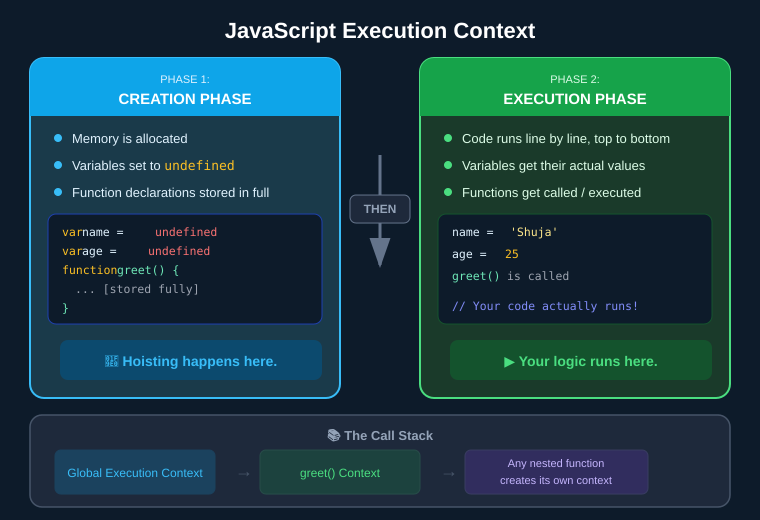

---

### The Call Stack

Every time a function is called, JavaScript creates a **new Execution Context** for it and pushes it onto the **Call Stack**. When the function finishes, that context is removed (popped off).

```javascript
function outer() {
  function inner() {
    console.log("I'm inner!"); // inner's Execution Context runs here
  }
  inner(); // Creates a new Execution Context for inner()
}
outer(); // Creates a new Execution Context for outer()
```

Call Stack at the moment `inner()` runs:
```
[ inner() Execution Context ]  ← currently running
[ outer() Execution Context ]
[ Global Execution Context   ]
```

---

> 🧪 **SDET Takeaway:** Understanding the Creation Phase explains **why hoisting causes flaky bugs**. If you use a `var` before its assignment line — expecting a value but getting `undefined` — that's the Creation Phase giving you the "not yet assigned" default. Always use `const` and `let` to avoid this trap, and remember that test setup functions run in their own Execution Context.

---

## 4. Operators


- What is an operator?

- An operator is a symbol that performs an operation on one or more operands.

- It is used to perform some operation on data.


- In JavaScript, there are different types of operators:

### 1. Arithmetic Operators (+, -, *, /, %, **)

**Meaning:** Used to perform mathematical calculations on numbers.

- `+` Addition - adds two numbers
- `-` Subtraction - subtracts one number from another
- `*` Multiplication - multiplies two numbers
- `/` Division - divides one number by another
- `%` Modulus - returns the remainder after division
- `**` Exponentiation - raises the first operand to the power of the second operand
- `++` Increment - increases the value of a variable by 1
- `--` Decrement - decreases the value of a variable by 1

**Example:**

```javascript
let a = 10;
let b = 3;

console.log(a + b); // Output: 13 (adds 10 and 3)
console.log(a - b); // Output: 7 (subtracts 3 from 10)
console.log(a * b); // Output: 30 (multiplies 10 by 3)
console.log(a / b); // Output: 3.333... (divides 10 by 3)
console.log(a % b); // Output: 1 (remainder when 10 is divided by 3)
console.log(a ** b); // Output: 1000 (10 to the power of 3)
```


### 2. Comparison Operators (==, ===, !=, !==, >, <, >=, <=)

**Meaning:** Used to compare two values and return a boolean (true or false).

- `==` Equal to - checks if values are equal (with type conversion)
- `===` Strict equal to - checks if values AND types are equal
- `!=` Not equal to - checks if values are not equal
- `!==` Strict not equal to - checks if values OR types are not equal
- `>` Greater than
- `<` Less than
- `>=` Greater than or equal to
- `<=` Less than or equal to

**Example:**

```javascript
let x = 10;
let y = "10";
let z = 5;

console.log(x == y);   // Output: true (10 equals "10" after type conversion)
console.log(x === y);  // Output: false (number 10 is NOT strictly equal to string "10")
console.log(x != z);   // Output: true (10 is not equal to 5)
console.log(x !== y);  // Output: true (different types: number vs string)
console.log(x > z);    // Output: true (10 is greater than 5)
console.log(x < z);    // Output: false (10 is not less than 5)
console.log(x >= 10);  // Output: true (10 is greater than or equal to 10)
console.log(z <= 5);   // Output: true (5 is less than or equal to 5)
```

- Comparison Operators (The Equality Trap)
In SDET work, checking values correctly is the difference between a "Pass" and a "Fail" in your tests.

A. Loose Equality (==)
Rule: Checks only the Value.

Coercion: It converts data types automatically (e.g., changes a string to a number) to try and make them match.

Example: 5 == "5" is true.

B. Strict Equality (===)
Rule: Checks both Value AND Data Type.

SDET Best Practice: Always use === to prevent "invisible" bugs in your automation scripts.

Example: 5 === "5" is false.


### 3. Logical Operators (&&, ||, !)

**Meaning:** Used to combine or invert boolean values.

- `&&` AND - returns true if BOTH conditions are true
- `||` OR - returns true if AT LEAST ONE condition is true
- `!` NOT - inverts the boolean value (true becomes false, false becomes true)

**Example:**

```javascript
let age = 25;
let hasLicense = true;

console.log(age >= 18 && hasLicense); // Output: true (age is 18+ AND has license)
console.log(age >= 18 || hasLicense); // Output: true (at least one is true)
console.log(!hasLicense);             // Output: false (inverts true to false)

let isSunny = false;
let isWarm = true;
console.log(isSunny && isWarm);       // Output: false (NOT both are true)
console.log(isSunny || isWarm);       // Output: true (at least one is true)
console.log(!isSunny);                // Output: true (inverts false to true)
```


---

### 🛑 The 6 "Falsy" Values in JavaScript
Before understanding how logical operators work at an advanced level, you must know that JavaScript always considers exactly **6 values to be "Falsy"**. Everything else in JavaScript is "Truthy".

The 6 Falsy values are:
1. `false` (The boolean itself)
2. `0` (The number zero)
3. `""` (An empty string)
4. `null` (The intentional absence of a value)
5. `undefined` (A declared variable with no set value)
6. `NaN` (Not a Number)

*If an expression evaluates to any of these 6 values, JavaScript treats it essentially as `false`.*

---

### ⚡ Short-circuit Evaluation
Short-circuit Evaluation is a fancy name for a simple shortcut JavaScript takes when checking conditions. It means **JavaScript stops looking at an expression as soon as it knows the final answer.** Think of it like a "Lazy Judge."

#### 1. The AND (`&&`) Short-circuit
For an `&&` to be true, BOTH sides must be true. If the first part is `false` (or Falsy), JavaScript doesn't even bother looking at the second part because the whole statement is already "ruined."

**Rule:** If the first value is falsy, it returns that value and stops.

**Real World Use:** "Only show the user's name IF they are logged in."
```javascript
let isLoggedIn = false;

// If isLoggedIn is false, JS stops and doesn't run the console.log
isLoggedIn && console.log("Welcome User!"); 
```

#### 2. The OR (`||`) Short-circuit
For an `||` to be true, only ONE side needs to be true. If the first part is `true` (or Truthy), JavaScript stops immediately because it already has what it needs.

**Rule:** If the first value is truthy, it returns that value and stops.

**Real World Use:** "Set a default value if the first one is missing."
```javascript
let userName = ""; // empty string is "falsy"
let displayName = userName || "Guest"; 

console.log(displayName); // "Guest"
```

#### 3. Summary Table
| Operator | How it Short-circuits | "Lazy" Behavior |
|----------|-----------------------|-----------------|
| `&&` (AND) | Stops at the first False | "I found a false, so I'm done!" |
| `\|\|` (OR) | Stops at the first True | "I found a true, so I'm done!" |

**Why is this useful for an SDET?**
You’ll see this a lot in automation frameworks to handle settings. For example:
```javascript
let timeout = config.timeout || 5000;
```
*(This means: Use the timeout from the config file, but if it's missing or undefined, just use 5000ms as a fallback default.)*

---

### 4. Assignment Operators (=, +=, -=, *=, /=, %=)

**Meaning:** Used to assign or update values to variables.

- `=` Assigns a value
- `+=` Adds and assigns (a += 5 is same as a = a + 5)
- `-=` Subtracts and assigns
- `*=` Multiplies and assigns
- `/=` Divides and assigns
- `%=` Modulus and assigns

**Example:**

```javascript
let score = 10;

score = 20;    // Assigns 20 to score
console.log(score); // Output: 20

score += 5;    // Same as: score = score + 5 (20 + 5)
console.log(score); // Output: 25

score -= 3;    // Same as: score = score - 3 (25 - 3)
console.log(score); // Output: 22

score *= 2;    // Same as: score = score * 2 (22 * 2)
console.log(score); // Output: 44

score /= 4;    // Same as: score = score / 4 (44 / 4)
console.log(score); // Output: 11

score %= 5;    // Same as: score = score % 5 (remainder of 11/5)
console.log(score); // Output: 1
```


### 5. Increment/Decrement Operators (++, --)

**Meaning:** Used to increase or decrease a variable's value by 1.

- `++` Increment - increases value by 1
- `--` Decrement - decreases value by 1
- Can be used as prefix (++a) or postfix (a++)

**Example:**

```javascript
let count = 5;

count++;           // Increases count by 1 (postfix)
console.log(count); // Output: 6

++count;           // Increases count by 1 (prefix)
console.log(count); // Output: 7

count--;           // Decreases count by 1 (postfix)
console.log(count); // Output: 6

--count;           // Decreases count by 1 (prefix)
console.log(count); // Output: 5

// Difference between prefix and postfix:
let a = 10;
console.log(a++);  // Output: 10 (uses current value first, THEN increments)
console.log(a);    // Output: 11 (now incremented)

let b = 10;
console.log(++b);  // Output: 11 (increments FIRST, then uses new value)
console.log(b);    // Output: 11
```


### 6. Ternary Operator (? :)

**Meaning:** A shorthand for if-else statements. Returns one value if condition is true, another if false.

- Syntax: `condition ? valueIfTrue : valueIfFalse`
- if condition is true then valueIfTrue will be executed else valueIfFalse will be executed

**Example:**

```javascript
let age = 20;
let canVote = age >= 18 ? "Yes" : "No"; // If age >= 18, return "Yes", else "No"
console.log(canVote); // Output: "Yes"

let marks = 45;
let result = marks >= 50 ? "Pass" : "Fail"; // Check if marks are 50 or more
console.log(result); // Output: "Fail"

// Can also use directly in console.log:
let temp = 35;
console.log(temp > 30 ? "Hot" : "Cold"); // Output: "Hot"
```


### 7. typeof Operator

**Meaning:** Returns the data type of a value as a string.

**Example:**

```javascript
let name = "John";
let age = 30;
let isStudent = true;
let salary = null;
let address;

console.log(typeof name);      // Output: "string" (text)
console.log(typeof age);       // Output: "number" (numeric value)
console.log(typeof isStudent); // Output: "boolean" (true/false)
console.log(typeof salary);    // Output: "object" (null is considered object - historical bug)
console.log(typeof address);   // Output: "undefined" (value not assigned)
console.log(typeof [1, 2, 3]); // Output: "object" (arrays are objects)
```


### 8. in Operator

**Meaning:** Checks if a property/key exists in an object. Returns true if found, false if not.

**Example:**

```javascript
let person = {
  name: "John",
  age: 30,
  city: "New York"
};

console.log("name" in person);    // Output: true (property "name" exists)
console.log("age" in person);     // Output: true (property "age" exists)
console.log("country" in person); // Output: false (property "country" doesn't exist)

let car = { brand: "Toyota", model: "Camry" };
console.log("brand" in car);      // Output: true
console.log("year" in car);       // Output: false
```


### 9. instanceof Operator

**Meaning:** Checks if an object is an instance of a specific class or constructor. Returns true or false.

**Example:**

```javascript
let numbers = [1, 2, 3, 4];
let today = new Date();
let message = "Hello";

console.log(numbers instanceof Array);  // Output: true (numbers is an array)
console.log(today instanceof Date);     // Output: true (today is a Date object)
console.log(message instanceof String); // Output: false (primitive string, not String object)

let obj = { name: "Test" };
console.log(obj instanceof Object);     // Output: true (obj is an object)
console.log(obj instanceof Array);      // Output: false (obj is not an array)

function Person(name) {
  this.name = name;
}
let john = new Person("John");
console.log(john instanceof Person);    // Output: true (john is instance of Person)
```

> **💡 Why is `message instanceof String` false?**
> In JavaScript, `instanceof` only works on Objects. When you do `let message = "Hello"`, it creates a *primitive* string. It's just raw data, not an actual string object created with the `new` keyword (like `new String("Hello")`). Since it is not an object wrapper, `instanceof` returns false. 
> 
> To check if a primitive variable is a string, you should always use the `typeof` operator instead:
> `console.log(typeof message === "string"); // Output: true`


---

### 10. Unary Operators

**Meaning:** Operators that work with only ONE operand (value). They perform operations on a single value.

**Common Unary Operators:**

- `+` Unary plus - converts operand to a number
- `-` Unary minus - negates the operand
- `!` Logical NOT - inverts boolean value
- `++` Increment - increases value by 1
- `--` Decrement - decreases value by 1
- `typeof` - returns the data type
- `delete` - deletes a property from an object
- `void` - evaluates an expression and returns undefined

**Example:**

```javascript
// Unary Plus (+) - converts to number
let str = "5";
console.log(+str);        // Output: 5 (string "5" converted to number 5)
console.log(typeof +str); // Output: "number"

let bool = true;
console.log(+bool);       // Output: 1 (true converted to 1)
console.log(+false);      // Output: 0 (false converted to 0)

// Unary Minus (-) - negates the value
let num = 10;
console.log(-num);        // Output: -10 (makes positive number negative)
console.log(-(-num));     // Output: 10 (double negative becomes positive)

// Logical NOT (!) - inverts boolean
let isActive = true;
console.log(!isActive);   // Output: false (inverts true to false)
console.log(!!isActive);  // Output: true (double negation returns original)

// Increment (++) and Decrement (--)
let count = 5;
console.log(++count);     // Output: 6 (increments first, then returns)
console.log(count++);     // Output: 6 (returns first, then increments)
console.log(count);       // Output: 7 (now incremented)

// typeof operator
console.log(typeof "Hello");  // Output: "string"
console.log(typeof 42);       // Output: "number"

// delete operator
let person = { name: "John", age: 30 };
delete person.age;            // Deletes the 'age' property
console.log(person);          // Output: { name: "John" }

// void operator
console.log(void 0);          // Output: undefined
console.log(void (2 + 2));    // Output: undefined (evaluates 2+2 but returns undefined)
```

---

### 11. Nullish Coalescing Operator (??)

**Meaning:** Returns the **right-hand value** only when the left-hand value is `null` or `undefined`. If the left side has any other value — even `0`, `""`, or `false` — it keeps it as is.

> In simple words: **"Give me a fallback, but ONLY if I have nothing (null/undefined)"**


**Syntax:** `value ?? fallback`

```javascript
// ?? only triggers for null and undefined
console.log(null ?? "default");      // "default"  ← null → use fallback
console.log(undefined ?? "default"); // "default"  ← undefined → use fallback
console.log(0 ?? "default");         // 0          ← 0 is NOT null, keep it!
console.log("" ?? "default");        // ""         ← empty string is NOT null, keep it!
console.log(false ?? "default");     // false      ← false is NOT null, keep it!
```

### ⚡ ?? vs || — The Key Difference

This is where people get confused. Both look similar but behave very differently:

| Situation | `??` result | `\|\|` result |
|-----------|------------|--------------|
| `null` | uses fallback ✅ | uses fallback ✅ |
| `undefined` | uses fallback ✅ | uses fallback ✅ |
| `0` | **keeps 0** ✅ | uses fallback ⚠️ |
| `""` | **keeps ""** ✅ | uses fallback ⚠️ |
| `false` | **keeps false** ✅ | uses fallback ⚠️ |

```javascript
let userScore = 0; // valid score of zero

// Using || — WRONG behaviour for this case
let score1 = userScore || 10;  // 10 ← 0 is falsy, gets replaced! Bug!

// Using ?? — CORRECT behaviour
let score2 = userScore ?? 10;  // 0  ← 0 is not null/undefined, kept! ✅
```

### Where you use this in real code

**Safe default for settings that might not exist:**
```javascript
let fontSize = userSettings.fontSize ?? 16; // use 16 only if not set at all
let username = user.name ?? "Guest";        // "Guest" only if name is null/undefined
```

**In SDET — reading config values:**
```javascript
let timeout = config.timeout ?? 5000; // default 5s only if timeout wasn't configured
let retries = config.retries ?? 3;    // default 3 only if retries is absent
```

> 💡 **Rule:** Use `??` when `0`, `""`, or `false` are valid values you want to keep. Use `||` when ANY falsy value should trigger the fallback.

---

### 12. Optional Chaining Operator (?.)

**Meaning:** Used to safely read the value of a property located deep within an object without having to check if every step in the chain actually exists. If it hits a `null` or `undefined`, it stops and returns `undefined` instead of throwing a massive error and crashing your script.

> In simple words: **"Does this exist? If yes, keep going. If no, just return `undefined` and don't crash!"**

**Why is it useful?**
In automation (or whenever making API calls), you often receive massive JSON objects. You cannot guarantee that every property is always there.

Without `?.`, you'd have to write ugly, defensive code to prevent "Cannot read properties of undefined" errors:
```javascript
let user = { profile: { name: "Shujauddin" } };

// Without Optional Chaining (Ugly & Long)
let city;
if (user && user.profile && user.profile.address && user.profile.address.city) {
    city = user.profile.address.city;
}
```

With **Optional Chaining (`?.`)**, this becomes a clean one-liner:
```javascript
// With Optional Chaining (Clean!)
let city = user?.profile?.address?.city; 

console.log(city); // Output: undefined (No Crash!)
```

**The Power Combo:** SDETs constantly pair `?.` and `??` together to grab a deep property and provide a safe fallback if it's missing!
```javascript
// Grab the city. If any part of that chain is missing, default to "Unknown"
let finalCity = user?.profile?.address?.city ?? "Unknown";
console.log(finalCity); // Output: "Unknown"
```

---

### 13. String Operators (+, +=)

**Meaning:** Used to concatenate (join) two or more strings together.

- `+` Concatenates two strings
- `+=` Appends a string to the end of an existing string variable

**Example:**

```javascript
let firstName = "John";
let lastName = "Doe";

console.log(firstName + " " + lastName); // Output: "John Doe"

let greeting = "Hello";
greeting += " World"; // Same as: greeting = greeting + " World"
console.log(greeting); // Output: "Hello World"
```

> ⚠️ **Note on Type Conversion:** If you use the `+` operator with a string and a number, JavaScript will implicitly convert the number to a string and concatenate them (Implicit Coercion).
```javascript
console.log("Age: " + 25); // Output: "Age: 25"
```

### 13. Bitwise Operators (&, |, ^, ~, <<, >>, >>>)

**Meaning:** Used to perform operations on the binary representation (0s and 1s) of numbers. JavaScript treats the numbers as 32-bit integers, performs the bitwise operation, and returns a standard number. This inherently involves **Type Conversion**, as JavaScript temporarily converts the number into a 32-bit binary integer behind the scenes.

#### 🧠 How Binary Works (A Quick Primer)

**1. The "Place Value" Rule**
Think of how we count normally (Base-10). Each digit represents a power of 10. For example, `123` means `100 + 20 + 3`.

In Binary (Base-2), each digit represents a power of 2. We use a "Double Up" chart going from right to left:
`... 16 | 8 | 4 | 2 | 1`

**2. Let's build the number 5**
To get 5, we look at our chart and ask: "Which of these numbers do I need to add up to make 5?"
- Do we need an 8? No (too big) -> `0`
- Do we need a 4? Yes -> `1`
- Do we need a 2? No (4+2=6, too big) -> `0`
- Do we need a 1? Yes (4+1=5) -> `1`

So, `5` in binary is `0101` (or just `101`).

**3. Let's build the number 3**
- Do we need an 8? No -> `0`
- Do we need a 4? No -> `0`
- Do we need a 2? Yes -> `1`
- Do we need a 1? Yes (2+1=3) -> `1`

So, `3` in binary is `0011` (or just `11`).

**4. How the Bitwise & (AND) works**
Now that you have the `0`s and `1`s, the Bitwise operator just compares them like a vertical math problem!

```text
5:  0 1 0 1
    & & & &  <-- (Is this one AND that one "1"?)
3:  0 0 1 1
-----------
    0 0 0 1  <-- Only the last column has two 1s!
```
The result is `0001`. If you look at our chart, `1` at the end just means the number `1`.

**📝 Summary Cheat Sheet:**
- `0` = Off
- `1` = On
- **Binary Chart:** `... 16 | 8 | 4 | 2 | 1`

#### 📊 Bitwise Operators Cheat Sheet

| Operator | Name | What It Does (The Rule) | Example | Binary Explanation |
| :---: | --- | --- | --- | --- |
| **`&`** | **AND** | Returns `1` ONLY if **BOTH** bits are `1` | `5 & 1` ➔ `1` | `0101 & 0001 = 0001` |
| **`\|`** | **OR** | Returns `1` if **AT LEAST ONE** bit is `1` | `5 \| 1` ➔ `5` | `0101 \| 0001 = 0101` |
| **`^`** | **XOR** | Returns `1` if the bits are **DIFFERENT** | `5 ^ 1` ➔ `4` | `0101 ^ 0001 = 0100` |
| **`~`** | **NOT** | Flips all bits (`0` ➔ `1`, `1` ➔ `0`) | `~5` ➔ `-6` | `~0...0101 = 1...1010` |
| **`<<`** | **Left Shift** | Shifts bits left (Multiplies by 2) | `5 << 1` ➔ `10` | `0101` becomes `1010` |
| **`>>`** | **Right Shift** | Shifts bits right (Divides by 2) | `5 >> 1` ➔ `2` | `0101` becomes `0010` |
| **`>>>`**| **Zero-Fill Right** | Shifts right, pushes `0`s from left | `5 >>> 1`➔ `2` | Same as `>>` for positive numbers |

**Example:**

```javascript
let a = 5;  // Binary: 0101
let b = 1;  // Binary: 0001

console.log(a & b); // Output: 1  (Binary: 0001)
console.log(a | b); // Output: 5  (Binary: 0101)
console.log(a ^ b); // Output: 4  (Binary: 0100)
console.log(~a);    // Output: -6 (Inverts 5 to get -(5 + 1))

console.log(a << 1); // Output: 10 (Binary: 1010) - effectively multiplies by 2
console.log(a >> 1); // Output: 2  (Binary: 0010) - effectively divides by 2
```

> 💡 **Where you use this:** In general web development or SDET automation, bitwise operators are very rare. They are primarily used in low-level programming, graphics processing, or cryptography.

---

## Operator Classification by Number of Operands


### **1. Unary Operators** (One Operand)

Operate on a single value.

- **Examples:** `!a`, `++a`, `--a`, `typeof a`, `-a`, `+a`, `delete obj.prop`
- **Use cases:** Type conversion, negation, increment/decrement, type checking

### **2. Binary Operators** (Two Operands)

Operate on two values.

- **Examples:** `a + b`, `a > b`, `a && b`, `a = b`, `a % b`
- **Use cases:** Arithmetic, comparison, logical operations, assignments
- **Note:** Most operators in JavaScript are binary operators

### **3. Ternary Operator** (Three Operands)

Operates on three values. JavaScript has only ONE ternary operator.

- **Example:** `condition ? valueIfTrue : valueIfFalse`
- **Use cases:** Conditional expressions, shorthand if-else statements

---

## Truthy and Falsy Values

When JavaScript checks a condition (like in an `if` statement), it doesn't just look for `true` or `false`. It treats **any value** as either truthy or falsy.


### ❌ Falsy Values — only 6 of them

These are the **only** values that act as `false` in a condition:

| Value | Why it's falsy |
|-------|---------------|
| `false` | It's literally false |
| `0` | Zero is nothing |
| `""` | Empty string — no content |
| `null` | Intentionally empty |
| `undefined` | Never given a value |
| `NaN` | Not a valid number |

### ✅ Truthy Values — everything else

If it's not in the 6 falsy values above, it's truthy. Including these that often surprise people:

```javascript
// These all count as TRUE in a condition
if (1)         console.log("truthy"); // ✅ non-zero number
if ("hello")   console.log("truthy"); // ✅ non-empty string
if ([])        console.log("truthy"); // ✅ empty array (still truthy!)
if ({})        console.log("truthy"); // ✅ empty object (still truthy!)
if (-1)        console.log("truthy"); // ✅ negative number
```

### Code Example

```javascript
// these are all FALSY - the if block will NOT run
if (0)         console.log("runs"); // ❌ skipped
if ("")        console.log("runs"); // ❌ skipped
if (null)      console.log("runs"); // ❌ skipped
if (undefined) console.log("runs"); // ❌ skipped

// these are all TRUTHY - the if block WILL run
if (1)         console.log("runs"); // ✅ prints
if ("hi")      console.log("runs"); // ✅ prints
if ([])        console.log("runs"); // ✅ prints (empty array is truthy!)
```

### Where you use this in real code

**Checking if a user filled in a form field:**
```javascript
let username = "";

if (username) {
    console.log("Welcome, " + username); // skipped — empty string is falsy
} else {
    console.log("Please enter your name!"); // this runs
}
```

**Checking if an API returned data:**
```javascript
let apiResponse = null; // API failed

if (apiResponse) {
    console.log("Got data:", apiResponse); // skipped — null is falsy
} else {
    console.log("No data returned"); // this runs
}
```

**In SDET / automation testing:**
```javascript
let element = getElement(".submit-btn"); // returns null if not found

if (element) {
    element.click(); // only clicks if element exists (truthy)
} else {
    console.log("Button not found on page!");
}
```

> 💡 **Key Rule to remember:** Only 6 things are falsy. Everything else — including empty arrays `[]` and empty objects `{}` — is truthy!

---

## 5. Conditional Statements


**What are Conditional Statements?**
Conditional statements allow you to make decisions in your code based on conditions. Think of them as "if this happens, then do that."


---
  
### **A) IF Statement**

**Rule:** Executes code ONLY if the condition is **true**. If false, nothing happens.

**Syntax:**

```javascript
if (condition) {
    // code to execute if condition is true
}
```

**Example:**

```javascript
let age = 20;

if (age >= 18) {
    console.log("You can vote!"); // This will print because age is 20
}

if (age >= 21) {
    console.log("You can drink!"); // This will NOT print (nothing happens)
}
```

---

### **B) IF-ELSE Statement**

**Rule:** If the condition is **true**, execute the `if` block. If **false**, execute the `else` block.

**Syntax:**

```javascript
if (condition) {
    // code if condition is true
} else {
    // code if condition is false
}
```

**Example:**

```javascript
let mode = "dark-mode";
let color;

if (mode === "dark-mode") {
    color = "Black"; // This executes because mode is "dark-mode"
} else {
    color = "White";
}

console.log(color); // Output: Black
```

**Another Example:**

```javascript
let marks = 45;

if (marks >= 50) {
    console.log("Pass");
} else {
    console.log("Fail"); // This executes because marks < 50
}
```

---

### **C) IF-ELSE-IF Statement**

**Rule:** Checks multiple conditions in order. Executes the FIRST true condition. If none are true, executes the `else` block.

**Syntax:**

```javascript
if (condition1) {
    // code if condition1 is true
} else if (condition2) {
    // code if condition2 is true
} else {
    // code if none of the conditions are true
}
```

**Example:**

```javascript
let marks = 75;

if (marks >= 90) {
    console.log("Grade: A");
} else if (marks >= 75) {
    console.log("Grade: B"); // This executes because marks = 75
} else if (marks >= 50) {
    console.log("Grade: C");
} else {
    console.log("Grade: F");
}

// Output: Grade: B
```

**Traffic Light Example:**

```javascript
let light = "yellow";

if (light === "green") {
    console.log("Go!");
} else if (light === "yellow") {
    console.log("Slow down!"); // This executes
} else if (light === "red") {
    console.log("Stop!");
} else {
    console.log("Invalid light!");
}

// Output: Slow down!
```

---

### **Quick Comparison:**

| Statement | When to Use |
| --------- | ----------- |
| **if** | Execute code only when condition is true, otherwise skip |
| **if-else** | Choose between 2 options (true or false) |
| **if-else-if** | Choose between 3+ options (multiple conditions) |

---

### **D) SWITCH Statement**

**Rule:** Compares a single value against multiple `case` labels. It is more readable than long `if-else-if` chains when checking the same variable for specific values.

**Syntax:**

```javascript
switch (expression) {
    case value1:
        // code to execute
        break;
    case value2:
        // code to execute
        break;
    default:
        // code if no case matches
}
```

**Example:**

```javascript
let day = 3;

switch (day) {
    case 1:
        console.log("Monday");
        break;
    case 2:
        console.log("Tuesday");
        break;
    case 3:
        console.log("Wednesday"); // This executes because day is 3
        break;
    default:
        console.log("Invalid day");
}

// Output: Wednesday
```


### 🛑 Two essential parts of a `switch`:
1. **`break`**: This tells JavaScript to *stop checking and exit*. If you forget to write `break`, JavaScript will "fall through" and automatically run the code for the cases below it too!
2. **`default`**: This acts exactly like an `else` statement. It is the "safety net" catch-all code that runs if the variable did *not match* any of the specific `case` values above.

### 🧪 When to use `switch` (SDET Use Cases)
As an SDET (Software Development Engineer in Test), you shouldn't use `switch` statements for complex math logic (like `if age > 18`). **You should only use `switch` when you are checking one specific variable against a list of exact, known textbook values.**

Here are the most common ways Software Testers use `switch` in automation:

**1. Choosing Test Environments (QA vs STAGE vs PROD):**
When your automation framework starts, it needs to know which server URL to test perfectly.
```javascript
let environment = "QA";
let baseUrl;

switch (environment) {
    case "QA":
        baseUrl = "https://qa.testingacademy.com";
        break;
    case "STAGE":
        baseUrl = "https://stage.testingacademy.com";
        break;
    case "PROD":
        baseUrl = "https://testingacademy.com";
        break;
    default:
        console.error("Unknown environment! Defaulting to QA.");
        baseUrl = "https://qa.testingacademy.com";
}
```

**2. Selecting a Browser for Automation (Playwright / Selenium):**
```javascript
let browserType = "chromium";

switch (browserType) {
    case "chromium":
        // Code to launch Google Chrome / Microsoft Edge
        break;
    case "firefox":
        // Code to launch Mozilla Firefox
        break;
    case "webkit":
        // Code to launch Apple Safari
        break;
    default:
        console.error("Browser not supported!");
}
```

> 💡 **Summary Rule:** Use `if-else` when you have complex conditions or ranges (`price > 100 && fastShipping`). Use `switch` when you have a single variable acting like a multiple-choice setting (`QA`, `STAGE`, `PROD`).

---

## 6. JavaScript Input/Output Methods

**Overview:** Different ways to get input from users and display output in JavaScript.

| Feature | Works in Browser? | Works in VS Code/Node? | Recommended For |
| ------- | ----------------- | ---------------------- | --------------- |
| `console.log()` | ✅ Yes | ✅ Yes | Everything (Universal) |
| `prompt()` | ✅ Yes | ❌ No | Learning Browser basics |
| `alert()` | ✅ Yes | ❌ No | Visual web alerts |
| `confirm()` | ✅ Yes | ❌ No | Yes/No questions in browser |
| `process.argv` | ❌ No | ✅ Yes | SDET Command Line Tools |

---

### **A) console.log()**

**What it does:** Prints output to the console (browser DevTools or terminal).

**Example:**

```javascript
console.log("Hello, World!"); // Output: Hello, World!
let age = 25;
console.log("Age:", age); // Output: Age: 25
```

---

### **B) prompt()**

**What it does:** Shows a popup box in the browser asking for user input. Returns the input as a **string**.

**Example:**

```javascript
let name = prompt("Enter your name:");
console.log("Hello,", name); // Whatever user types is stored in 'name'

let num = prompt("Enter a number:");
console.log(num + 5); // ⚠️ Will concatenate, not add! num is a string!
console.log(Number(num) + 5); // ✅ Convert to number first
```

**Important:** Always convert `prompt()` input to a number if doing math!

---

### **C) alert()**

**What it does:** Shows a popup message in the browser. User can only click "OK".

**Example:**

```javascript
alert("Welcome to our website!"); // Shows popup with message
alert("Your form has been submitted!"); // Another popup
```

**Use case:** Show important messages to users on web pages.

---

### **D) confirm()**

**What it does:** Shows a popup with "OK" and "Cancel" buttons. Returns `true` if OK is clicked, `false` if Cancel.

**Example:**

```javascript
let wantToDelete = confirm("Are you sure you want to delete?");

if (wantToDelete) {
    console.log("Item deleted!");
} else {
    console.log("Deletion cancelled.");
}
```

**Use case:** Ask yes/no questions before important actions.

---

### **E) process.argv**

**What it does:** Gets command-line arguments in Node.js. Returns an **array** of arguments.

**Example:**

```javascript
// File: test.js
console.log(process.argv);
```

**Run in terminal:**

```bash
node test.js hello world 123
```

**Output:**

```javascript
[
  '/usr/local/bin/node',    // process.argv[0] - Node path
  '/path/to/test.js',       // process.argv[1] - File path
  'hello',                  // process.argv[2] - First argument
  'world',                  // process.argv[3] - Second argument
  '123'                     // process.argv[4] - Third argument
]
```

**Practical example:**

```javascript
// File: greet.js
let name = process.argv[2]; // Get first argument
console.log("Hello,", name);
```

**Run:** `node greet.js John` → **Output:** `Hello, John`

**Use case:** Building SDET command-line tools and automation scripts.

---

### **Quick Summary:**

- **Browser only:** `prompt()`, `alert()`, `confirm()`
- **Node.js only:** `process.argv`
- **Works everywhere:** `console.log()`

---

## Appendix: Comparison Recap (== vs ===)


- **`==` (Loose Equality)**: Checks only the value. It performs **type coercion** (automatically converts data types to match).
  - *Example*: `5 == "5"` is `true`.
- **`===` (Strict Equality)**: Checks both value AND data type. It does **not** perform type coercion.
  - *Example*: `5 === "5"` is `false`.

---

## Appendix: Bracket Notation

In JavaScript, individual characters in a string can be accessed using **bracket notation** with a zero-based index.

- First character = index **0**
- Last character = index **`length - 1`**

```javascript
let greeting = "hello";

console.log(greeting[0]);                    // "h" — first character
console.log(greeting[1]);                    // "e" — second character
console.log(greeting[greeting.length - 1]);  // "o" — last character

// Combine characters using bracket notation
let firstTwo = greeting[0] + greeting[1];    // "he"
console.log(firstTwo);
```

> 💡 Useful when you need to check or extract specific characters — like initials from a name or validating the format of a code.

## 7. Loops

### What is a Loop?

A **loop** is a way to repeat a block of code again and again until a specific condition is met — like climbing a staircase one step at a time until you reach the top.

> 💡 **In simple words:** "Keep doing this specific task until I tell you to stop, or until a certain condition is met."

In automation (like Playwright), you use loops to do things like:
- *"Check every link on this page"*
- *"Wait for a button to appear 10 times before giving up"*
- *"Go through all rows of a table and verify the data"*

---

### 🌍 Real-World Examples

**The "Staircase" Analogy:**

Imagine you are standing at the bottom of a flight of 10 stairs. Your goal is to reach the top.
- **The Task:** Step up one stair.
- **The Condition:** "Am I at the 10th stair yet?"
- **The Loop:** You repeat the "Step up" task over and over. Each time, you ask yourself if you've reached the top. Once the answer is "Yes," you stop.

**The "Alarm Clock" Analogy:**
- **The Task:** Ring the bell.
- **The Condition:** "Has the user pressed the 'Stop' button?"
- **The Loop:** The alarm rings every 5 minutes until you finally hit 'Stop'.

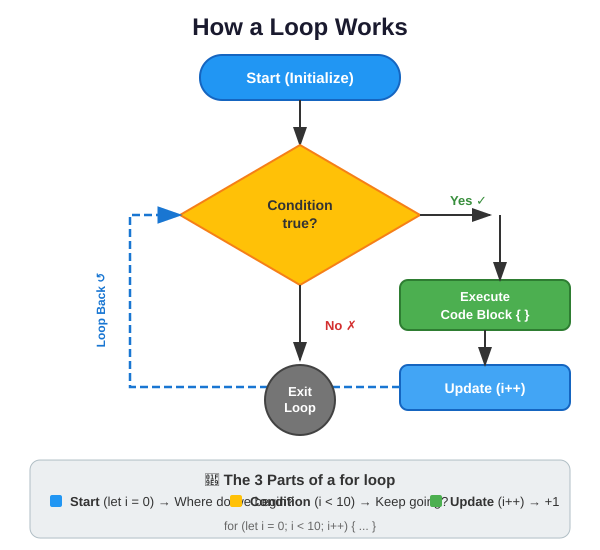

---

### 🧩 The 3 Parts of Every Loop

Before learning the different types of loops, understand that every loop has these 3 core parts:

1. **The Start (Initialization):** Where do we begin? *(e.g., `let i = 0`)*
2. **The Condition (Test):** Should we keep going? As long as this is `true`, the loop repeats. *(e.g., `i < 10`)*
3. **The Update (Step):** How do we move forward? *(e.g., `i++` adds 1 each time)*

> ⚠️ **Critical Rule:** If you forget the **Update** step, the condition will never become `false`, and your loop will run forever (an **infinite loop** — more on this later).

---

### 🛠️ Why do SDETs need Loops?

Imagine you are testing an E-commerce website. You have a list of **50 products**, and you want to make sure none of them have a "Price" of `$0`.

- **Without a loop:** You would have to write 50 individual lines of code to check each product.
- **With a loop:** You write **3 lines of code** that tells Playwright: *"Go through every product in this list and check the price."*

---

### Types of Loops in JavaScript

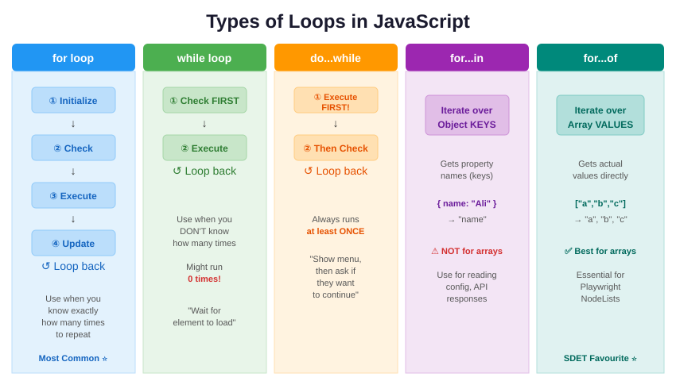

JavaScript gives you **5 types of loops**. Each one is best suited for a different situation:

| Loop Type | Best Used When... |
|-----------|------------------|
| **`for`** | You know **exactly** how many times to repeat |
| **`while`** | You **don't know** how many times — keep going until a condition changes |
| **`do...while`** | Same as `while`, but **always runs at least once** |
| **`for...in`** | You want to loop through an **Object's keys** (property names) |
| **`for...of`** | You want to loop through an **Array's values** (or NodeList in Playwright) |

---

### **A) `for` Loop (The Classic)**

**Meaning:** The most common loop. Use it when you **know exactly how many times** you need to repeat something.

**Syntax:**
```javascript
for (start; condition; step) {
    // code to repeat
}
```

**Example — The Staircase:**
```javascript
// Start at step 1; Stop at step 10; Move 1 step at a time
for (let step = 1; step <= 10; step++) {
    console.log("I am currently on step number: " + step);
}

console.log("I have reached the top!");
```

**Output:**
```
I am currently on step number: 1
I am currently on step number: 2
... (continues)
I am currently on step number: 10
I have reached the top!
```

**How it works step by step:**
1. `let step = 1` → Create a counter variable, start at 1.
2. `step <= 10` → Is 1 less than or equal to 10? **Yes** → Run the code inside `{ }`.
3. `step++` → Add 1 to step (step becomes 2).
4. `step <= 10` → Is 2 ≤ 10? **Yes** → Run again.
5. ...repeat until step becomes 11...
6. `step <= 10` → Is 11 ≤ 10? **No** → **STOP. Exit the loop.**

#### 🧪 Real-World SDET Example:

**Checking a list of prices on an E-commerce page:**
```javascript
let prices = [29.99, 49.99, 0, 15.00, 99.99];

for (let i = 0; i < prices.length; i++) {
    if (prices[i] === 0) {
        console.log("🚨 BUG FOUND! Product at index " + i + " has a price of $0!");
    } else {
        console.log("✅ Product " + i + " price is valid: $" + prices[i]);
    }
}
```

**Output:**
```
✅ Product 0 price is valid: $29.99
✅ Product 1 price is valid: $49.99
🚨 BUG FOUND! Product at index 2 has a price of $0!
✅ Product 3 price is valid: $15
✅ Product 4 price is valid: $99.99
```

> 💡 **`prices.length`** gives the total number of items in the array (5 in this case). We start at index `0` because arrays are zero-indexed.

---

### **B) `while` Loop**

**Meaning:** Keeps repeating **as long as a condition is true**. Use it when you **don't know in advance** how many times the loop needs to run.

> Think of it as: "Keep trying until it works."

**Syntax:**
```javascript
while (condition) {
    // code to repeat
    // IMPORTANT: update something so condition eventually becomes false!
}
```

**Example:**
```javascript
let count = 1;

while (count <= 5) {
    console.log("Attempt number: " + count);
    count++; // Don't forget this! Without it, infinite loop!
}

console.log("Done!");
```

**Output:**
```
Attempt number: 1
Attempt number: 2
Attempt number: 3
Attempt number: 4
Attempt number: 5
Done!
```

#### `for` vs `while` — When to use which?

| Situation | Use `for` | Use `while` |
|-----------|-----------|-------------|
| "Loop exactly 10 times" | ✅ | |
| "Loop through an array" | ✅ | |
| "Keep polling until element appears" | | ✅ |
| "Wait for API response" | | ✅ |
| "Retry until success" | | ✅ |

#### 🧪 Real-World SDET Example:

**Waiting for a button to appear on a page (retry logic):**
```javascript
let buttonFound = false;
let attempts = 0;
let maxAttempts = 10;

while (!buttonFound && attempts < maxAttempts) {
    attempts++;
    console.log("Attempt " + attempts + ": Looking for submit button...");

    // Simulating checking if button exists
    // In real Playwright: buttonFound = await page.locator('.submit-btn').isVisible();
    if (attempts === 7) {
        buttonFound = true; // Simulating: button appears on 7th try
    }
}

if (buttonFound) {
    console.log("✅ Button found after " + attempts + " attempts!");
} else {
    console.log("❌ Button NOT found after " + maxAttempts + " attempts. Test failed!");
}
```

**Output:**
```
Attempt 1: Looking for submit button...
Attempt 2: Looking for submit button...
... (continues)
Attempt 7: Looking for submit button...
✅ Button found after 7 attempts!
```

> 💡 **Important:** Always include a **maximum attempts limit** (like `maxAttempts`) in a `while` loop to prevent infinite loops if the condition never becomes true!

---

### **C) `do...while` Loop**

**Meaning:** Almost identical to `while`, but with **one crucial difference** — it **always executes at least once** before checking the condition.

> Think of it as: "Do this first, then check if you should keep doing it."

**Syntax:**
```javascript
do {
    // code to run (runs AT LEAST once!)
} while (condition);
```

> ⚠️ **Note the semicolon** `;` after `while(condition)` — this is required for `do...while` but NOT for regular `while`.

**Example:**
```javascript
let number = 1;

do {
    console.log("Number is: " + number);
    number++;
} while (number <= 5);
```

**Output:**
```
Number is: 1
Number is: 2
Number is: 3
Number is: 4
Number is: 5
```

**The Key Difference — runs even if condition is false from the start:**
```javascript
// while loop — runs 0 times
let x = 100;
while (x < 5) {
    console.log("while: " + x); // Never prints! Condition is false from the start.
}

// do...while loop — runs 1 time
let y = 100;
do {
    console.log("do...while: " + y); // Prints once! Runs before checking.
} while (y < 5);
```

**Output:**
```
do...while: 100
```

> The `while` loop checked the condition FIRST (100 < 5 is false) and never ran. The `do...while` loop ran the code FIRST, printed `100`, then checked (100 < 5 is false) and stopped.

#### 🧪 Real-World SDET Example:

**A menu-driven test runner:**
```javascript
let choice;

do {
    console.log("\n--- Test Menu ---");
    console.log("1. Run Login Tests");
    console.log("2. Run Cart Tests");
    console.log("3. Run Checkout Tests");
    console.log("4. Exit");

    choice = 4; // Simulating user input (in real code: prompt() or readline)

    switch (choice) {
        case 1: console.log("Running Login Tests..."); break;
        case 2: console.log("Running Cart Tests..."); break;
        case 3: console.log("Running Checkout Tests..."); break;
        case 4: console.log("Exiting..."); break;
        default: console.log("Invalid choice!");
    }
} while (choice !== 4);
```

> 💡 The menu **must show at least once** before asking the user — that's why `do...while` is perfect here.

---

### **D) `for...in` Loop**

**Meaning:** Used to iterate over the **keys (property names)** of an object. It gives you the **key**, not the value.

> Think of it as: "For each label/key in this object, do something."

**Syntax:**
```javascript
for (let key in object) {
    // key = property name (string)
    // object[key] = property value
}
```

**Example:**
```javascript
let testConfig = {
    browser: "chromium",
    headless: true,
    timeout: 5000,
    retries: 3
};

for (let key in testConfig) {
    console.log(key + ": " + testConfig[key]);
}
```

**Output:**
```
browser: chromium
headless: true
timeout: 5000
retries: 3
```

**How it works:**
- First iteration: `key` = `"browser"`, `testConfig[key]` = `"chromium"`
- Second iteration: `key` = `"headless"`, `testConfig[key]` = `true`
- ...and so on for each property.

#### 🧪 Real-World SDET Example:

**Checking API response fields:**
```javascript
let apiResponse = {
    status: 200,
    message: "Success",
    userId: 42,
    email: "test@example.com",
    role: null // Bug! Role should not be null
};

for (let field in apiResponse) {
    if (apiResponse[field] === null || apiResponse[field] === undefined) {
        console.log("🚨 BUG! Field '" + field + "' is " + apiResponse[field]);
    } else {
        console.log("✅ " + field + ": " + apiResponse[field]);
    }
}
```

**Output:**
```
✅ status: 200
✅ message: Success
✅ userId: 42
✅ email: test@example.com
🚨 BUG! Field 'role' is null
```

> ⚠️ **Warning:** Do NOT use `for...in` with arrays! It iterates over property names (indices as strings), not values, and can include inherited properties. Use `for...of` for arrays instead.

```javascript
// ❌ DON'T do this
let colors = ["red", "green", "blue"];
for (let key in colors) {
    console.log(key);     // "0", "1", "2" — these are string indices, not values!
    console.log(typeof key); // "string" — not "number"!
}

// ✅ DO this instead
for (let color of colors) {
    console.log(color); // "red", "green", "blue" — actual values!
}
```

---

### **E) `for...of` Loop**

**Meaning:** Used to iterate over the **values** of an iterable (Arrays, Strings, NodeLists, Maps, Sets). It directly gives you the **value**, not the index.

> Think of it as: "For each item in this list, do something."

**Syntax:**
```javascript
for (let value of iterable) {
    // value = the actual item
}
```

**Example:**
```javascript
let fruits = ["Apple", "Banana", "Cherry"];

for (let fruit of fruits) {
    console.log("I like " + fruit);
}
```

**Output:**
```
I like Apple
I like Banana
I like Cherry
```

#### `for...in` vs `for...of` — The Key Difference

| Feature | `for...in` | `for...of` |
|---------|-----------|-----------|
| Iterates over | **Keys** (property names) | **Values** (actual items) |
| Best for | **Objects** `{ }` | **Arrays** `[ ]`, Strings, NodeLists |
| Returns | `"name"`, `"age"`, `"0"`, `"1"` | `"John"`, `30`, `"red"`, `"green"` |
| Use in automation | Reading config objects | Looping through elements on page |

```javascript
let testBrowsers = ["chromium", "firefox", "webkit"];

// for...in gives INDICES (keys)
for (let i in testBrowsers) {
    console.log(i);           // "0", "1", "2"
}

// for...of gives VALUES
for (let browser of testBrowsers) {
    console.log(browser);     // "chromium", "firefox", "webkit"
}
```

#### 🧪 Real-World SDET Example:

**Checking all links on a page (Playwright):**
```javascript
// Getting all links from a page
let links = ["https://example.com", "https://test.com/broken", "https://shop.com"];

for (let link of links) {
    if (link.includes("broken")) {
        console.log("🚨 Broken link found: " + link);
    } else {
        console.log("✅ Link is valid: " + link);
    }
}
```

**Output:**
```
✅ Link is valid: https://example.com
🚨 Broken link found: https://test.com/broken
✅ Link is valid: https://shop.com
```

**Looping through characters in a string:**
```javascript
let password = "MyP@ss123";

let hasSpecialChar = false;
for (let char of password) {
    if ("!@#$%^&*".includes(char)) {
        hasSpecialChar = true;
        console.log("Found special character: " + char);
    }
}

console.log("Password valid:", hasSpecialChar); // true
```

> 💡 **SDET Tip:** In Playwright, when you use `page.locator('.product').all()`, it returns an array of elements. You loop through them with `for...of` to check each one!

---

### Quick Comparison of All Loops

```javascript
// All 5 loops doing similar things:

// 1. for — when you know the count
for (let i = 0; i < 3; i++) {
    console.log("for:", i);       // 0, 1, 2
}

// 2. while — when you don't know the count
let j = 0;
while (j < 3) {
    console.log("while:", j);     // 0, 1, 2
    j++;
}

// 3. do...while — always runs at least once
let k = 0;
do {
    console.log("do-while:", k);  // 0, 1, 2
    k++;
} while (k < 3);

// 4. for...in — for object keys
let obj = { a: 1, b: 2, c: 3 };
for (let key in obj) {
    console.log("for-in:", key);  // "a", "b", "c"
}

// 5. for...of — for array values
let arr = [1, 2, 3];
for (let val of arr) {
    console.log("for-of:", val);  // 1, 2, 3
}
```

---

## 8. Loop Control Statements

Sometimes you need more control over your loops — like stopping early when you find what you're looking for, or skipping certain items. That's where **`break`**, **`continue`**, and **Labels** come in.

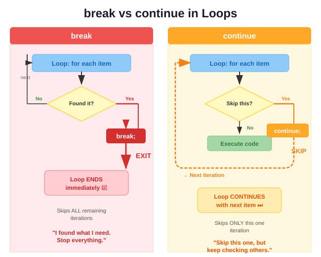

---

### **A) `break` Statement**

**Meaning:** Immediately **exits the entire loop**. No more iterations will run. The code continues after the loop.

> Think of it as: "I found what I need. Stop everything and move on."

**Syntax:**
```javascript
for (...) {
    if (someCondition) {
        break; // EXIT the loop completely
    }
}
```

**Example:**
```javascript
let numbers = [10, 20, 30, 40, 50];

for (let i = 0; i < numbers.length; i++) {
    if (numbers[i] === 30) {
        console.log("Found 30 at index " + i + "! Stopping search.");
        break; // Stop looping — we found it!
    }
    console.log("Checking: " + numbers[i]);
}
```

**Output:**
```
Checking: 10
Checking: 20
Found 30 at index 2! Stopping search.
```

> Notice: 40 and 50 were **never checked** because `break` exited the loop immediately.

#### 🧪 Real-World SDET Example:

**Finding the first broken link on a page:**
```javascript
let links = [
    { url: "/home", status: 200 },
    { url: "/about", status: 200 },
    { url: "/pricing", status: 404 },  // Broken!
    { url: "/contact", status: 200 }
];

for (let link of links) {
    if (link.status !== 200) {
        console.log("🚨 BROKEN LINK: " + link.url + " (Status: " + link.status + ")");
        console.log("Stopping test — first failure found.");
        break;
    }
    console.log("✅ " + link.url + " is OK");
}
```

---

### **B) `continue` Statement**

**Meaning:** Skips **only the current iteration** and jumps to the next one. The loop itself continues running.

> Think of it as: "Skip this one, but keep checking the rest."

**Syntax:**
```javascript
for (...) {
    if (someCondition) {
        continue; // SKIP this iteration, go to the next one
    }
    // code here will NOT run for skipped iterations
}
```

**Example:**
```javascript
for (let i = 1; i <= 5; i++) {
    if (i === 3) {
        console.log("Skipping " + i);
        continue; // Skip the rest of the code for i=3
    }
    console.log("Processing: " + i);
}
```

**Output:**
```
Processing: 1
Processing: 2
Skipping 3
Processing: 4
Processing: 5
```

> Notice: `i = 3` was skipped, but the loop continued with `i = 4` and `i = 5`.

#### 🧪 Real-World SDET Example:

**Skipping disabled products while testing:**
```javascript
let products = [
    { name: "Laptop", enabled: true, price: 999 },
    { name: "Phone", enabled: false, price: 699 },   // Disabled — skip
    { name: "Tablet", enabled: true, price: 499 },
    { name: "Watch", enabled: false, price: 299 },    // Disabled — skip
    { name: "Speaker", enabled: true, price: 149 }
];

for (let product of products) {
    if (!product.enabled) {
        console.log("⏭️ Skipping disabled product: " + product.name);
        continue; // Skip to next product
    }
    console.log("🧪 Testing: " + product.name + " — Price: $" + product.price);
}
```

**Output:**
```
🧪 Testing: Laptop — Price: $999
⏭️ Skipping disabled product: Phone
🧪 Testing: Tablet — Price: $499
⏭️ Skipping disabled product: Watch
🧪 Testing: Speaker — Price: $149
```

---

### **C) Labels (with `break` and `continue`)**

**Meaning:** Labels give a **name** to a loop so you can `break` or `continue` a specific **outer loop** from inside a nested (inner) loop.

> Without labels, `break` and `continue` only affect the **innermost** loop they're inside.

**Syntax:**
```javascript
outerLoop: for (...) {
    innerLoop: for (...) {
        if (condition) {
            break outerLoop;    // Exits the OUTER loop entirely
            // OR
            continue outerLoop; // Skips to next iteration of OUTER loop
        }
    }
}
```

**Example — Without a label (default behavior):**
```javascript
for (let i = 1; i <= 3; i++) {
    for (let j = 1; j <= 3; j++) {
        if (j === 2) break; // Only breaks the INNER loop
        console.log("i=" + i + ", j=" + j);
    }
}
// Output: i=1,j=1 → i=2,j=1 → i=3,j=1  (inner loop breaks at j=2 each time)
```

**Example — With a label:**
```javascript
outerLoop: for (let i = 1; i <= 3; i++) {
    for (let j = 1; j <= 3; j++) {
        if (i === 2 && j === 2) {
            console.log("Breaking OUTER loop at i=" + i + ", j=" + j);
            break outerLoop; // Breaks the OUTER loop entirely!
        }
        console.log("i=" + i + ", j=" + j);
    }
}
```

**Output:**
```
i=1, j=1
i=1, j=2
i=1, j=3
i=2, j=1
Breaking OUTER loop at i=2, j=2
```

> The loop stopped at `i=2, j=2` and **never reached** `i=3` because `break outerLoop` exited the entire outer loop.

#### 🧪 Real-World SDET Example:

**Searching for a specific cell in a Web Table:**
```javascript
let table = [
    ["Name",    "Price", "Stock"],
    ["Laptop",  "999",   "Yes"],
    ["Phone",   "0",     "No"],     // Bug: price is $0
    ["Tablet",  "499",   "Yes"]
];

searchTable: for (let row = 1; row < table.length; row++) {
    for (let col = 0; col < table[row].length; col++) {
        if (table[row][col] === "0") {
            console.log("🚨 Found $0 price at Row " + row + ", Col " + col);
            console.log("   Product: " + table[row][0]);
            break searchTable; // Found the bug, exit everything
        }
    }
}
```

> 💡 **When to use Labels:** Labels are rarely needed, but they shine when working with **nested loops** like web tables (rows inside columns) where you want to exit everything at once.

---

### Quick Reference: `break` vs `continue`

| Feature | `break` | `continue` |
|---------|---------|-----------|
| What it does | **Exits** the entire loop | **Skips** current iteration only |
| Loop continues? | ❌ No — loop is done | ✅ Yes — next iteration runs |
| Use case | "Found it! Stop searching." | "Skip this one, check the rest." |
| With labels | Exits a specific outer loop | Skips to next iteration of outer loop |

---

## 9. Advanced Loop Concepts & Safety

### ⚠️ Infinite Loops

An **infinite loop** is a loop where the condition **never becomes `false`**, so the loop runs forever. This will freeze your browser, crash your terminal, or hang your test suite.

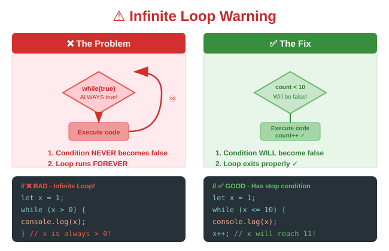

**How it happens:**
```javascript
// ❌ DANGER — Infinite Loop!
let x = 1;
while (x > 0) {
    console.log("Running..."); // x is always > 0, this NEVER stops!
}

// ❌ DANGER — Forgot to update the counter!
let count = 1;
while (count <= 10) {
    console.log(count);
    // Missing: count++; → count is always 1, always <= 10!
}

// ❌ DANGER — Condition can never be met!
for (let i = 10; i >= 0; i++) { // i starts at 10 and goes UP, never < 0
    console.log(i);
}
```

**How to prevent it:**
```javascript
// ✅ SAFE — Counter is updated
let count = 1;
while (count <= 10) {
    console.log(count);
    count++; // This ensures count eventually reaches 11, making condition false
}

// ✅ SAFE — Always use a maximum attempts limit
let attempts = 0;
let maxAttempts = 100; // Safety net!

while (someCondition && attempts < maxAttempts) {
    attempts++;
    // do work...
}
```

> 💡 **SDET Safety Tip:** Always add a `maxAttempts` or `timeout` when using `while` loops in test automation. If an element never appears, you don't want your test to run forever!

---

### 🏎️ Loop Performance — Choosing the Right Loop

For most daily work, all loops perform similarly. But when dealing with **large datasets** (like validating 10,000 API responses), the choice matters:

| Loop | Speed | Best For |
|------|-------|----------|
| `for` | ⚡ Fastest | Large arrays, performance-critical code |
| `while` | ⚡ Fast | Conditional repetition |
| `for...of` | ✅ Fast enough | Arrays, clean readable code |
| `for...in` | ⚠️ Slowest | Objects only (avoid on arrays) |
| `forEach` (array method) | ✅ Fast enough | Functional style, no break/continue |

> 💡 **Rule of Thumb:** Use `for...of` for clean code. Switch to a classic `for` loop only if you need maximum speed or need the index.

---

### 🧪 SDET Special: Common Automation Patterns

#### 1. Handling Web Tables (Rows & Columns)
```javascript
// Simulating a Playwright web table
let tableRows = [
    { product: "Laptop", price: 999, stock: true },
    { product: "Phone", price: 699, stock: true },
    { product: "Charger", price: 0, stock: false },  // Bug!
    { product: "Case", price: 29, stock: true }
];

console.log("--- Web Table Validation ---");
for (let row of tableRows) {
    if (row.price === 0) {
        console.log("🚨 " + row.product + ": Price is $0!");
    }
    if (!row.stock) {
        console.log("⚠️ " + row.product + ": Out of stock");
    }
}
```

#### 2. Handling Pagination (Multiple Pages)
```javascript
// Testing all pages of search results
let currentPage = 1;
let totalPages = 5;

while (currentPage <= totalPages) {
    console.log("📄 Testing page " + currentPage + " of " + totalPages);

    // In real Playwright:
    // await page.goto(`/products?page=${currentPage}`);
    // let items = await page.locator('.product-card').all();
    // for (let item of items) { ... validate each item ... }

    currentPage++;
}
console.log("✅ All " + totalPages + " pages tested!");
```

#### 3. Retry Logic (Flaky Tests)
```javascript
let testPassed = false;
let retries = 0;
let maxRetries = 3;

while (!testPassed && retries < maxRetries) {
    retries++;
    console.log("🔄 Attempt " + retries + " of " + maxRetries);

    // Simulating a flaky test that passes on 3rd try
    if (retries === 3) {
        testPassed = true;
        console.log("✅ Test PASSED on attempt " + retries);
    } else {
        console.log("❌ Test failed, retrying...");
    }
}

if (!testPassed) {
    console.log("🚨 Test FAILED after " + maxRetries + " attempts!");
}
```

---

---

## 10. Nested Loops (Loop Inside a Loop)

A **nested loop** is simply a loop placed **inside another loop**. The inner loop runs **completely** every time the outer loop runs once.

> Think of it like reading a book: the **outer loop** turns each page. The **inner loop** reads every word on that page.

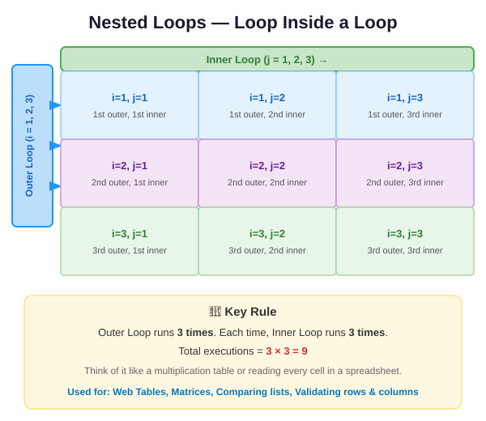

**Syntax:**
```javascript
for (let i = 1; i <= 3; i++) {          // Outer loop — runs 3 times
    for (let j = 1; j <= 3; j++) {      // Inner loop — runs 3 times PER outer run
        console.log("i=" + i + ", j=" + j);
    }
}
```

**Output:**
```
i=1, j=1 → i=1, j=2 → i=1, j=3
i=2, j=1 → i=2, j=2 → i=2, j=3
i=3, j=1 → i=3, j=2 → i=3, j=3
```

**🔑 Key Rule: Multiply the counts**
- Outer runs **3 times**, inner runs **3 times each** → **3 × 3 = 9 total executions**
- For outer=10, inner=10 → 10 × 10 = **100 total executions**

> ⚠️ **Warning:** Nested loops can get slow quickly with large data. Keep nesting to 2 levels maximum where possible.

#### 🧪 Real-World SDET Example:

**Validating every cell in a web table (rows × columns):**
```javascript
let table = [
    ["Product",  "Price", "Stock"],   // Header row (index 0)
    ["Laptop",   "999",   "Yes"],
    ["Phone",    "0",     "No"],      // Bug: price is $0!
    ["Tablet",   "499",   "Yes"]
];

// Start at row 1 to skip the header
for (let row = 1; row < table.length; row++) {
    for (let col = 0; col < table[row].length; col++) {
        let cell = table[row][col];

        if (cell === "0") {
            console.log("🚨 BUG at Row " + row + ", Col " + col + ": value is 0!");
        } else if (cell === "No") {
            console.log("⚠️ Row " + row + ", Col " + col + ": Out of stock");
        } else {
            console.log("✅ Row " + row + ", Col " + col + ": " + cell);
        }
    }
}
```

**Output:**
```
✅ Row 1, Col 0: Laptop
✅ Row 1, Col 1: 999
✅ Row 1, Col 2: Yes
✅ Row 2, Col 0: Phone
🚨 BUG at Row 2, Col 1: value is 0!
⚠️ Row 2, Col 2: Out of stock
✅ Row 3, Col 0: Tablet
✅ Row 3, Col 1: 499
✅ Row 3, Col 2: Yes
```

> 💡 **Common variable naming:** Use `i` for the outer loop and `j` for the inner loop — this is the universally accepted convention you'll see in every codebase.

---

## 11. Counting Down — Reverse Loops (i--)

Every loop example so far has counted **up** (`i++`). But you can just as easily loop **backwards** using `i--` (subtract 1 each time).

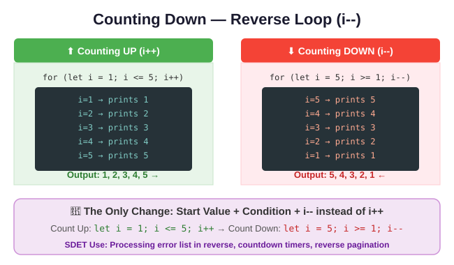

**The pattern — just 3 changes from a normal loop:**

| Part | Count Up | Count Down |
|------|----------|------------|
| **Start** | `let i = 1` | `let i = 5` (start at the end) |
| **Condition** | `i <= 5` | `i >= 1` (stop when you reach 1) |
| **Update** | `i++` | `i--` (subtract instead of add) |

**Example — Countdown:**
```javascript
// Count DOWN from 5 to 1
for (let i = 5; i >= 1; i--) {
    console.log(i);
}
console.log("🚀 Launch!");
```

**Output:**
```
5
4
3
2
1
🚀 Launch!
```

**Example — Loop through array in reverse:**
```javascript
let browsers = ["Chrome", "Firefox", "Safari", "Edge"];

// Loop from last index to 0
for (let i = browsers.length - 1; i >= 0; i--) {
    console.log("Testing: " + browsers[i]);
}
```

**Output:**
```
Testing: Edge
Testing: Safari
Testing: Firefox
Testing: Chrome
```

> 💡 **`browsers.length - 1`** is the last index. Since the array has 4 items (indices 0–3), `length - 1 = 3`, which is the last item "Edge".

#### 🧪 Real-World SDET Example:

**Removing failed tests from a list (safest to loop backwards when deleting):**
```javascript
let testResults = ["PASS", "FAIL", "PASS", "FAIL", "PASS"];

// Loop BACKWARDS when removing items — avoids index shifting issues
for (let i = testResults.length - 1; i >= 0; i--) {
    if (testResults[i] === "FAIL") {
        console.log("Removing failed test at index " + i);
        testResults.splice(i, 1); // Remove this item
    }
}

console.log("Remaining:", testResults); // ["PASS", "PASS", "PASS"]
```

> ⚠️ **Important:** When removing items from an array inside a loop, always loop **backwards**. If you loop forwards and remove an item, the indices shift and you'll skip the next item!

---

## 12. `for...of` with Index — Array.entries()

A common frustration with `for...of` is that you get the **value** but not the **position number (index)**. The fix is `.entries()`.

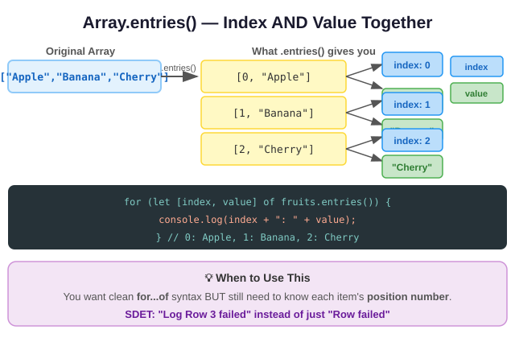

**The Problem:**
```javascript
let products = ["Laptop", "Phone", "Tablet"];

for (let product of products) {
    console.log(product);   // "Laptop", "Phone", "Tablet"
    // But which NUMBER is this? We don't know!
}
```

**The Solution — `.entries()`:**
```javascript
let products = ["Laptop", "Phone", "Tablet"];

for (let [index, product] of products.entries()) {
    console.log(index + ": " + product);
}
```

**Output:**
```
0: Laptop
1: Phone
2: Tablet
```

**How it works:**
- `products.entries()` converts the array into pairs: `[0, "Laptop"]`, `[1, "Phone"]`, `[2, "Tablet"]`
- `let [index, product]` — this is called **destructuring**: it unpacks each pair into two named variables
- Now you have **both** the index number AND the value in every iteration

**Comparison — 3 ways to loop with index:**
```javascript
let colors = ["red", "green", "blue"];

// Way 1: classic for — verbose
for (let i = 0; i < colors.length; i++) {
    console.log(i + ": " + colors[i]);
}

// Way 2: for...of with entries — clean & modern ✅ RECOMMENDED
for (let [i, color] of colors.entries()) {
    console.log(i + ": " + color);
}

// Way 3: forEach — no break/continue
colors.forEach((color, i) => {
    console.log(i + ": " + color);
});
```

> All three produce the same output: `0: red`, `1: green`, `2: blue`

#### 🧪 Real-World SDET Example:

**Reporting exactly which row number failed in a test:**
```javascript
let testCases = [
    { name: "Login Test",    status: "PASS" },
    { name: "Checkout Test", status: "FAIL" },   // Row 1 failed
    { name: "Search Test",   status: "PASS" },
    { name: "Profile Test",  status: "FAIL" }    // Row 3 failed
];

for (let [rowNumber, test] of testCases.entries()) {
    if (test.status === "FAIL") {
        console.log("❌ Row " + rowNumber + " FAILED: " + test.name);
    } else {
        console.log("✅ Row " + rowNumber + " passed: " + test.name);
    }
}
```

**Output:**
```
✅ Row 0 passed: Login Test
❌ Row 1 FAILED: Checkout Test
✅ Row 2 passed: Search Test
❌ Row 3 FAILED: Profile Test
```

> 💡 Without `.entries()`, you'd only know "Checkout Test failed" — with it, you know **exactly which row** failed. Much better bug reports!

---

## 13. `forEach()` — The Array Method Loop

`forEach()` is not a `for` loop — it's a **built-in array method** that loops through every item. You'll see it constantly in JavaScript code.

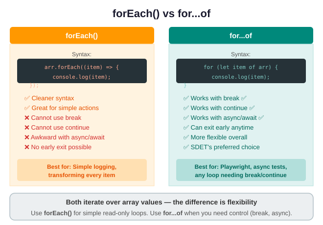

**Syntax:**
```javascript
array.forEach(function(item) {
    // code to run for each item
});

// Modern arrow function version (same thing, shorter):
array.forEach((item) => {
    // code to run for each item
});
```

**Basic Example:**
```javascript
let fruits = ["Apple", "Banana", "Cherry"];

fruits.forEach((fruit) => {
    console.log("🍎 " + fruit);
});
```

**Output:**
```
🍎 Apple
🍎 Banana
🍎 Cherry
```

**Getting the index with forEach:**
```javascript
let fruits = ["Apple", "Banana", "Cherry"];

fruits.forEach((fruit, index) => {
    console.log(index + ": " + fruit);
});
// Output: 0: Apple | 1: Banana | 2: Cherry
```

> `forEach` automatically passes two arguments to your function: the **item** and its **index**. You don't need `.entries()`.

**forEach vs for...of — When to use which:**

| Feature | `forEach()` | `for...of` |
|---------|------------|-----------|
| Syntax | Shorter, callback style | Slightly longer |
| `break` / `continue` | ❌ **Cannot use** | ✅ Works fine |
| `async/await` | ❌ Doesn't work as expected | ✅ Works perfectly |
| Getting index | ✅ Built-in (2nd param) | Need `.entries()` |
| Use in Playwright async tests | ❌ Avoid | ✅ Use this |

**The crucial limitation — no `break`:**
```javascript
let numbers = [1, 2, 3, 4, 5];

// ❌ This does NOT work — break inside forEach has no effect!
numbers.forEach((num) => {
    if (num === 3) break; // SyntaxError: Illegal break statement
    console.log(num);
});

// ✅ Use for...of when you need break
for (let num of numbers) {
    if (num === 3) break; // Works perfectly!
    console.log(num);
}
// Output: 1, 2
```

**The async/await problem:**
```javascript
let urls = ["/api/user", "/api/orders", "/api/cart"];

// ❌ WRONG — forEach does NOT wait for async operations
urls.forEach(async (url) => {
    let data = await fetch(url);  // This won't be awaited properly!
    console.log(data);
});

// ✅ CORRECT — for...of awaits each one properly
for (let url of urls) {
    let data = await fetch(url);  // This waits correctly
    console.log(data);
}
```

#### 🧪 Real-World SDET Example:

**✅ Good use of forEach — simple logging:**
```javascript
let testNames = ["Login", "Checkout", "Search", "Profile"];

// Simple, clean — just printing every test name
testNames.forEach((test) => {
    console.log("📋 Registered test: " + test);
});
```

**✅ Good use of for...of — async Playwright test:**
```javascript
let productUrls = ["/products/1", "/products/2", "/products/3"];

// In Playwright (async context) — for...of is correct!
for (let url of productUrls) {
    await page.goto(url);
    let title = await page.title();
    console.log("📄 " + url + " → " + title);
}
```

> 💡 **Simple rule:** If you need `break`, `continue`, or `async/await` → use `for...of`. If it's a simple action on every item with no early exit → `forEach` is fine.

---

## 14. Loop Variable Scope — `let` vs `var` Gotcha

This is one of the most common beginner bugs in JavaScript loops. It's important to understand before you move on.

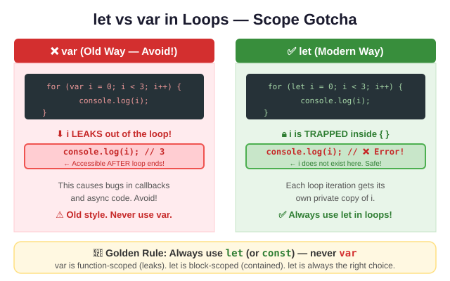

**`var` in loops — The OLD way (leaks out!):**
```javascript
for (var i = 0; i < 3; i++) {
    console.log(i);  // 0, 1, 2
}

// ❌ i is STILL accessible here — it leaked out!
console.log("After loop, i =", i);  // "After loop, i = 3"
```

**`let` in loops — The MODERN way (stays inside!):**
```javascript
for (let i = 0; i < 3; i++) {
    console.log(i);  // 0, 1, 2
}

// ✅ i is NOT accessible here — safely trapped inside the loop!
console.log("After loop, i =", i);  // ❌ ReferenceError: i is not defined
```

**Why does this matter? — The Closure Bug:**
```javascript
// ❌ BUG with var — classic infamous JavaScript bug
for (var i = 0; i < 3; i++) {
    setTimeout(() => {
        console.log(i);  // Prints 3, 3, 3 — NOT 0, 1, 2!
    }, 100);
}
// Because by the time setTimeout runs, i has already reached 3!

// ✅ FIXED with let — each iteration gets its OWN copy of i
for (let i = 0; i < 3; i++) {
    setTimeout(() => {
        console.log(i);  // Prints 0, 1, 2 — correct! ✅
    }, 100);
}
```

> ⚠️ This `var` closure bug has confused JavaScript developers for decades! The fix is simply: **always use `let`**.

**The golden rule:**

| Rule | Explanation |
|------|------------|
| `var` | **Function-scoped** — leaks out of loops, causes bugs |
| `let` | **Block-scoped** — stays inside `{ }`, safe |
| `const` | Use when the variable never changes (rare in loops) |

> 💡 **For SDETs:** If you ever see old test code using `var` in loops, replace it with `let`. It will behave more predictably in async automation code.

---

## 15. `for...of` with `Map` and `Set`

`for...of` doesn't just work on arrays. It works on any **iterable** — including the `Map` and `Set` data structures which are very useful in test data management.

### `Set` — A list with NO duplicates

A `Set` is like an array but automatically **removes duplicate values**. Perfect for storing unique test results.

```javascript
// Create a Set — no duplicates allowed
let uniqueStatuses = new Set(["PASS", "FAIL", "PASS", "PASS", "FAIL", "SKIP"]);

console.log(uniqueStatuses);
// Set { "PASS", "FAIL", "SKIP" } — duplicates removed automatically!

// Loop through a Set with for...of
for (let status of uniqueStatuses) {
    console.log("Status found: " + status);
}
```

**Output:**
```
Status found: PASS
Status found: FAIL
Status found: SKIP
```

#### 🧪 SDET Example — Finding all unique browsers tested:
```javascript
let browserLog = ["chromium", "firefox", "chromium", "webkit", "firefox", "chromium"];

let uniqueBrowsers = new Set(browserLog); // Removes duplicates

console.log("Unique browsers tested: " + uniqueBrowsers.size);

for (let browser of uniqueBrowsers) {
    console.log("  → " + browser);
}
```

**Output:**
```
Unique browsers tested: 3
  → chromium
  → firefox
  → webkit
```

---

### `Map` — Like an object but with MORE power

A `Map` stores **key-value pairs**, just like an object, but keys can be ANY type (not just strings). When you loop a `Map` with `for...of`, you get `[key, value]` pairs.

```javascript
// Create a Map
let testResults = new Map();
testResults.set("login",    "PASS");
testResults.set("checkout", "FAIL");
testResults.set("search",   "PASS");
testResults.set("profile",  "SKIP");

// Loop through a Map — get both key AND value
for (let [testName, result] of testResults) {
    console.log(testName + ": " + result);
}
```

**Output:**
```
login: PASS
checkout: FAIL
search: PASS
profile: SKIP
```

> 💡 Notice: `for (let [testName, result] of testResults)` — this is **destructuring** again, unpacking each `[key, value]` pair automatically.

#### 🧪 SDET Example — Test results summary with Map:
```javascript
let suiteResults = new Map([
    ["Login Suite",    "PASS"],
    ["Payment Suite",  "FAIL"],
    ["Search Suite",   "PASS"],
    ["Profile Suite",  "PASS"]
]);

let passed = 0;
let failed = 0;

for (let [suite, status] of suiteResults) {
    if (status === "PASS") {
        passed++;
        console.log("✅ " + suite);
    } else {
        failed++;
        console.log("❌ " + suite + " — needs attention!");
    }
}

console.log("\n📊 Summary: " + passed + " passed, " + failed + " failed");
```

**Output:**
```
✅ Login Suite
❌ Payment Suite — needs attention!
✅ Search Suite
✅ Profile Suite

📊 Summary: 3 passed, 1 failed
```

---

### Summary Cheat Sheet — Complete Loops Reference

| What You Want To Do | Best Approach |
|---------------------|--------------|
| Repeat exactly N times | `for (let i = 0; i < N; i++)` |
| Loop through an array's **values** | `for...of` |
| Loop through an array's **values + index** | `for...of` with `.entries()` |
| Loop through an **object's keys** | `for...in` |
| Repeat until a condition changes | `while` |
| Run at least once, then check | `do...while` |
| Loop **backwards** through a list | `for (let i = arr.length-1; i >= 0; i--)` |
| Loop inside a loop (tables, grids) | Nested `for` loops |
| Stop looping early | `break` |
| Skip one item, keep going | `continue` |
| Exit a nested loop from inside | `break labelName` |
| Simple action on every item (no break) | `forEach()` |
| Loop with `async/await` in Playwright | `for...of` |
| Loop through a `Set` (unique items) | `for...of` |
| Loop through a `Map` (key-value pairs) | `for...of` with destructuring |
| Always use `___` not `var` in loops | `let` |

> 💡 **Golden Rule for SDETs:** `for...of` is your workhorse for Playwright. It handles arrays, NodeLists, Sets, Maps, and works perfectly with `async/await`. Use `break` and `continue` inside it freely. Only switch to `forEach` for simple, non-async, read-every-item tasks.

---

## 17. Map and Set Commands (Cheat Sheet for SDETs)

As an SDET, you will frequently need to store unique values (like test IDs) or map keys to values (like storing test data). Let's learn the exact commands to manage `Set` and `Map` easily.

### 🔷 The `Set` Commands
A `Set` is a collection of **unique** values. If you try to add a duplicate, it just ignores it.

1. **`new Set()`** — Create an empty Set (or from an array).
2. **`.add(value)`** — Add a new item to the Set.
3. **`.has(value)`** — Check if an item exists (returns `true` or `false`).
4. **`.delete(value)`** — Remove an item from the Set.
5. **`.clear()`** — Empty the entire Set.
6. **`.size`** — Find out how many items are in the Set (not `.length`!).

```javascript
// 1. Create a Set
let failedTests = new Set();

// 2. Add items
failedTests.add("test_login");
failedTests.add("test_checkout");
failedTests.add("test_login"); // 👈 Ignored! Already exists.

// 3. Check if exists
console.log(failedTests.has("test_login")); // true
console.log(failedTests.has("test_payment")); // false

// 4. Check size
console.log(failedTests.size); // 2

// 5. Delete an item
failedTests.delete("test_login");
console.log(failedTests.has("test_login")); // false

// 6. Clear everything
failedTests.clear();
console.log(failedTests.size); // 0
```

### 🔷 The `Map` Commands
A `Map` is like a dictionary. It holds **Key-Value pairs**. You use a Key to save and find a Value.

1. **`new Map()`** — Create an empty Map.
2. **`.set(key, value)`** — Add or update a key-value pair.
3. **`.get(key)`** — Retrieve the value for a specific key.
4. **`.has(key)`** — Check if a key exists (returns `true` or `false`).
5. **`.delete(key)`** — Remove a key-value pair.
6. **`.clear()`** — Empty the entire Map.
7. **`.size`** — Find out how many pairs are in the Map.

```javascript
// 1. Create a Map
let userRoles = new Map();

// 2. Set (Add / Update)
userRoles.set("admin_user", "password123");
userRoles.set("guest_user", "guest123");
userRoles.set("admin_user", "new_password!"); // 👈 Updates the existing key!

// 3. Get value
console.log(userRoles.get("admin_user")); // "new_password!"
console.log(userRoles.get("unknown_user")); // undefined

// 4. Check if key exists
console.log(userRoles.has("guest_user")); // true

// 5. Check size
console.log(userRoles.size); // 2

// 6. Delete a key
userRoles.delete("guest_user");

// 7. Clear everything
userRoles.clear();
```

> 💡 **SDET Quick Tip:**
> - Use **`Set`** when you want to easily remove duplicates from an array: `let uniqueArray = [...new Set(arrayWithDuplicates)];`
> - Use **`Map`** when you need to link things together (like linking an element locator string to its expected text on a webpage).

---
## Strings (Overview)

A **String** is a data type used to represent text. It is essentially a sequence of characters—like letters, numbers, or symbols—all grouped together. 

### 1. How to Create a String
You can create a string by wrapping text in three types of "wrappers": 
*   **Single Quotes**: `'Hello'`
*   **Double Quotes**: `"Hello"`
*   **Backticks (Template Literals)**: `` `Hello` `` — These are special because they allow you to easily insert variables. 

### 2. Key Characteristics
*   **Immutable**: You cannot change a single letter in an existing string (e.g., you can't just swap 'H' for 'J' in "Hello"). To change it, you must create a brand-new string.
*   **Zero-based Indexing**: Like an array, you can access individual characters by their position, starting at `0`.
*   **Case-Sensitive**: JavaScript treats `"Hello"` and `"hello"` as two completely different strings. 

### 3. Common Operations
JavaScript provides built-in methods to handle strings easily: 
*   **Length**: `.length` tells you how many characters are in the string.
*   **Concatenation**: Joining strings together using the `+` operator or template literals.
*   **Case Conversion**: `.toUpperCase()` or `.toLowerCase()` changes the entire string's case.
*   **Searching**: `.includes()` or `.indexOf()` helps find specific words or letters inside a string.

## 18. Escape Characters in Strings

When you write a string in JavaScript, you use quotes around it — either `"double"` or `'single'`. But what if the text you want to print **contains** a quote, a new line, or a tab? That's where **escape characters** come in.

### 🔷 What is an Escape Character?

An escape character is a **backslash `\`** followed by a special letter. The backslash tells JavaScript:

> "Hey, the next character is NOT normal text — treat it as a special instruction."

**Analogy:** Think of the backslash as a **secret code prefix**. Just like `Ctrl + C` doesn't type the letter C on screen (it copies text), `\n` doesn't print the letter `n` on screen — it creates a **new line**.

---

### 🔷 All Escape Character Types

#### 1. `\'` — Single Quote
Use when your string is wrapped in single quotes and you need a single quote inside it.
```javascript
let message = 'It\'s a beautiful day!';
console.log(message); // It's a beautiful day!
```

#### 2. `\"` — Double Quote
Use when your string is wrapped in double quotes and you need a double quote inside it.
```javascript
let quote = "He said \"Hello\" to everyone.";
console.log(quote); // He said "Hello" to everyone.
```

#### 3. `\\` — Backslash itself
Since `\` is the escape character, to print an actual backslash you need to escape it with another backslash.
```javascript
let filePath = "C:\\Users\\Shuja\\Documents";
console.log(filePath); // C:\Users\Shuja\Documents
```

#### 4. `\n` — New Line
Moves the text to the **next line**. This is the most commonly used escape character.
```javascript
let greeting = "Hello!\nWelcome to JavaScript.";
console.log(greeting);
// Output:
// Hello!
// Welcome to JavaScript.
```

#### 5. `\t` — Tab (Horizontal)
Adds a **tab space** (like pressing the Tab key). Great for aligning output.
```javascript
let report = "Name\tAge\tCity";
console.log(report);
// Output: Name    Age     City
```

#### 6. `\r` — Carriage Return
Moves the cursor to the **beginning of the current line** (without going to a new line). Rarely used in modern code, but you may encounter it in files from Windows (Windows uses `\r\n` for new lines).
```javascript
console.log("Hello\rWorld");
// Output: World  ("World" overwrites "Hello" because \r moved cursor to start)
```

#### 7. `\b` — Backspace
Deletes the **previous character**. Rarely used in practice.
```javascript
console.log("Hello\b!");
// Output: Hell!  (the 'o' was "backspaced" and replaced by '!')
```

#### 8. `\f` — Form Feed
A legacy character used in old printers to jump to the **next page**. You'll almost never use this, but it exists.
```javascript
console.log("Page1\fPage2");
// Behavior depends on the environment — mostly seen in old documents
```

#### 9. `\0` — Null Character
Represents the **null character** (not the `null` value). Used internally in low-level programming.
```javascript
console.log("Hello\0World");
// May display as: Hello World (with an invisible character in between)
```

#### 10. `\uXXXX` — Unicode Character
Lets you insert **any character from any language** using its Unicode code. The `XXXX` is a 4-digit hex code.
```javascript
console.log("\u0048\u0065\u006C\u006C\u006F"); // Hello
console.log("\u2764");  // ❤ (heart symbol)
console.log("\u0928\u092E\u0938\u094D\u0924\u0947"); // नमस्ते (Namaste in Hindi)
```

---

### 🔷 Escape Characters Cheat Sheet

| Escape Sequence | Name | What It Does | Used Often? |
|---|---|---|---|
| `\'` | Single Quote | Prints `'` inside single-quoted strings | ✅ Yes |
| `\"` | Double Quote | Prints `"` inside double-quoted strings | ✅ Yes |
| `\\` | Backslash | Prints a literal `\` | ✅ Yes |
| `\n` | New Line | Moves text to the next line | ✅ Very Often |
| `\t` | Tab | Adds a tab space | ✅ Yes |
| `\r` | Carriage Return | Moves cursor to start of line | ⚠️ Rare |
| `\b` | Backspace | Deletes previous character | ⚠️ Rare |
| `\f` | Form Feed | Page break (legacy printers) | ❌ Almost Never |
| `\0` | Null Character | Inserts a null character | ❌ Almost Never |
| `\uXXXX` | Unicode | Inserts a character by its Unicode code | ✅ Sometimes |

---

### 🔷 Template Literals — The Modern Alternative

With ES6, JavaScript introduced **template literals** (backtick strings `` ` ``). These solve many problems that escape characters were needed for:

```javascript
// OLD way — using escape characters
let old = "Hello!\nMy name is \"Shuja\".\n\tI am learning JS.";

// NEW way — using template literals (backticks)
let name = "Shuja";
let modern = `Hello!
My name is "${name}".
	I am learning JS.`;

console.log(modern);
// Output:
// Hello!
// My name is "Shuja".
//     I am learning JS.
```

> 💡 With template literals:
> - **No need** to escape `"` or `'` — backticks handle both.
> - **No need** for `\n` — just press Enter inside the backticks for a real new line.
> - You can **embed variables** directly using `${variableName}`.

---

### 🧪 SDET Example — Escape Characters in Test Automation

As an SDET, you'll encounter escape characters when:

**1. Building XPath or CSS selectors with quotes:**
```javascript
// XPath that contains double quotes — escape them
let xpath = "//button[@aria-label=\"Submit Form\"]";
console.log(xpath);
// Output: //button[@aria-label="Submit Form"]

// Or use template literals to avoid escaping entirely
let xpath2 = `//button[@aria-label="Submit Form"]`;
```

**2. Logging multi-line test reports:**
```javascript
let testReport = `Test Results:
\t✅ Login Test — PASSED
\t❌ Checkout Test — FAILED
\t✅ Search Test — PASSED

Total: 2 Passed, 1 Failed`;

console.log(testReport);
// Output:
// Test Results:
//     ✅ Login Test — PASSED
//     ❌ Checkout Test — FAILED
//     ✅ Search Test — PASSED
//
// Total: 2 Passed, 1 Failed
```

**3. Working with file paths (Windows):**
```javascript
// Windows file paths use backslashes — must escape them
let screenshotPath = "C:\\test-results\\screenshots\\login_test.png";
console.log(screenshotPath);
// Output: C:\test-results\screenshots\login_test.png
```

> 💡 **SDET Tip:** Prefer **template literals** (backticks) in your test code whenever possible. They are cleaner, easier to read, and you won't need to escape quotes. Save `\n` and `\t` for when you need precise control over formatting in logs or reports.


## 19. String Methods in JS

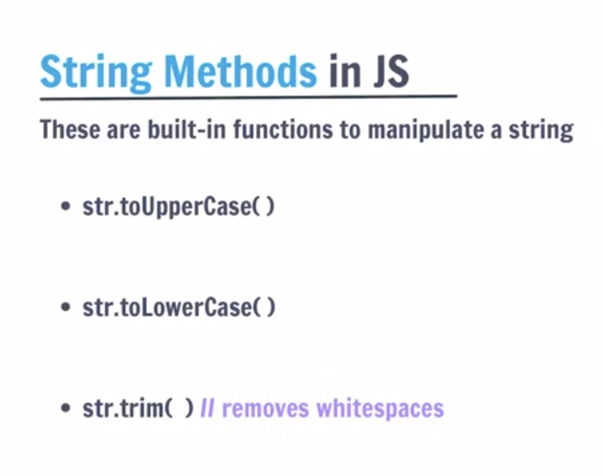
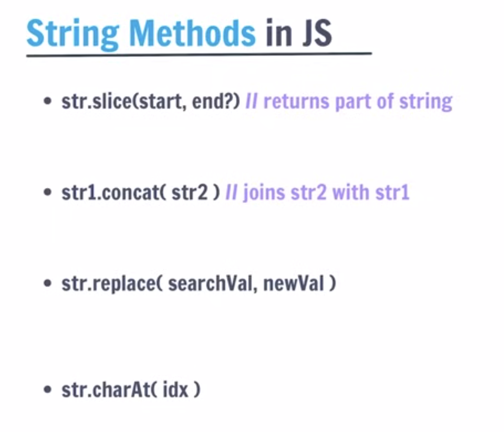

> 💡 **Golden Rule:** String methods **never change the original string**. They always return a **new string**. Always save the result: `text = text.trim();`

---

### 🔍 1. Searching & Checking — `includes`, `startsWith`, `endsWith`

These return `true` or `false` — they tell you **if** something exists.

```javascript
let msg = "Payment failed: invalid card.";

msg.includes("failed");      // true  — is "failed" anywhere inside?
msg.startsWith("Payment");   // true  — does it begin with "Payment"?
msg.endsWith("card.");        // true  — does it end with "card."?

// Text NOT there? They just return false — no crash!
msg.includes("success");     // false
msg.startsWith("Error");     // false
```
> 🎯 **SDET:** Verify a success toast shows, or that a URL begins with `https`.

---

### 📍 2. Finding Position — `indexOf` & `lastIndexOf`

These return the **index number** of where the text was found, or **`-1`** if it's not there.

```javascript
let s = "cat sat on a cat mat";

s.indexOf("cat");     // 0  — first "cat" starts at index 0
s.lastIndexOf("cat"); // 14 — last "cat" starts at index 14
s.indexOf("dog");     // -1 ← NOT FOUND
```

> 🎯 **SDET "not there" check:** `-1` means the text is absent. Use this to assert something is *not* on the page.
> ```javascript
> if (pageText.indexOf("Error") === -1) {
>     console.log("✅ No error — test passed!");
> }
> ```

---

### ✂️ 3. Extracting Text — `slice` & `substring`

Both cut out a piece of a string. The `end` index is **not included** in either.

```javascript
let msg = "Order #12345 placed";

// slice — supports negative indexes
msg.slice(7, 12);    // "12345"
msg.slice(-6);       // "placed" ← negative counts from the END

// substring — no negative indexes (treats negative as 0)
msg.substring(7, 12); // "12345"
msg.substring(12);    // "placed"
```

**`slice` vs `substring` — quick comparison:**

| Feature | `.slice(s, e)` | `.substring(s, e)` |
|---|---|---|
| Negative indexes? | ✅ Yes — counts from end | ❌ No — treated as `0` |
| Swaps args if s > e? | ❌ Returns empty string | ✅ Yes — swaps automatically |
| Use in SDET? | ✅ Preferred (more flexible) | ✅ Fine for simple extractions |

> 🎯 **SDET:** Use `slice` as your default — it's more flexible. `substring` is fine when you know both indexes are positive.

---

### 🔄 4. Replacing — `replace` & `replaceAll`

```javascript
let s = "I love apples. apples are great.";

s.replace("apples", "mango");    // "I love mango. apples are great."  ← first only
s.replaceAll("apples", "mango"); // "I love mango. mango are great."   ← all of them

// Strip a character by replacing with empty string ""
"$49.99".replace("$", ""); // "49.99"
```
> 🎯 **SDET:** Strip `$`, `₹`, `%` before converting scraped text to a number.

---

### 🧹 5. Trimming Spaces — `trim`, `trimStart`, `trimEnd`

Web pages often return text with hidden spaces.

```javascript
let name = "   John Doe   ";

name.trim();      // "John Doe"    — both sides
name.trimStart(); // "John Doe   " — left side only
name.trimEnd();   // "   John Doe" — right side only
```

---

### 🔤 6. Changing Case — `toUpperCase` & `toLowerCase`

```javascript
"PaSsEd".toUpperCase(); // "PASSED"
"PaSsEd".toLowerCase(); // "passed"
```
> 🎯 **SDET:** Always lowercase both sides before comparing to avoid case-mismatch failures.
> ```javascript
> actual.toLowerCase() === expected.toLowerCase(); // safe comparison
> ```

---

### 🔪 7. Split & Join

These are **opposites** — `split` turns a string into an array, `join` turns an array back into a string.

```javascript
// String → Array
let csv = "chrome,firefox,safari";
let browsers = csv.split(","); // ["chrome", "firefox", "safari"]

// Array → String
browsers.join(" | "); // "chrome | firefox | safari"
browsers.join("");    // "chromefirefoxsafari"
```
> 🎯 **SDET:** Split a test-data config string into an array, loop over it, then join results into a report.

---

### 🔢 8. Converting Types — `toString`, `parseInt`, `parseFloat`

```javascript
// Number → String
(42).toString(); // "42"
String(99);      // "99"

// String → Whole number (stops at first non-digit)
parseInt("42px");   // 42
parseInt("abc");    // NaN

// String → Decimal number
parseFloat("3.14rem"); // 3.14
parseFloat("99");      // 99
```
> 🎯 **SDET Pipeline:** `"$49.99"` → `.replace("$","")` → `parseFloat()` → compare to expected price.

---

### 🧩 9. Regex & Pattern Matching — `.match()`

**Regex** = a mini language for finding **patterns** in text. Written between two slashes: `/pattern/`.

```javascript
let text = "Order 123 placed. Ref: 456.";

// Find all numbers (\d+ = one or more digits, g = find all)
text.match(/\d+/g); // ["123", "456"]

// Case-insensitive search (i flag)
"Hello World".match(/hello/i); // ["Hello"]  ← matched despite different case

// Check if email-like pattern exists
"user@test.com".match(/@/); // truthy — "@" was found
```
> 🎯 **SDET:** Verify a field only contains numbers, or extract all prices from a product listing page.

---

### 🔢 10. Padding — `padStart` & `padEnd`

**Padding** means adding extra characters to the **beginning** or **end** of a string until it reaches a specific total length. Think of it like filling a box to a fixed size.

```
padStart — adds padding on the LEFT side
padEnd   — adds padding on the RIGHT side

Syntax: string.padStart(totalLength, "fillChar")
        string.padEnd(totalLength,   "fillChar")
```

#### Visual: What is padding?

```
──────────────────────────────────────────────────────────
  ORIGINAL:  "5"        (length = 1)
──────────────────────────────────────────────────────────

  padStart(4, "0")  →  "0005"   ← zeros added on the LEFT
  ┌───┬───┬───┬───┐
  │ 0 │ 0 │ 0 │ 5 │    total length = 4
  └───┴───┴───┴───┘
      ↑↑↑ padding    ↑ original

  padEnd(4, "0")    →  "5000"   ← zeros added on the RIGHT
  ┌───┬───┬───┬───┐
  │ 5 │ 0 │ 0 │ 0 │    total length = 4
  └───┴───┴───┴───┘
  ↑ original  ↑↑↑ padding
──────────────────────────────────────────────────────────
```

#### Examples

```javascript
// Pad with zeros on the LEFT (most common use case)
"5".padStart(4, "0");   // "0005"
"42".padStart(4, "0");  // "0042"
"999".padStart(4, "0"); // "0999"

// Pad with spaces on the RIGHT (for table alignment)
"Pass".padEnd(10, " ");  // "Pass      "
"Fail".padEnd(10, " ");  // "Fail      "

// Pad with any character
"hi".padStart(6, "*");  // "****hi"
"hi".padEnd(6, "-");    // "hi----"

// If string is already long enough — nothing changes
"Hello".padStart(3, "0"); // "Hello"  ← already longer than 3, unchanged
```

#### SDET Use — Formatting Test Report Output

Without padding, your report columns look messy. With padding, they align neatly:

```javascript
let results = [
    { test: "Login",    status: "PASS" },
    { test: "Checkout", status: "FAIL" },
    { test: "Search",   status: "PASS" },
];

for (let r of results) {
    // padEnd makes test name column always 12 chars wide
    // padStart makes status right-aligned in 6 chars
    console.log(r.test.padEnd(12) + r.status.padStart(6));
}
```

**Output (nicely aligned!):**
```
Login          PASS
Checkout       FAIL
Search         PASS
```

> 🎯 **SDET Use:** Pad order numbers / IDs with leading zeros so `"5"` becomes `"0005"` — useful when comparing IDs from a database that always stores them as 4-digit strings.

---

### 📋 String Methods Cheat Sheet

| Method | What it does | Returns |
|---|---|---|
| `.includes("x")` | Does the string contain "x"? | `boolean` |
| `.startsWith("x")` | Does it start with "x"? | `boolean` |
| `.endsWith("x")` | Does it end with "x"? | `boolean` |
| `.indexOf("x")` | Position of first "x" (`-1` = not found) | `number` |
| `.lastIndexOf("x")` | Position of last "x" | `number` |
| `.slice(s, e)` | Extract characters from index `s` to `e` | `string` |
| `.substring(s, e)` | Extract characters from `s` to `e` (no negatives) | `string` |
| `.replace("a","b")` | Replace **first** "a" with "b" | `string` |
| `.replaceAll("a","b")` | Replace **all** "a" with "b" | `string` |
| `.trim()` | Remove spaces from both ends | `string` |
| `.trimStart()` | Remove spaces from left only | `string` |
| `.trimEnd()` | Remove spaces from right only | `string` |
| `.padStart(n, "x")` | Add "x" on the **LEFT** until length = n | `string` |
| `.padEnd(n, "x")` | Add "x" on the **RIGHT** until length = n | `string` |
| `.toUpperCase()` | Convert to ALL CAPS | `string` |
| `.toLowerCase()` | Convert to all lowercase | `string` |
| `.split("x")` | Break string into an array at "x" | `array` |
| `.join("x")` | Merge array into string with "x" between | `string` |
| `.match(/regex/)` | Find pattern(s) using regex | `array` or `null` |
| `.toString()` | Convert number/value to string | `string` |
| `parseInt("x")` | Convert string → whole number | `number` |
| `parseFloat("x")` | Convert string → decimal number | `number` |
| `.length` | Count characters (no `()` — it's a property!) | `number` |

