# JavaScript Learning Notes

## 📋 Table of Contents

1. [What is JavaScript?](#1-what-is-javascript)
   - [Client-Side vs Server-Side](#client-side-vs-server-side)
   - [The JavaScript Console](#the-javascript-console)
2. [Variables](#2-variables)
   - [2.1 Temporary Variable](#21-temporary-variable)
3. [Data Types](#3-data-types)
   - [Pass by Value vs Pass by Reference](#-pass-by-value-vs-pass-by-reference)
   - [Symbol](#-symbol)
   - [BigInt](#-bigint)
   - [Dynamic Typing vs Static Typing](#-dynamic-typing-vs-static-typing)
   - [Type Coercion](#-type-coercion)
4. [Operators](#4-operators)
   - [Nullish Coalescing (??) vs ||](#11-nullish-coalescing-operator-)
5. [Truthy and Falsy Values](#truthy-and-falsy-values)
6. [Conditional Statements](#5-conditional-statements)
7. [JavaScript Input/Output Methods](#6-javascript-inputoutput-methods)
- [Appendix](#appendix-comparison-recap--vs-)

---

# 1. What is JavaScript?

JavaScript is a programming language that is used to create dynamic and interactive web pages. It is a high-level, interpreted programming language that is used to add functionality to web pages. It is a client-side programming language that is used to create dynamic and interactive web pages.

- JavaScript is a high-level, interpreted programming language primarily used to make web pages interactive and dynamic. It was created by Brendan Eich in 1995 at Netscape.
- Where it runs: Originally designed to run in web browsers, JavaScript now also runs on servers (via Node.js), mobile apps, desktop applications, and even IoT devices.
- Core features: It supports object-oriented, functional, and event-driven programming styles. It's dynamically typed, meaning you don't need to declare variable types explicitly.
- ECMAScript — mention that JavaScript follows the ECMAScript standard (ES6/ES2015+)
- Role in web development: It's one of the three core technologies of the web alongside HTML (structure) and CSS (styling). JavaScript handles the behavior and logic layer.

### Client-Side vs Server-Side

To understand how JavaScript works, it's important to understand the two main environments where code runs in web development.


#### 🖥️ Client-Side (Front-end)
The **Client** refers to the user's device (laptop, phone) and the software they are using to view the web (like Chrome, Safari, Firefox). 
- **What it does:** Displays the user interface, handles user interactions (clicks, scrolling), and makes the page look good.
- **Technologies used:** HTML (Structure), CSS (Styling), and Client-Side JavaScript (Behavior).
- **Example:** When you click a "Like" button and it turns blue immediately, that's client-side JavaScript reacting.

#### 🗄️ Server-Side (Back-end)
The **Server** is a powerful computer located somewhere else (in a data center) that listens for requests from clients, processes them, and sends data back.
- **What it does:** Stores data in databases, handles security, processes payments, and runs complex business logic.
- **Technologies used:** Node.js (Server-Side JavaScript), Python, Java, Databases (SQL, MongoDB), APIs.
- **Example:** When you click that same "Like" button, the client sends a message to the server saying "Update the database to add 1 like". The server saves this so everyone else can see it.

> **Why Node.js matters:** Historically, JavaScript *only* ran in the browser (Client-Side). Node.js was created to allow developers to run JavaScript on the Server-Side too. Now you can build the entire application using just one language!

---

## The JavaScript Console

### 1. What is the Console?
The `console` object is built into JavaScript and available in:

- **Browser DevTools** (F12 → Console tab)
- **Node.js** (when you run a script, output appears in the terminal)

It provides methods to print messages, warnings, errors, and even interactive tables. Think of it as a print statement for developers.

### 2. `console.log()` – The Workhorse

**Basic usage**
```javascript
console.log("Hello, world!");
```
*Output: Hello, world!*

**Logging multiple values**
You can pass any number of arguments; they'll be printed separated by spaces.
```javascript
console.log("The answer is", 42, "and", true);
```
*Output: The answer is 42 and true*

**Logging variables and expressions**
```javascript
let name = "Alice";
console.log("User:", name);
console.log("2 + 2 =", 2 + 2);
```

**String substitution (like printf)**
```javascript
console.log("Hello %s, you have %d new messages.", "Bob", 5);
// %s = string, %d = integer, %f = float, %o = object
```
*Output: Hello Bob, you have 5 new messages.*

**Styling output (browser only)**
You can add CSS with `%c`:
```javascript
console.log("%cThis is red and big", "color: red; font-size: 20px;");
```

**Logging objects**
```javascript
const user = { name: "Charlie", age: 30 };
console.log(user);
```
*In the console, you can expand the object to inspect its properties.*

### 3. `console.error()` – Highlight Problems
`console.error()` is similar to `log`, but it outputs in red (in browsers) and also includes a stack trace in Node.js. Use it for error messages.

```javascript
console.error("Something went wrong!");
```

**Example with an error object**
```javascript
try {
  throw new Error("Invalid input");
} catch (err) {
  console.error("Caught an error:", err);
}
```
*In the browser, you'll see a red message; in Node.js, it writes to stderr.*

### 4. `console.warn()` – Yellow Warnings
`console.warn()` outputs in yellow (in browsers) to indicate a warning – not as severe as an error.

```javascript
console.warn("This feature is deprecated.");
```

### 5. `console.table()` – Beautiful Data Display
`console.table()` prints arrays or objects as a neat table. This is incredibly useful for visualizing data.

**For an array of objects**
```javascript
const users = [
  { name: "Alice", age: 25, city: "New York" },
  { name: "Bob", age: 30, city: "London" },
  { name: "Charlie", age: 35, city: "Paris" }
];
console.table(users);
```

*Output (in console):*
```text
┌─────────┬───────────┬─────┬──────────┐
│ (index) │   name    │ age │   city   │
├─────────┼───────────┼─────┼──────────┤
│    0    │  'Alice'  │ 25  │'New York'│
│    1    │   'Bob'   │ 30  │ 'London' │
│    2    │ 'Charlie' │ 35  │  'Paris' │
└─────────┴───────────┴─────┴──────────┘
```

**For a single object**
```javascript
const person = { name: "Dave", job: "developer", age: 28 };
console.table(person);
```

*Output:*
```text
┌──────────┬─────────────┐
│ (index)  │   Values    │
├──────────┼─────────────┤
│   name   │   'Dave'    │
│   job    │ 'developer' │
│   age    │     28      │
└──────────┴─────────────┘
```

**Limiting columns**
You can pass an array of column names as a second argument:
```javascript
console.table(users, ["name", "city"]);
```
*Shows only name and city columns.*

### 6. Other Handy Console Methods

- **`console.info()`** – Informational messages. Similar to log, but sometimes styled differently (blue in some browsers).
- **`console.debug()`** – Debug-level messages. Often hidden by default; you can enable debug output in browser settings.
- **`console.group()` / `console.groupEnd()`** – Group related logs.
  ```javascript
  console.group("User Details");
  console.log("Name: Alice");
  console.log("Age: 25");
  console.groupEnd();
  ```
  *This creates collapsible groups in the console.*

- **`console.time()` / `console.timeEnd()`** – Measure execution time.
  ```javascript
  console.time("loop");
  for (let i = 0; i < 1000000; i++) {}
  console.timeEnd("loop"); // prints: loop: 3.456ms
  ```

- **`console.count()`** – Count how many times a line is executed.
  ```javascript
  function greet() {
    console.count("greet called");
  }
  greet(); // greet called: 1
  greet(); // greet called: 2
  ```

- **`console.trace()`** – Print stack trace.
  ```javascript
  function a() { b(); }
  function b() { console.trace(); }
  a();
  ```

### 7. Where to Run These Examples?
- **Browser:** Open any webpage, press `F12`, go to the **Console** tab, and paste the code.
- **Node.js:** Save a `.js` file and run `node filename.js`, or use the REPL by typing `node` in terminal.

### 8. Summary

| Method | Purpose |
|---|---|
| `log()` | General output (black text) |
| `error()` | Error messages (red, includes stack) |
| `warn()` | Warnings (yellow) |
| `table()` | Display arrays/objects as a table |
| `info()` | Informational (sometimes blue) |
| `debug()` | Debug output (may be hidden) |
| `group()` | Group related logs together |
| `time()` | Start a timer |
| `timeEnd()` | End a timer and print duration |
| `count()` | Count occurrences |
| `trace()` | Print a stack trace |

> **Tip:** These methods will be your daily companions as you learn JavaScript and especially when you start automating with Playwright (where you often need to debug selectors, network requests, etc.).
---

## 2. Variables

- What is a variable?
- A variable is a container for storing data.
- In JavaScript, variables are declared using the var, let, or const keywords.
- let is the preferred way to declare variables in modern JavaScript.
- const is used to declare variables that cannot be reassigned.
- var is the older way to declare variables and is not recommended for use in modern JavaScript.

- Syntax:
- let variableName = value;
- const variableName = value;
- var variableName = value;

- Example:

```javascript
let name = "John";
const age = 30;
var city = "New York";

console.log(name);
console.log(age);
console.log(city);
```

## Visual Guides

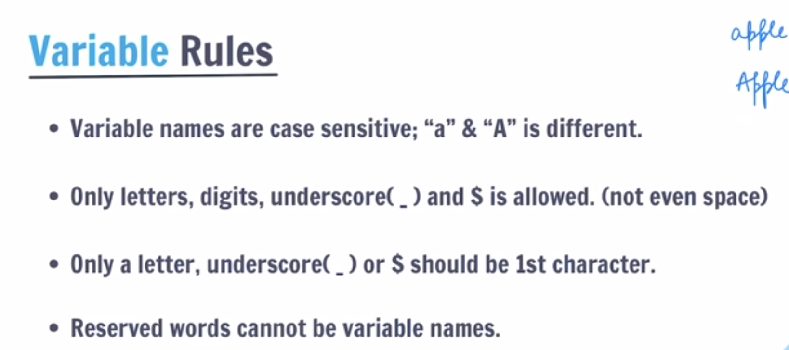

---

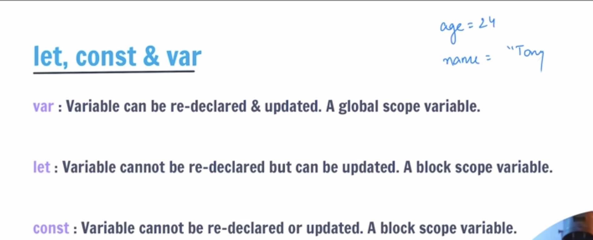

```javascript
var age = 1;
var age = 2;
var age = 3;
console.log(age);
```

The last value will be printed and it is wrong way to write code using var as we can redeclare the same variable many times.

```javascript
let age = 1;
age = 2;
console.log(age);
```

In `let` we can update the value of the variable but we cannot redeclare the same variable.

```javascript
const age = 1;
// age = 2; // This would cause an error
console.log(age);
```

In `const` we cannot update the value of the variable and we cannot redeclare the same variable.

---

### 📌 Variable Naming Rules

Not every name is a valid variable name in JavaScript. Here are the rules:

**✅ Valid names:**
- Can use letters, digits, `_`, and `$`
- Must **start with** a letter, `_`, or `$` — NOT a number
- Case-sensitive: `name` and `Name` are two different variables

**❌ Invalid names:**
```javascript
let 1name = "wrong";   // ❌ cannot start with a number
let my-name = "wrong"; // ❌ hyphens not allowed
let let = "wrong";     // ❌ 'let' is a reserved keyword
```

**✅ Valid names:**
```javascript
let name = "John";      // ✅
let _private = true;    // ✅ underscore is ok
let $price = 99;        // ✅ dollar sign is ok
let firstName = "Ali";  // ✅ camelCase — standard convention
let age2 = 25;          // ✅ digit in middle/end is ok
```

**Naming convention in JavaScript:** Use **camelCase** — first word lowercase, each next word starts uppercase.
```javascript
// ✅ Good — camelCase
let userAge = 25;
let totalPrice = 100;
let isLoggedIn = true;

// ❌ Bad — not conventional
let user_age = 25;   // snake_case (used in Python, not JS)
let UserAge = 25;    // PascalCase (used for class names, not variables)
```

---
## 2.1 Temporary Variable

A temporary variable (often called temp) is a variable used to hold a value temporarily while you rearrange or swap other variables. It's like using an extra cup when you want to swap the contents of two cups – you pour one into the extra cup, then the other into the first, then the extra into the second.

📝 Why Do You Need It for Swapping?
Imagine you have two variables:

javascript
let a = 3;
let b = 7;
If you simply do a = b;, you lose the original value of a (3) forever. Then you can't put it into b. The temporary variable saves that original value so you can complete the swap.

✅ Correct Swap Using a Temporary Variable
javascript
let a = 3;
let b = 7;

let temp = a;   // temp now holds 3 (original a)
a = b;          // a becomes 7 (value of b)
b = temp;       // b becomes 3 (value saved in temp)

console.log(a); // 7
console.log(b); // 3
Now the values are swapped! This works no matter what the original values are.

🧠 Key Takeaway
The temporary variable is just a storage box – it lets you keep a value safe while you move other values around. You'll see this pattern often in programming, not just for swapping but also for rotating values, reversing arrays, etc.

📝 Your Notes
Write down:

Temporary variable: A variable used to hold a value temporarily during operations like swapping.

Swap algorithm:

temp = a
a = b
b = temp

------------

## 3. Data Types

- What is a data type?
- A data type is a type of data that can be stored in a variable.
- In JavaScript, there are two types of data types:
- Primitive data types
- Non-primitive data types

- Primitive data types:
- String (Text)
- Number (Integer, Float)
- Boolean (True, False)
- Undefined (Value is not assigned)
- Null (Value is intentionally assigned as null)
- Symbol (Unique value)
- BigInt (Large integer)

- Non-primitive data types:
- Object (Collection of key-value pairs)
- Array (Ordered list of values)
- Function (Block of code that performs a specific task)

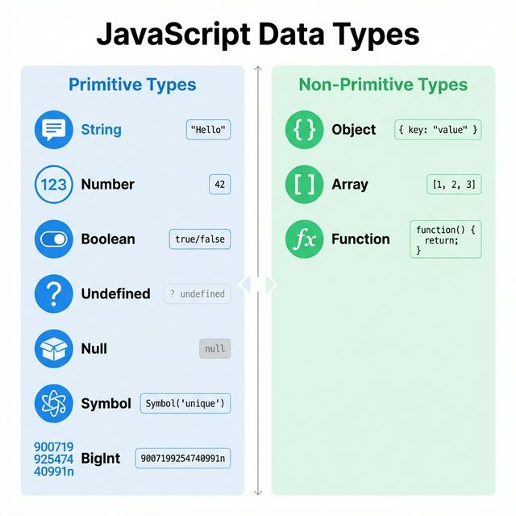

---

### 🔷 null vs undefined

Both mean "no value" — but they mean it in **different ways**:

| | `undefined` | `null` |
|---|---|---|
| **Meaning** | Variable declared but never given a value | Intentionally set to empty by the developer |
| **Who sets it?** | JavaScript sets it automatically | You set it yourself |
| **typeof** | `"undefined"` | `"object"` ← (famous JS bug!) |

```javascript
// undefined — JS sets this automatically
let username;
console.log(username); // undefined — you declared it but never assigned

// null — YOU set this intentionally
let loggedInUser = null; // no one is logged in yet
console.log(loggedInUser); // null

// checking the difference
console.log(undefined == null);  // true  ← loose equality treats them the same
console.log(undefined === null); // false ← strict equality — different types!
```

> 💡 Think of it this way: `undefined` = JS doesn't know. `null` = YOU said "nothing here".

---

### 🔷 NaN — Not a Number

`NaN` stands for **Not a Number**. It appears when you try to do a math operation on something that isn't a number.

```javascript
console.log("hello" - 5);    // NaN  ← can't subtract from text
console.log(Number("abc"));  // NaN  ← can't convert "abc" to a number
console.log(0 / 0);          // NaN  ← undefined math

// NaN is weird — it never equals itself!
console.log(NaN === NaN);    // false  ← only value in JS not equal to itself!

// Correct way to check for NaN
console.log(isNaN("hello"));      // true  ← is it NaN?
console.log(Number.isNaN(NaN));   // true  ← more reliable, only true for actual NaN
console.log(Number.isNaN("hello")); // false ← "hello" is not NaN, just non-numeric
```

> ⚠️ Always use `Number.isNaN()` rather than `isNaN()` — `isNaN()` converts the value first which can give unexpected results.

---

### 🔷 typeof Quick Reference

`typeof` tells you the data type of any value. Every beginner should know this table:

```javascript
console.log(typeof "hello");     // "string"
console.log(typeof 42);          // "number"
console.log(typeof 3.14);        // "number"  ← floats are also "number"
console.log(typeof true);        // "boolean"
console.log(typeof undefined);   // "undefined"
console.log(typeof null);        // "object"  ← 🐛 famous JS bug! null is NOT an object
console.log(typeof Symbol());    // "symbol"
console.log(typeof 42n);         // "bigint"
console.log(typeof {});          // "object"
console.log(typeof []);          // "object"  ← arrays are also objects!
console.log(typeof function(){}); // "function"
```

> ⚠️ `typeof null === "object"` is a **historical bug** in JavaScript from 1995. It was never fixed to avoid breaking old code. To properly check for null use: `value === null`

---

### 🔷 Pass by Value vs Pass by Reference

This explains how data is copied and shared in JavaScript — and it's directly tied to whether the type is **primitive** or **non-primitive (object)**.

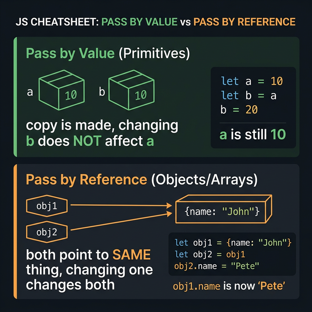

---

#### ✅ Pass by Value — Primitives (number, string, boolean, null, undefined)

When you assign a primitive to another variable, JavaScript makes a **full copy**. Each variable has its own independent value. Changing one does **NOT** affect the other.

```javascript
let a = 10;
let b = a;   // b gets a COPY of a's value

b = 20;      // change b

console.log(a); // 10  ← a is NOT affected, it has its own copy
console.log(b); // 20
```

```javascript
let name1 = "Alice";
let name2 = name1;   // copy of "Alice"

name2 = "Bob";

console.log(name1); // "Alice" ← unchanged
console.log(name2); // "Bob"
```

---

#### ⚠️ Pass by Reference — Non-Primitives (Objects, Arrays)

When you assign an object or array to another variable, JavaScript does **NOT** copy it. Both variables point to the **same object in memory**. Changing one changes both!

```javascript
let obj1 = { name: "John", age: 25 };
let obj2 = obj1;   // NOT a copy — both point to the same object!

obj2.name = "Pete"; // change via obj2

console.log(obj1.name); // "Pete" ← obj1 is also changed! 😱
console.log(obj2.name); // "Pete"
```

```javascript
// Same with arrays
let arr1 = [1, 2, 3];
let arr2 = arr1;   // both point to the same array

arr2.push(4);

console.log(arr1); // [1, 2, 3, 4] ← arr1 also changed!
console.log(arr2); // [1, 2, 3, 4]
```

---

#### 🔐 How to copy an object WITHOUT sharing it

If you want a real independent copy of an object:

```javascript
let original = { name: "John", age: 25 };

// Spread operator creates a SHALLOW copy
let copy = { ...original };

copy.name = "Pete";

console.log(original.name); // "John" ← safe, untouched ✅
console.log(copy.name);     // "Pete"
```

#### Quick Summary

| | Primitives (Pass by Value) | Objects/Arrays (Pass by Reference) |
|---|---|---|
| What is copied? | The actual value | The memory address (pointer) |
| Change affects original? | ❌ No | ✅ Yes |
| Types | number, string, boolean, null, undefined, symbol, bigint | object, array, function |
| Independent copy? | ✅ Always | ❌ Need spread `{...obj}` or `[...arr]` |

> 💡 **Key Rule:** If it's a primitive → you get a copy. If it's an object/array → you get a reference to the same thing in memory.

---

### 🔷 Symbol


A **Symbol** is a primitive data type introduced in ES6. Every Symbol created is **guaranteed to be unique** — even if two symbols have the exact same description, they are never equal to each other.

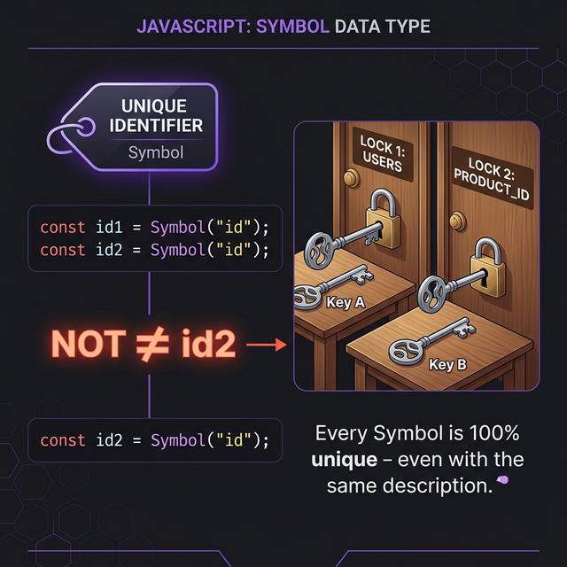

**Think of it like this:** Two keys that look exactly the same but open completely different locks — that's what Symbol does.

**When to use Symbol:**
- When you need a property key that will never clash with another key
- For hidden/private-like properties in objects (symbols are skipped in `for...in` loops)
- Used internally by JavaScript itself (e.g., `Symbol.iterator`)

```javascript
const id1 = Symbol("id");
const id2 = Symbol("id");

console.log(id1 === id2);     // false — same description, but NOT the same!
console.log(typeof id1);      // "symbol"
console.log(id1.description); // "id"

// Symbol as a unique object key
const SECRET = Symbol("secret");
const user = {
    name: "Shujauddin",
    [SECRET]: "internal-token-xyz"
};

console.log(user.name);    // Shujauddin
console.log(user[SECRET]); // internal-token-xyz
// Symbol key is hidden from for...in loops — acts like a private property
```

---

### 🔷 BigInt

**BigInt** is a primitive data type (ES2020+) used to work with **very large integers** that go beyond JavaScript's safe number limit.

**The Problem with regular numbers:**
JavaScript's `Number` type can only safely represent integers up to `9007199254740991`. Beyond that, it loses precision and gives wrong answers.

```javascript
console.log(Number.MAX_SAFE_INTEGER);   // 9007199254740991
console.log(9007199254740991 + 2);      // 9007199254740992 — WRONG answer!
```

**BigInt fixes this** — just add `n` at the end of the number:

```javascript
const big = 9007199254740991n;
console.log(big + 2n);   // 9007199254740993n — correct!
console.log(typeof big); // "bigint"

// ⚠️ You cannot mix BigInt with regular numbers
// console.log(big + 5);         // ❌ TypeError!
console.log(big + BigInt(5));    // ✅ Must convert first
```

**When to use BigInt:**
- Financial calculations with very large amounts
- Cryptography (huge numbers)
- Any calculation where accuracy beyond 9 quadrillion matters

---

### 🔷 Dynamic Typing vs Static Typing

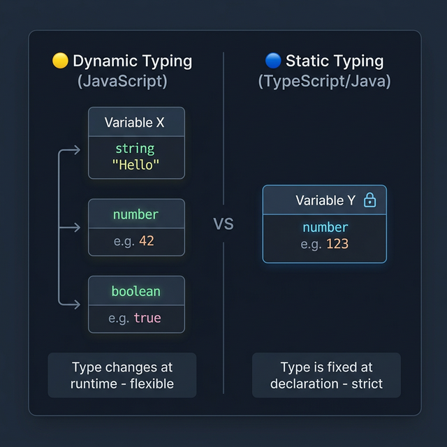

**JavaScript is dynamically typed** — the variable type is decided by the value you put in, not by you. You can even change the type later.

```javascript
// JavaScript - dynamic typing
let data = "Hello";   // type is string
data = 42;            // now it's a number — no error!
data = true;          // now it's a boolean — still fine!

console.log(typeof data); // "boolean"
```

**Statically typed languages** (like Java, TypeScript) lock the type at declaration. You can't change it.

```java
// Java - static typing
int data = 42;        // must be a number always
data = "Hello";       // ❌ ERROR — type mismatch!
```

| | JavaScript (Dynamic) | Java/TypeScript (Static) |
|---|---|---|
| Type set by | Value at runtime | You at declaration |
| Change type? | ✅ Yes | ❌ No |
| Catches errors | At runtime | At compile time |
| Flexibility | High | Low |

---
### 🔷 Type Coercion

**Type Coercion** is when JavaScript automatically (or you manually) converts one data type to another.

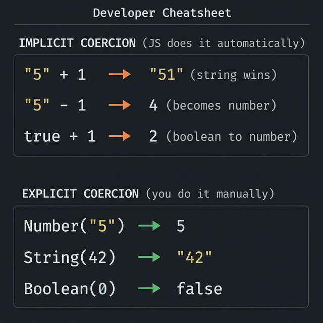

#### Implicit Coercion — JS does it automatically

JavaScript quietly converts types behind the scenes. This can lead to **surprising results**:

```javascript
// + with a string → JS converts number to string (concatenation)
console.log("5" + 1);    // "51"  ← NOT 6! string wins with +

// - always does math → JS converts string to number
console.log("5" - 1);    // 4    ← string becomes number

// boolean converts to number
console.log(true + 1);   // 2    ← true becomes 1
console.log(false + 1);  // 1    ← false becomes 0

// == triggers coercion (this is why === is preferred)
console.log(5 == "5");   // true  ← number and string treated as equal!
console.log(5 === "5");  // false ← strict, no coercion
```

#### Explicit Coercion — you control it

You convert types yourself using built-in functions — safer and clearer:

```javascript
// Convert to Number
console.log(Number("42"));     // 42
console.log(Number(""));       // 0
console.log(Number("hello"));  // NaN (can't convert text)
console.log(Number(true));     // 1
console.log(Number(false));    // 0

// Convert to String
console.log(String(42));       // "42"
console.log(String(true));     // "true"
console.log(String(null));     // "null"

// Convert to Boolean
console.log(Boolean(0));       // false
console.log(Boolean(""));      // false
console.log(Boolean("hello")); // true
console.log(Boolean(1));       // true
```

#### Where you use this in real code

**Getting input from a user (prompt returns a string):**
```javascript
let age = prompt("Enter your age:"); // returns "25" as string
console.log(age + 1);               // "251" ← WRONG! string + number
console.log(Number(age) + 1);       // 26   ← CORRECT! explicit conversion
```

**In SDET — reading values from the DOM:**
```javascript
let priceText = "499";   // text scraped from a webpage
let price = Number(priceText);

if (price > 100) {
    console.log("Expensive item"); // works correctly after conversion
}
```

> ⚠️ **Rule of thumb:** Always use `===` to avoid coercion surprises. Use explicit conversion (`Number()`, `String()`, `Boolean()`) when you need to change types intentionally.

---


---

## 4. Operators


- What is an operator?

- An operator is a symbol that performs an operation on one or more operands.

- It is used to perform some operation on data.

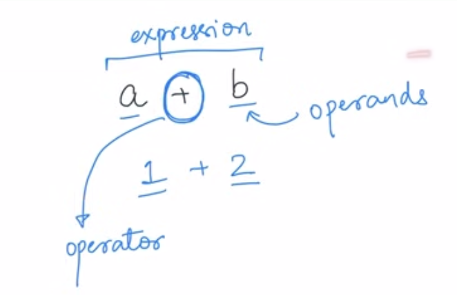

- In JavaScript, there are different types of operators:

### 1. Arithmetic Operators (+, -, *, /, %, **)

**Meaning:** Used to perform mathematical calculations on numbers.

- `+` Addition - adds two numbers
- `-` Subtraction - subtracts one number from another
- `*` Multiplication - multiplies two numbers
- `/` Division - divides one number by another
- `%` Modulus - returns the remainder after division
- `**` Exponentiation - raises the first operand to the power of the second operand
- `++` Increment - increases the value of a variable by 1
- `--` Decrement - decreases the value of a variable by 1

**Example:**

```javascript
let a = 10;
let b = 3;

console.log(a + b); // Output: 13 (adds 10 and 3)
console.log(a - b); // Output: 7 (subtracts 3 from 10)
console.log(a * b); // Output: 30 (multiplies 10 by 3)
console.log(a / b); // Output: 3.333... (divides 10 by 3)
console.log(a % b); // Output: 1 (remainder when 10 is divided by 3)
console.log(a ** b); // Output: 1000 (10 to the power of 3)
```

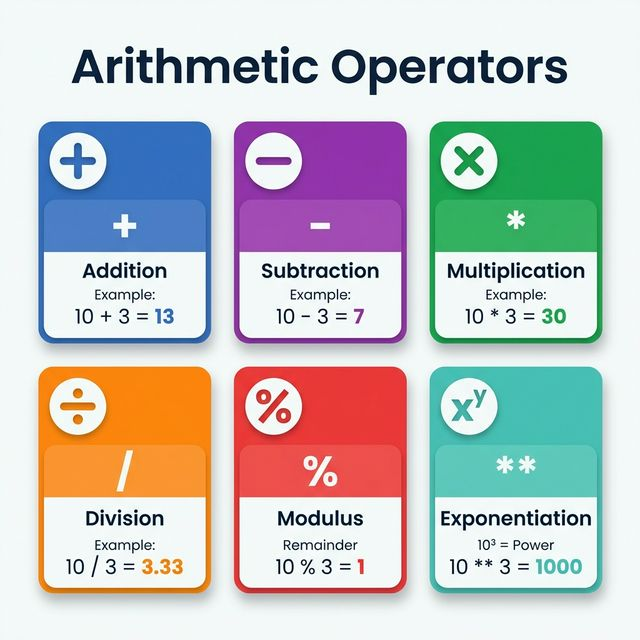

### 2. Comparison Operators (==, ===, !=, !==, >, <, >=, <=)

**Meaning:** Used to compare two values and return a boolean (true or false).

- `==` Equal to - checks if values are equal (with type conversion)
- `===` Strict equal to - checks if values AND types are equal
- `!=` Not equal to - checks if values are not equal
- `!==` Strict not equal to - checks if values OR types are not equal
- `>` Greater than
- `<` Less than
- `>=` Greater than or equal to
- `<=` Less than or equal to

**Example:**

```javascript
let x = 10;
let y = "10";
let z = 5;

console.log(x == y);   // Output: true (10 equals "10" after type conversion)
console.log(x === y);  // Output: false (number 10 is NOT strictly equal to string "10")
console.log(x != z);   // Output: true (10 is not equal to 5)
console.log(x !== y);  // Output: true (different types: number vs string)
console.log(x > z);    // Output: true (10 is greater than 5)
console.log(x < z);    // Output: false (10 is not less than 5)
console.log(x >= 10);  // Output: true (10 is greater than or equal to 10)
console.log(z <= 5);   // Output: true (5 is less than or equal to 5)
```

- Comparison Operators (The Equality Trap)
In SDET work, checking values correctly is the difference between a "Pass" and a "Fail" in your tests.

A. Loose Equality (==)
Rule: Checks only the Value.

Coercion: It converts data types automatically (e.g., changes a string to a number) to try and make them match.

Example: 5 == "5" is true.

B. Strict Equality (===)
Rule: Checks both Value AND Data Type.

SDET Best Practice: Always use === to prevent "invisible" bugs in your automation scripts.

Example: 5 === "5" is false.

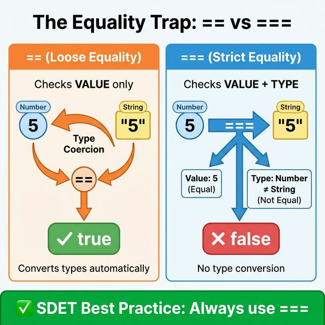

### 3. Logical Operators (&&, ||, !)

**Meaning:** Used to combine or invert boolean values.

- `&&` AND - returns true if BOTH conditions are true
- `||` OR - returns true if AT LEAST ONE condition is true
- `!` NOT - inverts the boolean value (true becomes false, false becomes true)

**Example:**

```javascript
let age = 25;
let hasLicense = true;

console.log(age >= 18 && hasLicense); // Output: true (age is 18+ AND has license)
console.log(age >= 18 || hasLicense); // Output: true (at least one is true)
console.log(!hasLicense);             // Output: false (inverts true to false)

let isSunny = false;
let isWarm = true;
console.log(isSunny && isWarm);       // Output: false (NOT both are true)
console.log(isSunny || isWarm);       // Output: true (at least one is true)
console.log(!isSunny);                // Output: true (inverts false to true)
```

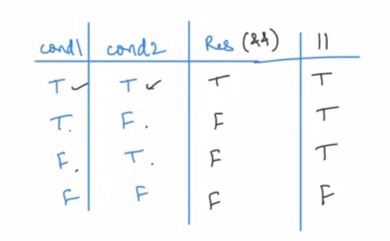

### 4. Assignment Operators (=, +=, -=, *=, /=, %=)

**Meaning:** Used to assign or update values to variables.

- `=` Assigns a value
- `+=` Adds and assigns (a += 5 is same as a = a + 5)
- `-=` Subtracts and assigns
- `*=` Multiplies and assigns
- `/=` Divides and assigns
- `%=` Modulus and assigns

**Example:**

```javascript
let score = 10;

score = 20;    // Assigns 20 to score
console.log(score); // Output: 20

score += 5;    // Same as: score = score + 5 (20 + 5)
console.log(score); // Output: 25

score -= 3;    // Same as: score = score - 3 (25 - 3)
console.log(score); // Output: 22

score *= 2;    // Same as: score = score * 2 (22 * 2)
console.log(score); // Output: 44

score /= 4;    // Same as: score = score / 4 (44 / 4)
console.log(score); // Output: 11

score %= 5;    // Same as: score = score % 5 (remainder of 11/5)
console.log(score); // Output: 1
```

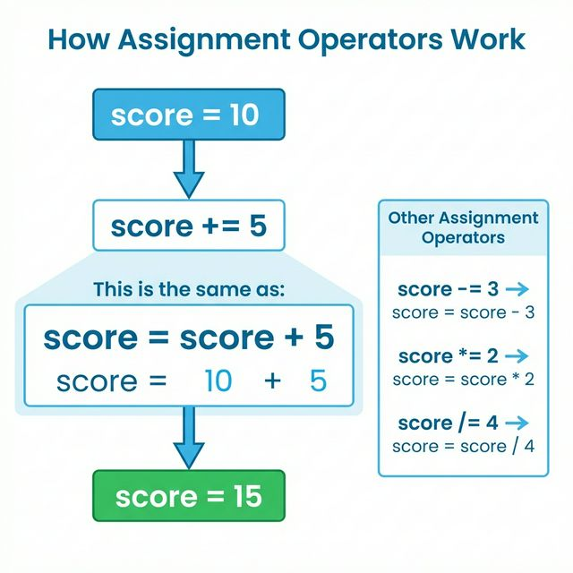

### 5. Increment/Decrement Operators (++, --)

**Meaning:** Used to increase or decrease a variable's value by 1.

- `++` Increment - increases value by 1
- `--` Decrement - decreases value by 1
- Can be used as prefix (++a) or postfix (a++)

**Example:**

```javascript
let count = 5;

count++;           // Increases count by 1 (postfix)
console.log(count); // Output: 6

++count;           // Increases count by 1 (prefix)
console.log(count); // Output: 7

count--;           // Decreases count by 1 (postfix)
console.log(count); // Output: 6

--count;           // Decreases count by 1 (prefix)
console.log(count); // Output: 5

// Difference between prefix and postfix:
let a = 10;
console.log(a++);  // Output: 10 (uses current value first, THEN increments)
console.log(a);    // Output: 11 (now incremented)

let b = 10;
console.log(++b);  // Output: 11 (increments FIRST, then uses new value)
console.log(b);    // Output: 11
```

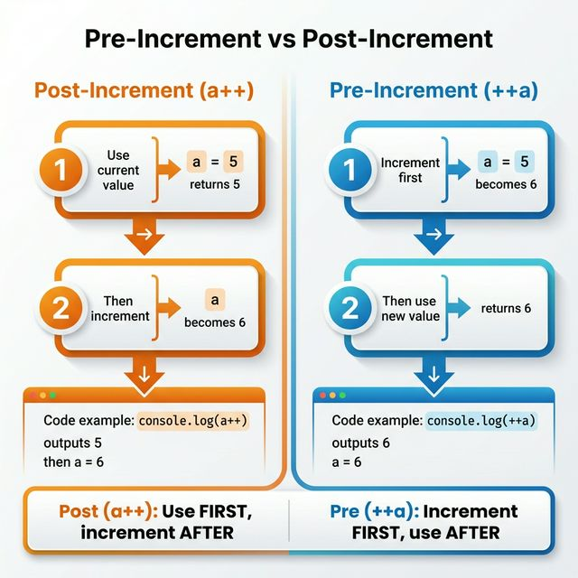

### 6. Ternary Operator (? :)

**Meaning:** A shorthand for if-else statements. Returns one value if condition is true, another if false.

- Syntax: `condition ? valueIfTrue : valueIfFalse`
- if condition is true then valueIfTrue will be executed else valueIfFalse will be executed

**Example:**

```javascript
let age = 20;
let canVote = age >= 18 ? "Yes" : "No"; // If age >= 18, return "Yes", else "No"
console.log(canVote); // Output: "Yes"

let marks = 45;
let result = marks >= 50 ? "Pass" : "Fail"; // Check if marks are 50 or more
console.log(result); // Output: "Fail"

// Can also use directly in console.log:
let temp = 35;
console.log(temp > 30 ? "Hot" : "Cold"); // Output: "Hot"
```

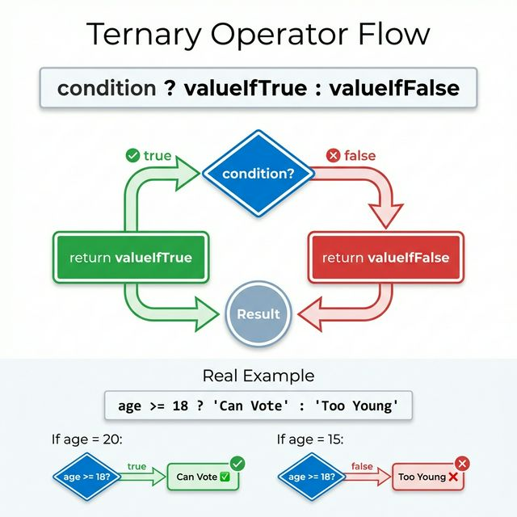

### 7. typeof Operator

**Meaning:** Returns the data type of a value as a string.

**Example:**

```javascript
let name = "John";
let age = 30;
let isStudent = true;
let salary = null;
let address;

console.log(typeof name);      // Output: "string" (text)
console.log(typeof age);       // Output: "number" (numeric value)
console.log(typeof isStudent); // Output: "boolean" (true/false)
console.log(typeof salary);    // Output: "object" (null is considered object - historical bug)
console.log(typeof address);   // Output: "undefined" (value not assigned)
console.log(typeof [1, 2, 3]); // Output: "object" (arrays are objects)
```

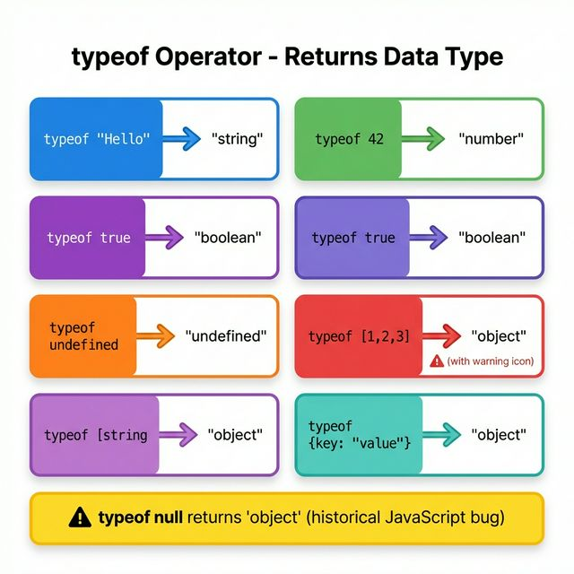

### 8. in Operator

**Meaning:** Checks if a property/key exists in an object. Returns true if found, false if not.

**Example:**

```javascript
let person = {
  name: "John",
  age: 30,
  city: "New York"
};

console.log("name" in person);    // Output: true (property "name" exists)
console.log("age" in person);     // Output: true (property "age" exists)
console.log("country" in person); // Output: false (property "country" doesn't exist)

let car = { brand: "Toyota", model: "Camry" };
console.log("brand" in car);      // Output: true
console.log("year" in car);       // Output: false
```

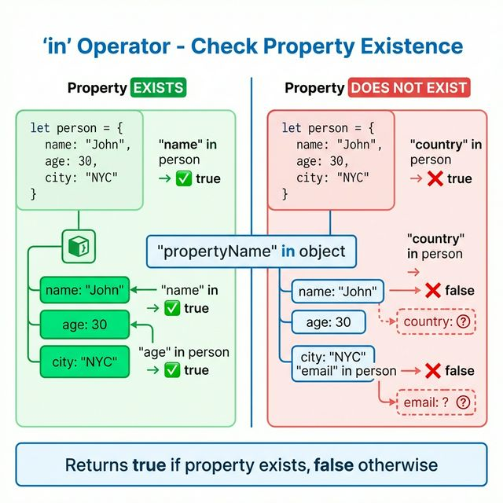

### 9. instanceof Operator

**Meaning:** Checks if an object is an instance of a specific class or constructor. Returns true or false.

**Example:**

```javascript
let numbers = [1, 2, 3, 4];
let today = new Date();
let message = "Hello";

console.log(numbers instanceof Array);  // Output: true (numbers is an array)
console.log(today instanceof Date);     // Output: true (today is a Date object)
console.log(message instanceof String); // Output: false (primitive string, not String object)

let obj = { name: "Test" };
console.log(obj instanceof Object);     // Output: true (obj is an object)
console.log(obj instanceof Array);      // Output: false (obj is not an array)

function Person(name) {
  this.name = name;
}
let john = new Person("John");
console.log(john instanceof Person);    // Output: true (john is instance of Person)
```

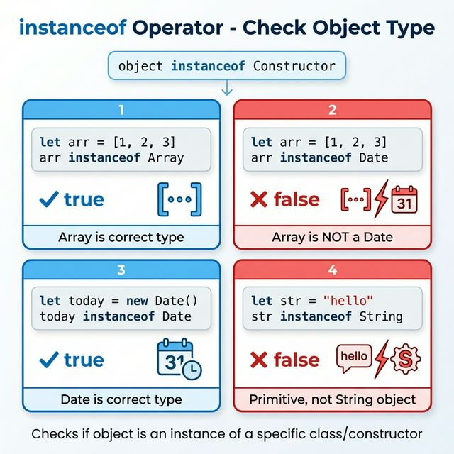

---

### 10. Unary Operators

**Meaning:** Operators that work with only ONE operand (value). They perform operations on a single value.

**Common Unary Operators:**

- `+` Unary plus - converts operand to a number
- `-` Unary minus - negates the operand
- `!` Logical NOT - inverts boolean value
- `++` Increment - increases value by 1
- `--` Decrement - decreases value by 1
- `typeof` - returns the data type
- `delete` - deletes a property from an object
- `void` - evaluates an expression and returns undefined

**Example:**

```javascript
// Unary Plus (+) - converts to number
let str = "5";
console.log(+str);        // Output: 5 (string "5" converted to number 5)
console.log(typeof +str); // Output: "number"

let bool = true;
console.log(+bool);       // Output: 1 (true converted to 1)
console.log(+false);      // Output: 0 (false converted to 0)

// Unary Minus (-) - negates the value
let num = 10;
console.log(-num);        // Output: -10 (makes positive number negative)
console.log(-(-num));     // Output: 10 (double negative becomes positive)

// Logical NOT (!) - inverts boolean
let isActive = true;
console.log(!isActive);   // Output: false (inverts true to false)
console.log(!!isActive);  // Output: true (double negation returns original)

// Increment (++) and Decrement (--)
let count = 5;
console.log(++count);     // Output: 6 (increments first, then returns)
console.log(count++);     // Output: 6 (returns first, then increments)
console.log(count);       // Output: 7 (now incremented)

// typeof operator
console.log(typeof "Hello");  // Output: "string"
console.log(typeof 42);       // Output: "number"

// delete operator
let person = { name: "John", age: 30 };
delete person.age;            // Deletes the 'age' property
console.log(person);          // Output: { name: "John" }

// void operator
console.log(void 0);          // Output: undefined
console.log(void (2 + 2));    // Output: undefined (evaluates 2+2 but returns undefined)
```

---

### 11. Nullish Coalescing Operator (??)

**Meaning:** Returns the **right-hand value** only when the left-hand value is `null` or `undefined`. If the left side has any other value — even `0`, `""`, or `false` — it keeps it as is.

> In simple words: **"Give me a fallback, but ONLY if I have nothing (null/undefined)"**

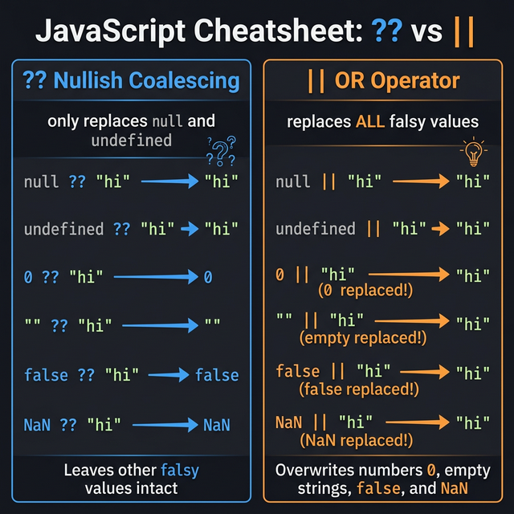

**Syntax:** `value ?? fallback`

```javascript
// ?? only triggers for null and undefined
console.log(null ?? "default");      // "default"  ← null → use fallback
console.log(undefined ?? "default"); // "default"  ← undefined → use fallback
console.log(0 ?? "default");         // 0          ← 0 is NOT null, keep it!
console.log("" ?? "default");        // ""         ← empty string is NOT null, keep it!
console.log(false ?? "default");     // false      ← false is NOT null, keep it!
```

### ⚡ ?? vs || — The Key Difference

This is where people get confused. Both look similar but behave very differently:

| Situation | `??` result | `\|\|` result |
|-----------|------------|--------------|
| `null` | uses fallback ✅ | uses fallback ✅ |
| `undefined` | uses fallback ✅ | uses fallback ✅ |
| `0` | **keeps 0** ✅ | uses fallback ⚠️ |
| `""` | **keeps ""** ✅ | uses fallback ⚠️ |
| `false` | **keeps false** ✅ | uses fallback ⚠️ |

```javascript
let userScore = 0; // valid score of zero

// Using || — WRONG behaviour for this case
let score1 = userScore || 10;  // 10 ← 0 is falsy, gets replaced! Bug!

// Using ?? — CORRECT behaviour
let score2 = userScore ?? 10;  // 0  ← 0 is not null/undefined, kept! ✅
```

### Where you use this in real code

**Safe default for settings that might not exist:**
```javascript
let fontSize = userSettings.fontSize ?? 16; // use 16 only if not set at all
let username = user.name ?? "Guest";        // "Guest" only if name is null/undefined
```

**In SDET — reading config values:**
```javascript
let timeout = config.timeout ?? 5000; // default 5s only if timeout wasn't configured
let retries = config.retries ?? 3;    // default 3 only if retries is absent
```

> 💡 **Rule:** Use `??` when `0`, `""`, or `false` are valid values you want to keep. Use `||` when ANY falsy value should trigger the fallback.

---

## Operator Classification by Number of Operands


### **1. Unary Operators** (One Operand)

Operate on a single value.

- **Examples:** `!a`, `++a`, `--a`, `typeof a`, `-a`, `+a`, `delete obj.prop`
- **Use cases:** Type conversion, negation, increment/decrement, type checking

### **2. Binary Operators** (Two Operands)

Operate on two values.

- **Examples:** `a + b`, `a > b`, `a && b`, `a = b`, `a % b`
- **Use cases:** Arithmetic, comparison, logical operations, assignments
- **Note:** Most operators in JavaScript are binary operators

### **3. Ternary Operator** (Three Operands)

Operates on three values. JavaScript has only ONE ternary operator.

- **Example:** `condition ? valueIfTrue : valueIfFalse`
- **Use cases:** Conditional expressions, shorthand if-else statements

---

## Truthy and Falsy Values

When JavaScript checks a condition (like in an `if` statement), it doesn't just look for `true` or `false`. It treats **any value** as either truthy or falsy.

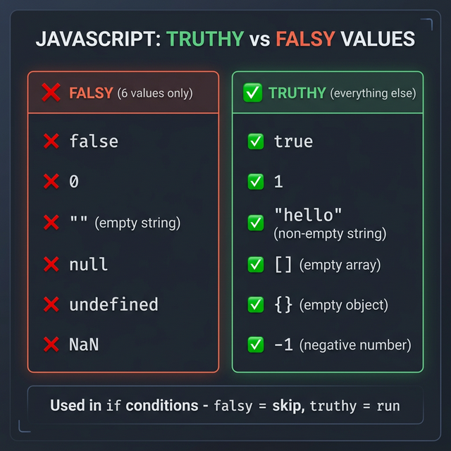

### ❌ Falsy Values — only 6 of them

These are the **only** values that act as `false` in a condition:

| Value | Why it's falsy |
|-------|---------------|
| `false` | It's literally false |
| `0` | Zero is nothing |
| `""` | Empty string — no content |
| `null` | Intentionally empty |
| `undefined` | Never given a value |
| `NaN` | Not a valid number |

### ✅ Truthy Values — everything else

If it's not in the 6 falsy values above, it's truthy. Including these that often surprise people:

```javascript
// These all count as TRUE in a condition
if (1)         console.log("truthy"); // ✅ non-zero number
if ("hello")   console.log("truthy"); // ✅ non-empty string
if ([])        console.log("truthy"); // ✅ empty array (still truthy!)
if ({})        console.log("truthy"); // ✅ empty object (still truthy!)
if (-1)        console.log("truthy"); // ✅ negative number
```

### Code Example

```javascript
// these are all FALSY - the if block will NOT run
if (0)         console.log("runs"); // ❌ skipped
if ("")        console.log("runs"); // ❌ skipped
if (null)      console.log("runs"); // ❌ skipped
if (undefined) console.log("runs"); // ❌ skipped

// these are all TRUTHY - the if block WILL run
if (1)         console.log("runs"); // ✅ prints
if ("hi")      console.log("runs"); // ✅ prints
if ([])        console.log("runs"); // ✅ prints (empty array is truthy!)
```

### Where you use this in real code

**Checking if a user filled in a form field:**
```javascript
let username = "";

if (username) {
    console.log("Welcome, " + username); // skipped — empty string is falsy
} else {
    console.log("Please enter your name!"); // this runs
}
```

**Checking if an API returned data:**
```javascript
let apiResponse = null; // API failed

if (apiResponse) {
    console.log("Got data:", apiResponse); // skipped — null is falsy
} else {
    console.log("No data returned"); // this runs
}
```

**In SDET / automation testing:**
```javascript
let element = getElement(".submit-btn"); // returns null if not found

if (element) {
    element.click(); // only clicks if element exists (truthy)
} else {
    console.log("Button not found on page!");
}
```

> 💡 **Key Rule to remember:** Only 6 things are falsy. Everything else — including empty arrays `[]` and empty objects `{}` — is truthy!

---

## 5. Conditional Statements


**What are Conditional Statements?**
Conditional statements allow you to make decisions in your code based on conditions. Think of them as "if this happens, then do that."

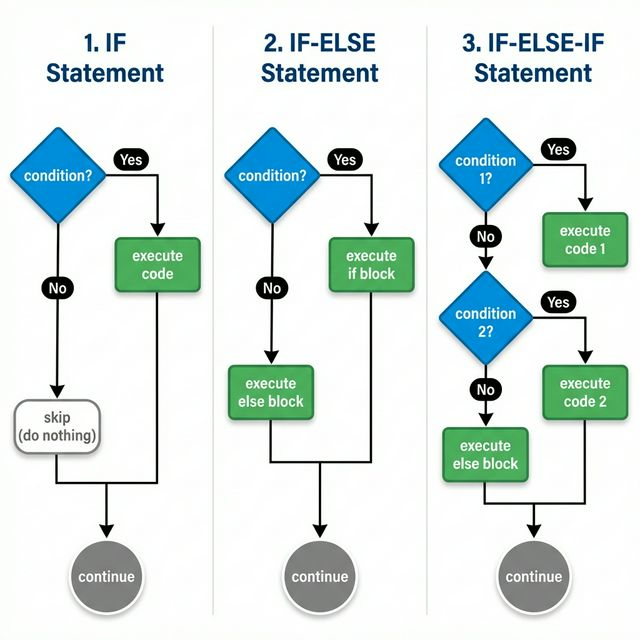

---
  
### **A) IF Statement**

**Rule:** Executes code ONLY if the condition is **true**. If false, nothing happens.

**Syntax:**

```javascript
if (condition) {
    // code to execute if condition is true
}
```

**Example:**

```javascript
let age = 20;

if (age >= 18) {
    console.log("You can vote!"); // This will print because age is 20
}

if (age >= 21) {
    console.log("You can drink!"); // This will NOT print (nothing happens)
}
```

---

### **B) IF-ELSE Statement**

**Rule:** If the condition is **true**, execute the `if` block. If **false**, execute the `else` block.

**Syntax:**

```javascript
if (condition) {
    // code if condition is true
} else {
    // code if condition is false
}
```

**Example:**

```javascript
let mode = "dark-mode";
let color;

if (mode === "dark-mode") {
    color = "Black"; // This executes because mode is "dark-mode"
} else {
    color = "White";
}

console.log(color); // Output: Black
```

**Another Example:**

```javascript
let marks = 45;

if (marks >= 50) {
    console.log("Pass");
} else {
    console.log("Fail"); // This executes because marks < 50
}
```

---

### **C) IF-ELSE-IF Statement**

**Rule:** Checks multiple conditions in order. Executes the FIRST true condition. If none are true, executes the `else` block.

**Syntax:**

```javascript
if (condition1) {
    // code if condition1 is true
} else if (condition2) {
    // code if condition2 is true
} else {
    // code if none of the conditions are true
}
```

**Example:**

```javascript
let marks = 75;

if (marks >= 90) {
    console.log("Grade: A");
} else if (marks >= 75) {
    console.log("Grade: B"); // This executes because marks = 75
} else if (marks >= 50) {
    console.log("Grade: C");
} else {
    console.log("Grade: F");
}

// Output: Grade: B
```

**Traffic Light Example:**

```javascript
let light = "yellow";

if (light === "green") {
    console.log("Go!");
} else if (light === "yellow") {
    console.log("Slow down!"); // This executes
} else if (light === "red") {
    console.log("Stop!");
} else {
    console.log("Invalid light!");
}

// Output: Slow down!
```

---

### **Quick Comparison:**

| Statement | When to Use |
| --------- | ----------- |
| **if** | Execute code only when condition is true, otherwise skip |
| **if-else** | Choose between 2 options (true or false) |
| **if-else-if** | Choose between 3+ options (multiple conditions) |

---

### **D) SWITCH Statement**

**Rule:** Compares a single value against multiple `case` labels. It is more readable than long `if-else-if` chains when checking the same variable for specific values.

**Syntax:**

```javascript
switch (expression) {
    case value1:
        // code to execute
        break;
    case value2:
        // code to execute
        break;
    default:
        // code if no case matches
}
```

**Example:**

```javascript
let day = 3;

switch (day) {
    case 1:
        console.log("Monday");
        break;
    case 2:
        console.log("Tuesday");
        break;
    case 3:
        console.log("Wednesday"); // This executes because day is 3
        break;
    default:
        console.log("Invalid day");
}

// Output: Wednesday
```

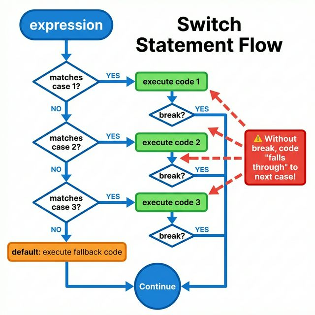

**Key Note:** The `break` keyword is essential to stop the execution from "falling through" to the next case. The `default` case acts like an `else`

---

## 6. JavaScript Input/Output Methods

**Overview:** Different ways to get input from users and display output in JavaScript.

| Feature | Works in Browser? | Works in VS Code/Node? | Recommended For |
| ------- | ----------------- | ---------------------- | --------------- |
| `console.log()` | ✅ Yes | ✅ Yes | Everything (Universal) |
| `prompt()` | ✅ Yes | ❌ No | Learning Browser basics |
| `alert()` | ✅ Yes | ❌ No | Visual web alerts |
| `confirm()` | ✅ Yes | ❌ No | Yes/No questions in browser |
| `process.argv` | ❌ No | ✅ Yes | SDET Command Line Tools |

---

### **A) console.log()**

**What it does:** Prints output to the console (browser DevTools or terminal).

**Example:**

```javascript
console.log("Hello, World!"); // Output: Hello, World!
let age = 25;
console.log("Age:", age); // Output: Age: 25
```

---

### **B) prompt()**

**What it does:** Shows a popup box in the browser asking for user input. Returns the input as a **string**.

**Example:**

```javascript
let name = prompt("Enter your name:");
console.log("Hello,", name); // Whatever user types is stored in 'name'

let num = prompt("Enter a number:");
console.log(num + 5); // ⚠️ Will concatenate, not add! num is a string!
console.log(Number(num) + 5); // ✅ Convert to number first
```

**Important:** Always convert `prompt()` input to a number if doing math!

---

### **C) alert()**

**What it does:** Shows a popup message in the browser. User can only click "OK".

**Example:**

```javascript
alert("Welcome to our website!"); // Shows popup with message
alert("Your form has been submitted!"); // Another popup
```

**Use case:** Show important messages to users on web pages.

---

### **D) confirm()**

**What it does:** Shows a popup with "OK" and "Cancel" buttons. Returns `true` if OK is clicked, `false` if Cancel.

**Example:**

```javascript
let wantToDelete = confirm("Are you sure you want to delete?");

if (wantToDelete) {
    console.log("Item deleted!");
} else {
    console.log("Deletion cancelled.");
}
```

**Use case:** Ask yes/no questions before important actions.

---

### **E) process.argv**

**What it does:** Gets command-line arguments in Node.js. Returns an **array** of arguments.

**Example:**

```javascript
// File: test.js
console.log(process.argv);
```

**Run in terminal:**

```bash
node test.js hello world 123
```

**Output:**

```javascript
[
  '/usr/local/bin/node',    // process.argv[0] - Node path
  '/path/to/test.js',       // process.argv[1] - File path
  'hello',                  // process.argv[2] - First argument
  'world',                  // process.argv[3] - Second argument
  '123'                     // process.argv[4] - Third argument
]
```

**Practical example:**

```javascript
// File: greet.js
let name = process.argv[2]; // Get first argument
console.log("Hello,", name);
```

**Run:** `node greet.js John` → **Output:** `Hello, John`

**Use case:** Building SDET command-line tools and automation scripts.

---

### **Quick Summary:**

- **Browser only:** `prompt()`, `alert()`, `confirm()`
- **Node.js only:** `process.argv`
- **Works everywhere:** `console.log()`

---

## Appendix: Comparison Recap (== vs ===)


- **`==` (Loose Equality)**: Checks only the value. It performs **type coercion** (automatically converts data types to match).
  - *Example*: `5 == "5"` is `true`.
- **`===` (Strict Equality)**: Checks both value AND data type. It does **not** perform type coercion.
  - *Example*: `5 === "5"` is `false`.

---

## Appendix: Bracket Notation

In JavaScript, individual characters in a string can be accessed using **bracket notation** with a zero-based index.

- First character = index **0**
- Last character = index **`length - 1`**

```javascript
let greeting = "hello";

console.log(greeting[0]);                    // "h" — first character
console.log(greeting[1]);                    // "e" — second character
console.log(greeting[greeting.length - 1]);  // "o" — last character

// Combine characters using bracket notation
let firstTwo = greeting[0] + greeting[1];    // "he"
console.log(firstTwo);
```

> 💡 Useful when you need to check or extract specific characters — like initials from a name or validating the format of a code.
