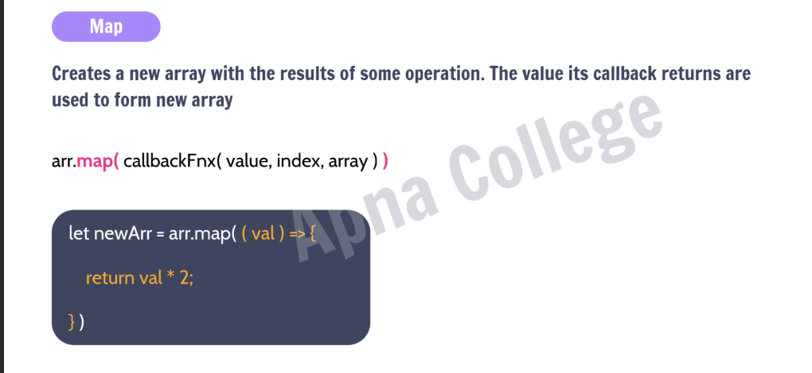
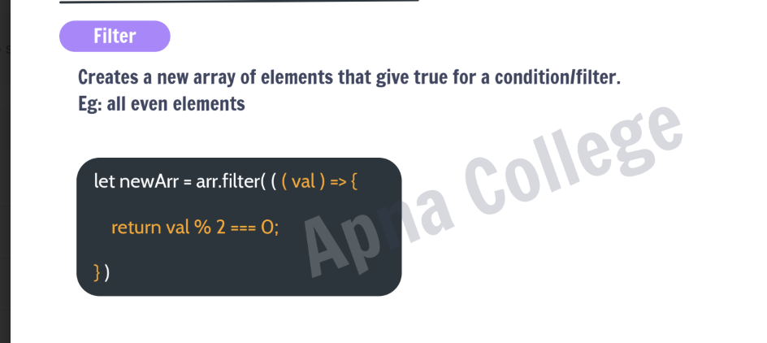
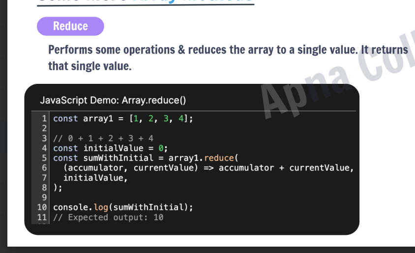
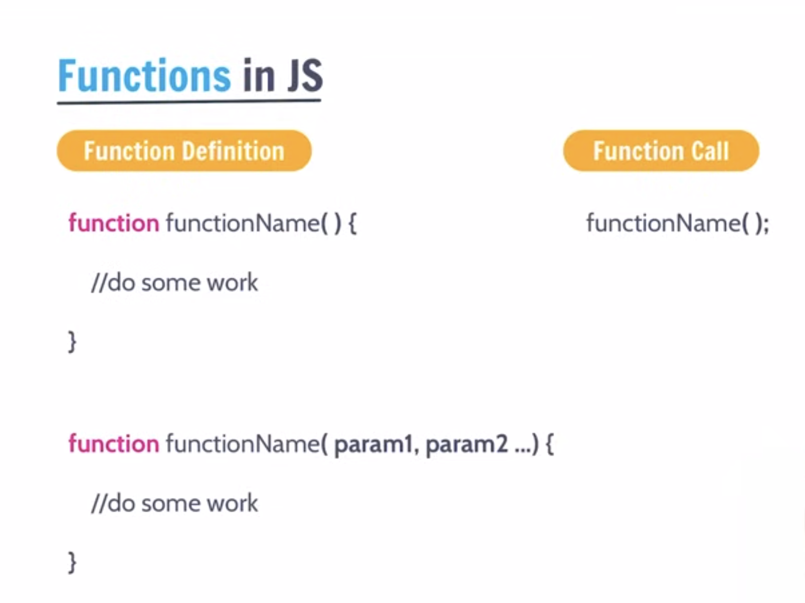
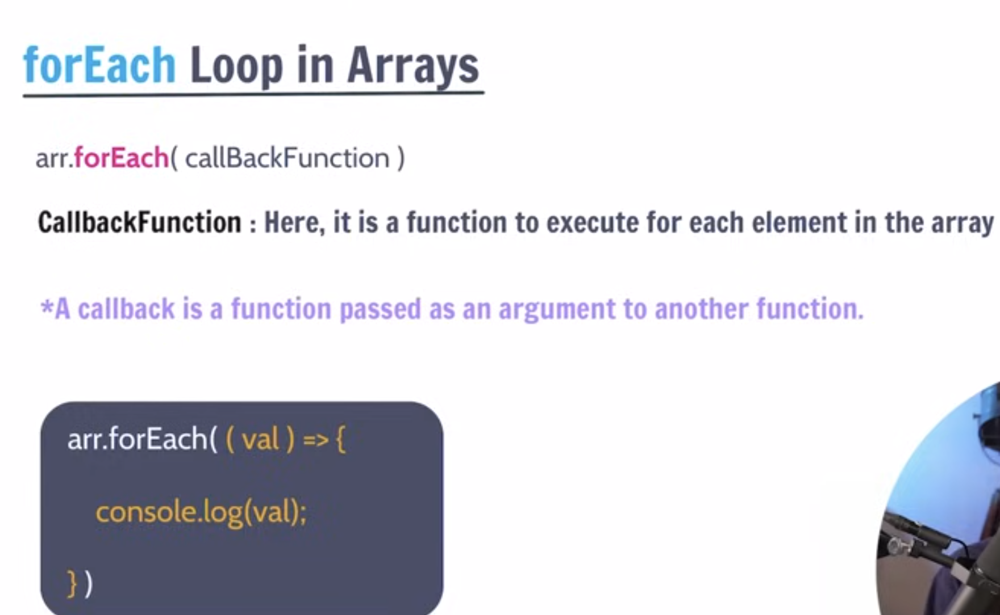
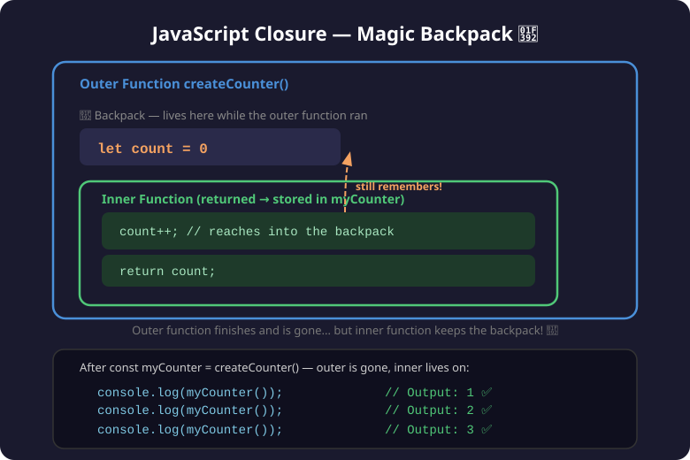
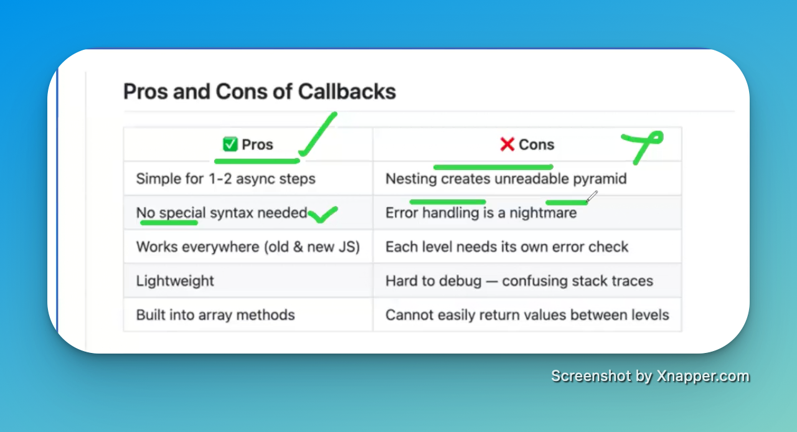
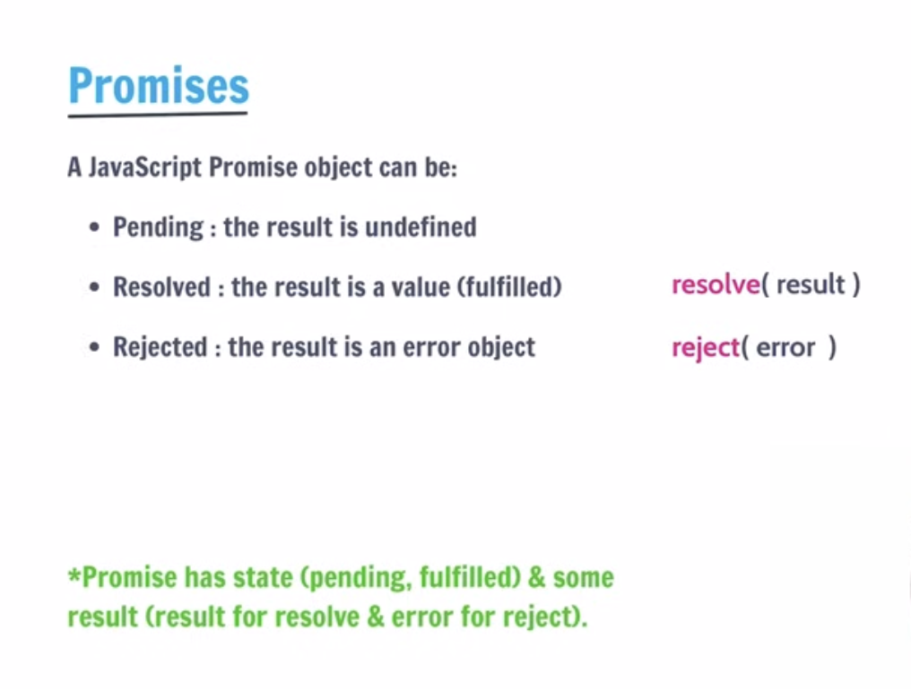

# JavaScript Learning Notes

## 📋 Table of Contents

1. [What is JavaScript?](#1-what-is-javascript)
   - [Client-Side vs Server-Side](#client-side-vs-server-side)
   - [What is Node.js?](#what-is-nodejs)
   - [The JavaScript Console](#the-javascript-console)
2. [Variables](#2-variables)
   - [2.1 Temporary Variable](#21-temporary-variable)
3. [Data Types](#3-data-types)
   - [Pass by Value vs Pass by Reference](#-pass-by-value-vs-pass-by-reference)
   - [Symbol](#-symbol)
   - [BigInt](#-bigint)
   - [Dynamic Typing vs Static Typing](#-dynamic-typing-vs-static-typing)
   - [Type Coercion](#-type-coercion)
     3.5 [Execution Context — Creation & Execution Phase](#35-execution-context)
4. [Operators](#4-operators)
   - [Nullish Coalescing (??) vs ||](#11-nullish-coalescing-operator-)
5. [Truthy and Falsy Values](#truthy-and-falsy-values)
6. [Conditional Statements](#5-conditional-statements)
7. [JavaScript Input/Output Methods](#6-javascript-inputoutput-methods)
8. [Loops](#7-loops)
   - [for Loop](#a-for-loop-the-classic)
   - [while Loop](#b-while-loop)
   - [do...while Loop](#c-dowhile-loop)
   - [for...in Loop](#d-forin-loop)
   - [for...of Loop](#e-forof-loop)
9. [Loop Control Statements](#8-loop-control-statements)
   - [break](#a-break-statement)
   - [continue](#b-continue-statement)
   - [Labels](#c-labels-with-break-and-continue)
10. [Loop Control Statements](#8-loop-control-statements)
    - [break](#a-break-statement)
    - [continue](#b-continue-statement)
    - [Labels](#c-labels-with-break-and-continue)
11. [Advanced Loop Concepts & Safety](#9-advanced-loop-concepts--safety)
12. [Nested Loops](#10-nested-loops-loop-inside-a-loop)
13. [Counting Down — Reverse Loops](#11-counting-down--reverse-loops-i--)
14. [for...of with Index — Array.entries()](#12-forof-with-index--arrayentries)
15. [forEach() — The Array Method Loop](#13-foreach--the-array-method-loop)
16. [Loop Variable Scope — let vs var](#14-loop-variable-scope--let-vs-var-gotcha)
    16.1 [Variable Shadowing](#variable-shadowing-in-javascript)
17. [for...of with Map and Set](#15-forof-with-map-and-set)
18. [Map and Set Commands (Cheat Sheet)](#17-map-and-set-commands-cheat-sheet-for-sdets)
19. [Escape Characters](#18-escape-characters-in-strings)
20. [String Methods](#19-string-methods-in-js)
21. [Arrays — Comprehensive Guide](#20-arrays--comprehensive-guide)
    - [Array Creation](#️-array-creation)
    - [Accessing & Modifying](#️-accessing--modifying)
    - [Adding & Removing](#️-adding--removing)
    - [Searching](#️-searching)
    - [Iterating Through Arrays](#️-iterating-through-arrays)
    - [Transforming Arrays](#️-transforming-arrays)
    - [Sorting](#️-sorting)
    - [Slicing & Combining](#️-slicing--combining)
    - [Checking & Validation](#️-checking--validation)
    - [Copying Arrays](#-copying-arrays)
    - [Array Destructuring](#️-array-destructuring)
    - [Pure vs Impure Methods](#️-pure-vs-impure-methods--quick-reference)
22. [Multi-Dimensional Arrays](#21-multi-dimensional-arrays)
    - [2D Arrays (Matrices)](#2d-arrays-matrices)
    - [Accessing & Modifying 2D](#accessing--modifying-2d-arrays)
    - [Iterating 2D Arrays](#iterating-through-2d-arrays)
    - [Common 2D Operations](#common-2d-operations)
    - [3D Arrays](#3d-arrays)
    - [Pattern Generation](#pattern-generation)
23. [Objects — Comprehensive Guide](#11-objects--comprehensive-guide)
    - [Creating Objects (Object Literals)](#111-creating-objects-object-literals)
    - [Accessing Object Properties](#112-accessing-object-properties)
    - [Modifying and Adding Properties](#113-modifying-and-adding-properties)
    - [Deleting Properties](#114-deleting-properties)
    - [Primitive vs Reference](#115-primitive-vs-reference--the-critical-difference)
    - [Object Methods](#116-object-methods-functions-inside-objects)
    - [Object Destructuring](#117-object-destructuring)
    - [Spread Operator with Objects](#118-spread-operator-with-objects)
    - [Getters and Setters](#119-getters-and-setters)
    - [Object Built-in Methods](#1110-object-built-in-methods)
    - [Real-World Objects](#1111-real-world-objects--configuration-and-test-data)
    - [let vs const with Objects](#1112-let-vs-const-with-objects)
    - [Objects Quick Reference](#1113-summary--objects-quick-reference)
24. [Classes — Object-Oriented JavaScript](#12-classes--object-oriented-javascript)
25. [JSON (JavaScript Object Notation)](#25-json-javascript-object-notation)
26. [Synchronous vs Asynchronous JS](#26-synchronous-vs-asynchronous-js)
27. [Callbacks in JavaScript](#27-callbacks-in-javascript)
    - [Basic Callback Concept](#271-basic-callback-concept)
    - [Three Ways to Define Callbacks](#272-three-ways-to-define-callbacks)
    - [Callbacks with Parameters](#273-callbacks-with-parameters)
    - [Synchronous Callbacks — forEach()](#274-synchronous-callbacks--foreach)
    - [Asynchronous Callbacks — setTimeout()](#275-asynchronous-callbacks--settimeout)
    - [Real QA Scenario — E2E Login Flow](#276-real-qa-scenario--e2e-login-flow-callback-hell-️)
    - [Key Takeaways](#277-key-takeaways)
- [Appendix](#appendix-comparison-recap--vs-)

---

# 1. What is JavaScript?

JavaScript is a programming language that is used to create dynamic and interactive web pages. It is a high-level, interpreted programming language that is used to add functionality to web pages. It is a client-side programming language that is used to create dynamic and interactive web pages.

- JavaScript is a high-level, interpreted programming language primarily used to make web pages interactive and dynamic. It was created by Brendan Eich in 1995 at Netscape.
- Where it runs: Originally designed to run in web browsers, JavaScript now also runs on servers (via Node.js), mobile apps, desktop applications, and even IoT devices.
- Core features: It supports object-oriented, functional, and event-driven programming styles. It's dynamically typed, meaning you don't need to declare variable types explicitly.
- ECMAScript — mention that JavaScript follows the ECMAScript standard (ES6/ES2015+)
- Role in web development: It's one of the three core technologies of the web alongside HTML (structure) and CSS (styling). JavaScript handles the behavior and logic layer.

### Client-Side vs Server-Side

To understand how JavaScript works, it's important to understand the two main environments where code runs in web development.


#### 🖥️ Client-Side (Front-end)

The **Client** refers to the user's device (laptop, phone) and the software they are using to view the web (like Chrome, Safari, Firefox).

- **What it does:** Displays the user interface, handles user interactions (clicks, scrolling), and makes the page look good.
- **Technologies used:** HTML (Structure), CSS (Styling), and Client-Side JavaScript (Behavior).
- **Example:** When you click a "Like" button and it turns blue immediately, that's client-side JavaScript reacting.

#### 🗄️ Server-Side (Back-end)

The **Server** is a powerful computer located somewhere else (in a data center) that listens for requests from clients, processes them, and sends data back.

- **What it does:** Stores data in databases, handles security, processes payments, and runs complex business logic.
- **Technologies used:** Node.js (Server-Side JavaScript), Python, Java, Databases (SQL, MongoDB), APIs.
- **Example:** When you click that same "Like" button, the client sends a message to the server saying "Update the database to add 1 like". The server saves this so everyone else can see it.

> **Why Node.js matters:** Historically, JavaScript _only_ ran in the browser (Client-Side). Node.js was created to allow developers to run JavaScript on the Server-Side too. Now you can build the entire application using just one language!

### What is Node.js?

Node.js is not a new language or a framework—it is a **runtime environment** that allows JavaScript to run _outside_ of a web browser. It takes the V8 JavaScript engine (the engine that powers Google Chrome) and runs it directly on your computer's operating system.

> 🧠 **What is a "Runtime"?**
> Think of a runtime like a **translator and a toolbox combined**. JavaScript is just text (code). A runtime is the software that actually reads that text, understands it, and executes it.
>
> - A **browser** provides a runtime that gives JavaScript tools to change HTML and CSS.
> - **Node.js** provides a runtime that gives JavaScript tools to access your computer's files, databases, and network.

#### ⚙️ Why is this important?

Before Node.js, JavaScript was trapped inside the browser. It could only change colors, show popups, and interact with the webpage.

With Node.js, JavaScript broke free. Now JavaScript can:

- **Write and read files** directly on your computer.
- **Connect directly to databases** (like SQL or MongoDB).
- **Run servers** that handle millions of HTTP requests (using tools like Express).
- **Run Automation Scripts** (like API tests, Selenium, Playwright, or Cypress scripts directly from your terminal).

#### 📦 NPM (Node Package Manager)

When you install Node.js, you also get **NPM**. NPM is essential for modern development:

- It's a massive online library containing over 1 million free code packages.
- If you need to make an API call, you don't write it from scratch—you download a package (like `axios`).
- If you need to write tests, you download a testing package (like `jest` or `playwright`).
- You manage these packages using a `package.json` file in your project.

> **SDET Takeaway:** In Test Automation, you almost never run your test scripts in a browser console. You define them in files and execute them through your terminal using Node.js (e.g., running `npx playwright test`).

---

## The JavaScript Console

When you're writing code, you need a way for your program to talk back to you—to show you the results of a calculation, tell you if something loaded correctly, or warn you if there's an error. That's exactly what the Console is for!

### 1. What is the Console?

The `console` is a built-in tool that lets developers print messages and inspect data behind the scenes. Your users won't see these messages; they are strictly for **you**, the developer.

You can find the console in two places:

1. **The Web Browser:** (Press `F12` or Right-Click → Inspect, then go to the "Console" tab).
2. **Node.js:** (When you run a JavaScript file in your terminal, the output appears right there).

---

### 2. `console.log()` – Your Best Friend

`console.log()` is the most common command you will use. It literally means "log (print) this information to the console."

**Basic Output:**

```javascript
console.log("Hello, world!");
```

_Output: Hello, world!_

**Printing Multiple Things Together:**
You can give `console.log()` several pieces of information separated by commas, and it will print them with spaces in between.

```javascript
console.log("My age is", 25, "and it is", true, "that I love coding.");
```

_Output: My age is 25 and it is true that I love coding._

**Checking Variables:**
This is how you investigate what value is currently stored inside a varying box (variable) in your code.

```javascript
let currentScore = 1500;
console.log("The current score is:", currentScore);
// Output: The current score is: 1500
```

#### 💡 String Substitution (The "printf" concept)

In older programming languages like C, developers used a tool called `printf` (print formatted) to insert variables into text cleanly using placeholders. JavaScript allows you to do the exact same thing using `%` symbols!

- `%s` is a placeholder for a **S**tring (text).
- `%d` or `%i` are placeholders for an Integer (whole number).
- `%f` is a placeholder for a Float (decimal number).
- `%o` is a placeholder for an Object.

```javascript
// This reads as: "Hello [text string placeholder], you have [number placeholder] new messages."
console.log("Hello %s, you have %d new messages.", "Shujauddin", 5);
```

_Output: Hello Shujauddin, you have 5 new messages._

---

### 3. Spotting Problems: `.error()` and `.warn()`

Sometimes `console.log()` isn't enough. When things break, you want the message to stand out.

**`console.error()`**
Prints your message in bright red (in browsers) to loudly tell you that a major failure occurred.

```javascript
console.error("Critical Failure: Could not connect to the database!");
```

**`console.warn()`**
Prints your message in yellow (in browsers). Use this when something isn't broken yet, but it might cause issues later (like using an outdated piece of code).

```javascript
console.warn("Watch out! This system is going offline in 5 minutes.");
```

---

### 4. `console.table()` – Beautiful Data Display

If you are looking at a large list of data (an Array) or a complex collection of information (an Object), `console.log()` can look messy. `console.table()` draws a clean, professional grid for you to read!

```javascript
// A list of users
const users = [
  { name: "Alice", age: 25, city: "New York" },
  { name: "Bob", age: 30, city: "London" },
];

console.table(users);
```

_Output (in the console):_

```text
┌─────────┬───────────┬─────┬──────────┐
│ (index) │   name    │ age │   city   │
├─────────┼───────────┼─────┼──────────┤
│    0    │  'Alice'  │ 25  │'New York'│
│    1    │   'Bob'   │ 30  │ 'London' │
└─────────┴───────────┴─────┴──────────┘
```

---

### 5. Other Handy Tools

As you get more advanced, you might need these specialized console tools:

**`console.time()` & `console.timeEnd()`**
Think of this as a stopwatch. It measures exactly how many milliseconds a piece of code takes to run. Great for testing performance!

```javascript
console.time("loopTimer");
for (let i = 0; i < 100000; i++) {
  // some heavy work
}
console.timeEnd("loopTimer"); // Output: loopTimer: 3.456ms
```

**`console.count()`**
Every time the code hits this line, it adds +1 to a counter and prints it. Useful to see exactly how many times a loop ran or a function was called.

```javascript
function loginUser() {
  console.count("Login Attempt");
}
loginUser(); // Output: Login Attempt: 1
loginUser(); // Output: Login Attempt: 2
```

**`console.group()` & `console.groupEnd()`**
Indents your console logs cleanly into a folder-like structure so it doesn't look like a giant wall of text.

```javascript
console.group("User Details");
console.log("Name: Alice");
console.log("Role: Admin");
console.groupEnd(); // Closes the folder so next logs are un-indented
```

**`console.info()` & `console.debug()`**
`info()` prints an informational message (sometimes blue in browsers). `debug()` prints debug-level messages (often hidden by default in browsers unless you enable debug output).

```javascript
console.info("System has finished booting.");
console.debug("Variable x is currently manually set to 5.");
```

**`console.trace()`**
Prints a stack trace to show you exactly which function called which function to get to this line. Essential for complex debugging!

```javascript
function stepOne() {
  stepTwo();
}
function stepTwo() {
  console.trace("Trace to stepTwo");
}

stepOne();
// Output will show that 'stepOne' called 'stepTwo'
```

### Summary Cheat Sheet

| Command     | What it does                         | When to use it                                |
| ----------- | ------------------------------------ | --------------------------------------------- |
| `log()`     | General output (black text)          | 90% of the time, general checking             |
| `error()`   | Error messages (red, includes stack) | When an operation completely fails            |
| `warn()`    | Warnings (yellow text)               | When something is risky but not broken        |
| `table()`   | Displays data in a neat grid         | When looking at Arrays or Objects             |
| `info()`    | Informational messages (blue)        | Distinct updates you want separated from logs |
| `debug()`   | Debug output (often hidden)          | Granular internal checks                      |
| `group()`   | Groups related logs together         | Organizing large amounts of log output        |
| `time()`    | Starts a stopwatch timer             | When checking how fast code runs              |
| `timeEnd()` | Ends the timer and prints duration   | Paired with `time()`                          |
| `count()`   | Counts occurrences                   | Finding out how many times a loop runs        |
| `trace()`   | Prints a stack trace                 | Finding the exact path code took to get here  |

> **🚀 SDET Tip:** These methods will be your daily companions. When you start automating browsers with Playwright, you constantly use `console.log()` to check if you successfully clicked a button, or `console.error()` to figure out why an element couldn't be found.

---

### 🔷 Code Lifecycle: Declaration, Compile Time, and Runtime

#### 1. Declaration

Declaration is simply the act of telling the computer that a variable, function, or class exists and giving it a name. It’s like registering a name for a new baby—you haven't told the baby what to do yet, you've just given them a name so you can refer to them later.

- **In JS:** You use keywords like `let`, `const`, `var`, `function`, or `class`.
- **Example:** `let myName;` (This is a declaration. You've introduced `myName` to the program).

#### 2. Compile Time

Compile Time is the "pre-check" phase. It is when the computer reads your code to translate it into a language it can understand (machine code) before actually doing any of the work.

- **What happens:** The computer checks for Syntax Errors (typos). If it finds a missing bracket `}` or a misspelled keyword like `functin`, it will stop everything and show an error before the code even starts.
- **Analogy:** This is like a chef reading a recipe. If the recipe says "add 2 cups of 🏁," the chef stops immediately because they don't know what "🏁" is. They haven't started cooking yet; they just found a mistake in the instructions.

#### 3. Runtime

Runtime is the "execution" phase. This is when the program is actually running and doing the tasks you wrote.

- **What happens:** This is where the computer performs math, talks to databases, or handles user clicks. Runtime Errors (like dividing by zero or trying to read a property of `null`) happen here because the instructions were grammatically correct, but the task became impossible while trying to do it.
- **Analogy:** This is the chef actually cooking. The recipe was readable (no compile errors), but while cooking, the chef realized they ran out of salt or the stove caught fire. The mistake was only discovered while "running" the recipe.

#### Summary Table

| Stage            | What it is                 | Key Event                                |
| ---------------- | -------------------------- | ---------------------------------------- |
| **Declaration**  | Introducing a name.        | `let x;`                                 |
| **Compile Time** | Translating/Checking code. | Catching a missing semicolon.            |
| **Runtime**      | Running the program.       | Processing data and handling user input. |

---

## 2. Variables

- What is a variable?
- A variable is a container for storing data.
- In JavaScript, variables are declared using the var, let, or const keywords.
- let is the preferred way to declare variables in modern JavaScript.
- const is used to declare variables that cannot be reassigned.
- var is the older way to declare variables and is not recommended for use in modern JavaScript.

- Syntax:
- let variableName = value;
- const variableName = value;
- var variableName = value;

- Example:

```javascript
let name = "John";
const age = 30;
var city = "New York";

console.log(name);
console.log(age);
console.log(city);
```

## Visual Guides


---

### Easy Explanation of `var`, `let`, and `const`

Here is a simple table showing the differences based on the image:

| Feature                    | `var`  | `let`  | `const` |
| -------------------------- | ------ | ------ | ------- |
| **Stored in Global Scope** | ✅ Yes | ❌ No  | ❌ No   |
| **Function Scope**         | ✅ Yes | ✅ Yes | ✅ Yes  |
| **Block Scope**            | ❌ No  | ✅ Yes | ✅ Yes  |
| **Can Be Reassigned?**     | ✅ Yes | ✅ Yes | ❌ No   |
| **Can Be Redeclared?**     | ✅ Yes | ❌ No  | ❌ No   |
| **Can Be Hoisted?**        | ✅ Yes | ❌ No  | ❌ No   |

**In simple words:**

- **`var`** is the old way. It's too loose and can cause unexpected bugs because it can be redeclared, hoisted, and it leaks out of block scopes (like `if` statements or loops). You should generally **avoid** using it.
- **`let`** is the modern way. Use this when you know the variable's value **will change** later (like a score or current age). It safely stays where you put it (Block Scope).
- **`const`** is for constant values that **will NEVER change** (like someone's date of birth or a fixed URL). Once you set it, you cannot update or redeclare it.

---


```javascript
var age = 1;
var age = 2;
var age = 3;
console.log(age);
```

The last value will be printed and it is wrong way to write code using var as we can redeclare the same variable many times.

```javascript
let age = 1;
age = 2;
console.log(age);
```

In `let` we can update the value of the variable but we cannot redeclare the same variable.

```javascript
const age = 1;
// age = 2; // This would cause an error
console.log(age);
```

In `const` we cannot update the value of the variable and we cannot redeclare the same variable.

---

### 📌 Variable Naming Rules

Not every name is a valid variable name in JavaScript. Here are the rules:

**✅ Valid names:**

- Can use letters, digits, `_`, and `$`
- Must **start with** a letter, `_`, or `$` — NOT a number
- Case-sensitive: `name` and `Name` are two different variables

**❌ Invalid names:**

```javascript
let 1name = "wrong";   // ❌ cannot start with a number
let my-name = "wrong"; // ❌ hyphens not allowed
let let = "wrong";     // ❌ 'let' is a reserved keyword
```

**✅ Valid names:**

```javascript
let name = "John"; // ✅
let _private = true; // ✅ underscore is ok
let $price = 99; // ✅ dollar sign is ok
let firstName = "Ali"; // ✅ camelCase — standard convention
let age2 = 25; // ✅ digit in middle/end is ok
```

**Naming convention in JavaScript:** Use **camelCase** — first word lowercase, each next word starts uppercase.

```javascript
// ✅ Good — camelCase
let userAge = 25;
let totalPrice = 100;
let isLoggedIn = true;

// ❌ Bad — not conventional
let user_age = 25; // snake_case (used in Python, not JS)
let UserAge = 25; // PascalCase (used for class names, not variables)
```

---

## 2.1 Temporary Variable

A temporary variable (often called temp) is a variable used to hold a value temporarily while you rearrange or swap other variables. It's like using an extra cup when you want to swap the contents of two cups – you pour one into the extra cup, then the other into the first, then the extra into the second.

📝 Why Do You Need It for Swapping?
Imagine you have two variables:

javascript
let a = 3;
let b = 7;
If you simply do a = b;, you lose the original value of a (3) forever. Then you can't put it into b. The temporary variable saves that original value so you can complete the swap.

✅ Correct Swap Using a Temporary Variable
javascript
let a = 3;
let b = 7;

let temp = a; // temp now holds 3 (original a)
a = b; // a becomes 7 (value of b)
b = temp; // b becomes 3 (value saved in temp)

console.log(a); // 7
console.log(b); // 3
Now the values are swapped! This works no matter what the original values are.

🧠 Key Takeaway
The temporary variable is just a storage box – it lets you keep a value safe while you move other values around. You'll see this pattern often in programming, not just for swapping but also for rotating values, reversing arrays, etc.

📝 Your Notes
Write down:

Temporary variable: A variable used to hold a value temporarily during operations like swapping.

Swap algorithm:

temp = a
a = b
b = temp

---

## 3. Data Types

- What is a data type?
- A data type is a type of data that can be stored in a variable.
- In JavaScript, there are two types of data types:
- Primitive data types
- Non-primitive data types

### 1. Primitive Data Types

(Numbers, Strings, Booleans, Null, Undefined, Symbols)

**The Meaning:** A primitive is a single, simple value that is "immutable" (it cannot be changed). When you assign a primitive to a variable, the variable holds the actual value.

**Fixed Size:** They take up a tiny, set amount of memory.

**Passed by Value:** If you copy a primitive, you create a brand-new, separate copy. Changing one doesn't hurt the other.

**Analogy:** A primitive is like a photograph. If I give you a copy of my photo and you draw a mustache on it, my original photo stays the same.

```javascript
let x = 10;
let y = x; // y gets a copy of the value 10
y = 20; // x is still 10
```

### 2. Non-Primitive Data Types

(Objects, Arrays, Functions)

**The Meaning:** These are collections of values. A non-primitive variable doesn't actually hold the data itself; it holds a Reference (an address) to where the data is stored in memory.

**Flexible Size:** They can grow or shrink (like adding items to an array).

**Passed by Reference:** If you copy a non-primitive, you aren't copying the data—you're copying the map to that data. Both variables now point to the same "box" in memory.

**Analogy:** A non-primitive is like a Google Doc. If I share the link (the reference) with you and you delete a paragraph, it’s deleted for me too, because we are both looking at the same document.

```javascript
let car1 = { color: "red" };
let car2 = car1; // car2 now points to the SAME object as car1

car2.color = "blue";
console.log(car1.color); // "blue" (It changed for both!)
```

### Summary Comparison

| Feature    | Primitive                      | Non-Primitive                |
| ---------- | ------------------------------ | ---------------------------- |
| Storage    | Holds the Value directly.      | Holds a Reference (Address). |
| Mutability | Immutable (Cannot be changed). | Mutable (Can be changed).    |
| Structure  | Single, simple piece of data.  | Complex collection of data.  |


---

### 🔷 null vs undefined

Both mean "no value" — but they mean it in **different ways**:

|                  | `undefined`                               | `null`                                      |
| ---------------- | ----------------------------------------- | ------------------------------------------- |
| **Meaning**      | Variable declared but never given a value | Intentionally set to empty by the developer |
| **Who sets it?** | JavaScript sets it automatically          | You set it yourself                         |
| **typeof**       | `"undefined"`                             | `"object"` ← (famous JS bug!)               |

> **Why is this a bug?** When JS was built in 1995, it checked the first few bits of a value (called a "type tag") to figure out its data type. The tag for an object was `000`. At that time, `null` was represented as a NULL pointer, which is basically just a bunch of zeros. Because `null` literally started with `000`, the system got tricked into thinking it was an object! They noticed the mistake later, but fixing it would have broken millions of websites that already relied on it, so they just had to leave it.

```javascript
// undefined — JS sets this automatically
let username;
console.log(username); // undefined — you declared it but never assigned

// null — YOU set this intentionally
let loggedInUser = null; // no one is logged in yet
console.log(loggedInUser); // null

// checking the difference
console.log(undefined == null); // true  ← loose equality treats them the same
console.log(undefined === null); // false ← strict equality — different types!
```

> 💡 Think of it this way: `undefined` = JS doesn't know. `null` = YOU said "nothing here".

---

### 🔷 NaN — Not a Number

`NaN` stands for **Not a Number**. It appears when you try to do a math operation on something that isn't a number.

```javascript
console.log("hello" - 5); // NaN  ← can't subtract from text
console.log(Number("abc")); // NaN  ← can't convert "abc" to a number
console.log(0 / 0); // NaN  ← undefined math

// NaN is weird — it never equals itself!
console.log(NaN === NaN); // false  ← only value in JS not equal to itself!

// Correct way to check for NaN
console.log(isNaN("hello")); // true  ← is it NaN?
console.log(Number.isNaN(NaN)); // true  ← more reliable, only true for actual NaN
console.log(Number.isNaN("hello")); // false ← "hello" is not NaN, just non-numeric
```

> ⚠️ Always use `Number.isNaN()` rather than `isNaN()` — `isNaN()` converts the value first which can give unexpected results.

---

### 🔷 typeof Quick Reference

`typeof` tells you the data type of any value. Every beginner should know this table:

```javascript
console.log(typeof "hello"); // "string"
console.log(typeof 42); // "number"
console.log(typeof 3.14); // "number"  ← floats are also "number"
console.log(typeof true); // "boolean"
console.log(typeof undefined); // "undefined"
console.log(typeof null); // "object"  ← 🐛 famous JS bug! null is NOT an object
console.log(typeof Symbol()); // "symbol"
console.log(typeof 42n); // "bigint"
console.log(typeof {}); // "object"
console.log(typeof []); // "object"  ← arrays are also objects!
console.log(typeof function () {}); // "function"
```

> ⚠️ `typeof null === "object"` is a **historical bug** in JavaScript from 1995. It was never fixed to avoid breaking old code. To properly check for null use: `value === null`

---

### 🔷 Pass by Value vs Pass by Reference

This explains how data is copied and shared in JavaScript — and it's directly tied to whether the type is **primitive** or **non-primitive (object)**.


---

#### ✅ Pass by Value — Primitives (number, string, boolean, null, undefined)

When you assign a primitive to another variable, JavaScript makes a **full copy**. Each variable has its own independent value. Changing one does **NOT** affect the other.

```javascript
let a = 10;
let b = a; // b gets a COPY of a's value

b = 20; // change b

console.log(a); // 10  ← a is NOT affected, it has its own copy
console.log(b); // 20
```

```javascript
let name1 = "Alice";
let name2 = name1; // copy of "Alice"

name2 = "Bob";

console.log(name1); // "Alice" ← unchanged
console.log(name2); // "Bob"
```

---

#### ⚠️ Pass by Reference — Non-Primitives (Objects, Arrays)

When you assign an object or array to another variable, JavaScript does **NOT** copy it. Both variables point to the **same object in memory**. Changing one changes both!

```javascript
let obj1 = { name: "John", age: 25 };
let obj2 = obj1; // NOT a copy — both point to the same object!

obj2.name = "Pete"; // change via obj2

console.log(obj1.name); // "Pete" ← obj1 is also changed! 😱
console.log(obj2.name); // "Pete"
```

```javascript
// Same with arrays
let arr1 = [1, 2, 3];
let arr2 = arr1; // both point to the same array

arr2.push(4);

console.log(arr1); // [1, 2, 3, 4] ← arr1 also changed!
console.log(arr2); // [1, 2, 3, 4]
```

---

#### 🔐 How to copy an object WITHOUT sharing it

If you want a real independent copy of an object:

```javascript
let original = { name: "John", age: 25 };

// Spread operator creates a SHALLOW copy
let copy = { ...original };

copy.name = "Pete";

console.log(original.name); // "John" ← safe, untouched ✅
console.log(copy.name); // "Pete"
```

#### 1. The Analogy (Understanding the Concept)

Imagine you have a **Blue Toy Box** (`original`) with a "John" action figure inside.

When you write `let copy = { ...original };`, you are actually doing two things at once:

- **The `{ }` (The New Box):** The moment you type those curly braces, you are telling the computer: "Go to the store and buy me a **BRAND NEW** empty Red Toy Box."
- **The `...` (The Photocopier):** The spread operator is like a magic wand. It looks inside the Blue Box, sees the "John" figure, makes an exact replica of it, and drops that replica into the New Red Box.
- **The Assignment (`let copy =`):** You then put a label on that new Red Box called `copy`.

So, why "Object B"? In my previous explanation, "Object B" was just a name I gave to that "New Red Box" to show it’s different from the Blue one. You didn't have to assign "B"; the curly braces `{ }` automatically created it in the computer's memory.

#### Key Terms to Remember for Interviews:

- **Object Literal Creation:** Using `{}` tells JavaScript to create a new object.
- **Memory Allocation:** The computer sets aside a new "shelf" for the new object.
- **Pass-by-Reference:** Objects aren't stored "in" the variable; the variable just holds the "address" to the shelf.
- **Shallow Copy:** The spread operator only copies values. If a value is a string ("John"), it's copied perfectly. If a value is another object, it only copies the "address" of that inner object.

**In short:** The `{ }` is the "Birth" of the new object. The `copy` variable is just the "Name" we give it.

#### Quick Summary

|                          | Primitives (Pass by Value)                               | Objects/Arrays (Pass by Reference)      |
| ------------------------ | -------------------------------------------------------- | --------------------------------------- |
| What is copied?          | The actual value                                         | The memory address (pointer)            |
| Change affects original? | ❌ No                                                    | ✅ Yes                                  |
| Types                    | number, string, boolean, null, undefined, symbol, bigint | object, array, function                 |
| Independent copy?        | ✅ Always                                                | ❌ Need spread `{...obj}` or `[...arr]` |

> 💡 **Key Rule:** If it's a primitive → you get a copy. If it's an object/array → you get a reference to the same thing in memory.

---

### 🔷 Symbol

A **Symbol** is a primitive data type introduced in ES6. Every Symbol created is **guaranteed to be unique** — even if two symbols have the exact same description, they are never equal to each other.


**Think of it like this:** Two keys that look exactly the same but open completely different locks — that's what Symbol does.

**When to use Symbol:**

- When you need a property key that will never clash with another key
- For hidden/private-like properties in objects (symbols are skipped in `for...in` loops)
- Used internally by JavaScript itself (e.g., `Symbol.iterator`)

```javascript
const id1 = Symbol("id");
const id2 = Symbol("id");

console.log(id1 === id2); // false — same description, but NOT the same!
console.log(typeof id1); // "symbol"
console.log(id1.description); // "id"

// Symbol as a unique object key
const SECRET = Symbol("secret");
const user = {
  name: "Shujauddin",
  [SECRET]: "internal-token-xyz",
};

console.log(user.name); // Shujauddin
console.log(user[SECRET]); // internal-token-xyz
// Symbol key is hidden from for...in loops — acts like a private property
```

---

### 🔷 BigInt

**BigInt** is a primitive data type (ES2020+) used to work with **very large integers** that go beyond JavaScript's safe number limit.

**The Problem with regular numbers:**
JavaScript's `Number` type can only safely represent integers up to `9007199254740991`. Beyond that, it loses precision and gives wrong answers.

```javascript
console.log(Number.MAX_SAFE_INTEGER); // 9007199254740991
console.log(9007199254740991 + 2); // 9007199254740992 — WRONG answer!
```

**BigInt fixes this** — just add `n` at the end of the number:

```javascript
const big = 9007199254740991n;
console.log(big + 2n); // 9007199254740993n — correct!
console.log(typeof big); // "bigint"

// ⚠️ You cannot mix BigInt with regular numbers
// console.log(big + 5);         // ❌ TypeError!
console.log(big + BigInt(5)); // ✅ Must convert first
```

**When to use BigInt:**

- Financial calculations with very large amounts
- Cryptography (huge numbers)
- Any calculation where accuracy beyond 9 quadrillion matters

---

### 🔷 Dynamic Typing vs Static Typing


**JavaScript is dynamically typed** — the variable type is decided by the value you put in, not by you. You can even change the type later.

```javascript
// JavaScript - dynamic typing
let data = "Hello"; // type is string
data = 42; // now it's a number — no error!
data = true; // now it's a boolean — still fine!

console.log(typeof data); // "boolean"
```

**Statically typed languages** (like Java, TypeScript) lock the type at declaration. You can't change it.

```java
// Java - static typing
int data = 42;        // must be a number always
data = "Hello";       // ❌ ERROR — type mismatch!
```

|                | JavaScript (Dynamic) | Java/TypeScript (Static) |
| -------------- | -------------------- | ------------------------ |
| Type set by    | Value at runtime     | You at declaration       |
| Change type?   | ✅ Yes               | ❌ No                    |
| Catches errors | At runtime           | At compile time          |
| Flexibility    | High                 | Low                      |

---

### 🔷 Type Conversion (Implicit vs Explicit)

**Type Conversion** is the process of changing a value from one data type to another (for example, turning the String `"5"` into the Number `5`).

In JavaScript, there are two ways this happens: **Implicitly** (automatically) and **Explicitly** (manually).


#### 1. Implicit Conversion (Also known as Type Coercion)

**The Meaning:** JavaScript attempts to be "helpful" by automatically converting types behind the scenes so the code doesn't crash.

**Analogy:** It's like an **Automatic Transmission Car**. The car senses the speed and shifts gears automatically for you. You didn't tell it to shift, but it guessed what you needed.

This can often lead to **surprising and confusing results**, which is why many developers dislike it!

```javascript
// + operator with a string → JS converts number to string (concatenation)
console.log("5" + 1); // "51"  ← NOT 6! JS says: "Oh, you have text, I'll just combine them."

// - operator always does math → JS converts string to number
console.log("5" - 1); // 4    ← JS says: "You can't subtract text, I'll turn '5' into a number."

// boolean converts to number
console.log(true + 1); // 2    ← true becomes 1
console.log(false + 1); // 1    ← false becomes 0

// == triggers implicit conversion (this is why === is preferred)
console.log(5 == "5"); // true  ← number and string treated as equal!
console.log(5 === "5"); // false ← strict, NO automatic conversion allowed
```

#### 2. Explicit Conversion (Also known as Type Casting)

**The Meaning:** You manually tell JavaScript exactly what type you want using built-in functions.

**Analogy:** It's like a **Manual Transmission Car**. _You_ are in full control and intentionally shift the gears. The car only does what you explicitly instruct it to do.

This is much safer and clearer because the intent is obvious.

```javascript
// Manually convert to Number
console.log(Number("42")); // 42
console.log(Number("hello")); // NaN (can't convert random text to a number)
console.log(Number(true)); // 1

// Manually convert to String
console.log(String(42)); // "42"
console.log(String(true)); // "true"

// Manually convert to Boolean
console.log(Boolean(0)); // false
console.log(Boolean("")); // false
console.log(Boolean("hello")); // true
```

#### 🏢 Real-World Use Cases (SDET / Automation)

**Handling User Inputs:**
When you get input from a dialog box or form, it always comes back as a text string.

```javascript
let age = prompt("Enter your age:"); // user types 25, but JS receives "25"
console.log(age + 1); // "251" ← WRONG! string + number

// The Fix! Use Explicit Conversion:
console.log(Number(age) + 1); // 26   ← CORRECT!
```

**In Test Automation (Scraping Data):**
If you automate a browser to read a price from Amazon, it comes as text. You must explicitly convert it before comparing.

```javascript
let priceText = "499"; // Text scraped directly from the web page
let price = Number(priceText); // Explicit conversion

if (price > 100) {
  console.log("Expensive item detected!"); // Works perfectly
}
```

#### Summary Table

| Stage                   | What it is                         | Example               | Analogy                        |
| ----------------------- | ---------------------------------- | --------------------- | ------------------------------ |
| **Implicit Conversion** | JS automatically changes the type. | `"5" - 1` becomes `4` | Automatic Car (Shifts for you) |
| **Explicit Conversion** | You manually change the type.      | `Number("5")`         | Manual Car (You shift)         |

> ⚠️ **Rule of thumb:** Always use `===` to stop JavaScript from converting types unexpectedly (Implicit). Whenever you need to change data types, always do it yourself (Explicit) using `Number()`, `String()`, or `Boolean()`.

---

### 🔷 Edge Cases in JavaScript (The Weird Parts)

JavaScript has some infamous "edge cases" where the language behaves in very unexpected ways, largely due to **Implicit Type Coercion**. Knowing these will save you hours of debugging!

**1. The `+` operator favors Strings, but `-` favors Numbers**

```javascript
console.log("5" + 3); // "53" (Converts 3 to a string and concatenates)
console.log("5" - 3); // 2    (Converts "5" to a number and subtracts)
console.log("5" * "3"); // 15  (Converts both to numbers)
```

**2. Arrays and Math**

```javascript
console.log([] + []); // "" (Empty string! Arrays convert to "" before addition)
console.log([] + {}); // "[object Object]"
console.log({} + []); // 0 (Depending on the engine, {} is sometimes read as an empty code block)
```

**3. `null` vs `0` in Comparisons**
`null` acts like `0` in math, but in comparisons, it behaves weirdly:

```javascript
console.log(null > 0); // false
console.log(null == 0); // false (null is only loosely equal to undefined)
console.log(null >= 0); // true  🤯 (Wat?! Math comparison forces it to 0, so 0 >= 0 is true)
```

**4. The unexpected `typeof NaN`**
As mentioned in previous sections, `NaN` stands for "Not a Number", but...

```javascript
console.log(typeof NaN); // "number" 🤯 (It technically means an "Invalid Number" data type)
```

> 🛡️ **How to securely avoid these edge cases?**
> Edge cases almost exclusively trigger when you mix different data types without manually converting them first. By sticking to **Strict Equality (`===`)** and always explicitly converting your variables (e.g. `Number(age)`), you will bypass 99% of these weird JavaScript traps!

---

## 3.5 Execution Context

Every time JavaScript runs your code, it doesn't just "start reading" randomly. It goes through a very specific two-step process inside something called an **Execution Context**.

Think of an Execution Context as a **room where your code lives and runs**. Before any of your code does anything, JavaScript prepares that room.

---

### What is an Execution Context?

An Execution Context is the environment in which JavaScript code is **evaluated and executed**. There are two types:

| Type                           | When it's created                           |
| ------------------------------ | ------------------------------------------- |
| **Global Execution Context**   | Created once when your script first loads   |
| **Function Execution Context** | Created every time a function is **called** |

Both types go through the **same two phases**:

---

### Phase 1: The Creation Phase 🧠

Before a single line of your code runs, JavaScript scans through it and **sets up memory**:

- **Variables** declared with `var` are stored in memory and given the initial value of `undefined`
- **Function declarations** (`function greet() {}`) are stored in memory **in full** — the complete function body
- `let` and `const` are noted but kept in a "Temporal Dead Zone" (TDZ) — they exist but cannot be accessed yet

This is exactly what causes **Hoisting** — the reason you can call a `function` before it's written, but can't use a `var` variable before its line (it'll be `undefined`).

```javascript
console.log(name); // undefined  ← var was hoisted, set to undefined
console.log(greet); // [Function: greet] ← full function was hoisted

var name = "Shuja";
function greet() {
  return "Hello!";
}
```

---

### Phase 2: The Execution Phase ▶️

Only after the Creation Phase completes does JavaScript actually **run your code** — line by line, top to bottom:

- Variables get assigned their **real values**
- Functions get **called** where you invoke them
- Logic runs, conditions are checked, loops execute

```javascript
var name = "Shuja"; // Now 'name' gets the actual value
var age = 25; // Now 'age'  gets the actual value

function greet() {
  return "Hello " + name;
}

console.log(greet()); // "Hello Shuja" — executed here
```

---

### Visual Overview


---

### The Call Stack

Every time a function is called, JavaScript creates a **new Execution Context** for it and pushes it onto the **Call Stack**. When the function finishes, that context is removed (popped off).

```javascript
function outer() {
  function inner() {
    console.log("I'm inner!"); // inner's Execution Context runs here
  }
  inner(); // Creates a new Execution Context for inner()
}
outer(); // Creates a new Execution Context for outer()
```

Call Stack at the moment `inner()` runs:

```
[ inner() Execution Context ]  ← currently running
[ outer() Execution Context ]
[ Global Execution Context   ]
```

---

> 🧪 **SDET Takeaway:** Understanding the Creation Phase explains **why hoisting causes flaky bugs**. If you use a `var` before its assignment line — expecting a value but getting `undefined` — that's the Creation Phase giving you the "not yet assigned" default. Always use `const` and `let` to avoid this trap, and remember that test setup functions run in their own Execution Context.

---

## 4. Operators

- What is an operator?

- An operator is a symbol that performs an operation on one or more operands.

- It is used to perform some operation on data.


- In JavaScript, there are different types of operators:

### 1. Arithmetic Operators (+, -, \*, /, %, \*\*)

**Meaning:** Used to perform mathematical calculations on numbers.

- `+` Addition - adds two numbers
- `-` Subtraction - subtracts one number from another
- `*` Multiplication - multiplies two numbers
- `/` Division - divides one number by another
- `%` Modulus - returns the remainder after division
- `**` Exponentiation - raises the first operand to the power of the second operand
- `++` Increment - increases the value of a variable by 1
- `--` Decrement - decreases the value of a variable by 1

**Example:**

```javascript
let a = 10;
let b = 3;

console.log(a + b); // Output: 13 (adds 10 and 3)
console.log(a - b); // Output: 7 (subtracts 3 from 10)
console.log(a * b); // Output: 30 (multiplies 10 by 3)
console.log(a / b); // Output: 3.333... (divides 10 by 3)
console.log(a % b); // Output: 1 (remainder when 10 is divided by 3)
console.log(a ** b); // Output: 1000 (10 to the power of 3)
```


### 2. Comparison Operators (==, ===, !=, !==, >, <, >=, <=)

**Meaning:** Used to compare two values and return a boolean (true or false).

- `==` Equal to - checks if values are equal (with type conversion)
- `===` Strict equal to - checks if values AND types are equal
- `!=` Not equal to - checks if values are not equal
- `!==` Strict not equal to - checks if values OR types are not equal
- `>` Greater than
- `<` Less than
- `>=` Greater than or equal to
- `<=` Less than or equal to

**Example:**

```javascript
let x = 10;
let y = "10";
let z = 5;

console.log(x == y); // Output: true (10 equals "10" after type conversion)
console.log(x === y); // Output: false (number 10 is NOT strictly equal to string "10")
console.log(x != z); // Output: true (10 is not equal to 5)
console.log(x !== y); // Output: true (different types: number vs string)
console.log(x > z); // Output: true (10 is greater than 5)
console.log(x < z); // Output: false (10 is not less than 5)
console.log(x >= 10); // Output: true (10 is greater than or equal to 10)
console.log(z <= 5); // Output: true (5 is less than or equal to 5)
```

- Comparison Operators (The Equality Trap)
  In SDET work, checking values correctly is the difference between a "Pass" and a "Fail" in your tests.

A. Loose Equality (==)
Rule: Checks only the Value.

Coercion: It converts data types automatically (e.g., changes a string to a number) to try and make them match.

Example: 5 == "5" is true.

B. Strict Equality (===)
Rule: Checks both Value AND Data Type.

SDET Best Practice: Always use === to prevent "invisible" bugs in your automation scripts.

Example: 5 === "5" is false.


### 3. Logical Operators (&&, ||, !)

**Meaning:** Used to combine or invert boolean values.

- `&&` AND - returns true if BOTH conditions are true
- `||` OR - returns true if AT LEAST ONE condition is true
- `!` NOT - inverts the boolean value (true becomes false, false becomes true)

**Example:**

```javascript
let age = 25;
let hasLicense = true;

console.log(age >= 18 && hasLicense); // Output: true (age is 18+ AND has license)
console.log(age >= 18 || hasLicense); // Output: true (at least one is true)
console.log(!hasLicense); // Output: false (inverts true to false)

let isSunny = false;
let isWarm = true;
console.log(isSunny && isWarm); // Output: false (NOT both are true)
console.log(isSunny || isWarm); // Output: true (at least one is true)
console.log(!isSunny); // Output: true (inverts false to true)
```


---

### 🛑 The 6 "Falsy" Values in JavaScript

Before understanding how logical operators work at an advanced level, you must know that JavaScript always considers exactly **6 values to be "Falsy"**. Everything else in JavaScript is "Truthy".

The 6 Falsy values are:

1. `false` (The boolean itself)
2. `0` (The number zero)
3. `""` (An empty string)
4. `null` (The intentional absence of a value)
5. `undefined` (A declared variable with no set value)
6. `NaN` (Not a Number)

_If an expression evaluates to any of these 6 values, JavaScript treats it essentially as `false`._

---

### ⚡ Short-circuit Evaluation

Short-circuit Evaluation is a fancy name for a simple shortcut JavaScript takes when checking conditions. It means **JavaScript stops looking at an expression as soon as it knows the final answer.** Think of it like a "Lazy Judge."

#### 1. The AND (`&&`) Short-circuit

For an `&&` to be true, BOTH sides must be true. If the first part is `false` (or Falsy), JavaScript doesn't even bother looking at the second part because the whole statement is already "ruined."

**Rule:** If the first value is falsy, it returns that value and stops.

**Real World Use:** "Only show the user's name IF they are logged in."

```javascript
let isLoggedIn = false;

// If isLoggedIn is false, JS stops and doesn't run the console.log
isLoggedIn && console.log("Welcome User!");
```

#### 2. The OR (`||`) Short-circuit

For an `||` to be true, only ONE side needs to be true. If the first part is `true` (or Truthy), JavaScript stops immediately because it already has what it needs.

**Rule:** If the first value is truthy, it returns that value and stops.

**Real World Use:** "Set a default value if the first one is missing."

```javascript
let userName = ""; // empty string is "falsy"
let displayName = userName || "Guest";

console.log(displayName); // "Guest"
```

#### 3. Summary Table

| Operator    | How it Short-circuits    | "Lazy" Behavior                 |
| ----------- | ------------------------ | ------------------------------- |
| `&&` (AND)  | Stops at the first False | "I found a false, so I'm done!" |
| `\|\|` (OR) | Stops at the first True  | "I found a true, so I'm done!"  |

**Why is this useful for an SDET?**
You’ll see this a lot in automation frameworks to handle settings. For example:

```javascript
let timeout = config.timeout || 5000;
```

_(This means: Use the timeout from the config file, but if it's missing or undefined, just use 5000ms as a fallback default.)_

---

### 4. Assignment Operators (=, +=, -=, \*=, /=, %=)

**Meaning:** Used to assign or update values to variables.

- `=` Assigns a value
- `+=` Adds and assigns (a += 5 is same as a = a + 5)
- `-=` Subtracts and assigns
- `*=` Multiplies and assigns
- `/=` Divides and assigns
- `%=` Modulus and assigns

**Example:**

```javascript
let score = 10;

score = 20; // Assigns 20 to score
console.log(score); // Output: 20

score += 5; // Same as: score = score + 5 (20 + 5)
console.log(score); // Output: 25

score -= 3; // Same as: score = score - 3 (25 - 3)
console.log(score); // Output: 22

score *= 2; // Same as: score = score * 2 (22 * 2)
console.log(score); // Output: 44

score /= 4; // Same as: score = score / 4 (44 / 4)
console.log(score); // Output: 11

score %= 5; // Same as: score = score % 5 (remainder of 11/5)
console.log(score); // Output: 1
```


### 5. Increment/Decrement Operators (++, --)

**Meaning:** Used to increase or decrease a variable's value by 1.

- `++` Increment - increases value by 1
- `--` Decrement - decreases value by 1
- Can be used as prefix (++a) or postfix (a++)

**Example:**

```javascript
let count = 5;

count++; // Increases count by 1 (postfix)
console.log(count); // Output: 6

++count; // Increases count by 1 (prefix)
console.log(count); // Output: 7

count--; // Decreases count by 1 (postfix)
console.log(count); // Output: 6

--count; // Decreases count by 1 (prefix)
console.log(count); // Output: 5

// Difference between prefix and postfix:
let a = 10;
console.log(a++); // Output: 10 (uses current value first, THEN increments)
console.log(a); // Output: 11 (now incremented)

let b = 10;
console.log(++b); // Output: 11 (increments FIRST, then uses new value)
console.log(b); // Output: 11
```


### 6. Ternary Operator (? :)

**Meaning:** A shorthand for if-else statements. Returns one value if condition is true, another if false.

- Syntax: `condition ? valueIfTrue : valueIfFalse`
- if condition is true then valueIfTrue will be executed else valueIfFalse will be executed

**Example:**

```javascript
let age = 20;
let canVote = age >= 18 ? "Yes" : "No"; // If age >= 18, return "Yes", else "No"
console.log(canVote); // Output: "Yes"

let marks = 45;
let result = marks >= 50 ? "Pass" : "Fail"; // Check if marks are 50 or more
console.log(result); // Output: "Fail"

// Can also use directly in console.log:
let temp = 35;
console.log(temp > 30 ? "Hot" : "Cold"); // Output: "Hot"
```


### 7. typeof Operator

**Meaning:** Returns the data type of a value as a string.

**Example:**

```javascript
let name = "John";
let age = 30;
let isStudent = true;
let salary = null;
let address;

console.log(typeof name); // Output: "string" (text)
console.log(typeof age); // Output: "number" (numeric value)
console.log(typeof isStudent); // Output: "boolean" (true/false)
console.log(typeof salary); // Output: "object" (null is considered object - historical bug)
console.log(typeof address); // Output: "undefined" (value not assigned)
console.log(typeof [1, 2, 3]); // Output: "object" (arrays are objects)
```


### 8. in Operator

**Meaning:** Checks if a property/key exists in an object. Returns true if found, false if not.

**Example:**

```javascript
let person = {
  name: "John",
  age: 30,
  city: "New York",
};

console.log("name" in person); // Output: true (property "name" exists)
console.log("age" in person); // Output: true (property "age" exists)
console.log("country" in person); // Output: false (property "country" doesn't exist)

let car = { brand: "Toyota", model: "Camry" };
console.log("brand" in car); // Output: true
console.log("year" in car); // Output: false
```


### 9. instanceof Operator

**Meaning:** Checks if an object is an instance of a specific class or constructor. Returns true or false.

**Example:**

```javascript
let numbers = [1, 2, 3, 4];
let today = new Date();
let message = "Hello";

console.log(numbers instanceof Array); // Output: true (numbers is an array)
console.log(today instanceof Date); // Output: true (today is a Date object)
console.log(message instanceof String); // Output: false (primitive string, not String object)

let obj = { name: "Test" };
console.log(obj instanceof Object); // Output: true (obj is an object)
console.log(obj instanceof Array); // Output: false (obj is not an array)

function Person(name) {
  this.name = name;
}
let john = new Person("John");
console.log(john instanceof Person); // Output: true (john is instance of Person)
```

> **💡 Why is `message instanceof String` false?**
> In JavaScript, `instanceof` only works on Objects. When you do `let message = "Hello"`, it creates a _primitive_ string. It's just raw data, not an actual string object created with the `new` keyword (like `new String("Hello")`). Since it is not an object wrapper, `instanceof` returns false.
>
> To check if a primitive variable is a string, you should always use the `typeof` operator instead:
> `console.log(typeof message === "string"); // Output: true`


---

### 10. Unary Operators

**Meaning:** Operators that work with only ONE operand (value). They perform operations on a single value.

**Common Unary Operators:**

- `+` Unary plus - converts operand to a number
- `-` Unary minus - negates the operand
- `!` Logical NOT - inverts boolean value
- `++` Increment - increases value by 1
- `--` Decrement - decreases value by 1
- `typeof` - returns the data type
- `delete` - deletes a property from an object
- `void` - evaluates an expression and returns undefined

**Example:**

```javascript
// Unary Plus (+) - converts to number
let str = "5";
console.log(+str); // Output: 5 (string "5" converted to number 5)
console.log(typeof +str); // Output: "number"

let bool = true;
console.log(+bool); // Output: 1 (true converted to 1)
console.log(+false); // Output: 0 (false converted to 0)

// Unary Minus (-) - negates the value
let num = 10;
console.log(-num); // Output: -10 (makes positive number negative)
console.log(-(-num)); // Output: 10 (double negative becomes positive)

// Logical NOT (!) - inverts boolean
let isActive = true;
console.log(!isActive); // Output: false (inverts true to false)
console.log(!!isActive); // Output: true (double negation returns original)

// Increment (++) and Decrement (--)
let count = 5;
console.log(++count); // Output: 6 (increments first, then returns)
console.log(count++); // Output: 6 (returns first, then increments)
console.log(count); // Output: 7 (now incremented)

// typeof operator
console.log(typeof "Hello"); // Output: "string"
console.log(typeof 42); // Output: "number"

// delete operator
let person = { name: "John", age: 30 };
delete person.age; // Deletes the 'age' property
console.log(person); // Output: { name: "John" }

// void operator
console.log(void 0); // Output: undefined
console.log(void (2 + 2)); // Output: undefined (evaluates 2+2 but returns undefined)
```

---

### 11. Nullish Coalescing Operator (??)

**Meaning:** Returns the **right-hand value** only when the left-hand value is `null` or `undefined`. If the left side has any other value — even `0`, `""`, or `false` — it keeps it as is.

> In simple words: **"Give me a fallback, but ONLY if I have nothing (null/undefined)"**


**Syntax:** `value ?? fallback`

```javascript
// ?? only triggers for null and undefined
console.log(null ?? "default"); // "default"  ← null → use fallback
console.log(undefined ?? "default"); // "default"  ← undefined → use fallback
console.log(0 ?? "default"); // 0          ← 0 is NOT null, keep it!
console.log("" ?? "default"); // ""         ← empty string is NOT null, keep it!
console.log(false ?? "default"); // false      ← false is NOT null, keep it!
```

### ⚡ ?? vs || — The Key Difference

This is where people get confused. Both look similar but behave very differently:

| Situation   | `??` result        | `\|\|` result    |
| ----------- | ------------------ | ---------------- |
| `null`      | uses fallback ✅   | uses fallback ✅ |
| `undefined` | uses fallback ✅   | uses fallback ✅ |
| `0`         | **keeps 0** ✅     | uses fallback ⚠️ |
| `""`        | **keeps ""** ✅    | uses fallback ⚠️ |
| `false`     | **keeps false** ✅ | uses fallback ⚠️ |

```javascript
let userScore = 0; // valid score of zero

// Using || — WRONG behaviour for this case
let score1 = userScore || 10; // 10 ← 0 is falsy, gets replaced! Bug!

// Using ?? — CORRECT behaviour
let score2 = userScore ?? 10; // 0  ← 0 is not null/undefined, kept! ✅
```

### Where you use this in real code

**Safe default for settings that might not exist:**

```javascript
let fontSize = userSettings.fontSize ?? 16; // use 16 only if not set at all
let username = user.name ?? "Guest"; // "Guest" only if name is null/undefined
```

**In SDET — reading config values:**

```javascript
let timeout = config.timeout ?? 5000; // default 5s only if timeout wasn't configured
let retries = config.retries ?? 3; // default 3 only if retries is absent
```

> 💡 **Rule:** Use `??` when `0`, `""`, or `false` are valid values you want to keep. Use `||` when ANY falsy value should trigger the fallback.

---

### 12. Optional Chaining Operator (?.)

**Meaning:** Used to safely read the value of a property located deep within an object without having to check if every step in the chain actually exists. If it hits a `null` or `undefined`, it stops and returns `undefined` instead of throwing a massive error and crashing your script.

> In simple words: **"Does this exist? If yes, keep going. If no, just return `undefined` and don't crash!"**

**Why is it useful?**
In automation (or whenever making API calls), you often receive massive JSON objects. You cannot guarantee that every property is always there.

Without `?.`, you'd have to write ugly, defensive code to prevent "Cannot read properties of undefined" errors:

```javascript
let user = { profile: { name: "Shujauddin" } };

// Without Optional Chaining (Ugly & Long)
let city;
if (user && user.profile && user.profile.address && user.profile.address.city) {
  city = user.profile.address.city;
}
```

With **Optional Chaining (`?.`)**, this becomes a clean one-liner:

```javascript
// With Optional Chaining (Clean!)
let city = user?.profile?.address?.city;

console.log(city); // Output: undefined (No Crash!)
```

**The Power Combo:** SDETs constantly pair `?.` and `??` together to grab a deep property and provide a safe fallback if it's missing!

```javascript
// Grab the city. If any part of that chain is missing, default to "Unknown"
let finalCity = user?.profile?.address?.city ?? "Unknown";
console.log(finalCity); // Output: "Unknown"
```

---

### 13. String Operators (+, +=)

**Meaning:** Used to concatenate (join) two or more strings together.

- `+` Concatenates two strings
- `+=` Appends a string to the end of an existing string variable

**Example:**

```javascript
let firstName = "John";
let lastName = "Doe";

console.log(firstName + " " + lastName); // Output: "John Doe"

let greeting = "Hello";
greeting += " World"; // Same as: greeting = greeting + " World"
console.log(greeting); // Output: "Hello World"
```

> ⚠️ **Note on Type Conversion:** If you use the `+` operator with a string and a number, JavaScript will implicitly convert the number to a string and concatenate them (Implicit Coercion).

```javascript
console.log("Age: " + 25); // Output: "Age: 25"
```

### 13. Bitwise Operators (&, |, ^, ~, <<, >>, >>>)

**Meaning:** Used to perform operations on the binary representation (0s and 1s) of numbers. JavaScript treats the numbers as 32-bit integers, performs the bitwise operation, and returns a standard number. This inherently involves **Type Conversion**, as JavaScript temporarily converts the number into a 32-bit binary integer behind the scenes.

#### 🧠 How Binary Works (A Quick Primer)

**1. The "Place Value" Rule**
Think of how we count normally (Base-10). Each digit represents a power of 10. For example, `123` means `100 + 20 + 3`.

In Binary (Base-2), each digit represents a power of 2. We use a "Double Up" chart going from right to left:
`... 16 | 8 | 4 | 2 | 1`

**2. Let's build the number 5**
To get 5, we look at our chart and ask: "Which of these numbers do I need to add up to make 5?"

- Do we need an 8? No (too big) -> `0`
- Do we need a 4? Yes -> `1`
- Do we need a 2? No (4+2=6, too big) -> `0`
- Do we need a 1? Yes (4+1=5) -> `1`

So, `5` in binary is `0101` (or just `101`).

**3. Let's build the number 3**

- Do we need an 8? No -> `0`
- Do we need a 4? No -> `0`
- Do we need a 2? Yes -> `1`
- Do we need a 1? Yes (2+1=3) -> `1`

So, `3` in binary is `0011` (or just `11`).

**4. How the Bitwise & (AND) works**
Now that you have the `0`s and `1`s, the Bitwise operator just compares them like a vertical math problem!

```text
5:  0 1 0 1
    & & & &  <-- (Is this one AND that one "1"?)
3:  0 0 1 1
-----------
    0 0 0 1  <-- Only the last column has two 1s!
```

The result is `0001`. If you look at our chart, `1` at the end just means the number `1`.

**📝 Summary Cheat Sheet:**

- `0` = Off
- `1` = On
- **Binary Chart:** `... 16 | 8 | 4 | 2 | 1`

#### 📊 Bitwise Operators Cheat Sheet

| Operator  | Name                | What It Does (The Rule)                    | Example         | Binary Explanation                |
| :-------: | ------------------- | ------------------------------------------ | --------------- | --------------------------------- |
|  **`&`**  | **AND**             | Returns `1` ONLY if **BOTH** bits are `1`  | `5 & 1` ➔ `1`   | `0101 & 0001 = 0001`              |
| **`\|`**  | **OR**              | Returns `1` if **AT LEAST ONE** bit is `1` | `5 \| 1` ➔ `5`  | `0101 \| 0001 = 0101`             |
|  **`^`**  | **XOR**             | Returns `1` if the bits are **DIFFERENT**  | `5 ^ 1` ➔ `4`   | `0101 ^ 0001 = 0100`              |
|  **`~`**  | **NOT**             | Flips all bits (`0` ➔ `1`, `1` ➔ `0`)      | `~5` ➔ `-6`     | `~0...0101 = 1...1010`            |
| **`<<`**  | **Left Shift**      | Shifts bits left (Multiplies by 2)         | `5 << 1` ➔ `10` | `0101` becomes `1010`             |
| **`>>`**  | **Right Shift**     | Shifts bits right (Divides by 2)           | `5 >> 1` ➔ `2`  | `0101` becomes `0010`             |
| **`>>>`** | **Zero-Fill Right** | Shifts right, pushes `0`s from left        | `5 >>> 1`➔ `2`  | Same as `>>` for positive numbers |

**Example:**

```javascript
let a = 5; // Binary: 0101
let b = 1; // Binary: 0001

console.log(a & b); // Output: 1  (Binary: 0001)
console.log(a | b); // Output: 5  (Binary: 0101)
console.log(a ^ b); // Output: 4  (Binary: 0100)
console.log(~a); // Output: -6 (Inverts 5 to get -(5 + 1))

console.log(a << 1); // Output: 10 (Binary: 1010) - effectively multiplies by 2
console.log(a >> 1); // Output: 2  (Binary: 0010) - effectively divides by 2
```

> 💡 **Where you use this:** In general web development or SDET automation, bitwise operators are very rare. They are primarily used in low-level programming, graphics processing, or cryptography.

---

## Operator Classification by Number of Operands

### **1. Unary Operators** (One Operand)

Operate on a single value.

- **Examples:** `!a`, `++a`, `--a`, `typeof a`, `-a`, `+a`, `delete obj.prop`
- **Use cases:** Type conversion, negation, increment/decrement, type checking

### **2. Binary Operators** (Two Operands)

Operate on two values.

- **Examples:** `a + b`, `a > b`, `a && b`, `a = b`, `a % b`
- **Use cases:** Arithmetic, comparison, logical operations, assignments
- **Note:** Most operators in JavaScript are binary operators

### **3. Ternary Operator** (Three Operands)

Operates on three values. JavaScript has only ONE ternary operator.

- **Example:** `condition ? valueIfTrue : valueIfFalse`
- **Use cases:** Conditional expressions, shorthand if-else statements

---

## Truthy and Falsy Values

When JavaScript checks a condition (like in an `if` statement), it doesn't just look for `true` or `false`. It treats **any value** as either truthy or falsy.


### ❌ Falsy Values — only 6 of them

These are the **only** values that act as `false` in a condition:

| Value       | Why it's falsy            |
| ----------- | ------------------------- |
| `false`     | It's literally false      |
| `0`         | Zero is nothing           |
| `""`        | Empty string — no content |
| `null`      | Intentionally empty       |
| `undefined` | Never given a value       |
| `NaN`       | Not a valid number        |

### ✅ Truthy Values — everything else

If it's not in the 6 falsy values above, it's truthy. Including these that often surprise people:

```javascript
// These all count as TRUE in a condition
if (1) console.log("truthy"); // ✅ non-zero number
if ("hello") console.log("truthy"); // ✅ non-empty string
if ([]) console.log("truthy"); // ✅ empty array (still truthy!)
if ({}) console.log("truthy"); // ✅ empty object (still truthy!)
if (-1) console.log("truthy"); // ✅ negative number
```

### Code Example

```javascript
// these are all FALSY - the if block will NOT run
if (0) console.log("runs"); // ❌ skipped
if ("") console.log("runs"); // ❌ skipped
if (null) console.log("runs"); // ❌ skipped
if (undefined) console.log("runs"); // ❌ skipped

// these are all TRUTHY - the if block WILL run
if (1) console.log("runs"); // ✅ prints
if ("hi") console.log("runs"); // ✅ prints
if ([]) console.log("runs"); // ✅ prints (empty array is truthy!)
```

### Where you use this in real code

**Checking if a user filled in a form field:**

```javascript
let username = "";

if (username) {
  console.log("Welcome, " + username); // skipped — empty string is falsy
} else {
  console.log("Please enter your name!"); // this runs
}
```

**Checking if an API returned data:**

```javascript
let apiResponse = null; // API failed

if (apiResponse) {
  console.log("Got data:", apiResponse); // skipped — null is falsy
} else {
  console.log("No data returned"); // this runs
}
```

**In SDET / automation testing:**

```javascript
let element = getElement(".submit-btn"); // returns null if not found

if (element) {
  element.click(); // only clicks if element exists (truthy)
} else {
  console.log("Button not found on page!");
}
```

> 💡 **Key Rule to remember:** Only 6 things are falsy. Everything else — including empty arrays `[]` and empty objects `{}` — is truthy!

---

## 5. Conditional Statements

**What are Conditional Statements?**
Conditional statements allow you to make decisions in your code based on conditions. Think of them as "if this happens, then do that."


---

### **A) IF Statement**

**Rule:** Executes code ONLY if the condition is **true**. If false, nothing happens.

**Syntax:**

```javascript
if (condition) {
  // code to execute if condition is true
}
```

**Example:**

```javascript
let age = 20;

if (age >= 18) {
  console.log("You can vote!"); // This will print because age is 20
}

if (age >= 21) {
  console.log("You can drink!"); // This will NOT print (nothing happens)
}
```

---

### **B) IF-ELSE Statement**

**Rule:** If the condition is **true**, execute the `if` block. If **false**, execute the `else` block.

**Syntax:**

```javascript
if (condition) {
  // code if condition is true
} else {
  // code if condition is false
}
```

**Example:**

```javascript
let mode = "dark-mode";
let color;

if (mode === "dark-mode") {
  color = "Black"; // This executes because mode is "dark-mode"
} else {
  color = "White";
}

console.log(color); // Output: Black
```

**Another Example:**

```javascript
let marks = 45;

if (marks >= 50) {
  console.log("Pass");
} else {
  console.log("Fail"); // This executes because marks < 50
}
```

---

### **C) IF-ELSE-IF Statement**

**Rule:** Checks multiple conditions in order. Executes the FIRST true condition. If none are true, executes the `else` block.

**Syntax:**

```javascript
if (condition1) {
  // code if condition1 is true
} else if (condition2) {
  // code if condition2 is true
} else {
  // code if none of the conditions are true
}
```

**Example:**

```javascript
let marks = 75;

if (marks >= 90) {
  console.log("Grade: A");
} else if (marks >= 75) {
  console.log("Grade: B"); // This executes because marks = 75
} else if (marks >= 50) {
  console.log("Grade: C");
} else {
  console.log("Grade: F");
}

// Output: Grade: B
```

**Traffic Light Example:**

```javascript
let light = "yellow";

if (light === "green") {
  console.log("Go!");
} else if (light === "yellow") {
  console.log("Slow down!"); // This executes
} else if (light === "red") {
  console.log("Stop!");
} else {
  console.log("Invalid light!");
}

// Output: Slow down!
```

---

### **Quick Comparison:**

| Statement      | When to Use                                              |
| -------------- | -------------------------------------------------------- |
| **if**         | Execute code only when condition is true, otherwise skip |
| **if-else**    | Choose between 2 options (true or false)                 |
| **if-else-if** | Choose between 3+ options (multiple conditions)          |

---

### **D) SWITCH Statement**

**Rule:** Compares a single value against multiple `case` labels. It is more readable than long `if-else-if` chains when checking the same variable for specific values.

**Syntax:**

```javascript
switch (expression) {
  case value1:
    // code to execute
    break;
  case value2:
    // code to execute
    break;
  default:
  // code if no case matches
}
```

**Example:**

```javascript
let day = 3;

switch (day) {
  case 1:
    console.log("Monday");
    break;
  case 2:
    console.log("Tuesday");
    break;
  case 3:
    console.log("Wednesday"); // This executes because day is 3
    break;
  default:
    console.log("Invalid day");
}

// Output: Wednesday
```


### 🛑 Two essential parts of a `switch`:

1. **`break`**: This tells JavaScript to _stop checking and exit_. If you forget to write `break`, JavaScript will "fall through" and automatically run the code for the cases below it too!
2. **`default`**: This acts exactly like an `else` statement. It is the "safety net" catch-all code that runs if the variable did _not match_ any of the specific `case` values above.

### 🧪 When to use `switch` (SDET Use Cases)

As an SDET (Software Development Engineer in Test), you shouldn't use `switch` statements for complex math logic (like `if age > 18`). **You should only use `switch` when you are checking one specific variable against a list of exact, known textbook values.**

Here are the most common ways Software Testers use `switch` in automation:

**1. Choosing Test Environments (QA vs STAGE vs PROD):**
When your automation framework starts, it needs to know which server URL to test perfectly.

```javascript
let environment = "QA";
let baseUrl;

switch (environment) {
  case "QA":
    baseUrl = "https://qa.testingacademy.com";
    break;
  case "STAGE":
    baseUrl = "https://stage.testingacademy.com";
    break;
  case "PROD":
    baseUrl = "https://testingacademy.com";
    break;
  default:
    console.error("Unknown environment! Defaulting to QA.");
    baseUrl = "https://qa.testingacademy.com";
}
```

**2. Selecting a Browser for Automation (Playwright / Selenium):**

```javascript
let browserType = "chromium";

switch (browserType) {
  case "chromium":
    // Code to launch Google Chrome / Microsoft Edge
    break;
  case "firefox":
    // Code to launch Mozilla Firefox
    break;
  case "webkit":
    // Code to launch Apple Safari
    break;
  default:
    console.error("Browser not supported!");
}
```

> 💡 **Summary Rule:** Use `if-else` when you have complex conditions or ranges (`price > 100 && fastShipping`). Use `switch` when you have a single variable acting like a multiple-choice setting (`QA`, `STAGE`, `PROD`).

---

## 6. JavaScript Input/Output Methods

**Overview:** Different ways to get input from users and display output in JavaScript.

| Feature         | Works in Browser? | Works in VS Code/Node? | Recommended For             |
| --------------- | ----------------- | ---------------------- | --------------------------- |
| `console.log()` | ✅ Yes            | ✅ Yes                 | Everything (Universal)      |
| `prompt()`      | ✅ Yes            | ❌ No                  | Learning Browser basics     |
| `alert()`       | ✅ Yes            | ❌ No                  | Visual web alerts           |
| `confirm()`     | ✅ Yes            | ❌ No                  | Yes/No questions in browser |
| `process.argv`  | ❌ No             | ✅ Yes                 | SDET Command Line Tools     |

---

### **A) console.log()**

**What it does:** Prints output to the console (browser DevTools or terminal).

**Example:**

```javascript
console.log("Hello, World!"); // Output: Hello, World!
let age = 25;
console.log("Age:", age); // Output: Age: 25
```

---

### **B) prompt()**

**What it does:** Shows a popup box in the browser asking for user input. Returns the input as a **string**.

**Example:**

```javascript
let name = prompt("Enter your name:");
console.log("Hello,", name); // Whatever user types is stored in 'name'

let num = prompt("Enter a number:");
console.log(num + 5); // ⚠️ Will concatenate, not add! num is a string!
console.log(Number(num) + 5); // ✅ Convert to number first
```

**Important:** Always convert `prompt()` input to a number if doing math!

---

### **C) alert()**

**What it does:** Shows a popup message in the browser. User can only click "OK".

**Example:**

```javascript
alert("Welcome to our website!"); // Shows popup with message
alert("Your form has been submitted!"); // Another popup
```

**Use case:** Show important messages to users on web pages.

---

### **D) confirm()**

**What it does:** Shows a popup with "OK" and "Cancel" buttons. Returns `true` if OK is clicked, `false` if Cancel.

**Example:**

```javascript
let wantToDelete = confirm("Are you sure you want to delete?");

if (wantToDelete) {
  console.log("Item deleted!");
} else {
  console.log("Deletion cancelled.");
}
```

**Use case:** Ask yes/no questions before important actions.

---

### **E) process.argv**

**What it does:** Gets command-line arguments in Node.js. Returns an **array** of arguments.

**Example:**

```javascript
// File: test.js
console.log(process.argv);
```

**Run in terminal:**

```bash
node test.js hello world 123
```

**Output:**

```javascript
[
  "/usr/local/bin/node", // process.argv[0] - Node path
  "/path/to/test.js", // process.argv[1] - File path
  "hello", // process.argv[2] - First argument
  "world", // process.argv[3] - Second argument
  "123", // process.argv[4] - Third argument
];
```

**Practical example:**

```javascript
// File: greet.js
let name = process.argv[2]; // Get first argument
console.log("Hello,", name);
```

**Run:** `node greet.js John` → **Output:** `Hello, John`

**Use case:** Building SDET command-line tools and automation scripts.

---

### **Quick Summary:**

- **Browser only:** `prompt()`, `alert()`, `confirm()`
- **Node.js only:** `process.argv`
- **Works everywhere:** `console.log()`

---

## Appendix: Comparison Recap (== vs ===)

- **`==` (Loose Equality)**: Checks only the value. It performs **type coercion** (automatically converts data types to match).
  - _Example_: `5 == "5"` is `true`.
- **`===` (Strict Equality)**: Checks both value AND data type. It does **not** perform type coercion.
  - _Example_: `5 === "5"` is `false`.

---

## Appendix: Bracket Notation

In JavaScript, individual characters in a string can be accessed using **bracket notation** with a zero-based index.

- First character = index **0**
- Last character = index **`length - 1`**

```javascript
let greeting = "hello";

console.log(greeting[0]); // "h" — first character
console.log(greeting[1]); // "e" — second character
console.log(greeting[greeting.length - 1]); // "o" — last character

// Combine characters using bracket notation
let firstTwo = greeting[0] + greeting[1]; // "he"
console.log(firstTwo);
```

> 💡 Useful when you need to check or extract specific characters — like initials from a name or validating the format of a code.

## 7. Loops

### What is a Loop?

A **loop** is a way to repeat a block of code again and again until a specific condition is met — like climbing a staircase one step at a time until you reach the top.

> 💡 **In simple words:** "Keep doing this specific task until I tell you to stop, or until a certain condition is met."

In automation (like Playwright), you use loops to do things like:

- _"Check every link on this page"_
- _"Wait for a button to appear 10 times before giving up"_
- _"Go through all rows of a table and verify the data"_

---

### 🌍 Real-World Examples

**The "Staircase" Analogy:**

Imagine you are standing at the bottom of a flight of 10 stairs. Your goal is to reach the top.

- **The Task:** Step up one stair.
- **The Condition:** "Am I at the 10th stair yet?"
- **The Loop:** You repeat the "Step up" task over and over. Each time, you ask yourself if you've reached the top. Once the answer is "Yes," you stop.

**The "Alarm Clock" Analogy:**

- **The Task:** Ring the bell.
- **The Condition:** "Has the user pressed the 'Stop' button?"
- **The Loop:** The alarm rings every 5 minutes until you finally hit 'Stop'.


---

### 🧩 The 3 Parts of Every Loop

Before learning the different types of loops, understand that every loop has these 3 core parts:

1. **The Start (Initialization):** Where do we begin? _(e.g., `let i = 0`)_
2. **The Condition (Test):** Should we keep going? As long as this is `true`, the loop repeats. _(e.g., `i < 10`)_
3. **The Update (Step):** How do we move forward? _(e.g., `i++` adds 1 each time)_

> ⚠️ **Critical Rule:** If you forget the **Update** step, the condition will never become `false`, and your loop will run forever (an **infinite loop** — more on this later).

---

### 🛠️ Why do SDETs need Loops?

Imagine you are testing an E-commerce website. You have a list of **50 products**, and you want to make sure none of them have a "Price" of `$0`.

- **Without a loop:** You would have to write 50 individual lines of code to check each product.
- **With a loop:** You write **3 lines of code** that tells Playwright: _"Go through every product in this list and check the price."_

---

### Types of Loops in JavaScript


JavaScript gives you **5 types of loops**. Each one is best suited for a different situation:

| Loop Type        | Best Used When...                                                          |
| ---------------- | -------------------------------------------------------------------------- |
| **`for`**        | You know **exactly** how many times to repeat                              |
| **`while`**      | You **don't know** how many times — keep going until a condition changes   |
| **`do...while`** | Same as `while`, but **always runs at least once**                         |
| **`for...in`**   | You want to loop through an **Object's keys** (property names)             |
| **`for...of`**   | You want to loop through an **Array's values** (or NodeList in Playwright) |

---

### **A) `for` Loop (The Classic)**

**Meaning:** The most common loop. Use it when you **know exactly how many times** you need to repeat something.

**Syntax:**

```javascript
for (start; condition; step) {
  // code to repeat
}
```

**Example — The Staircase:**

```javascript
// Start at step 1; Stop at step 10; Move 1 step at a time
for (let step = 1; step <= 10; step++) {
  console.log("I am currently on step number: " + step);
}

console.log("I have reached the top!");
```

**Output:**

```
I am currently on step number: 1
I am currently on step number: 2
... (continues)
I am currently on step number: 10
I have reached the top!
```

**How it works step by step:**

1. `let step = 1` → Create a counter variable, start at 1.
2. `step <= 10` → Is 1 less than or equal to 10? **Yes** → Run the code inside `{ }`.
3. `step++` → Add 1 to step (step becomes 2).
4. `step <= 10` → Is 2 ≤ 10? **Yes** → Run again.
5. ...repeat until step becomes 11...
6. `step <= 10` → Is 11 ≤ 10? **No** → **STOP. Exit the loop.**

#### 🧪 Real-World SDET Example:

**Checking a list of prices on an E-commerce page:**

```javascript
let prices = [29.99, 49.99, 0, 15.0, 99.99];

for (let i = 0; i < prices.length; i++) {
  if (prices[i] === 0) {
    console.log("🚨 BUG FOUND! Product at index " + i + " has a price of $0!");
  } else {
    console.log("✅ Product " + i + " price is valid: $" + prices[i]);
  }
}
```

**Output:**

```
✅ Product 0 price is valid: $29.99
✅ Product 1 price is valid: $49.99
🚨 BUG FOUND! Product at index 2 has a price of $0!
✅ Product 3 price is valid: $15
✅ Product 4 price is valid: $99.99
```

> 💡 **`prices.length`** gives the total number of items in the array (5 in this case). We start at index `0` because arrays are zero-indexed.

---

### **B) `while` Loop**

**Meaning:** Keeps repeating **as long as a condition is true**. Use it when you **don't know in advance** how many times the loop needs to run.

> Think of it as: "Keep trying until it works."

**Syntax:**

```javascript
while (condition) {
  // code to repeat
  // IMPORTANT: update something so condition eventually becomes false!
}
```

**Example:**

```javascript
let count = 1;

while (count <= 5) {
  console.log("Attempt number: " + count);
  count++; // Don't forget this! Without it, infinite loop!
}

console.log("Done!");
```

**Output:**

```
Attempt number: 1
Attempt number: 2
Attempt number: 3
Attempt number: 4
Attempt number: 5
Done!
```

#### `for` vs `while` — When to use which?

| Situation                            | Use `for` | Use `while` |
| ------------------------------------ | --------- | ----------- |
| "Loop exactly 10 times"              | ✅        |             |
| "Loop through an array"              | ✅        |             |
| "Keep polling until element appears" |           | ✅          |
| "Wait for API response"              |           | ✅          |
| "Retry until success"                |           | ✅          |

#### 🧪 Real-World SDET Example:

**Waiting for a button to appear on a page (retry logic):**

```javascript
let buttonFound = false;
let attempts = 0;
let maxAttempts = 10;

while (!buttonFound && attempts < maxAttempts) {
  attempts++;
  console.log("Attempt " + attempts + ": Looking for submit button...");

  // Simulating checking if button exists
  // In real Playwright: buttonFound = await page.locator('.submit-btn').isVisible();
  if (attempts === 7) {
    buttonFound = true; // Simulating: button appears on 7th try
  }
}

if (buttonFound) {
  console.log("✅ Button found after " + attempts + " attempts!");
} else {
  console.log(
    "❌ Button NOT found after " + maxAttempts + " attempts. Test failed!",
  );
}
```

**Output:**

```
Attempt 1: Looking for submit button...
Attempt 2: Looking for submit button...
... (continues)
Attempt 7: Looking for submit button...
✅ Button found after 7 attempts!
```

> 💡 **Important:** Always include a **maximum attempts limit** (like `maxAttempts`) in a `while` loop to prevent infinite loops if the condition never becomes true!

---

### **C) `do...while` Loop**

**Meaning:** Almost identical to `while`, but with **one crucial difference** — it **always executes at least once** before checking the condition.

> Think of it as: "Do this first, then check if you should keep doing it."

**Syntax:**

```javascript
do {
  // code to run (runs AT LEAST once!)
} while (condition);
```

> ⚠️ **Note the semicolon** `;` after `while(condition)` — this is required for `do...while` but NOT for regular `while`.

**Example:**

```javascript
let number = 1;

do {
  console.log("Number is: " + number);
  number++;
} while (number <= 5);
```

**Output:**

```
Number is: 1
Number is: 2
Number is: 3
Number is: 4
Number is: 5
```

**The Key Difference — runs even if condition is false from the start:**

```javascript
// while loop — runs 0 times
let x = 100;
while (x < 5) {
  console.log("while: " + x); // Never prints! Condition is false from the start.
}

// do...while loop — runs 1 time
let y = 100;
do {
  console.log("do...while: " + y); // Prints once! Runs before checking.
} while (y < 5);
```

**Output:**

```
do...while: 100
```

> The `while` loop checked the condition FIRST (100 < 5 is false) and never ran. The `do...while` loop ran the code FIRST, printed `100`, then checked (100 < 5 is false) and stopped.

#### 🧪 Real-World SDET Example:

**A menu-driven test runner:**

```javascript
let choice;

do {
  console.log("\n--- Test Menu ---");
  console.log("1. Run Login Tests");
  console.log("2. Run Cart Tests");
  console.log("3. Run Checkout Tests");
  console.log("4. Exit");

  choice = 4; // Simulating user input (in real code: prompt() or readline)

  switch (choice) {
    case 1:
      console.log("Running Login Tests...");
      break;
    case 2:
      console.log("Running Cart Tests...");
      break;
    case 3:
      console.log("Running Checkout Tests...");
      break;
    case 4:
      console.log("Exiting...");
      break;
    default:
      console.log("Invalid choice!");
  }
} while (choice !== 4);
```

> 💡 The menu **must show at least once** before asking the user — that's why `do...while` is perfect here.

---

### **D) `for...in` Loop**

**Meaning:** Used to iterate over the **keys (property names)** of an object. It gives you the **key**, not the value.

> Think of it as: "For each label/key in this object, do something."

**Syntax:**

```javascript
for (let key in object) {
  // key = property name (string)
  // object[key] = property value
}
```

**Example:**

```javascript
let testConfig = {
  browser: "chromium",
  headless: true,
  timeout: 5000,
  retries: 3,
};

for (let key in testConfig) {
  console.log(key + ": " + testConfig[key]);
}
```

**Output:**

```
browser: chromium
headless: true
timeout: 5000
retries: 3
```

**How it works:**

- First iteration: `key` = `"browser"`, `testConfig[key]` = `"chromium"`
- Second iteration: `key` = `"headless"`, `testConfig[key]` = `true`
- ...and so on for each property.

#### 🧪 Real-World SDET Example:

**Checking API response fields:**

```javascript
let apiResponse = {
  status: 200,
  message: "Success",
  userId: 42,
  email: "test@example.com",
  role: null, // Bug! Role should not be null
};

for (let field in apiResponse) {
  if (apiResponse[field] === null || apiResponse[field] === undefined) {
    console.log("🚨 BUG! Field '" + field + "' is " + apiResponse[field]);
  } else {
    console.log("✅ " + field + ": " + apiResponse[field]);
  }
}
```

**Output:**

```
✅ status: 200
✅ message: Success
✅ userId: 42
✅ email: test@example.com
🚨 BUG! Field 'role' is null
```

> ⚠️ **Warning:** Do NOT use `for...in` with arrays! It iterates over property names (indices as strings), not values, and can include inherited properties. Use `for...of` for arrays instead.

```javascript
// ❌ DON'T do this
let colors = ["red", "green", "blue"];
for (let key in colors) {
  console.log(key); // "0", "1", "2" — these are string indices, not values!
  console.log(typeof key); // "string" — not "number"!
}

// ✅ DO this instead
for (let color of colors) {
  console.log(color); // "red", "green", "blue" — actual values!
}
```

---

### **E) `for...of` Loop**

**Meaning:** Used to iterate over the **values** of an iterable (Arrays, Strings, NodeLists, Maps, Sets). It directly gives you the **value**, not the index.

> Think of it as: "For each item in this list, do something."

**Syntax:**

```javascript
for (let value of iterable) {
  // value = the actual item
}
```

**Example:**

```javascript
let fruits = ["Apple", "Banana", "Cherry"];

for (let fruit of fruits) {
  console.log("I like " + fruit);
}
```

**Output:**

```
I like Apple
I like Banana
I like Cherry
```

#### `for...in` vs `for...of` — The Key Difference

| Feature           | `for...in`                      | `for...of`                           |
| ----------------- | ------------------------------- | ------------------------------------ |
| Iterates over     | **Keys** (property names)       | **Values** (actual items)            |
| Best for          | **Objects** `{ }`               | **Arrays** `[ ]`, Strings, NodeLists |
| Returns           | `"name"`, `"age"`, `"0"`, `"1"` | `"John"`, `30`, `"red"`, `"green"`   |
| Use in automation | Reading config objects          | Looping through elements on page     |

```javascript
let testBrowsers = ["chromium", "firefox", "webkit"];

// for...in gives INDICES (keys)
for (let i in testBrowsers) {
  console.log(i); // "0", "1", "2"
}

// for...of gives VALUES
for (let browser of testBrowsers) {
  console.log(browser); // "chromium", "firefox", "webkit"
}
```

#### 🧪 Real-World SDET Example:

**Checking all links on a page (Playwright):**

```javascript
// Getting all links from a page
let links = [
  "https://example.com",
  "https://test.com/broken",
  "https://shop.com",
];

for (let link of links) {
  if (link.includes("broken")) {
    console.log("🚨 Broken link found: " + link);
  } else {
    console.log("✅ Link is valid: " + link);
  }
}
```

**Output:**

```
✅ Link is valid: https://example.com
🚨 Broken link found: https://test.com/broken
✅ Link is valid: https://shop.com
```

**Looping through characters in a string:**

```javascript
let password = "MyP@ss123";

let hasSpecialChar = false;
for (let char of password) {
  if ("!@#$%^&*".includes(char)) {
    hasSpecialChar = true;
    console.log("Found special character: " + char);
  }
}

console.log("Password valid:", hasSpecialChar); // true
```

> 💡 **SDET Tip:** In Playwright, when you use `page.locator('.product').all()`, it returns an array of elements. You loop through them with `for...of` to check each one!

---

### Quick Comparison of All Loops

```javascript
// All 5 loops doing similar things:

// 1. for — when you know the count
for (let i = 0; i < 3; i++) {
  console.log("for:", i); // 0, 1, 2
}

// 2. while — when you don't know the count
let j = 0;
while (j < 3) {
  console.log("while:", j); // 0, 1, 2
  j++;
}

// 3. do...while — always runs at least once
let k = 0;
do {
  console.log("do-while:", k); // 0, 1, 2
  k++;
} while (k < 3);

// 4. for...in — for object keys
let obj = { a: 1, b: 2, c: 3 };
for (let key in obj) {
  console.log("for-in:", key); // "a", "b", "c"
}

// 5. for...of — for array values
let arr = [1, 2, 3];
for (let val of arr) {
  console.log("for-of:", val); // 1, 2, 3
}
```

---

## 8. Loop Control Statements

Sometimes you need more control over your loops — like stopping early when you find what you're looking for, or skipping certain items. That's where **`break`**, **`continue`**, and **Labels** come in.


---

### **A) `break` Statement**

**Meaning:** Immediately **exits the entire loop**. No more iterations will run. The code continues after the loop.

> Think of it as: "I found what I need. Stop everything and move on."

**Syntax:**

```javascript
for (...) {
    if (someCondition) {
        break; // EXIT the loop completely
    }
}
```

**Example:**

```javascript
let numbers = [10, 20, 30, 40, 50];

for (let i = 0; i < numbers.length; i++) {
  if (numbers[i] === 30) {
    console.log("Found 30 at index " + i + "! Stopping search.");
    break; // Stop looping — we found it!
  }
  console.log("Checking: " + numbers[i]);
}
```

**Output:**

```
Checking: 10
Checking: 20
Found 30 at index 2! Stopping search.
```

> Notice: 40 and 50 were **never checked** because `break` exited the loop immediately.

#### 🧪 Real-World SDET Example:

**Finding the first broken link on a page:**

```javascript
let links = [
  { url: "/home", status: 200 },
  { url: "/about", status: 200 },
  { url: "/pricing", status: 404 }, // Broken!
  { url: "/contact", status: 200 },
];

for (let link of links) {
  if (link.status !== 200) {
    console.log(
      "🚨 BROKEN LINK: " + link.url + " (Status: " + link.status + ")",
    );
    console.log("Stopping test — first failure found.");
    break;
  }
  console.log("✅ " + link.url + " is OK");
}
```

---

### **B) `continue` Statement**

**Meaning:** Skips **only the current iteration** and jumps to the next one. The loop itself continues running.

> Think of it as: "Skip this one, but keep checking the rest."

**Syntax:**

```javascript
for (...) {
    if (someCondition) {
        continue; // SKIP this iteration, go to the next one
    }
    // code here will NOT run for skipped iterations
}
```

**Example:**

```javascript
for (let i = 1; i <= 5; i++) {
  if (i === 3) {
    console.log("Skipping " + i);
    continue; // Skip the rest of the code for i=3
  }
  console.log("Processing: " + i);
}
```

**Output:**

```
Processing: 1
Processing: 2
Skipping 3
Processing: 4
Processing: 5
```

> Notice: `i = 3` was skipped, but the loop continued with `i = 4` and `i = 5`.

#### 🧪 Real-World SDET Example:

**Skipping disabled products while testing:**

```javascript
let products = [
  { name: "Laptop", enabled: true, price: 999 },
  { name: "Phone", enabled: false, price: 699 }, // Disabled — skip
  { name: "Tablet", enabled: true, price: 499 },
  { name: "Watch", enabled: false, price: 299 }, // Disabled — skip
  { name: "Speaker", enabled: true, price: 149 },
];

for (let product of products) {
  if (!product.enabled) {
    console.log("⏭️ Skipping disabled product: " + product.name);
    continue; // Skip to next product
  }
  console.log("🧪 Testing: " + product.name + " — Price: $" + product.price);
}
```

**Output:**

```
🧪 Testing: Laptop — Price: $999
⏭️ Skipping disabled product: Phone
🧪 Testing: Tablet — Price: $499
⏭️ Skipping disabled product: Watch
🧪 Testing: Speaker — Price: $149
```

---

### **C) Labels (with `break` and `continue`)**

**Meaning:** Labels give a **name** to a loop so you can `break` or `continue` a specific **outer loop** from inside a nested (inner) loop.

> Without labels, `break` and `continue` only affect the **innermost** loop they're inside.

**Syntax:**

```javascript
outerLoop: for (...) {
    innerLoop: for (...) {
        if (condition) {
            break outerLoop;    // Exits the OUTER loop entirely
            // OR
            continue outerLoop; // Skips to next iteration of OUTER loop
        }
    }
}
```

**Example — Without a label (default behavior):**

```javascript
for (let i = 1; i <= 3; i++) {
  for (let j = 1; j <= 3; j++) {
    if (j === 2) break; // Only breaks the INNER loop
    console.log("i=" + i + ", j=" + j);
  }
}
// Output: i=1,j=1 → i=2,j=1 → i=3,j=1  (inner loop breaks at j=2 each time)
```

**Example — With a label:**

```javascript
outerLoop: for (let i = 1; i <= 3; i++) {
  for (let j = 1; j <= 3; j++) {
    if (i === 2 && j === 2) {
      console.log("Breaking OUTER loop at i=" + i + ", j=" + j);
      break outerLoop; // Breaks the OUTER loop entirely!
    }
    console.log("i=" + i + ", j=" + j);
  }
}
```

**Output:**

```
i=1, j=1
i=1, j=2
i=1, j=3
i=2, j=1
Breaking OUTER loop at i=2, j=2
```

> The loop stopped at `i=2, j=2` and **never reached** `i=3` because `break outerLoop` exited the entire outer loop.

#### 🧪 Real-World SDET Example:

**Searching for a specific cell in a Web Table:**

```javascript
let table = [
  ["Name", "Price", "Stock"],
  ["Laptop", "999", "Yes"],
  ["Phone", "0", "No"], // Bug: price is $0
  ["Tablet", "499", "Yes"],
];

searchTable: for (let row = 1; row < table.length; row++) {
  for (let col = 0; col < table[row].length; col++) {
    if (table[row][col] === "0") {
      console.log("🚨 Found $0 price at Row " + row + ", Col " + col);
      console.log("   Product: " + table[row][0]);
      break searchTable; // Found the bug, exit everything
    }
  }
}
```

> 💡 **When to use Labels:** Labels are rarely needed, but they shine when working with **nested loops** like web tables (rows inside columns) where you want to exit everything at once.

---

### Quick Reference: `break` vs `continue`

| Feature         | `break`                     | `continue`                            |
| --------------- | --------------------------- | ------------------------------------- |
| What it does    | **Exits** the entire loop   | **Skips** current iteration only      |
| Loop continues? | ❌ No — loop is done        | ✅ Yes — next iteration runs          |
| Use case        | "Found it! Stop searching." | "Skip this one, check the rest."      |
| With labels     | Exits a specific outer loop | Skips to next iteration of outer loop |

---

## 9. Advanced Loop Concepts & Safety

### ⚠️ Infinite Loops

An **infinite loop** is a loop where the condition **never becomes `false`**, so the loop runs forever. This will freeze your browser, crash your terminal, or hang your test suite.


**How it happens:**

```javascript
// ❌ DANGER — Infinite Loop!
let x = 1;
while (x > 0) {
  console.log("Running..."); // x is always > 0, this NEVER stops!
}

// ❌ DANGER — Forgot to update the counter!
let count = 1;
while (count <= 10) {
  console.log(count);
  // Missing: count++; → count is always 1, always <= 10!
}

// ❌ DANGER — Condition can never be met!
for (let i = 10; i >= 0; i++) {
  // i starts at 10 and goes UP, never < 0
  console.log(i);
}
```

**How to prevent it:**

```javascript
// ✅ SAFE — Counter is updated
let count = 1;
while (count <= 10) {
  console.log(count);
  count++; // This ensures count eventually reaches 11, making condition false
}

// ✅ SAFE — Always use a maximum attempts limit
let attempts = 0;
let maxAttempts = 100; // Safety net!

while (someCondition && attempts < maxAttempts) {
  attempts++;
  // do work...
}
```

> 💡 **SDET Safety Tip:** Always add a `maxAttempts` or `timeout` when using `while` loops in test automation. If an element never appears, you don't want your test to run forever!

---

### 🏎️ Loop Performance — Choosing the Right Loop

For most daily work, all loops perform similarly. But when dealing with **large datasets** (like validating 10,000 API responses), the choice matters:

| Loop                     | Speed          | Best For                                |
| ------------------------ | -------------- | --------------------------------------- |
| `for`                    | ⚡ Fastest     | Large arrays, performance-critical code |
| `while`                  | ⚡ Fast        | Conditional repetition                  |
| `for...of`               | ✅ Fast enough | Arrays, clean readable code             |
| `for...in`               | ⚠️ Slowest     | Objects only (avoid on arrays)          |
| `forEach` (array method) | ✅ Fast enough | Functional style, no break/continue     |

> 💡 **Rule of Thumb:** Use `for...of` for clean code. Switch to a classic `for` loop only if you need maximum speed or need the index.

---

### 🧪 SDET Special: Common Automation Patterns

#### 1. Handling Web Tables (Rows & Columns)

```javascript
// Simulating a Playwright web table
let tableRows = [
  { product: "Laptop", price: 999, stock: true },
  { product: "Phone", price: 699, stock: true },
  { product: "Charger", price: 0, stock: false }, // Bug!
  { product: "Case", price: 29, stock: true },
];

console.log("--- Web Table Validation ---");
for (let row of tableRows) {
  if (row.price === 0) {
    console.log("🚨 " + row.product + ": Price is $0!");
  }
  if (!row.stock) {
    console.log("⚠️ " + row.product + ": Out of stock");
  }
}
```

#### 2. Handling Pagination (Multiple Pages)

```javascript
// Testing all pages of search results
let currentPage = 1;
let totalPages = 5;

while (currentPage <= totalPages) {
  console.log("📄 Testing page " + currentPage + " of " + totalPages);

  // In real Playwright:
  // await page.goto(`/products?page=${currentPage}`);
  // let items = await page.locator('.product-card').all();
  // for (let item of items) { ... validate each item ... }

  currentPage++;
}
console.log("✅ All " + totalPages + " pages tested!");
```

#### 3. Retry Logic (Flaky Tests)

```javascript
let testPassed = false;
let retries = 0;
let maxRetries = 3;

while (!testPassed && retries < maxRetries) {
  retries++;
  console.log("🔄 Attempt " + retries + " of " + maxRetries);

  // Simulating a flaky test that passes on 3rd try
  if (retries === 3) {
    testPassed = true;
    console.log("✅ Test PASSED on attempt " + retries);
  } else {
    console.log("❌ Test failed, retrying...");
  }
}

if (!testPassed) {
  console.log("🚨 Test FAILED after " + maxRetries + " attempts!");
}
```

---

---

## 10. Nested Loops (Loop Inside a Loop)

A **nested loop** is simply a loop placed **inside another loop**. The inner loop runs **completely** every time the outer loop runs once.

> Think of it like reading a book: the **outer loop** turns each page. The **inner loop** reads every word on that page.


**Syntax:**

```javascript
for (let i = 1; i <= 3; i++) {
  // Outer loop — runs 3 times
  for (let j = 1; j <= 3; j++) {
    // Inner loop — runs 3 times PER outer run
    console.log("i=" + i + ", j=" + j);
  }
}
```

**Output:**

```
i=1, j=1 → i=1, j=2 → i=1, j=3
i=2, j=1 → i=2, j=2 → i=2, j=3
i=3, j=1 → i=3, j=2 → i=3, j=3
```

**🔑 Key Rule: Multiply the counts**

- Outer runs **3 times**, inner runs **3 times each** → **3 × 3 = 9 total executions**
- For outer=10, inner=10 → 10 × 10 = **100 total executions**

> ⚠️ **Warning:** Nested loops can get slow quickly with large data. Keep nesting to 2 levels maximum where possible.

#### 🧪 Real-World SDET Example:

**Validating every cell in a web table (rows × columns):**

```javascript
let table = [
  ["Product", "Price", "Stock"], // Header row (index 0)
  ["Laptop", "999", "Yes"],
  ["Phone", "0", "No"], // Bug: price is $0!
  ["Tablet", "499", "Yes"],
];

// Start at row 1 to skip the header
for (let row = 1; row < table.length; row++) {
  for (let col = 0; col < table[row].length; col++) {
    let cell = table[row][col];

    if (cell === "0") {
      console.log("🚨 BUG at Row " + row + ", Col " + col + ": value is 0!");
    } else if (cell === "No") {
      console.log("⚠️ Row " + row + ", Col " + col + ": Out of stock");
    } else {
      console.log("✅ Row " + row + ", Col " + col + ": " + cell);
    }
  }
}
```

**Output:**

```
✅ Row 1, Col 0: Laptop
✅ Row 1, Col 1: 999
✅ Row 1, Col 2: Yes
✅ Row 2, Col 0: Phone
🚨 BUG at Row 2, Col 1: value is 0!
⚠️ Row 2, Col 2: Out of stock
✅ Row 3, Col 0: Tablet
✅ Row 3, Col 1: 499
✅ Row 3, Col 2: Yes
```

> 💡 **Common variable naming:** Use `i` for the outer loop and `j` for the inner loop — this is the universally accepted convention you'll see in every codebase.

---

## 11. Counting Down — Reverse Loops (i--)

Every loop example so far has counted **up** (`i++`). But you can just as easily loop **backwards** using `i--` (subtract 1 each time).


**The pattern — just 3 changes from a normal loop:**

| Part          | Count Up    | Count Down                       |
| ------------- | ----------- | -------------------------------- |
| **Start**     | `let i = 1` | `let i = 5` (start at the end)   |
| **Condition** | `i <= 5`    | `i >= 1` (stop when you reach 1) |
| **Update**    | `i++`       | `i--` (subtract instead of add)  |

**Example — Countdown:**

```javascript
// Count DOWN from 5 to 1
for (let i = 5; i >= 1; i--) {
  console.log(i);
}
console.log("🚀 Launch!");
```

**Output:**

```
5
4
3
2
1
🚀 Launch!
```

**Example — Loop through array in reverse:**

```javascript
let browsers = ["Chrome", "Firefox", "Safari", "Edge"];

// Loop from last index to 0
for (let i = browsers.length - 1; i >= 0; i--) {
  console.log("Testing: " + browsers[i]);
}
```

**Output:**

```
Testing: Edge
Testing: Safari
Testing: Firefox
Testing: Chrome
```

> 💡 **`browsers.length - 1`** is the last index. Since the array has 4 items (indices 0–3), `length - 1 = 3`, which is the last item "Edge".

#### 🧪 Real-World SDET Example:

**Removing failed tests from a list (safest to loop backwards when deleting):**

```javascript
let testResults = ["PASS", "FAIL", "PASS", "FAIL", "PASS"];

// Loop BACKWARDS when removing items — avoids index shifting issues
for (let i = testResults.length - 1; i >= 0; i--) {
  if (testResults[i] === "FAIL") {
    console.log("Removing failed test at index " + i);
    testResults.splice(i, 1); // Remove this item
  }
}

console.log("Remaining:", testResults); // ["PASS", "PASS", "PASS"]
```

> ⚠️ **Important:** When removing items from an array inside a loop, always loop **backwards**. If you loop forwards and remove an item, the indices shift and you'll skip the next item!

---

## 12. `for...of` with Index — Array.entries()

A common frustration with `for...of` is that you get the **value** but not the **position number (index)**. The fix is `.entries()`.


**The Problem:**

```javascript
let products = ["Laptop", "Phone", "Tablet"];

for (let product of products) {
  console.log(product); // "Laptop", "Phone", "Tablet"
  // But which NUMBER is this? We don't know!
}
```

**The Solution — `.entries()`:**

```javascript
let products = ["Laptop", "Phone", "Tablet"];

for (let [index, product] of products.entries()) {
  console.log(index + ": " + product);
}
```

**Output:**

```
0: Laptop
1: Phone
2: Tablet
```

**How it works:**

- `products.entries()` converts the array into pairs: `[0, "Laptop"]`, `[1, "Phone"]`, `[2, "Tablet"]`
- `let [index, product]` — this is called **destructuring**: it unpacks each pair into two named variables
- Now you have **both** the index number AND the value in every iteration

**Comparison — 3 ways to loop with index:**

```javascript
let colors = ["red", "green", "blue"];

// Way 1: classic for — verbose
for (let i = 0; i < colors.length; i++) {
  console.log(i + ": " + colors[i]);
}

// Way 2: for...of with entries — clean & modern ✅ RECOMMENDED
for (let [i, color] of colors.entries()) {
  console.log(i + ": " + color);
}

// Way 3: forEach — no break/continue
colors.forEach((color, i) => {
  console.log(i + ": " + color);
});
```

> All three produce the same output: `0: red`, `1: green`, `2: blue`

#### 🧪 Real-World SDET Example:

**Reporting exactly which row number failed in a test:**

```javascript
let testCases = [
  { name: "Login Test", status: "PASS" },
  { name: "Checkout Test", status: "FAIL" }, // Row 1 failed
  { name: "Search Test", status: "PASS" },
  { name: "Profile Test", status: "FAIL" }, // Row 3 failed
];

for (let [rowNumber, test] of testCases.entries()) {
  if (test.status === "FAIL") {
    console.log("❌ Row " + rowNumber + " FAILED: " + test.name);
  } else {
    console.log("✅ Row " + rowNumber + " passed: " + test.name);
  }
}
```

**Output:**

```
✅ Row 0 passed: Login Test
❌ Row 1 FAILED: Checkout Test
✅ Row 2 passed: Search Test
❌ Row 3 FAILED: Profile Test
```

> 💡 Without `.entries()`, you'd only know "Checkout Test failed" — with it, you know **exactly which row** failed. Much better bug reports!

---

## 13. `forEach()` — The Array Method Loop

`forEach()` is not a `for` loop — it's a **built-in array method** that loops through every item. You'll see it constantly in JavaScript code.


**Syntax:**

```javascript
array.forEach(function (item) {
  // code to run for each item
});

// Modern arrow function version (same thing, shorter):
array.forEach((item) => {
  // code to run for each item
});
```

**Basic Example:**

```javascript
let fruits = ["Apple", "Banana", "Cherry"];

fruits.forEach((fruit) => {
  console.log("🍎 " + fruit);
});
```

**Output:**

```
🍎 Apple
🍎 Banana
🍎 Cherry
```

**Getting the index with forEach:**

```javascript
let fruits = ["Apple", "Banana", "Cherry"];

fruits.forEach((fruit, index) => {
  console.log(index + ": " + fruit);
});
// Output: 0: Apple | 1: Banana | 2: Cherry
```

> `forEach` automatically passes two arguments to your function: the **item** and its **index**. You don't need `.entries()`.

**forEach vs for...of — When to use which:**

| Feature                       | `forEach()`                 | `for...of`         |
| ----------------------------- | --------------------------- | ------------------ |
| Syntax                        | Shorter, callback style     | Slightly longer    |
| `break` / `continue`          | ❌ **Cannot use**           | ✅ Works fine      |
| `async/await`                 | ❌ Doesn't work as expected | ✅ Works perfectly |
| Getting index                 | ✅ Built-in (2nd param)     | Need `.entries()`  |
| Use in Playwright async tests | ❌ Avoid                    | ✅ Use this        |

**The crucial limitation — no `break`:**

```javascript
let numbers = [1, 2, 3, 4, 5];

// ❌ This does NOT work — break inside forEach has no effect!
numbers.forEach((num) => {
    if (num === 3) break; // SyntaxError: Illegal break statement
    console.log(num);
});

// ✅ Use for...of when you need break
for (let num of numbers) {
    if (num === 3) break; // Works perfectly!
    console.log(num);
}
// Output: 1, 2
```

**The async/await problem:**

```javascript
let urls = ["/api/user", "/api/orders", "/api/cart"];

// ❌ WRONG — forEach does NOT wait for async operations
urls.forEach(async (url) => {
  let data = await fetch(url); // This won't be awaited properly!
  console.log(data);
});

// ✅ CORRECT — for...of awaits each one properly
for (let url of urls) {
  let data = await fetch(url); // This waits correctly
  console.log(data);
}
```

#### 🧪 Real-World SDET Example:

**✅ Good use of forEach — simple logging:**

```javascript
let testNames = ["Login", "Checkout", "Search", "Profile"];

// Simple, clean — just printing every test name
testNames.forEach((test) => {
  console.log("📋 Registered test: " + test);
});
```

**✅ Good use of for...of — async Playwright test:**

```javascript
let productUrls = ["/products/1", "/products/2", "/products/3"];

// In Playwright (async context) — for...of is correct!
for (let url of productUrls) {
  await page.goto(url);
  let title = await page.title();
  console.log("📄 " + url + " → " + title);
}
```

> 💡 **Simple rule:** If you need `break`, `continue`, or `async/await` → use `for...of`. If it's a simple action on every item with no early exit → `forEach` is fine.

---

## 14. Loop Variable Scope — `let` vs `var` Gotcha

This is one of the most common beginner bugs in JavaScript loops. It's important to understand before you move on.


**`var` in loops — The OLD way (leaks out!):**

```javascript
for (var i = 0; i < 3; i++) {
  console.log(i); // 0, 1, 2
}

// ❌ i is STILL accessible here — it leaked out!
console.log("After loop, i =", i); // "After loop, i = 3"
```

**`let` in loops — The MODERN way (stays inside!):**

```javascript
for (let i = 0; i < 3; i++) {
  console.log(i); // 0, 1, 2
}

// ✅ i is NOT accessible here — safely trapped inside the loop!
console.log("After loop, i =", i); // ❌ ReferenceError: i is not defined
```

**Why does this matter? — The Closure Bug:**

```javascript
// ❌ BUG with var — classic infamous JavaScript bug
for (var i = 0; i < 3; i++) {
  setTimeout(() => {
    console.log(i); // Prints 3, 3, 3 — NOT 0, 1, 2!
  }, 100);
}
// Because by the time setTimeout runs, i has already reached 3!

// ✅ FIXED with let — each iteration gets its OWN copy of i
for (let i = 0; i < 3; i++) {
  setTimeout(() => {
    console.log(i); // Prints 0, 1, 2 — correct! ✅
  }, 100);
}
```

> ⚠️ This `var` closure bug has confused JavaScript developers for decades! The fix is simply: **always use `let`**.

**The golden rule:**

| Rule    | Explanation                                           |
| ------- | ----------------------------------------------------- |
| `var`   | **Function-scoped** — leaks out of loops, causes bugs |
| `let`   | **Block-scoped** — stays inside `{ }`, safe           |
| `const` | Use when the variable never changes (rare in loops)   |

> 💡 **For SDETs:** If you ever see old test code using `var` in loops, replace it with `let`. It will behave more predictably in async automation code.

---

## Variable Shadowing in JavaScript

In JavaScript, **Variable Shadowing** occurs when you declare a new variable inside a local scope (like inside a function or a block) that has the exact same name as a variable in an outer scope.

Because `let` and `const` are block-scoped, JavaScript allows this without throwing an error. When the inner function runs, the local variable "shadows" (or hides) the outer variable.

### 🎯 The "Check Your Pockets" Rule

When JavaScript looks for a variable, it always searches from the **inside out**:

1. The function checks its own local scope (its own pockets) first.
2. If it finds the variable there, it uses it immediately and ignores the outer scope.
3. If it does not find it, only then does it look outward to the parent scope or the global environment.

### 💡 Code Example: The Environment Setup

Here is a practical SDET example showing how shadowing works when managing test URLs.

```javascript
// 1. The Outer Scope (Global Variable)
let baseUrl = "https://production-site.com";

function runLocalTest() {
  // 2. The Inner Scope (Local Variable)
  // We declare a new variable with the EXACT same name.
  // This "shadows" the global variable.
  let baseUrl = "http://localhost:3000";

  // 3. JavaScript checks its own local scope first, finds "localhost", and stops looking.
  console.log("Running tests on: " + baseUrl);
}

// === Execution Phase ===

// Runs the function. It uses its own shadowed version.
runLocalTest();
// Output: Running tests on: http://localhost:3000

// Checks the global variable. It remains completely untouched!
console.log("Global URL is still: " + baseUrl);
// Output: Global URL is still: https://production-site.com
```

### 📤 Output:

```console
Running tests on: http://localhost:3000
Global URL is still: https://production-site.com
```

### 🎮 Why This Matters for SDETs

**Safety:** Shadowing protects your global variables. In the example above, creating a local `baseUrl` inside the function ensured that we didn't accidentally overwrite the main production URL for the rest of the application.

**Debugging Trap:** Shadowing is a very common source of bugs. If you accidentally put `let` in front of a variable inside a function when you actually meant to update the global variable, the outer variable will never get updated.

### ⚠️ The Bug Scenario:

```javascript
let failures = 0;

function logFailure() {
  let failures = 5; // ❌ Accidentally used 'let' here! Created a shadow variable instead of updating the global one.
}

logFailure();
console.log(failures); // This will still print 0! The global variable was never touched.
```

### 📤 Output:

```console
0
```

### 🔑 Key Takeaway:

If you want to **update** a global variable from inside a function, **do NOT use `let`**:

```javascript
let failures = 0;

function logFailure() {
  failures = 5; // ✅ Correct! No 'let' — we're updating the global variable
}

logFailure();
console.log(failures); // 5 — the global variable was updated!
```

---

## 15. `for...of` with `Map` and `Set`

`for...of` doesn't just work on arrays. It works on any **iterable** — including the `Map` and `Set` data structures which are very useful in test data management.

### `Set` — A list with NO duplicates

A `Set` is like an array but automatically **removes duplicate values**. Perfect for storing unique test results.

```javascript
// Create a Set — no duplicates allowed
let uniqueStatuses = new Set(["PASS", "FAIL", "PASS", "PASS", "FAIL", "SKIP"]);

console.log(uniqueStatuses);
// Set { "PASS", "FAIL", "SKIP" } — duplicates removed automatically!

// Loop through a Set with for...of
for (let status of uniqueStatuses) {
  console.log("Status found: " + status);
}
```

**Output:**

```
Status found: PASS
Status found: FAIL
Status found: SKIP
```

#### 🧪 SDET Example — Finding all unique browsers tested:

```javascript
let browserLog = [
  "chromium",
  "firefox",
  "chromium",
  "webkit",
  "firefox",
  "chromium",
];

let uniqueBrowsers = new Set(browserLog); // Removes duplicates

console.log("Unique browsers tested: " + uniqueBrowsers.size);

for (let browser of uniqueBrowsers) {
  console.log("  → " + browser);
}
```

**Output:**

```
Unique browsers tested: 3
  → chromium
  → firefox
  → webkit
```

---

### `Map` — Like an object but with MORE power

A `Map` stores **key-value pairs**, just like an object, but keys can be ANY type (not just strings). When you loop a `Map` with `for...of`, you get `[key, value]` pairs.

```javascript
// Create a Map
let testResults = new Map();
testResults.set("login", "PASS");
testResults.set("checkout", "FAIL");
testResults.set("search", "PASS");
testResults.set("profile", "SKIP");

// Loop through a Map — get both key AND value
for (let [testName, result] of testResults) {
  console.log(testName + ": " + result);
}
```

**Output:**

```
login: PASS
checkout: FAIL
search: PASS
profile: SKIP
```

> 💡 Notice: `for (let [testName, result] of testResults)` — this is **destructuring** again, unpacking each `[key, value]` pair automatically.

#### 🧪 SDET Example — Test results summary with Map:

```javascript
let suiteResults = new Map([
  ["Login Suite", "PASS"],
  ["Payment Suite", "FAIL"],
  ["Search Suite", "PASS"],
  ["Profile Suite", "PASS"],
]);

let passed = 0;
let failed = 0;

for (let [suite, status] of suiteResults) {
  if (status === "PASS") {
    passed++;
    console.log("✅ " + suite);
  } else {
    failed++;
    console.log("❌ " + suite + " — needs attention!");
  }
}

console.log("\n📊 Summary: " + passed + " passed, " + failed + " failed");
```

**Output:**

```
✅ Login Suite
❌ Payment Suite — needs attention!
✅ Search Suite
✅ Profile Suite

📊 Summary: 3 passed, 1 failed
```

---

### Summary Cheat Sheet — Complete Loops Reference

| What You Want To Do                        | Best Approach                             |
| ------------------------------------------ | ----------------------------------------- |
| Repeat exactly N times                     | `for (let i = 0; i < N; i++)`             |
| Loop through an array's **values**         | `for...of`                                |
| Loop through an array's **values + index** | `for...of` with `.entries()`              |
| Loop through an **object's keys**          | `for...in`                                |
| Repeat until a condition changes           | `while`                                   |
| Run at least once, then check              | `do...while`                              |
| Loop **backwards** through a list          | `for (let i = arr.length-1; i >= 0; i--)` |
| Loop inside a loop (tables, grids)         | Nested `for` loops                        |
| Stop looping early                         | `break`                                   |
| Skip one item, keep going                  | `continue`                                |
| Exit a nested loop from inside             | `break labelName`                         |
| Simple action on every item (no break)     | `forEach()`                               |
| Loop with `async/await` in Playwright      | `for...of`                                |
| Loop through a `Set` (unique items)        | `for...of`                                |
| Loop through a `Map` (key-value pairs)     | `for...of` with destructuring             |
| Always use `___` not `var` in loops        | `let`                                     |

> 💡 **Golden Rule for SDETs:** `for...of` is your workhorse for Playwright. It handles arrays, NodeLists, Sets, Maps, and works perfectly with `async/await`. Use `break` and `continue` inside it freely. Only switch to `forEach` for simple, non-async, read-every-item tasks.

---

## 17. Map and Set Commands (Cheat Sheet for SDETs)

As an SDET, you will frequently need to store unique values (like test IDs) or map keys to values (like storing test data). Let's learn the exact commands to manage `Set` and `Map` easily.

### 🔷 The `Set` Commands

A `Set` is a collection of **unique** values. If you try to add a duplicate, it just ignores it.

1. **`new Set()`** — Create an empty Set (or from an array).
2. **`.add(value)`** — Add a new item to the Set.
3. **`.has(value)`** — Check if an item exists (returns `true` or `false`).
4. **`.delete(value)`** — Remove an item from the Set.
5. **`.clear()`** — Empty the entire Set.
6. **`.size`** — Find out how many items are in the Set (not `.length`!).

```javascript
// 1. Create a Set
let failedTests = new Set();

// 2. Add items
failedTests.add("test_login");
failedTests.add("test_checkout");
failedTests.add("test_login"); // 👈 Ignored! Already exists.

// 3. Check if exists
console.log(failedTests.has("test_login")); // true
console.log(failedTests.has("test_payment")); // false

// 4. Check size
console.log(failedTests.size); // 2

// 5. Delete an item
failedTests.delete("test_login");
console.log(failedTests.has("test_login")); // false

// 6. Clear everything
failedTests.clear();
console.log(failedTests.size); // 0
```

### 🔷 The `Map` Commands

A `Map` is like a dictionary. It holds **Key-Value pairs**. You use a Key to save and find a Value.

1. **`new Map()`** — Create an empty Map.
2. **`.set(key, value)`** — Add or update a key-value pair.
3. **`.get(key)`** — Retrieve the value for a specific key.
4. **`.has(key)`** — Check if a key exists (returns `true` or `false`).
5. **`.delete(key)`** — Remove a key-value pair.
6. **`.clear()`** — Empty the entire Map.
7. **`.size`** — Find out how many pairs are in the Map.

```javascript
// 1. Create a Map
let userRoles = new Map();

// 2. Set (Add / Update)
userRoles.set("admin_user", "password123");
userRoles.set("guest_user", "guest123");
userRoles.set("admin_user", "new_password!"); // 👈 Updates the existing key!

// 3. Get value
console.log(userRoles.get("admin_user")); // "new_password!"
console.log(userRoles.get("unknown_user")); // undefined

// 4. Check if key exists
console.log(userRoles.has("guest_user")); // true

// 5. Check size
console.log(userRoles.size); // 2

// 6. Delete a key
userRoles.delete("guest_user");

// 7. Clear everything
userRoles.clear();
```

> 💡 **SDET Quick Tip:**
>
> - Use **`Set`** when you want to easily remove duplicates from an array: `let uniqueArray = [...new Set(arrayWithDuplicates)];`
> - Use **`Map`** when you need to link things together (like linking an element locator string to its expected text on a webpage).

---

## Strings (Overview)

A **String** is a data type used to represent text. It is essentially a sequence of characters—like letters, numbers, or symbols—all grouped together.

### 1. How to Create a String

You can create a string by wrapping text in three types of "wrappers":

- **Single Quotes**: `'Hello'`
- **Double Quotes**: `"Hello"`
- **Backticks (Template Literals)**: `` `Hello` `` — These are special because they allow you to easily insert variables.

### 2. Key Characteristics

- **Immutable**: You cannot change a single letter in an existing string (e.g., you can't just swap 'H' for 'J' in "Hello"). To change it, you must create a brand-new string.
- **Zero-based Indexing**: Like an array, you can access individual characters by their position, starting at `0`.
- **Case-Sensitive**: JavaScript treats `"Hello"` and `"hello"` as two completely different strings.

### 3. Common Operations

JavaScript provides built-in methods to handle strings easily:

- **Length**: `.length` tells you how many characters are in the string.
- **Concatenation**: Joining strings together using the `+` operator or template literals.
- **Case Conversion**: `.toUpperCase()` or `.toLowerCase()` changes the entire string's case.
- **Searching**: `.includes()` or `.indexOf()` helps find specific words or letters inside a string.

## 18. Escape Characters in Strings

When you write a string in JavaScript, you use quotes around it — either `"double"` or `'single'`. But what if the text you want to print **contains** a quote, a new line, or a tab? That's where **escape characters** come in.

### 🔷 What is an Escape Character?

An escape character is a **backslash `\`** followed by a special letter. The backslash tells JavaScript:

> "Hey, the next character is NOT normal text — treat it as a special instruction."

**Analogy:** Think of the backslash as a **secret code prefix**. Just like `Ctrl + C` doesn't type the letter C on screen (it copies text), `\n` doesn't print the letter `n` on screen — it creates a **new line**.

---

### 🔷 All Escape Character Types

#### 1. `\'` — Single Quote

Use when your string is wrapped in single quotes and you need a single quote inside it.

```javascript
let message = "It's a beautiful day!";
console.log(message); // It's a beautiful day!
```

#### 2. `\"` — Double Quote

Use when your string is wrapped in double quotes and you need a double quote inside it.

```javascript
let quote = 'He said "Hello" to everyone.';
console.log(quote); // He said "Hello" to everyone.
```

#### 3. `\\` — Backslash itself

Since `\` is the escape character, to print an actual backslash you need to escape it with another backslash.

```javascript
let filePath = "C:\\Users\\Shuja\\Documents";
console.log(filePath); // C:\Users\Shuja\Documents
```

#### 4. `\n` — New Line

Moves the text to the **next line**. This is the most commonly used escape character.

```javascript
let greeting = "Hello!\nWelcome to JavaScript.";
console.log(greeting);
// Output:
// Hello!
// Welcome to JavaScript.
```

#### 5. `\t` — Tab (Horizontal)

Adds a **tab space** (like pressing the Tab key). Great for aligning output.

```javascript
let report = "Name\tAge\tCity";
console.log(report);
// Output: Name    Age     City
```

#### 6. `\r` — Carriage Return

Moves the cursor to the **beginning of the current line** (without going to a new line). Rarely used in modern code, but you may encounter it in files from Windows (Windows uses `\r\n` for new lines).

```javascript
console.log("Hello\rWorld");
// Output: World  ("World" overwrites "Hello" because \r moved cursor to start)
```

#### 7. `\b` — Backspace

Deletes the **previous character**. Rarely used in practice.

```javascript
console.log("Hello\b!");
// Output: Hell!  (the 'o' was "backspaced" and replaced by '!')
```

#### 8. `\f` — Form Feed

A legacy character used in old printers to jump to the **next page**. You'll almost never use this, but it exists.

```javascript
console.log("Page1\fPage2");
// Behavior depends on the environment — mostly seen in old documents
```

#### 9. `\0` — Null Character

Represents the **null character** (not the `null` value). Used internally in low-level programming.

```javascript
console.log("Hello\0World");
// May display as: Hello World (with an invisible character in between)
```

#### 10. `\uXXXX` — Unicode Character

Lets you insert **any character from any language** using its Unicode code. The `XXXX` is a 4-digit hex code.

```javascript
console.log("\u0048\u0065\u006C\u006C\u006F"); // Hello
console.log("\u2764"); // ❤ (heart symbol)
console.log("\u0928\u092E\u0938\u094D\u0924\u0947"); // नमस्ते (Namaste in Hindi)
```

---

### 🔷 Escape Characters Cheat Sheet

| Escape Sequence | Name            | What It Does                            | Used Often?     |
| --------------- | --------------- | --------------------------------------- | --------------- |
| `\'`            | Single Quote    | Prints `'` inside single-quoted strings | ✅ Yes          |
| `\"`            | Double Quote    | Prints `"` inside double-quoted strings | ✅ Yes          |
| `\\`            | Backslash       | Prints a literal `\`                    | ✅ Yes          |
| `\n`            | New Line        | Moves text to the next line             | ✅ Very Often   |
| `\t`            | Tab             | Adds a tab space                        | ✅ Yes          |
| `\r`            | Carriage Return | Moves cursor to start of line           | ⚠️ Rare         |
| `\b`            | Backspace       | Deletes previous character              | ⚠️ Rare         |
| `\f`            | Form Feed       | Page break (legacy printers)            | ❌ Almost Never |
| `\0`            | Null Character  | Inserts a null character                | ❌ Almost Never |
| `\uXXXX`        | Unicode         | Inserts a character by its Unicode code | ✅ Sometimes    |

---

### 🔷 Template Literals — The Modern Alternative

With ES6, JavaScript introduced **template literals** (backtick strings `` ` ``). These solve many problems that escape characters were needed for:

```javascript
// OLD way — using escape characters
let old = 'Hello!\nMy name is "Shuja".\n\tI am learning JS.';

// NEW way — using template literals (backticks)
let name = "Shuja";
let modern = `Hello!
My name is "${name}".
	I am learning JS.`;

console.log(modern);
// Output:
// Hello!
// My name is "Shuja".
//     I am learning JS.
```

> 💡 With template literals:
>
> - **No need** to escape `"` or `'` — backticks handle both.
> - **No need** for `\n` — just press Enter inside the backticks for a real new line.
> - You can **embed variables** directly using `${variableName}`.

---

### 🧪 SDET Example — Escape Characters in Test Automation

As an SDET, you'll encounter escape characters when:

**1. Building XPath or CSS selectors with quotes:**

```javascript
// XPath that contains double quotes — escape them
let xpath = '//button[@aria-label="Submit Form"]';
console.log(xpath);
// Output: //button[@aria-label="Submit Form"]

// Or use template literals to avoid escaping entirely
let xpath2 = `//button[@aria-label="Submit Form"]`;
```

**2. Logging multi-line test reports:**

```javascript
let testReport = `Test Results:
\t✅ Login Test — PASSED
\t❌ Checkout Test — FAILED
\t✅ Search Test — PASSED

Total: 2 Passed, 1 Failed`;

console.log(testReport);
// Output:
// Test Results:
//     ✅ Login Test — PASSED
//     ❌ Checkout Test — FAILED
//     ✅ Search Test — PASSED
//
// Total: 2 Passed, 1 Failed
```

**3. Working with file paths (Windows):**

```javascript
// Windows file paths use backslashes — must escape them
let screenshotPath = "C:\\test-results\\screenshots\\login_test.png";
console.log(screenshotPath);
// Output: C:\test-results\screenshots\login_test.png
```

> 💡 **SDET Tip:** Prefer **template literals** (backticks) in your test code whenever possible. They are cleaner, easier to read, and you won't need to escape quotes. Save `\n` and `\t` for when you need precise control over formatting in logs or reports.

## 19. String Methods in JS


> 💡 **Golden Rule:** String methods **never change the original string**. They always return a **new string**. Always save the result: `text = text.trim();`

---

### 🔍 1. Searching & Checking — `includes`, `startsWith`, `endsWith`

These return `true` or `false` — they tell you **if** something exists.

```javascript
let msg = "Payment failed: invalid card.";

msg.includes("failed"); // true  — is "failed" anywhere inside?
msg.startsWith("Payment"); // true  — does it begin with "Payment"?
msg.endsWith("card."); // true  — does it end with "card."?

// Text NOT there? They just return false — no crash!
msg.includes("success"); // false
msg.startsWith("Error"); // false
```

> 🎯 **SDET:** Verify a success toast shows, or that a URL begins with `https`.

---

### 📍 2. Finding Position — `indexOf` & `lastIndexOf`

These return the **index number** of where the text was found, or **`-1`** if it's not there.

```javascript
let s = "cat sat on a cat mat";

s.indexOf("cat"); // 0  — first "cat" starts at index 0
s.lastIndexOf("cat"); // 14 — last "cat" starts at index 14
s.indexOf("dog"); // -1 ← NOT FOUND
```

> 🎯 **SDET "not there" check:** `-1` means the text is absent. Use this to assert something is _not_ on the page.
>
> ```javascript
> if (pageText.indexOf("Error") === -1) {
>   console.log("✅ No error — test passed!");
> }
> ```

---

### ✂️ 3. Extracting Text — `slice` & `substring`

Both cut out a piece of a string. The `end` index is **not included** in either.

```javascript
let msg = "Order #12345 placed";

// slice — supports negative indexes
msg.slice(7, 12); // "12345"
msg.slice(-6); // "placed" ← negative counts from the END

// substring — no negative indexes (treats negative as 0)
msg.substring(7, 12); // "12345"
msg.substring(12); // "placed"
```

**`slice` vs `substring` — quick comparison:**

| Feature              | `.slice(s, e)`               | `.substring(s, e)`             |
| -------------------- | ---------------------------- | ------------------------------ |
| Negative indexes?    | ✅ Yes — counts from end     | ❌ No — treated as `0`         |
| Swaps args if s > e? | ❌ Returns empty string      | ✅ Yes — swaps automatically   |
| Use in SDET?         | ✅ Preferred (more flexible) | ✅ Fine for simple extractions |

> 🎯 **SDET:** Use `slice` as your default — it's more flexible. `substring` is fine when you know both indexes are positive.

---

### 🔄 4. Replacing — `replace` & `replaceAll`

```javascript
let s = "I love apples. apples are great.";

s.replace("apples", "mango"); // "I love mango. apples are great."  ← first only
s.replaceAll("apples", "mango"); // "I love mango. mango are great."   ← all of them

// Strip a character by replacing with empty string ""
"$49.99".replace("$", ""); // "49.99"
```

> 🎯 **SDET:** Strip `$`, `₹`, `%` before converting scraped text to a number.

---

### 🧹 5. Trimming Spaces — `trim`, `trimStart`, `trimEnd`

Web pages often return text with hidden spaces.

```javascript
let name = "   John Doe   ";

name.trim(); // "John Doe"    — both sides
name.trimStart(); // "John Doe   " — left side only
name.trimEnd(); // "   John Doe" — right side only
```

---

### 🔤 6. Changing Case — `toUpperCase` & `toLowerCase`

```javascript
"PaSsEd".toUpperCase(); // "PASSED"
"PaSsEd".toLowerCase(); // "passed"
```

> 🎯 **SDET:** Always lowercase both sides before comparing to avoid case-mismatch failures.
>
> ```javascript
> actual.toLowerCase() === expected.toLowerCase(); // safe comparison
> ```

---

### 🔪 7. Split & Join

These are **opposites** — `split` turns a string into an array, `join` turns an array back into a string.

```javascript
// String → Array
let csv = "chrome,firefox,safari";
let browsers = csv.split(","); // ["chrome", "firefox", "safari"]

// Array → String
browsers.join(" | "); // "chrome | firefox | safari"
browsers.join(""); // "chromefirefoxsafari"
```

> 🎯 **SDET:** Split a test-data config string into an array, loop over it, then join results into a report.

---

### 🔢 8. Converting Types — `toString`, `parseInt`, `parseFloat`

```javascript
// Number → String
(42).toString(); // "42"
String(99); // "99"

// String → Whole number (stops at first non-digit)
parseInt("42px"); // 42
parseInt("abc"); // NaN

// String → Decimal number
parseFloat("3.14rem"); // 3.14
parseFloat("99"); // 99
```

> 🎯 **SDET Pipeline:** `"$49.99"` → `.replace("$","")` → `parseFloat()` → compare to expected price.

---

### 🧩 9. Regex & Pattern Matching — `.match()`

**Regex** = a mini language for finding **patterns** in text. Written between two slashes: `/pattern/`.

```javascript
let text = "Order 123 placed. Ref: 456.";

// Find all numbers (\d+ = one or more digits, g = find all)
text.match(/\d+/g); // ["123", "456"]

// Case-insensitive search (i flag)
"Hello World".match(/hello/i); // ["Hello"]  ← matched despite different case

// Check if email-like pattern exists
"user@test.com".match(/@/); // truthy — "@" was found
```

> 🎯 **SDET:** Verify a field only contains numbers, or extract all prices from a product listing page.

---

### 🔢 10. Padding — `padStart` & `padEnd`

**Padding** means adding extra characters to the **beginning** or **end** of a string until it reaches a specific total length. Think of it like filling a box to a fixed size.

```
padStart — adds padding on the LEFT side
padEnd   — adds padding on the RIGHT side

Syntax: string.padStart(totalLength, "fillChar")
        string.padEnd(totalLength,   "fillChar")
```

#### Visual: What is padding?

```
──────────────────────────────────────────────────────────
  ORIGINAL:  "5"        (length = 1)
──────────────────────────────────────────────────────────

  padStart(4, "0")  →  "0005"   ← zeros added on the LEFT
  ┌───┬───┬───┬───┐
  │ 0 │ 0 │ 0 │ 5 │    total length = 4
  └───┴───┴───┴───┘
      ↑↑↑ padding    ↑ original

  padEnd(4, "0")    →  "5000"   ← zeros added on the RIGHT
  ┌───┬───┬───┬───┐
  │ 5 │ 0 │ 0 │ 0 │    total length = 4
  └───┴───┴───┴───┘
  ↑ original  ↑↑↑ padding
──────────────────────────────────────────────────────────
```

#### Examples

```javascript
// Pad with zeros on the LEFT (most common use case)
"5".padStart(4, "0"); // "0005"
"42".padStart(4, "0"); // "0042"
"999".padStart(4, "0"); // "0999"

// Pad with spaces on the RIGHT (for table alignment)
"Pass".padEnd(10, " "); // "Pass      "
"Fail".padEnd(10, " "); // "Fail      "

// Pad with any character
"hi".padStart(6, "*"); // "****hi"
"hi".padEnd(6, "-"); // "hi----"

// If string is already long enough — nothing changes
"Hello".padStart(3, "0"); // "Hello"  ← already longer than 3, unchanged
```

#### SDET Use — Formatting Test Report Output

Without padding, your report columns look messy. With padding, they align neatly:

```javascript
let results = [
  { test: "Login", status: "PASS" },
  { test: "Checkout", status: "FAIL" },
  { test: "Search", status: "PASS" },
];

for (let r of results) {
  // padEnd makes test name column always 12 chars wide
  // padStart makes status right-aligned in 6 chars
  console.log(r.test.padEnd(12) + r.status.padStart(6));
}
```

**Output (nicely aligned!):**

```
Login          PASS
Checkout       FAIL
Search         PASS
```

> 🎯 **SDET Use:** Pad order numbers / IDs with leading zeros so `"5"` becomes `"0005"` — useful when comparing IDs from a database that always stores them as 4-digit strings.

---

### 📋 String Methods Cheat Sheet

| Method                 | What it does                                      | Returns           |
| ---------------------- | ------------------------------------------------- | ----------------- |
| `.includes("x")`       | Does the string contain "x"?                      | `boolean`         |
| `.startsWith("x")`     | Does it start with "x"?                           | `boolean`         |
| `.endsWith("x")`       | Does it end with "x"?                             | `boolean`         |
| `.indexOf("x")`        | Position of first "x" (`-1` = not found)          | `number`          |
| `.lastIndexOf("x")`    | Position of last "x"                              | `number`          |
| `.slice(s, e)`         | Extract characters from index `s` to `e`          | `string`          |
| `.substring(s, e)`     | Extract characters from `s` to `e` (no negatives) | `string`          |
| `.replace("a","b")`    | Replace **first** "a" with "b"                    | `string`          |
| `.replaceAll("a","b")` | Replace **all** "a" with "b"                      | `string`          |
| `.trim()`              | Remove spaces from both ends                      | `string`          |
| `.trimStart()`         | Remove spaces from left only                      | `string`          |
| `.trimEnd()`           | Remove spaces from right only                     | `string`          |
| `.padStart(n, "x")`    | Add "x" on the **LEFT** until length = n          | `string`          |
| `.padEnd(n, "x")`      | Add "x" on the **RIGHT** until length = n         | `string`          |
| `.toUpperCase()`       | Convert to ALL CAPS                               | `string`          |
| `.toLowerCase()`       | Convert to all lowercase                          | `string`          |
| `.split("x")`          | Break string into an array at "x"                 | `array`           |
| `.join("x")`           | Merge array into string with "x" between          | `string`          |
| `.match(/regex/)`      | Find pattern(s) using regex                       | `array` or `null` |
| `.toString()`          | Convert number/value to string                    | `string`          |
| `parseInt("x")`        | Convert string → whole number                     | `number`          |
| `parseFloat("x")`      | Convert string → decimal number                   | `number`          |
| `.length`              | Count characters (no `()` — it's a property!)     | `number`          |

### Array

--Arrays is collection of items.
--Arrays let you store multiple values in a single variable.
-- we use index instead of keys.
--If we see the type of then it will return objects. because arrays are objects in Javascript.
--It is mutable. i.e. its value can be changed.
--It is Hytrogenies and not Homogenous.(Hytrogenies means it can store multiple data types, Homogenous means it can store only one data type).

```javascript
--Single values
let price = 49.99;
let isLoggedIn = true;

--Multiple values in one variable
let prices = [29.99, 59.99, 89.99];
let statuses = ["PASS", "FAIL", "PASS", "SKIP"];
let user1 = { name: "John", role: "admin" };
let user2 = { name: "Jane", role: "user" };
let users = [user1, user2];
```

---

### 1. Array Creation - "Declaration" 🏗️

Arrays are declared in two ways:

1. Array literal
2. Array constructor

#### Array literal

```javascript
let prices = [29.99, 59.99, 89.99];
let statuses = ["PASS", "FAIL", "PASS", "SKIP"];
let user1 = { name: "John", role: "admin" };
let user2 = { name: "Jane", role: "user" };
let users = [user1, user2];
```

#### Array constructor

```javascript
// Empty array
let prices = new Array();

// Array with pre-defined length
let statuses = new Array(4);

// Array with initial values
let users = new Array("John", "Jane", "Bob");
```

### Array Literals vs Array Constructor

```javascript
// Array literal -preferred way
let prices = [29.99, 59.99, 89.99];

// Array constructor - not recommended
let prices2 = new Array(29.99, 59.99, 89.99);
```

### Array Indices & Accessing Items

Every item in an array has a **position number** called an **index**, starting at `0`.

```javascript
let status = ["pass", "fail", "skip"];
//  index:       0       1       2
//  length = 3

console.log(status[0]); // "pass"      ← first item
console.log(status[1]); // "fail"
console.log(status[2]); // "skip"      ← last item
console.log(status[3]); // undefined   ← out of bounds, no crash
```

---

#### ⚠️ JavaScript Does NOT Support Negative Indexes (directly)

In Python you can do `list[-1]` to get the last item. In JavaScript, **this does NOT work the same way**:

```javascript
let status = ["pass", "fail", "skip"];

console.log(status[-1]); // undefined ← NOT "skip"! JavaScript doesn't understand negative indexes.
```

> 💡 `status[-1]` doesn't crash — it just silently returns `undefined`. This is a **common trap** for beginners coming from Python.

**How to get the LAST item — 3 ways:**

```javascript
let status = ["pass", "fail", "skip"];

// Way 1: Use length - 1
console.log(status[status.length - 1]); // "skip" ✅

// Way 2: Use .at() — the modern clean way (ES2022)
console.log(status.at(-1)); // "skip" ✅  ← -1 means last
console.log(status.at(-2)); // "fail" ✅  ← -2 means second from end
console.log(status.at(0)); // "pass" ✅  ← works like normal index too

// Way 3: slice
console.log(status.slice(-1)[0]); // "skip" (less clean, avoid this)
```

**Visual — how `.at()` counts:**

```
let status = ["pass", "fail", "skip"];

 Forward:   0       1       2
           ["pass","fail","skip"]
 Backward: -3      -2      -1

status.at(0)  → "pass"   (same as status[0])
status.at(-1) → "skip"   (last item)
status.at(-2) → "fail"   (second from end)
```

> 🎯 **SDET Tip:** Use `.at(-1)` when you want the **last element** — for example, the last URL in a navigation history, or the latest log entry in a results array.

### Array Values - Any Data Type

```javascript
let mixed = [10, "apple", true, null, undefined, { name: "John" }, [1, 2, 3]];
console.log(mixed[0]); // 10
console.log(mixed[1]); // "apple"
console.log(mixed[2]); // true
console.log(mixed[3]); // null
console.log(mixed[4]); // undefined
console.log(mixed[5]); // { name: "John" }
console.log(mixed[6]); // [1, 2, 3]
console.log(mixed.length); // 7
```

### How to Check Array Type

```javascript
console.log(Array.isArray(mixed)); // true
console.log(typeof mixed); // object - this is why we use Array.isArray()
```

### How to Chnage Array Values

```javascript
let prices = [29.99, 59.99, 89.99];
prices[0] = 100;
console.log(prices); // [100, 59.99, 89.99]
```

### Looping over an Array

```javascript
// length is to know when to stop the loop.
// i is the index of the array.
// prices[i] is the value of the array at index i.

// for loop
let price = [29.99, 59.99, 89.99];
for (let i = 0; i < prices.length; i++) {
  console.log(prices[i]);
}

// for...of loop (recommended)
let price = [29.99, 59.99, 89.99];
for (let price of prices) {
  console.log(price);
}

// for...in loop
let price = [29.99, 59.99, 89.99];
for (let price in prices) {
  console.log(prices[price]);
}

// forEach loop
let price = [29.99, 59.99, 89.99];
prices.forEach((price) => {
  console.log(price);
});
```

### How to Add, Subtract,Multiply and Divide Array Values

```javascript
// add all the array values

let prices = [29.99, 59.99, 89.99];

//  For of loop

let sum = 0;
for (let price of prices) {
  sum += price; // short cut of sum = sum + price
}
console.log(`Total amount is ${sum}`);
```

```javascript
// subtract all the array values
let prices = [29.99, 59.99, 89.99];
let sum = 0;
for (let price of prices) {
  sum -= price; // short cut of sum = sum - prices
}
console.log(`Total amount is ${sum}`);
```

```javascript
// Multiply all the array values
let prices = [29.99, 59.99, 89.99];
let sum = 1;
for (let price of prices) {
  sum *= price; // short cut of sum = sum * prices
}
console.log(`Total amount is ${sum}`);
```

```javascript
// Divide all the array values
let prices = [29.99, 59.99, 89.99];
let sum = 1;
for (let price of prices) {
  sum /= price; // short cut of sum = sum / prices
}
console.log(`Total amount is ${sum}`);
```

---

# 20. Arrays — Comprehensive Guide

Arrays are **ordered collections** of values that can hold any data type. They are one of the most fundamental data structures in JavaScript and essential for SDET work.

## 📊 Introduction to Arrays

An **array** is like a **list** or **container** that holds multiple values in order. Each value has a position called an **index** (starting from 0).

```javascript
let testSuites = ["login", "checkout", "payment"];
//                   0         1          2       ← indices

console.log(testSuites[0]); // "login" (first item)
console.log(testSuites.length); // 3 (total items)
```

> **Key Point:** Arrays are **mutable** — you can change them after creation. Arrays are **objects** in JavaScript, so they are **Pass by Reference**.

---

## 1️⃣ Array Creation

### Literal Syntax (Preferred)

```javascript
let empty = []; // Empty array
let browsers = ["Chrome", "Firefox", "Safari"];
let mixed = [1, "hello", true, null, undefined]; // Any type
```

### Array Constructor

```javascript
// Be careful! n means empty array of size n
let scores = new Array(5); // [empty x 5] — creates 5 empty slots

// If you pass values, it creates array with those values
let numbers = new Array(10, 20, 30); // [10, 20, 30]
```

### `fill()` — Populate Empty Slots

Used to fill an array with static values. Perfect for creating dummy test data.

```javascript
let dummyTests = new Array(5).fill("PASS");
console.log(dummyTests); // ["PASS", "PASS", "PASS", "PASS", "PASS"]

// Fill specific portion: fill(value, startIndex, endIndex)
let scores = [10, 20, 30, 40];
scores.fill(0, 1, 3);
console.log(scores); // [10, 0, 0, 40]
```

### `Array.of()` — Create Array with Explicit Values

Like constructor, but **always creates array with the values you pass** (safer than constructor).

```javascript
let vals = Array.of(1); // [1] — creates array with value 1
let vals2 = Array.of(5); // [5] — creates array with value 5

// Compare to constructor:
let arr = new Array(5); // [empty x 5] — creates empty array of size 5
```

### `Array.from()` — Convert Iterable to Array

Converts strings, Sets, Maps, NodeLists (from DOM), or any iterable into an array.

```javascript
// From string
let chars = Array.from("hello");
console.log(chars); // ["h", "e", "l", "l", "o"]

// From Set
let unique = Array.from(new Set([1, 2, 2, 3]));
console.log(unique); // [1, 2, 3]

// With mapping function (second parameter)
let nums = Array.from([1, 2, 3], (n) => n * 2);
console.log(nums); // [2, 4, 6]

// SDET use: Get all elements from DOM and convert to array
let buttons = Array.from(document.querySelectorAll("button"));
```

---

## 2️⃣ Accessing & Modifying

### Access by Index

```javascript
let tests = ["login", "checkout", "logout"];
console.log(tests[0]); // "login"
console.log(tests[2]); // "logout"
console.log(tests[5]); // undefined (out of bounds)
```

### Using `.at()` — Negative Indices (Modern Syntax — ES2022)

```javascript
let tests = ["login", "checkout", "logout"];
console.log(tests.at(-1)); // "logout" ← last item (perfect for testing!)
console.log(tests.at(-2)); // "checkout" ← second from end
console.log(tests.at(0)); // "login" ← regular index works too
```

> 💡 **SDET Tip:** `.at(-1)` is perfect when you need the **last test result** or **last notification** without counting!

### Length Property

```javascript
let steps = ["login", "search", "checkout"];
console.log(steps.length); // 3

// You can set length to truncate the array
steps.length = 2;
console.log(steps); // ["login", "search"] ← checkout removed!
```

### Modify Element

```javascript
let statuses = ["pass", "fail", "skip"];
statuses[1] = "blocked"; // Change index 1
console.log(statuses); // ["pass", "blocked", "skip"]
```

---

## 3️⃣ Adding & Removing

### `push()` — Add to END

```javascript
let tests = ["login"];
tests.push("checkout");
tests.push("payment", "logout"); // Add multiple at once
console.log(tests); // ["login", "checkout", "payment", "logout"]
console.log(tests.push("new")); // Returns NEW length: 5
```

### `pop()` — Remove from END

```javascript
let tests = ["login", "checkout", "logout"];
let last = tests.pop();
console.log(last); // "logout" ← removed item
console.log(tests); // ["login", "checkout"]
```

### `unshift()` — Add to BEGINNING

```javascript
let tests = ["checkout"];
tests.unshift("login");
tests.unshift("setup"); // Add multiple at beginning
console.log(tests); // ["setup", "login", "checkout"]
```

### `shift()` — Remove from BEGINNING

```javascript
let tests = ["setup", "login", "checkout"];
let first = tests.shift();
console.log(first); // "setup"
console.log(tests); // ["login", "checkout"]
```

### `splice()` — Add/Remove/Replace Anywhere

Syntax: `splice(startIndex, deleteCount, item1, item2, ...)`

```javascript
let tests = ["login", "search", "checkout", "logout"];

// ❌ REMOVE: delete items
let removed = tests.splice(1, 2); // Remove 2 items starting at index 1
console.log(removed); // ["search", "checkout"] ← what was deleted
console.log(tests); // ["login", "logout"]

// ➕ ADD: insert items (deleteCount = 0)
let steps = ["login", "logout"];
steps.splice(1, 0, "search", "checkout");
console.log(steps); // ["login", "search", "checkout", "logout"]

// 🔄 REPLACE: remove and insert at same time
let envs = ["dev", "staging", "prod"];
envs.splice(1, 1, "qa", "uat"); // Remove 1, insert 2
console.log(envs); // ["dev", "qa", "uat", "prod"]
```

---

## 4️⃣ Searching

### `includes(item)` — Check if Item Exists

Returns `true` or `false`.

```javascript
let browsers = ["chrome", "firefox", "safari"];
console.log(browsers.includes("firefox")); // true
console.log(browsers.includes("edge")); // false

// SDET: Confirm browser is in matrix
if (!browsers.includes("IE")) {
  console.log("✅ IE is not in test suite (removed)");
}
```

### `indexOf(item)` — Find Position (First Occurrence)

Returns **index** of first match, or `-1` if not found.

```javascript
let results = ["pass", "fail", "pass", "fail"];
console.log(results.indexOf("fail")); // 1 ← first pass position
console.log(results.indexOf("error")); // -1 ← not found
```

### `lastIndexOf(item)` — Find Position (Last Occurrence)

Searches from the **end** and returns index of **last** match.

```javascript
let results = ["pass", "fail", "pass", "fail"];
console.log(results.lastIndexOf("fail")); // 3 ← last position
console.log(results.lastIndexOf("pass")); // 2 ← second pass

// SDET use: What was the last failure?
let lastFail = results.lastIndexOf("fail");
console.log("Last failure at index:", lastFail);
```

### `find(fn)` — Get First Item Matching Condition

Returns the **actual item** (not index). Returns `undefined` if not found.

```javascript
let tests = [
  { name: "Login", status: "PASS" },
  { name: "Checkout", status: "FAIL" },
  { name: "Search", status: "PASS" },
];

let failedTest = tests.find((t) => t.status === "FAIL");
console.log(failedTest); // { name: "Checkout", status: "FAIL" }

let crashed = tests.find((t) => t.status === "CRASH");
console.log(crashed); // undefined
```

### `findIndex(fn)` — Get Position of First Match

Returns **index** of first match, or `-1` if not found.

```javascript
let tests = [
  { name: "Login", status: "PASS" },
  { name: "Checkout", status: "FAIL" },
  { name: "Search", status: "PASS" },
];

let failPosition = tests.findIndex((t) => t.status === "FAIL");
console.log(failPosition); // 1
console.log(tests[failPosition]); // { name: "Checkout", status: "FAIL" }
```

### `findLast(fn)` — Get Last Item Matching Condition (ES2023)

Like `find`, but searches from **end** of array.

```javascript
let tests = [
  { name: "Login", status: "PASS" },
  { name: "Checkout", status: "FAIL" },
  { name: "Payment", status: "FAIL" },
];

let lastFail = tests.findLast((t) => t.status === "FAIL");
console.log(lastFail.name); // "Payment" ← LAST failure
```

### `findLastIndex(fn)` — Get Position of Last Match (ES2023)

Returns **index** of last match, or `-1` if not found.

```javascript
let tests = [
  { name: "Login", status: "PASS" },
  { name: "Checkout", status: "FAIL" },
  { name: "Payment", status: "FAIL" },
];

let lastFailIdx = tests.findLastIndex((t) => t.status === "FAIL");
console.log(lastFailIdx); // 2 (Payment is at index 2)
```

### 📊 Searching Methods Comparison Table

| Method              | Searches From | Returns        | Not Found   |
| ------------------- | ------------- | -------------- | ----------- |
| `includes(item)`    | Start         | `true`/`false` | `false`     |
| `indexOf(item)`     | Start         | **Index**      | `-1`        |
| `lastIndexOf(item)` | **End**       | **Index**      | `-1`        |
| `find(fn)`          | Start         | **Item**       | `undefined` |
| `findIndex(fn)`     | Start         | **Index**      | `-1`        |
| `findLast(fn)`      | **End**       | **Item**       | `undefined` |
| `findLastIndex(fn)` | **End**       | **Index**      | `-1`        |

---

## 5️⃣ Iterating Through Arrays

### Classic `for` Loop

```javascript
let tests = ["login", "checkout", "logout"];
for (let i = 0; i < tests.length; i++) {
  console.log(`${i}: ${tests[i]}`);
}
// 0: login
// 1: checkout
// 2: logout
```

### `for...of` Loop (Cleanest for Values)

```javascript
let tests = ["login", "checkout", "logout"];
for (let test of tests) {
  console.log(test); // ← gives you the VALUE
}
// login
// checkout
// logout
```

### `forEach()` — Run Function on Each Item

```javascript
let tests = ["login", "checkout", "logout"];
tests.forEach((test, index) => {
  console.log(`Running: ${index + 1}. ${test}`);
});
// Running: 1. login
// Running: 2. checkout
// Running: 3. logout
```

### `.entries()` — Get Index AND Value

```javascript
let tests = ["login", "checkout", "logout"];
for (let [index, test] of tests.entries()) {
  console.log(`${index}: ${test}`);
}
// 0: login
// 1: checkout
// 2: logout
```

### `for...in` Loop (Not Recommended for Arrays)

```javascript
let tests = ["login", "checkout"];
for (let i in tests) {
  console.log(i, tests[i]); // i is STRING, not number!
}
// ⚠️ Gives you KEYS (as strings), not values
```

---

## 6️⃣ Transforming Arrays

### `map()` — Transform Every Item (Create NEW Array)



```javascript
let prices = [100, 200, 300];

// Apply 10% discount
let discounted = prices.map((p) => p * 0.9);
console.log(discounted); // [90, 180, 270]
console.log(prices); // [100, 200, 300] ← original safe ✅

// SDET: Extract field from array of objects
let tests = [
  { name: "Login", status: "PASS" },
  { name: "Checkout", status: "FAIL" },
];
let names = tests.map((t) => t.name);
console.log(names); // ["Login", "Checkout"]
```

### `filter()` — Keep Only Items Matching Condition



```javascript
let scores = [45, 82, 91, 60, 73];
let passing = scores.filter((s) => s >= 70);
console.log(passing); // [82, 91, 73]

// SDET: Get only failed tests
let results = [
  { name: "Login", status: "PASS" },
  { name: "Checkout", status: "FAIL" },
  { name: "Payment", status: "FAIL" },
];
let failures = results.filter((r) => r.status === "FAIL");
console.log(failures.length); // 2
```

### `reduce()` — Combine All Items Into One Value


Syntax: `reduce((accumulator, current) => ..., initialValue)`

```javascript
let prices = [29.99, 59.99, 89.99]; // This is a easy example than in the Image.

// Add up all prices
let total = prices.reduce((sum, price) => {
  return sum + price;
});
console.log(total); // 179.97

// SDET: Count passed tests
let results = ["PASS", "FAIL", "PASS", "PASS"];
let passCount = results.reduce((count, status) => {
  return status === "PASS" ? count + 1 : count;
}, 0);
console.log(passCount); // 3

// Create object from array
let browsers = ["chrome", "firefox"];
let config = browsers.reduce((obj, b) => ({ ...obj, [b]: true }), {});
console.log(config); // { chrome: true, firefox: true }
```

### `reduceRight()` — Combine from Right to Left

Works exactly like `reduce()`, but processes the array starting from the last item.

```javascript
let words = ["world", " ", "hello"];
let sentence = words.reduceRight((acc, current) => acc + current, "");
console.log(sentence); // "hello world"
```

### `flat()` — Flatten Nested Arrays (ES2019)

```javascript
let nested = [[1, 2], [3, 4], [5]];
console.log(nested.flat()); // [1, 2, 3, 4, 5]

// Flatten multiple levels
let deepNested = [
  [1, [2, 3]],
  [4, [5, 6]],
];
console.log(deepNested.flat(1)); // [1, [2, 3], 4, [5, 6]] ← 1 level
console.log(deepNested.flat(2)); // [1, 2, 3, 4, 5, 6] ← 2 levels
console.log(deepNested.flat()); // Defaults to 1 level

// Remove empty slots
let withGaps = [1, , 3]; // has empty slot at index 1
console.log(withGaps.flat()); // [1, 3] ← empty removed
```

### `flatMap()` — Map and Flatten in One Step

Combines `.map()` and `.flat()` (with depth 1) into a single, highly efficient method.

```javascript
let sentences = ["Hello world", "Learning JS"];

// If we just use map(), we get an array of arrays:
let wordsNested = sentences.map((s) => s.split(" "));
console.log(wordsNested); // [["Hello", "world"], ["Learning", "JS"]]

// Using flatMap() gives us a single flat array of words!
let wordsFlat = sentences.flatMap((s) => s.split(" "));
console.log(wordsFlat); // ["Hello", "world", "Learning", "JS"]
```

---

## 7️⃣ Sorting

### `sort()` — Sort Array In Place

⚠️ **Default** sorts as **strings** alphabetically! For numbers, use a compare function.

```javascript
// STRINGS — works fine by default
let fruits = ["banana", "apple", "cherry"];
fruits.sort();
console.log(fruits); // ["apple", "banana", "cherry"]

// NUMBERS — MUST use compare function
let scores = [100, 25, 50, 8, 300];
scores.sort((a, b) => a - b); // Ascending ↑
console.log(scores); // [8, 25, 50, 100, 300]

scores.sort((a, b) => b - a); // Descending ↓
console.log(scores); // [300, 100, 50, 25, 8]

// Sort objects by property
let tests = [
  { name: "Login", time: 5 },
  { name: "Checkout", time: 2 },
  { name: "Payment", time: 8 },
];
tests.sort((a, b) => a.time - b.time); // Sort by time ascending
```

### `reverse()` — Reverse Array In Place

```javascript
let steps = ["login", "checkout", "logout"];
steps.reverse();
console.log(steps); // ["logout", "checkout", "login"]
// ⚠️ Original is changed!

// Safe reverse (copy + reverse)
let safe = steps.slice().reverse();
console.log(steps); // original untouched ✅
```

---

## 8️⃣ Slicing & Combining

### `slice(start, end)` — Copy a Portion (Pure)

Returns **new array**, original **untouched**. End index is **NOT included**.

```javascript
let tests = ["a", "b", "c", "d", "e"];
console.log(tests.slice(1, 3)); // ["b", "c"] ← indices 1,2 (not 3)
console.log(tests.slice(2)); // ["c", "d", "e"] ← from index 2 to end
console.log(tests.slice(-2)); // ["d", "e"] ← last 2 items
console.log(tests); // ["a", "b", "c", "d", "e"] ← original untouched ✅

// Copy entire array (common technique)
let copy = tests.slice();
```

### `concat()` — Join Arrays (Pure)

```javascript
let suite1 = ["login", "search"];
let suite2 = ["checkout"];
let suite3 = ["logout"];

let all = suite1.concat(suite2, suite3);
console.log(all); // ["login", "search", "checkout", "logout"]
console.log(suite1); // original untouched ✅

// Add items with concat
let tests = ["login"];
let combined = tests.concat("logout", "admin");
console.log(combined); // ["login", "logout", "admin"]
```

### Spread Operator `...` — Modern Array Combining

```javascript
let a = [1, 2];
let b = [3, 4];
let combined = [...a, ...b];
console.log(combined); // [1, 2, 3, 4]

// Add items
let tests = ["login", ...["search", "checkout"], "logout"];
console.log(tests); // ["login", "search", "checkout", "logout"]

// Copy array (modern alternative to slice)
let copy = [...tests];
```

### `join()` — Convert Array to String (Pure)

```javascript
let frameworks = ["Playwright", "Cypress", "Selenium"];
let result = frameworks.join(", ");
console.log(result); // "Playwright, Cypress, Selenium"

// With different separator
console.log(frameworks.join(" | ")); // "Playwright | Cypress | Selenium"
console.log(frameworks.join("")); // "PlaywrightCypressSelenium"

// Default separator is comma
console.log(frameworks.join()); // "Playwright,Cypress,Selenium"
```

---

## 9️⃣ Checking & Validation

### `Array.isArray()` — Verify It's an Array

```javascript
console.log(Array.isArray([1, 2, 3])); // true
console.log(Array.isArray("hello")); // false
console.log(Array.isArray({ a: 1 })); // false

// SDET: Validate API response is array
let response = []; // or some API data
if (Array.isArray(response)) {
  console.log("✅ Response is array, has", response.length, "items");
} else {
  console.log("❌ Response is not array!");
}
```

### `every()` — Test if ALL Elements Pass

Returns `true` only if **ALL** items pass the condition.

```javascript
let scores = [80, 90, 85];
console.log(scores.every((s) => s >= 70)); // true (all >= 70)

let mixed = [80, 60, 85];
console.log(mixed.every((s) => s >= 70)); // false (60 < 70)

// SDET: Check if all tests passed
let results = ["PASS", "PASS", "PASS"];
if (results.every((r) => r === "PASS")) {
  console.log("✅ All tests passed!");
}
```

### `some()` — Test if AT LEAST ONE Element Passes

Returns `true` if **at least one** item passes the condition.

```javascript
let scores = [80, 60, 85];
console.log(scores.some((s) => s < 70)); // true (60 < 70)

let allHigh = [80, 90, 85];
console.log(allHigh.some((s) => s < 70)); // false (all >= 70)

// SDET: Check if any test failed
let results = ["PASS", "FAIL", "PASS"];
if (results.some((r) => r === "FAIL")) {
  console.log("❌ At least one test failed!");
}
```

### 📊 `every()` vs `some()` Comparison

| Condition          | `every()` | `some()` |
| ------------------ | --------- | -------- |
| All A's            | `true`    | `true`   |
| Some A's, Some B's | `false`   | `true`   |
| All B's            | `false`   | `false`  |
| Empty array        | `true`    | `false`  |

---

## 🔟 Copying Arrays

### Reference vs Copy (Important!)

```javascript
let original = [1, 2, 3];

// ❌ Reference — points to SAME array
let ref = original;
ref.push(4);
console.log(original); // [1, 2, 3, 4] ← both changed!

// ✅ Shallow Copy — separate arrays (values stay same)
let copy1 = [...original]; // Spread operator
let copy2 = original.slice();
let copy3 = Array.from(original);
let copy4 = original.concat();

copy1.push(99);
console.log(original); // [1, 2, 3] ← original safe ✅
console.log(copy1); // [1, 2, 3, 99]
```

### 🌊 Shallow vs Deep Copy — Explained Simply

Imagine you are copying a **test data folder**:

- **Shallow Copy:** You duplicate the folder, but any shortcuts inside still point to the original files. If you change a file through the shortcut, the original file is changed!
- **Deep Copy:** You duplicate the folder AND all the files inside. It is a completely independent, safe copy.

In JavaScript, if your array contains **other arrays or objects** (nested data), you must be careful:

#### ⚠️ Shallow Copy (The problem with nested data)

Methods like `...spread` and `.slice()` only copy the **first level**. Nested items are still linked!

```javascript
// Test data with a nested array (e.g., tags)
let originalTests = [
  "LoginTest",
  ["P1", "Smoke"], // Nested array!
];

// Let's make a shallow copy
let shallowCopy = [...originalTests];

// We modify the nested array in the COPY
shallowCopy[1].push("Regression");

// BUG! The original was also modified because the nested array was shared!
console.log(originalTests[1]); // ["P1", "Smoke", "Regression"] ❌
```

#### ✅ Deep Copy (The safe way for nested data)

To completely detach the copy, we convert the entire thing to a string (JSON) and back to an object.

```javascript
let originalTests = ["LoginTest", ["P1", "Smoke"]];

// Make a Deep Copy using JSON methods
let deepCopy = JSON.parse(JSON.stringify(originalTests));

// Modify the copy
deepCopy[1].push("Regression");

// The original is SAFE!
console.log(originalTests[1]); // ["P1", "Smoke"] ✅
console.log(deepCopy[1]); // ["P1", "Smoke", "Regression"]
```

> 🎯 **SDET Golden Rule:** If your array is flat (just strings/numbers), use `[...array]`. If your array contains **objects or other arrays** (like API JSON responses), use `JSON.parse(JSON.stringify(array))` to copy it safely before modifying it!

---

## 1️⃣1️⃣ Array Destructuring

### Basic Destructuring

```javascript
let [a, b, c] = [10, 20, 30];
console.log(a); // 10
console.log(b); // 20
console.log(c); // 30

// Skip elements
let [first, , third] = [10, 20, 30];
console.log(first); // 10
console.log(third); // 30 (second is skipped)
```

### Rest Operator with Destructuring

```javascript
let [first, second, ...rest] = [10, 20, 30, 40, 50];
console.log(first); // 10
console.log(second); // 20
console.log(rest); // [30, 40, 50]

// SDET: Separate test cases
let [head, ...tail] = ["setup", "login", "checkout", "logout"];
console.log(head); // "setup"
console.log(tail); // ["login", "checkout", "logout"]
```

### Swapping Values

```javascript
let a = 1,
  b = 2;
[a, b] = [b, a]; // Swap!
console.log(a, b); // 2, 1
```

---

## 1️⃣2️⃣ Pure vs Impure Methods — Quick Reference

| Method          | Pure | Impure | Returns             |
| --------------- | ---- | ------ | ------------------- |
| `push()`        | ❌   | ✅     | New length          |
| `pop()`         | ❌   | ✅     | Removed item        |
| `unshift()`     | ❌   | ✅     | New length          |
| `shift()`       | ❌   | ✅     | Removed item        |
| `splice()`      | ❌   | ✅     | Removed items       |
| `sort()`        | ❌   | ✅     | Sorted array        |
| `reverse()`     | ❌   | ✅     | Reversed array      |
| `slice()`       | ✅   | -      | New array           |
| `concat()`      | ✅   | -      | New array           |
| `map()`         | ✅   | -      | New array           |
| `filter()`      | ✅   | -      | New array           |
| `reduce()`      | ✅   | -      | Single value        |
| `forEach()`     | ❌\* | -      | `undefined`         |
| `find()`        | ✅   | -      | Item or `undefined` |
| `findIndex()`   | ✅   | -      | Index or `-1`       |
| `includes()`    | ✅   | -      | Boolean             |
| `indexOf()`     | ✅   | -      | Index or `-1`       |
| `every()`       | ✅   | -      | Boolean             |
| `some()`        | ✅   | -      | Boolean             |
| `join()`        | ✅   | -      | String              |
| `flat()`        | ✅   | -      | New array           |
| `flatMap()`     | ✅   | -      | New array           |
| `reduceRight()` | ✅   | -      | Single value        |

> \*`forEach` doesn't modify the array itself, but doesn't return anything.

---

## 🚀 JavaScript Array Methods: When to use what

### 1. `forEach` (The Inspector)

- **Goal:** To **do an action** for every single item (like printing to the screen or clicking a button).
- **Returns:** `undefined` (Nothing).
- **Rule:** Never try to save it to a variable.

```javascript
// Example: Just looking at the data
arr.forEach((val) => {
  console.log(val);
});
```

### 2. `map` (The Factory)

- **Goal:** To create a **brand new array** by transforming every single item in the original array.
- **Returns:** A New Array (exact same size as the original).
- **Rule:** You must return the new value you want to build.

```javascript
// Example: Multiply everything by 2
let doubled = arr.map((val) => {
  return val * 2;
});
```

### 3. `filter` (The Bouncer)

- **Goal:** To create a **smaller array** by only keeping items that pass a specific test.
- **Returns:** A New Array (smaller, or empty if nothing passes).
- **Rule:** You must return a True/False math condition.

```javascript
// Example: Keep only numbers greater than 10
let winners = arr.filter((val) => {
  return val > 10;
});
```

### 4. `reduce` (The Snowball)

- **Goal:** To crush the entire array down into **one single value** (like a total sum, or a single Object backpack).
- **Returns:** A Single Value.
- **Rule:** You must use an accumulator (the snowball) and give it a starting value at the very end.

```javascript
// Example: Add all numbers together
let totalSum = arr.reduce((acc, val) => {
  return acc + val;
}, 0); // <-- 0 is the starting value
```

---

## 1️⃣3️⃣ The New ES2023 Pure Methods 🚀

JavaScript developers used to hate that `sort()`, `reverse()`, and `splice()` modified the original array because mutating data can cause bugs.

In 2023, JavaScript introduced **Pure** versions of these methods. They do the exact same thing, but they **create a brand new array** and leave the original completely untouched!

| Old Mutating Method | New Pure Method (ES2023) | What it does                                  |
| ------------------- | ------------------------ | --------------------------------------------- |
| `sort()`            | **`toSorted()`**         | Returns a new sorted array.                   |
| `reverse()`         | **`toReversed()`**       | Returns a new reversed array.                 |
| `splice()`          | **`toSpliced()`**        | Returns a new array with items added/removed. |
| `arr[index] = val`  | **`with(index, val)`**   | Returns a new array with the item replaced.   |

### ES2023 Code Examples:

````javascript
let months = ["Jan", "Mar", "Apr"];

// 1. toSorted()
let sortedMonths = months.toSorted();
// sortedMonths is ["Apr", "Jan", "Mar"]
// months is STILL ["Jan", "Mar", "Apr"] ✅

// 2. toReversed()
let reversedMonths = months.toReversed();
// reversedMonths is ["Apr", "Mar", "Jan"]

// 3. toSpliced(index, deleteCount, item)
let insertedMonths = months.toSpliced(1, 0, "Feb");
// insertedMonths is ["Jan", "Feb", "Mar", "Apr"]

// 4. with(index, newValue) — Replace without mutating
let fixedMonths = months.with(1, "March");
// fixedMonths is ["Jan", "March", "Apr"]

---

### Discount Scenario (Modifying Array)

```javascript

# Modifying Arrays in JavaScript: The Discount Scenario

## The Goal
Given an array of prices, apply a 10% discount to every item and update the array with the new final prices.

## The Rule: `for...of` vs Classic `for`
* **`for...of`** gives you a *copy* of the data. It cannot change the original array.
* **Classic `for`** gives you the *index* (`i`). You must use the index to directly target and change the items inside the array.

## The Code Solution


let prices = [250, 645, 300, 900, 50];

// Loop through the array using the index (i)
for (let i = 0; i < prices.length; i++) {

    // THE LONG WAY:
    // let discount = prices[i] * 0.10;
    // prices[i] = prices[i] - discount;

    // THE PRO SHORTCUT:
    // Multiplying by 0.9 directly calculates 90% of the original price (a 10% discount).
    prices[i] = prices[i] * 0.9;
}
-----------------------------------------------------------
console.log(prices); // Output: [ 225, 580.5, 270, 810, 45 ]

let items =  [250, 645, 300, 900, 50];

for (let i = 0;i < items.length; i++){
    let offer = items[i] / 10
    items[i] -= offer;
}
console.log(items)
````

### How to find the largest and smallest value in an Array

```javascript
let prices = [250, 645, 300, 900, 50];

let largest = prices[0];
let smallest = prices[0];

for (let i = 1; i < prices.length; i++) {
  if (prices[i] > largest) {
    largest = prices[i];
  }
  if (prices[i] < smallest) {
    smallest = prices[i];
  }
}

console.log(largest);
console.log(smallest);
```

### How to find percentage

```javascript
Scenario 1: You need to find "X% of a number"
The Goal: You have a total amount, and you need to figure out what a specific percentage of it is. (Example: "What is a 15% tax on a 200 rupee cart total?")

The Formula: (Percentage / 100) * TotalAmount

The Code:

JavaScript
let totalCart = 200;
let taxRate = 15; // 15%

let taxAmount = (taxRate / 100) * totalCart;
console.log(taxAmount); // Output: 30


Scenario 2: You need to find "What percentage is this part?"
The Goal: You have a part and a whole, and you want to know the percentage. This is everywhere in QA automation (Example: "My test suite has 50 tests. 45 passed. What is my pass rate percentage?")

The Formula: (Part / Whole) * 100

The Code:

JavaScript
let totalTests = 50;
let passedTests = 45;

let passRate = (passedTests / totalTests) * 100;
console.log(passRate + "%"); // Output: "90%"
```

### Array Methods

```javascript
There are 2 types of Array methods:
1. Pure Methods (Non-Mutating): These methods do NOT change the original array. They return a new array with the results.
2. Impure Methods (Mutating): These methods modify (change) the original array directly.
```

### Array Methods Examples

```javascript
let numbers = [1, 2, 3, 4, 5];

// 1. Pure Methods
// map: Creates a NEW array with modified values
let doubled = numbers.map((n) => n * 2);
console.log(doubled); // [2, 4, 6, 8, 10]
console.log(numbers); // Original array is unchanged: [1, 2, 3, 4, 5]

// filter: Creates a NEW array with filtered values
let evens = numbers.filter((n) => n % 2 === 0);
console.log(evens); // [2, 4]

// 2. Impure Methods
// splice: Modifies the ORIGINAL array (removes items)
let removed = numbers.splice(1, 2); // Removes 2 items starting from index 1
console.log(removed); // [2, 3]
console.log(numbers); // Original array is CHAGNED: [1, 4, 5]
```

---

### 📋 Array Methods — Quick Reference Table

| Method                          | What it does                            | Pure / Impure | Returns             |
| ------------------------------- | --------------------------------------- | ------------- | ------------------- |
| `.push(item)`                   | Add to the **END**                      | ❌ Impure     | New length          |
| `.pop()`                        | Remove from the **END**                 | ❌ Impure     | Removed item        |
| `.unshift(item)`                | Add to the **BEGINNING**                | ❌ Impure     | New length          |
| `.shift()`                      | Remove from the **BEGINNING**           | ❌ Impure     | Removed item        |
| `.splice(start, del, ...items)` | Add / Remove / Replace at any position  | ❌ Impure     | Removed items array |
| `.sort()`                       | Sort items in place                     | ❌ Impure     | Sorted array        |
| `.reverse()`                    | Reverse items in place                  | ❌ Impure     | Reversed array      |
| `.forEach(fn)`                  | Run a function on each item (no return) | ❌ Impure\*   | `undefined`         |
| `.slice(start, end)`            | Copy a portion (original untouched)     | ✅ Pure       | New array           |
| `.concat(...arrays)`            | Join multiple arrays                    | ✅ Pure       | New array           |
| `.toString()`                   | Convert to comma-separated string       | ✅ Pure       | String              |
| `.includes(item)`               | Is this item in the array?              | ✅ Pure       | `true` / `false`    |
| `.indexOf(item)`                | Position of item (`-1` = not found)     | ✅ Pure       | Index number        |
| `.find(fn)`                     | First **item** matching a condition     | ✅ Pure       | Item or `undefined` |
| `.findIndex(fn)`                | First **index** matching a condition    | ✅ Pure       | Index or `-1`       |
| `.map(fn)`                      | Transform every item into a new value   | ✅ Pure       | New array           |
| `.filter(fn)`                   | Keep only items that pass a condition   | ✅ Pure       | New array           |
| `.reduce(fn, start)`            | Boil array down to a single value       | ✅ Pure       | Single value        |

> 💡 **Pure vs Impure:**
>
> - **Pure** — original array is **safe**, result is returned.
> - **Impure** — original array is **changed** directly. Be careful!
> - \*`forEach` doesn't modify the array itself, but doesn't return anything either.

---

### 🔴 Impure Methods (Change the Original Array)

#### `push()` — Add to the END

```javascript
let tests = ["Login", "Search"];
tests.push("Checkout");
console.log(tests); // ["Login", "Search", "Checkout"] ← Checkout added at end
```

#### `pop()` — Remove from the END

```javascript
let tests = ["Login", "Search", "Checkout"];
let last = tests.pop();
console.log(last); // "Checkout" ← the removed item is returned
console.log(tests); // ["Login", "Search"] ← original changed
```

#### `unshift()` — Add to the BEGINNING

```javascript
let tests = ["Search", "Checkout"];
tests.unshift("Login");
console.log(tests); // ["Login", "Search", "Checkout"] ← Login added at front
```

#### `shift()` — Remove from the BEGINNING

```javascript
let tests = ["Login", "Search", "Checkout"];
let first = tests.shift();
console.log(first); // "Login" ← removed item returned
console.log(tests); // ["Search", "Checkout"] ← original changed
```

#### `splice()` — Add / Remove / Replace Anywhere

Syntax: `splice(startIndex, deleteCount, item1, item2, ...)`

```javascript
let tests = ["Login", "Search", "Checkout", "Profile"];

// ✂️ REMOVE — delete 2 items starting at index 1
let removed = tests.splice(1, 2);
console.log(removed); // ["Search", "Checkout"] ← what was removed
console.log(tests); // ["Login", "Profile"]   ← original changed

// ➕ ADD — insert without removing (deleteCount = 0)
let steps = ["Login", "Checkout"];
steps.splice(1, 0, "Search", "Cart"); // insert at index 1
console.log(steps); // ["Login", "Search", "Cart", "Checkout"]

// 🔄 REPLACE — remove 1 and put a new item in its place
let envs = ["dev", "staging", "prod"];
envs.splice(1, 1, "qa"); // remove 1 at index 1, insert "qa"
console.log(envs); // ["dev", "qa", "prod"]
```

---

### 🟢 Pure Methods (Original Array Is Safe)

#### `slice()` — Copy a Portion (or the Whole Array)

Syntax: `slice(startIndex, endIndex)` — end is **not included**

```javascript
let tests = ["Login", "Search", "Checkout", "Profile", "Logout"];

tests.slice(1, 3); // ["Search", "Checkout"] ← index 1 and 2 only
tests.slice(2); // ["Checkout", "Profile", "Logout"] ← from index 2 to end
tests.slice(-2); // ["Profile", "Logout"] ← last 2 items

// Copy the entire array (common trick)
let copy = tests.slice();
console.log(tests); // original untouched ✅
```

#### `concat()` — Join Multiple Arrays

```javascript
let suite1 = ["Login", "Search"];
let suite2 = ["Checkout", "Payment"];
let suite3 = ["Logout"];

let allTests = suite1.concat(suite2, suite3);
console.log(allTests);
// ["Login", "Search", "Checkout", "Payment", "Logout"]

console.log(suite1); // original untouched ✅
```

#### `toString()` — Convert Array to String

```javascript
let browsers = ["chrome", "firefox", "safari"];
let result = browsers.toString();
console.log(result); // "chrome,firefox,safari"
// Note: save it to a variable OR pass it to console.log — original array unchanged
```

#### `includes()` — Check if Item Exists

```javascript
let browsers = ["chrome", "firefox", "safari"];

browsers.includes("firefox"); // true
browsers.includes("edge"); // false

// SDET use: check if a required browser is in your test matrix
if (!browsers.includes("edge")) {
  console.log("⚠️ Edge not in test suite!");
}
```

#### `findIndex()` — Find Position by Condition

```javascript
let tests = [
  { name: "Login", status: "PASS" },
  { name: "Checkout", status: "FAIL" },
  { name: "Search", status: "PASS" },
];

let failIdx = tests.findIndex((t) => t.status === "FAIL");
console.log(failIdx); // 1
console.log(tests[failIdx]); // { name: "Checkout", status: "FAIL" }

// If NOT found, returns -1
let crashIdx = tests.findIndex((t) => t.status === "CRASH");
console.log(crashIdx); // -1
```

---

> ⚠️ **SDET Critical Tip — Leading Zeros:**
> Whenever you automate a test and see a number on screen that **starts with a zero** (like `09`, `007`, `02345`), always save it as a **String**.
>
> ```javascript
> // ❌ WRONG — JavaScript will drop the leading zero!
> let orderId = 007;
> console.log(orderId); // 7 ← "00" is gone! Your test assertion will FAIL.
>
> // ✅ CORRECT — Wrap it in quotes to keep the zeros
> let orderId = "007";
> console.log(orderId); // "007" ← safe!
> ```

---

### 🟡 More Essential Pure Methods

#### `indexOf()` — Find Position of an Item

Like `findIndex` but for a **direct value** (not a condition). Returns `-1` if not found.

```javascript
let browsers = ["chrome", "firefox", "safari", "firefox"];

browsers.indexOf("firefox"); // 1 ← first occurrence
browsers.indexOf("edge"); // -1 ← not found

// SDET use: confirm an item is NOT in the list
if (browsers.indexOf("IE") === -1) {
  console.log("✅ IE is not in the test suite");
}
```

#### `find()` — Get the Actual Item (not the index)

`findIndex` gives you the position. `find` gives you the **item itself**.

```javascript
let tests = [
  { name: "Login", status: "PASS" },
  { name: "Checkout", status: "FAIL" },
  { name: "Search", status: "PASS" },
];

// findIndex → gives the index number (1)
let idx = tests.findIndex((t) => t.status === "FAIL"); // 1

// find → gives the actual object
let failedTest = tests.find((t) => t.status === "FAIL");
console.log(failedTest); // { name: "Checkout", status: "FAIL" }

// If nothing matches, returns undefined
let crash = tests.find((t) => t.status === "CRASH");
console.log(crash); // undefined
```

#### `map()` — Transform Every Item

Creates a **brand new array** by applying a function to every item. Original is safe.

```javascript
let prices = [100, 200, 300];

// Apply 10% discount to all prices
let discounted = prices.map((p) => p * 0.9);
console.log(discounted); // [90, 180, 270]
console.log(prices); // [100, 200, 300] ← original unchanged ✅

// SDET use: extract one field from an array of objects
let tests = [
  { name: "Login", status: "PASS" },
  { name: "Checkout", status: "FAIL" },
];
let names = tests.map((t) => t.name);
console.log(names); // ["Login", "Checkout"]
```

#### `filter()` — Keep Only Items That Pass a Condition

Creates a **new array** with only the items where the condition is `true`.

```javascript
let results = [
  { name: "Login", status: "PASS" },
  { name: "Checkout", status: "FAIL" },
  { name: "Search", status: "PASS" },
  { name: "Profile", status: "FAIL" },
];

let failures = results.filter((r) => r.status === "FAIL");
console.log(failures);
// [{ name: "Checkout", status: "FAIL" }, { name: "Profile", status: "FAIL" }]

let passes = results.filter((r) => r.status === "PASS");
console.log(passes.length); // 2
```

#### `forEach()` — Run a Function on Every Item (No Return)

`forEach` loops through every item and runs a function. It does **NOT** return anything — use it for side effects like `console.log` or updating something outside.

```javascript
let tests = ["Login", "Checkout", "Search"];

// Just print each test
tests.forEach((test) => {
  console.log("🧪 Running: " + test);
});
// 🧪 Running: Login
// 🧪 Running: Checkout
// 🧪 Running: Search

// forEach vs map — key difference:
let result = tests.forEach((t) => t.toUpperCase()); // Returns undefined!
console.log(result); // undefined ← forEach never returns a new array

let result2 = tests.map((t) => t.toUpperCase()); // Returns new array!
console.log(result2); // ["LOGIN", "CHECKOUT", "SEARCH"]
```

#### `reduce()` — Boil the Whole Array Down to One Value

`reduce` takes all items and combines them into a **single result** (total, string, object, etc.).
Syntax: `reduce((accumulator, currentItem) => ..., startingValue)`

```javascript
let prices = [29.99, 59.99, 89.99];

// Add up all prices
let total = prices.reduce((sum, price) => sum + price, 0);
console.log(total); // 179.97

// SDET use: count how many tests passed
let results = ["PASS", "FAIL", "PASS", "PASS", "FAIL"];
let passCount = results.reduce((count, status) => {
  return status === "PASS" ? count + 1 : count;
}, 0);
console.log(passCount); // 3
```

---

### 🔴 Impure Methods — `sort()` & `reverse()`

#### `sort()` — Sort the Array In Place

> ⚠️ By default `sort()` converts items to **strings** and sorts alphabetically. For numbers you **must** provide a compare function.

```javascript
// Strings — works fine by default
let browsers = ["safari", "chrome", "firefox"];
browsers.sort();
console.log(browsers); // ["chrome", "firefox", "safari"]

// Numbers — MUST use a compare function
let scores = [100, 25, 50, 8, 300];
scores.sort((a, b) => a - b); // ascending ↑
console.log(scores); // [8, 25, 50, 100, 300]

scores.sort((a, b) => b - a); // descending ↓
console.log(scores); // [300, 100, 50, 25, 8]
```

#### `reverse()` — Reverse the Array In Place

```javascript
let steps = ["Login", "Search", "Checkout", "Logout"];
steps.reverse();
console.log(steps); // ["Logout", "Checkout", "Search", "Login"]
// ⚠️ Original is changed!

// Safe reverse (use slice first to copy, then reverse)
let safeReversed = steps.slice().reverse();
console.log(steps); // original untouched ✅
console.log(safeReversed); // reversed copy
```

### Accessing and Modifying

---

### 🔍 Searching Methods — `includes`, `find`, `findIndex`, `findLast`, `findLastIndex`

These are all **Pure** — they never change the original array.

---

#### `includes(item)` — Does This Item Exist? Returns a **boolean**

The simplest search. Just tells you YES (`true`) or NO (`false`).

```javascript
let browsers = ["chrome", "firefox", "safari"];

console.log(browsers.includes("firefox")); // true
console.log(browsers.includes("edge")); // false

// SDET use: check if a required browser is in your test list
if (!browsers.includes("edge")) {
  console.log("⚠️ Edge not in test suite! Adding it.");
  browsers.push("edge");
}
```

> 📌 **Remember:** `includes()` always returns `true` or `false` — it is a **boolean**. Nothing else.

---

#### `find(fn)` — Get the First **Item** That Matches

You give it a condition (a function). It returns the **actual item** — not the index.
If nothing matches, returns `undefined`.

```javascript
let tests = [
  { name: "Login", status: "PASS" },
  { name: "Checkout", status: "FAIL" },
  { name: "Search", status: "PASS" },
  { name: "Payment", status: "FAIL" },
];

let firstFail = tests.find((t) => t.status === "FAIL");
console.log(firstFail); // { name: "Checkout", status: "FAIL" } ← stops at FIRST match

// If not found:
let crashed = tests.find((t) => t.status === "CRASH");
console.log(crashed); // undefined
```

---

#### `findIndex(fn)` — Get the **Index** of the First Match

Same as `find`, but returns the **position number** instead of the item.
Returns `-1` if nothing matches.

```javascript
let tests = [
  { name: "Login", status: "PASS" },
  { name: "Checkout", status: "FAIL" },
  { name: "Search", status: "PASS" },
];

let failIdx = tests.findIndex((t) => t.status === "FAIL");
console.log(failIdx); // 1
console.log(tests[failIdx]); // { name: "Checkout", status: "FAIL" }

let crashIdx = tests.findIndex((t) => t.status === "CRASH");
console.log(crashIdx); // -1 ← means NOT found
```

> 📊 **`find` vs `findIndex` in one line:**
>
> - `find` → gives you the **item** (the object/value itself)
> - `findIndex` → gives you the **position number** (where it is)

---

#### `findLast(fn)` — Get the **Last** Item That Matches (ES2023)

Exactly like `find`, but **searches from the END** instead of the beginning.
Useful when you want the most recent match.

```javascript
let tests = [
  { name: "Login", status: "PASS" },
  { name: "Checkout", status: "FAIL" },
  { name: "Search", status: "PASS" },
  { name: "Payment", status: "FAIL" },
];

// find → returns FIRST FAIL (Checkout)
let firstFail = tests.find((t) => t.status === "FAIL");
console.log(firstFail.name); // "Checkout"

// findLast → returns LAST FAIL (Payment)
let lastFail = tests.findLast((t) => t.status === "FAIL");
console.log(lastFail.name); // "Payment"
```

> 🎯 **SDET Use:** "What was the **last** test that failed in this run?"

---

#### `findLastIndex(fn)` — Index of the **Last** Match (ES2023)

Like `findIndex` but searches from the END. Returns `-1` if not found.

```javascript
let tests = [
  { name: "Login", status: "PASS" },
  { name: "Checkout", status: "FAIL" },
  { name: "Search", status: "PASS" },
  { name: "Payment", status: "FAIL" },
];

let lastFailIdx = tests.findLastIndex((t) => t.status === "FAIL");
console.log(lastFailIdx); // 3
console.log(tests[lastFailIdx]); // { name: "Payment", status: "FAIL" }
```

---

#### 📋 Quick Comparison — All Searching Methods

| Method              | Searches From | Returns                    | Not Found Returns |
| ------------------- | ------------- | -------------------------- | ----------------- |
| `includes(item)`    | Start         | `true` or `false`          | `false`           |
| `find(fn)`          | Start         | The **item**               | `undefined`       |
| `findIndex(fn)`     | Start         | The **index**              | `-1`              |
| `findLast(fn)`      | **End**       | The **item** (last match)  | `undefined`       |
| `findLastIndex(fn)` | **End**       | The **index** (last match) | `-1`              |

---

### 🟢 `filter()` — Keep Only What You Need

`filter` creates a **brand new array** containing only the items where your condition is `true`. The original array is **never changed**.

**Simple analogy:** Imagine you have a basket of fruits. `filter` lets you pick out only the apples and puts them in a new basket. The original basket still has everything.

```javascript
let numbers = [1, 2, 3, 4, 5, 6, 7, 8, 9, 10];

// Keep only even numbers
let evens = numbers.filter((n) => n % 2 === 0);
console.log(evens); // [2, 4, 6, 8, 10]
console.log(numbers); // [1,2,3,4,5,6,7,8,9,10] ← original untouched ✅
```

**SDET Example — Filter failed tests from results:**

```javascript
let results = [
  { name: "Login", status: "PASS" },
  { name: "Checkout", status: "FAIL" },
  { name: "Search", status: "PASS" },
  { name: "Payment", status: "FAIL" },
  { name: "Profile", status: "PASS" },
];

// Get only failed tests
let failures = results.filter((r) => r.status === "FAIL");
console.log(failures);
// [
//   { name: "Checkout", status: "FAIL" },
//   { name: "Payment",  status: "FAIL" }
// ]

// Get only passed tests
let passes = results.filter((r) => r.status === "PASS");
console.log("✅ Passed:", passes.length); // ✅ Passed: 3
console.log("❌ Failed:", failures.length); // ❌ Failed: 2
```

**Chain filter with map — powerful SDET pattern:**

```javascript
// Get just the NAMES of failed tests
let failedNames = results
  .filter((r) => r.status === "FAIL") // keep only failures
  .map((r) => r.name); // extract their names

console.log(failedNames); // ["Checkout", "Payment"]
```

> 💡 **`filter` vs `find`:**
>
> - `filter` → returns a **new array** with ALL matches
> - `find` → returns the **first single item** that matches (not an array)
>
> ```javascript
> results.find((r) => r.status === "FAIL"); // { name: "Checkout", ... }  ← one item
> results.filter((r) => r.status === "FAIL"); // [{ name: "Checkout",...}, { name:"Payment",...}] ← all
> ```

---

# 20.5 Understanding Rows and Columns

Before learning about multi-dimensional arrays, understand how **rows** and **columns** work. Think of a Google Sheet:

| Name    | Email            | Status   |
| ------- | ---------------- | -------- |
| Alice   | alice@test.com   | Active   |
| Bob     | bob@test.com     | Active   |
| Charlie | charlie@test.com | Inactive |

**Rows** = Horizontal lines (each person is one row)  
**Columns** = Vertical lines (Name, Email, Status are columns)

### Example 1: Test Results Sheet

```
Columns:  Test Name    |  Result  |  Duration
Rows:
   1     Login Test    |  PASS    |  1.2s
   2     Search Test   |  FAIL    |  0.8s
   3     Checkout Test |  PASS    |  2.5s
```

In JavaScript:

```javascript
let testResults = [
  ["Login Test", "PASS", "1.2s"], // Row 1
  ["Search Test", "FAIL", "0.8s"], // Row 2
  ["Checkout Test", "PASS", "2.5s"], // Row 3
];

// Access first row: testResults[0] → ["Login Test", "PASS", "1.2s"]
// Access column (test names): testResults[0][0], testResults[1][0], testResults[2][0]
```

### Example 2: Student Grades Sheet

```
Columns:  Student  |  Math | English | Science
   1      Alice    |   90  |   85    |   92
   2      Bob      |   75  |   88    |   80
   3      Charlie  |   88  |   92    |   91
```

In JavaScript:

```javascript
let grades = [
  ["Alice", 90, 85, 92], // Row 1
  ["Bob", 75, 88, 80], // Row 2
  ["Charlie", 88, 92, 91], // Row 3
];

// Get Alice's math grade: grades[0][1] → 90
// Get all math grades (column 1): grades[0][1], grades[1][1], grades[2][1]
```

### Example 3: User Account Data Sheet

```
Columns:  Username | Age | Country | Premium
   1      john_doe |  28 | USA     | true
   2      jane_smith| 34 | UK      | false
   3      pak_user | 25 | Pakistan | true
```

In JavaScript:

```javascript
let users = [
  ["john_doe", 28, "USA", true], // Row 1
  ["jane_smith", 34, "UK", false], // Row 2
  ["pak_user", 25, "Pakistan", true], // Row 3
];

// Access John's age: users[0][1] → 28
// Access all ages (column 2): users[0][1], users[1][1], users[2][1]
```

**Key Point:** Rows go **down** (first bracket), columns go **right** (second bracket).

---

# 21. Multi-Dimensional Arrays

Multi-dimensional arrays are arrays **containing other arrays**. Think of them as **grids, tables, or spreadsheets**. Essential for SDET when dealing with test data tables, API responses with nested structures, or visual grid testing.

## 2D Arrays (Matrices)

A **2D array** is an array of arrays — like a **table with rows and columns**.

### Creating a 2D Array

```javascript
// Basic 2D array (3x3 matrix)
let matrix = [
  [1, 2, 3], // row 0
  [4, 5, 6], // row 1
  [7, 8, 9], // row 2
];

// Visual representation:
// Col:  0  1  2
// Row 0: 1  2  3
// Row 1: 4  5  6
// Row 2: 7  8  9

// Rectangular array (3 rows, 4 columns)
let grid = [
  [10, 20, 30, 40],
  [50, 60, 70, 80],
  [90, 100, 110, 120],
];

// SDET: Test results table
let testResults = [
  ["login", "pass", 200],
  ["checkout", "fail", 404],
  ["payment", "pass", 201],
];
```

### Visual Grid Representation

```
Matrix:          testResults:
  0  1  2        Test         Status  Code
0[1][2][3]  0   ["login"   ]  "pass"  200
1[4][5][6]  1   ["checkout"]  "fail"  404
2[7][8][9]  2   ["payment" ]  "pass"  201
```

---

## Accessing & Modifying 2D Arrays

Access using **[row][column]** syntax.

```javascript
let matrix = [
  [1, 2, 3],
  [4, 5, 6],
  [7, 8, 9],
];

// ✅ GET values using [row][col]
console.log(matrix[0][0]); // 1 (top-left)
console.log(matrix[1][1]); // 5 (center)
console.log(matrix[2][2]); // 9 (bottom-right)
console.log(matrix[2][1]); // 8

// ✅ MODIFY values
matrix[0][0] = 99;
console.log(matrix[0][0]); // 99

// ✅ Get last element
let rows = matrix.length; // 3
let cols = matrix[0].length; // 3
console.log(matrix[rows - 1][cols - 1]); // 9 (matrix[2][2])
```

### Common Mistakes

```javascript
// ❌ WRONG — Will give you entire row, not single element
matrix[0]; // [1, 2, 3]

// ✅ CORRECT — Both indices required
matrix[0][0]; // 1

// ❌ WRONG — Out of bounds
matrix[5][5]; // undefined
```

---

## Iterating Through 2D Arrays

### Classic `for` Loop (Best for Operations)

```javascript
let matrix = [
  [1, 2, 3],
  [4, 5, 6],
  [7, 8, 9],
];

for (let i = 0; i < matrix.length; i++) {
  // outer: rows
  for (let j = 0; j < matrix[i].length; j++) {
    // inner: columns
    console.log(matrix[i][j]);
  }
}
// Output: 1 2 3 4 5 6 7 8 9
```

### `for...of` Loop (Clean & Simple)

```javascript
let matrix = [
  [1, 2, 3],
  [4, 5, 6],
];

for (let row of matrix) {
  // each row is an array
  for (let cell of row) {
    // each cell in row
    console.log(cell);
  }
}
```

### `forEach()` (Modern & Readable)

```javascript
let matrix = [
  [1, 2, 3],
  [4, 5, 6],
];

matrix.forEach((row) => {
  row.forEach((cell) => {
    process.stdout.write(cell + " ");
  });
  console.log(); // new line
});
// Output:
// 1 2 3
// 4 5 6
```

---

## Common 2D Operations

### 1️⃣ Sum Each Row

```javascript
let scores = [
  [85, 90, 78],
  [60, 45, 70],
  [95, 88, 92],
];

// Get sum of each row
let rowSums = scores.map((row) => row.reduce((a, b) => a + b, 0));
console.log(rowSums); // [253, 175, 275]

// Which student has the highest total?
let maxSum = Math.max(...rowSums);
console.log(maxSum); // 275
```

### 2️⃣ Filter/Find Specific Elements

```javascript
let suiteResults = [
  ["login-pass", "register-pass", "logout-pass"],
  ["search-pass", "filter-fail", "sort-pass"],
  ["checkout-fail", "payment-fail", "confirm-pass"],
];

// Find all failures
for (let i = 0; i < suiteResults.length; i++) {
  for (let j = 0; j < suiteResults[i].length; j++) {
    if (suiteResults[i][j].includes("fail")) {
      console.log(`Row ${i}, Col ${j}: ${suiteResults[i][j]}`);
    }
  }
}
// Row 1, Col 1: filter-fail
// Row 2, Col 0: checkout-fail
// Row 2, Col 1: payment-fail
```

### 3️⃣ Get Column (Extract All Values from One Column)

```javascript
let matrix = [
  [1, 2, 3],
  [4, 5, 6],
  [7, 8, 9],
];

// Extract column 1 (middle column)
let col1 = matrix.map((row) => row[1]);
console.log(col1); // [2, 5, 8]

// SDET: Get all statuses from test results
let tests = [
  ["login", "pass"],
  ["checkout", "fail"],
  ["payment", "pass"],
];
let statuses = tests.map((test) => test[1]);
console.log(statuses); // ["pass", "fail", "pass"]
```

### 4️⃣ Flatten 2D Array

```javascript
let matrix = [
  [1, 2, 3],
  [4, 5, 6],
  [7, 8, 9],
];

// Convert to 1D
let flat = matrix.flat();
console.log(flat); // [1, 2, 3, 4, 5, 6, 7, 8, 9]

// Or manually
let flattened = [];
for (let row of matrix) {
  for (let cell of row) {
    flattened.push(cell);
  }
}
```

---

## 3D Arrays

A **3D array** is an array of 2D arrays — like **multiple sheets/layers**.

```javascript
// 3D array: 2 sheets, each with 2x2 matrix
let data = [
  // Sheet 0
  [
    [1, 2],
    [3, 4],
  ],
  // Sheet 1
  [
    [5, 6],
    [7, 8],
  ],
];

// Access: [sheet][row][col]
console.log(data[0][0][0]); // 1 (sheet 0, row 0, col 0)
console.log(data[1][1][1]); // 8 (sheet 1, row 1, col 1)

// Visual:
// data[0]     data[1]
// 1  2        5  6
// 3  4        7  8

// Iterate 3D
for (let sheet of data) {
  // each 2D sheet
  for (let row of sheet) {
    // each row in sheet
    for (let cell of row) {
      // each cell in row
      console.log(cell);
    }
  }
}
```

### SDET Use Case: Multi-Environment Test Results

```javascript
// Test results: different browsers, multiple environments, each test
let results = [
  // Chrome
  [
    ["dev", "pass", 120],
    ["staging", "pass", 150],
  ],
  // Firefox
  [
    ["dev", "fail", 95],
    ["staging", "pass", 160],
  ],
];

// Access: Which status for Firefox in Staging?
console.log(results[1][1][1]); // "pass"
```

---

## Pattern Generation

Pattern generation is common in coding interviews and useful for understanding nested loops.

### Right Triangle

```javascript
// Expected output:
// *
// * *
// * * *

let n = 3;
for (let i = 1; i <= n; i++) {
  let row = "";
  for (let j = 1; j <= i; j++) {
    row += "* ";
  }
  console.log(row.trim());
}
```

### Left Triangle (Reverse)

```javascript
// Expected output:
// *****
// ****
// ***
// **
// *

let n = 5;
for (let i = n; i >= 1; i--) {
  let row = "";
  for (let j = 1; j <= i; j++) {
    row += "*";
  }
  console.log(row);
}
```

### Pyramid (Diamond-like)

```javascript
// Expected output:
//   *
//  ***
// *****

let n = 3;
for (let i = 1; i <= n; i++) {
  let row = "";

  // Spaces
  for (let j = 1; j <= n - i; j++) {
    row += " ";
  }

  // Stars
  for (let j = 1; j <= 2 * i - 1; j++) {
    row += "*";
  }

  console.log(row);
}
```

### Hollow Square

```javascript
// Expected output:
// * * * * *
// *       *
// *       *
// *       *
// * * * * *

let n = 5;
for (let i = 1; i <= n; i++) {
  let row = "";
  for (let j = 1; j <= n; j++) {
    if (i === 1 || i === n || j === 1 || j === n) {
      row += "* ";
    } else {
      row += "  ";
    }
  }
  console.log(row);
}
```

---

## Quick Reference: 2D Array Operations

| Operation        | Code                                | Result                     |
| ---------------- | ----------------------------------- | -------------------------- |
| **Create 2D**    | `[[1,2],[3,4]]`                     | 2x2 matrix                 |
| **Access**       | `matrix[0][1]`                      | Element at row 0, col 1    |
| **Modify**       | `matrix[0][1] = 99`                 | Changes element            |
| **Get rows**     | `matrix.length`                     | Number of rows             |
| **Get columns**  | `matrix[0].length`                  | Number of columns in row 0 |
| **Sum row**      | `row.reduce((a,b) => a+b, 0)`       | Total of row values        |
| **Get column**   | `matrix.map(r => r[i])`             | All values from column i   |
| **Flatten**      | `matrix.flat()`                     | Convert 2D to 1D           |
| **Iterate rows** | `for (let row of matrix)`           | Loop each row              |
| **Iterate all**  | `for (let r of m) for (let c of r)` | Loop each cell             |

---

### Quick Comparison: 1D vs 2D vs 3D

```javascript
// 1D — Simple list
let arr1D = [1, 2, 3, 4];
console.log(arr1D[0]); // 1

// 2D — Table/Matrix
let arr2D = [
  [1, 2],
  [3, 4],
];
console.log(arr2D[0][1]); // 2

// 3D — Multiple tables
let arr3D = [
  [
    [1, 2],
    [3, 4],
  ],
  [
    [5, 6],
    [7, 8],
  ],
];
console.log(arr3D[0][1][0]); // 3
```

---

### Printing on the Same Line in Node.js (Pattern Building)

When building patterns or formatting terminal output, standard `console.log()` automatically adds a new line (an invisible "Enter" key press) at the end of every print.

To print multiple items side-by-side on the exact same line, you must use Node's `process.stdout.write()`.

```javascript
let m = 3;

// OUTER LOOP: Controls the Rows (Top to Bottom)
for (let i = 1; i <= m; i++) {
  // INNER LOOP: Controls the Columns (Left to Right)
  for (let j = 1; j <= i; j++) {
    // 🛑 process.stdout.write():
    // Prints the string BUT leaves the cursor exactly where it finished.
    // This forces the next star to be printed right next to it horizontally.
    process.stdout.write("* ");
  }

  // 🟢 console.log() (Empty):
  // Once the inner loop is done building the row, we use an empty console.log().
  // This simply acts like hitting the "Enter" key to drop the cursor down to the next line for the next row.
  console.log();
}
```

### Functions

- A function is a reusable block of code that performs a specific task.
- Instead of repeating logic, we define it once and call it when ever needed. It increases the code reusability.



Functions are of two types

1. Function statement (Normal Function)
2. Arrow Function

#### 1. Function Statement:

Function statement is a function that is declared using the keyword function. It is also known as a normal function.

```javascript
//defination
function functionName(parameters) {
  // code to be executed
}

// calling
functionName(arguments);
```

---

- **Parameters** means name of variables which are used to store the values which are passed to the function.
- **Arguments** means values which are passed to the function.

for example in:

```javascript
functionName(parameters) {
    // code to be executed
}
functionName(arguments)

// 'a' and 'b' are PARAMETERS
function add(a, b) {
    return a + b;
}

// 5 and 10 are ARGUMENTS
add(5, 10);
//A simple way to remember: Parameters = definition, Arguments = call.
```

---

## What is Return?

Think of a function like a **machine**:

- You put something **in** (arguments)
- It does some work
- It gives something **back** to you (return)

---

### Without Return

The machine does the work but throws the result away:

```javascript
function add(a, b) {
  console.log(a + b); // prints 8, but thrown away
}

let x = add(3, 5); // x is undefined ❌
console.log(x * 2); // NaN ❌ can't use it
```

---

### With Return

The machine hands the result back to YOU:

```javascript
function add(a, b) {
  return a + b; // hands 8 back to whoever called it
}

let x = add(3, 5); // x is 8 ✅
console.log(x * 2); // 16 ✅ now you can use it
```

---

### One Important Rule

Once `return` runs, the function stops. Anything after it is ignored:

```javascript
function add(a, b) {
  return a + b;
  console.log("I will never run"); // ❌ dead code
}
```

---

### Quick Summary

- `console.log()` inside = prints it, but **nobody gets it back**
- `return` = **hands the value back** so you can use it elsewhere

---

## Scope: Global, Function, Block

We will use this analogy: **The Street (Global)**, **The Office (Function)**, and **The Locked Safe (Block)**.

Here is one complete piece of code that shows exactly how they all interact with each other. Read the comments as you go down!

```javascript
// ==========================================
// 1. GLOBAL SCOPE (The Public Street)
// Everyone in the entire file can see this.
// ==========================================
let weatherToday = "Sunny";

function startWorkDay() {
  // ==========================================
  // 2. FUNCTION SCOPE (The Private Office)
  // Only things inside 'startWorkDay' can see this.
  // ==========================================
  let officePassword = "OpenSesame";

  // The office can look out the window to see the street!
  console.log("The weather outside is: " + weatherToday); // Works!

  if (weatherToday === "Sunny") {
    // ==========================================
    // 3. BLOCK SCOPE (The Locked Safe)
    // Only things inside these specific 'if' brackets can see this.
    // ==========================================
    let secretBonus = 1000;

    // The safe can look out into the office, AND out to the street!
    console.log("My office password is: " + officePassword); // Works!
    console.log("I got a bonus of: $" + secretBonus); // Works!
  }

  // ❌ BUG! We stepped out of the 'if' statement.
  // We are still in the office, but the safe door slammed shut!
  // console.log("Did I get a bonus? " + secretBonus); // ERROR: secretBonus is not defined
}

// Let's run the function
startWorkDay();

// ❌ BUG! We are standing out on the street.
// We cannot look through the locked office door.
// console.log("What is the password? " + officePassword); // ERROR: officePassword is not defined
```

### The "Russian Nesting Doll" Rule

If you look closely at that code, you'll see a very specific pattern. It works exactly like a set of **Russian Nesting Dolls**.

- The **deepest code** (inside the `if` statement) is the smartest. It can see its own stuff, it can see the function's stuff, and it can see the global stuff. It sees everything above it.
- The **middle code** (inside the function) is halfway smart. It can see its own stuff, and the global stuff. But it cannot look deeper into the `if` statement.
- The **outside code** (Global) is completely blind. It can only see itself. It cannot look inside functions, and it cannot look inside `if` statements.

> **The Golden Rule of Scope:** You can always look _outward_ to grab data, but you can never look _inward_ to grab data.

---

# Basic Functions in JavaScript

Functions can be categorized based on two things:

- Do they take arguments? (input)
- Do they return a value? (output)

---

## 1. No Parameters, No Return

Only performs an action, returns nothing.

```javascript
function greet() {
  console.log("Hello World");
}

greet(); // Output: Hello World
```

---

## 2. With Parameters, No Return

Takes input, but returns nothing.

```javascript
function greet(name) {
  console.log("Hello " + name);
}

greet("Shuja"); // Output: Hello Shuja
```

---

## 3. No Parameters, With Return

Returns a value, but takes no input.

```javascript
function greet() {
  return "Hello World";
}

console.log(greet()); // Output: Hello World
```

---

## 4. With Parameters, With Return

Takes input AND returns a value. (Most common in real projects)

```javascript
function greet(name) {
  return "Hello " + name;
}

console.log(greet("Shuja")); // Output: Hello Shuja
```

---

## Quick Summary Table

| Type | Parameters | Return | Example Call                |
| ---- | ---------- | ------ | --------------------------- |
| 1    | ❌ No      | ❌ No  | greet()                     |
| 2    | ✅ Yes     | ❌ No  | greet("Shuja")              |
| 3    | ❌ No      | ✅ Yes | console.log(greet())        |
| 4    | ✅ Yes     | ✅ Yes | console.log(greet("Shuja")) |

---

## Function Expression

In JavaScript, functions are treated as **values**. This means you can create a function and store it directly inside a variable. This is called a **Function Expression**.

When a function does not have a name after the `function` keyword, it is called an **Anonymous Function**.

### Normal Function vs. Function Expression

The core difference between them is **Hoisting** (how JavaScript loads them into memory).

#### 1. Normal Function (Function Declaration)

Normal functions are **hoisted**. You can call them _before_ they are defined in your code.

```javascript
console.log(greet1("Bob")); // ✅ Works!

function greet1(name1) {
  return `Hello, ${name1}!`;
}
```

---

### 2. Function Expression

A function expression is simply storing a function inside a variable.

const greet = function(name) {
return `Hello, ${name}!`;
};

console.log(greet("Shuja")); // Output: Hello, Shuja!

That's it. The function has no name — the variable IS the name.

---

### The Only Important Rule — No Hoisting

// ❌ This will crash
greet("Shuja"); // ERROR — greet doesn't exist yet

const greet = function(name) {
return `Hello, ${name}!`;
};

// ✅ This works
const greet = function(name) {
return `Hello, ${name}!`;
};

greet("Shuja"); // Define first, call after

Simple rule: Define first, use after.

---

### Why Should an SDET Care?

In test automation you will see this pattern constantly:

// Passing a function as an argument (callback)
const numbers = [1, 2, 3, 4, 5];

const evenNumbers = numbers.filter(function(num) {
return num % 2 === 0;
});

console.log(evenNumbers); // [2, 4]

.filter(), .map(), .forEach() — all of these accept a function as an argument.
That function you pass in is a function expression.
You will use this every single day in Playwright and JavaScript.

---

### Quick Summary

|            | Function Declaration | Function Expression          |
| ---------- | -------------------- | ---------------------------- |
| Has a name | ✅ Yes               | ❌ No (variable is the name) |
| Hoisted    | ✅ Yes               | ❌ No                        |
| Use case   | General functions    | Callbacks, test helpers      |

---

#### 2. Arrow Function:

Arrow function is a function that is declared using the arrow syntax `=>`. It is also known as an anonymous function.

```javascript
const functionName = (parameters) => {
  // code to be executed
};

// sum function - normal and arrow function

function sum(a, b) {
  return a + b;
}

let arrowSum = (a, b) => a + b;
console.log(arrowSum(10, 20));

// multiplication

function multiplication(a, b) {
  return a * b;
}

//double it with arrow function

const doubleIt = (n) => n * 2;
console.log(doubleIt(20)); // prefered way to write as it is not bulky and concise.

let arrowMultiplication = (a, b) => a * b;
console.log(arrowMultiplication(10, 20));

// Function Statement:

function getResult(score) {
  return score >= 70 ? "pass" : "fail";
}

getResult(85); // "pass"
getResult(45); // "fail"

console.log("------");

function a() {
  console.log("hello World");
}
a();

function b(hie) {
  //hie is parameter
  console.log(hie);
}
b("hi from shuja"); // shuja is argument

// Arrow Function

// 1. Basic Arrow Function
// Syntax:
// const functionName = (parameter1, parameter2) => {
//    // code to be executed
// }

// With no parameters
let arrow = () => {
  console.log("Hello");
};
arrow();

let add = (a, b) => {
  return a + b;
};

console.log(add(2, 5)); // 7

let multiply = (a, b) => {
  return a * b;
};

console.log(multiply(2, 5)); // 10

function sum(x, y) {
  let s = x + y;
  return s; // return is optional if not present function will return undefined. The meaning of return is to return the value to the caller. we can only have one return statement in a function.
}
sum(10, 20); // 30
```

> ⚠️ **A function cannot return multiple values directly.**
> JavaScript only lets you hand back **one thing** through the exit door.
> The workaround: wrap everything in an **array** or an **object** and return that.

```javascript
function calculateBoth(x, y) {
  let s = x + y;
  let m = x * y;

  // 1. Pack your backpack (an Array!)
  let myAnswers = [s, m];

  // 2. Carry the single backpack out the exit door
  return myAnswers;
}

// 3. Catch the backpack
let results = calculateBoth(10, 20);

console.log(results); // Output: [ 30, 200 ]
console.log(results[0]); // Output: 30 (Just the sum)
console.log(results[1]); // Output: 200 (Just the multiplication)
```

> **Note:** Function parameters are like local variables of functions, and they are block scoped.

---

### Arrow Functions: Explicit vs. Implicit Return

An arrow function can return a value in **two ways**, and the only thing that controls which one you use is whether you write **curly braces `{}`** or not.

> 💡 **The Curly Braces are the Master Switch.**
> They are the _only_ thing JavaScript looks at to decide whether it should return automatically or not.

---

#### 🔴 Scenario A — With Curly Braces `{ }` → You MUST write `return`

When you put curly braces after the arrow `=>`, you are telling JavaScript:

> _"I am opening a room. I might write five lines of code in here. Do NOT assume anything. Wait for me to manually write the word `return`."_

If you forget `return` here, the function hands back `undefined`.

```javascript
// WITH curly braces → You MUST type 'return'
const multiply = (n) => {
  return n * 2;
};

console.log(multiply(10)); // Output: 20 ✅
```

---

#### 🟢 Scenario B — Without Curly Braces → Automatic Return (Implicit Return)

When you do **NOT** put curly braces, you are telling JavaScript:

> _"This is a one-lane highway. Whatever math is on this single line, instantly throw it out the exit door."_

This is the **only** time it will return without you typing the word `return`.

```javascript
// NO curly braces → It returns automatically (Implicit Return)
const multiply = (n) => n * 2;

console.log(multiply(10)); // Output: 20 ✅
```

---

#### ❌ The #1 Mistake — The Broken Code

This is the most common mistake new developers make. Study this carefully:

```javascript
// ❌ BROKEN: You used curly braces but forgot the word 'return'
const multiply = (n) => {
  n * 2; // ← This line runs, but the result is thrown away!
};

let answer = multiply(10);
console.log(answer); // Output: undefined ❌
```

The function ran the math, but because you used `{ }` and didn't write `return`, JavaScript silently discarded the result.

---

#### 📋 Quick Reference — The Unbreakable Rule

| You write this...          | What JavaScript does             | Result                 |
| -------------------------- | -------------------------------- | ---------------------- |
| `(n) => { return n * 2; }` | Waits for your `return`          | ✅ Returns `20`        |
| `(n) => n * 2`             | Returns automatically            | ✅ Returns `20`        |
| `(n) => { n * 2; }`        | Waits for `return`... finds none | ❌ Returns `undefined` |

> **The Bottom Line:**
>
> - If you see `{` → you **must** write `return`.
> - If you don't see `{` → the code **returns automatically**.

---

### Methods

- It is a function inside a property.

**Example:**

```javascript
const calculator = {
  add: function (a, b) {
    // add is property and function is value. 'add' is a method of the calculator object.
    return a + b;
  },
  subtract: function (a, b) {
    return a - b;
  },
};
console.log(calculator.add(10, 20));
```

### For each loops


We use for each loops when we need to work on each element of an array.
In for each in callback function we can use 3 parameters which is (value, index, array)
It can also be called as Higher Order Function because it takes a function as a parameter. and also Higher order Method because it is a method of an array.

example with 3 parameters

1. value: its value of current element.
2. index: its index of current element.
3. array: its array of current element.

```javascript
const array = [10,20,30,40,50];

array.forEach(function(value,index,array){
    console.log("value:" + value + " index:" + index + " array:" + array);
});

output:
value:10 index:0 array:[10, 20, 30, 40, 50]
value:20 index:1 array:[10, 20, 30, 40, 50]
value:30 index:2 array:[10, 20, 30, 40, 50]
value:40 index:3 array:[10, 20, 30, 40, 50]
value:50 index:4 array:[10, 20, 30, 40, 50]
```

```javascript
Array objects have built in function called for each which is very useful to iterate over array elements.

const fruits = ["apple", "banana", "cherry", "orange", "mango"];

fruits.forEach(function(fruit) {
  console.log(fruit);
});

// Using Arrow Function (ES6) — More concise!
fruits.forEach(fruit => console.log(fruit));

let arr = [1, 2, 3, 4, 5, 6];

arr.forEach ((val) => {
    console.log(val)
});

let arr = [1, 2, 3, 4, 5, 6]

arr.forEach((val) => {
    console.log(val * val)
});

let arr = [1, 2, 3, 4, 5, 6]

let total = (num) => {
    console.log(num * num)
}
arr.forEach(total)
```

### Higher Order bs

- **Functions are first-class citizens**: They can be treated like any other variable.
- **Can be passed as arguments**: You can pass a function into another function (called a callback).
- **Can be returned**: A function can return another function.

**Example: Passing a function as an argument**

```javascript
// A simple function
function sayHello(name) {
  return `Hello, ${name}!`;
}

// Higher Order Function (Takes a function as an argument)
function processUser(userName, callbackFn) {
  console.log(callbackFn(userName));
}

processUser("Shujauddin", sayHello); // Output: Hello, Shujauddin!
```

```javascript

1. Are Higher Order Functions and Higher Order Methods the same?
Yes, the concept is exactly the same. The only difference is where they live.

Function: A freestanding block of code. myFunction()

Method: A function that is attached to an Object or an Array. myArray.myMethod()

When developers say "Higher Order Function," they are talking about the general rule. When they say "Higher Order Method," they are usually talking specifically about JavaScript's built-in array tools, like .map(), .filter(), and .reduce().

Under the hood, the engine works the exact same way.

2. What exactly IS a Higher Order Function (HOF)?
To be a Higher Order Function, a function only needs to do one of two things:

It returns another function.

It takes another function as an argument (a parameter).

If it does either of those things, it gets the VIP title of "Higher Order."

Part 1: Returning a Function (You already know this!)
Think about the createIdGenerator() factory you just built.

JavaScript

function createIdGenerator(prefix) {
    let count = 0;
    return function() {  // <-- Look! It returns a function!
        count++;
        return prefix + count;
    }
}
Because createIdGenerator returns a function, it is officially a Higher Order Function.

Part 2: Taking a Function as an Argument (The New Part)
This is the second half of the puzzle. Instead of handing a string or a number to a function, you hand it a completely different function.

The function you pass in is called a Callback Function.

Here is a classic SDET example. Imagine you want to click a button, but you want the computer to log a message right before it clicks.

JavaScript
// 1. The Callback Function (The simple worker)
function clickLogin() {
    console.log("Clicking the login button now!");
}

// 2. The Higher Order Function (The Boss)
function runWithLogging(actionFunction) {
    console.log("[SYSTEM] Preparing to run action...");

    // The Boss executes the function you handed to it!
    actionFunction();
}

// 3. The Execution: We pass the worker TO the boss.
// Notice we DO NOT use () on clickLogin here. We aren't running it yet. We are just handing the blueprint over.
runWithLogging(clickLogin);
Output:

Plaintext
[SYSTEM] Preparing to run action...
Clicking the login button now!
Why do SDETs care about this?
Higher Order Functions are the backbone of test automation. Every time you write an assertion in a framework like Cypress, Playwright, or Jest, you are using HOFs. Furthermore, JavaScript's built-in Higher Order Methods (.filter, .map) are how we search through massive JSON API responses to find the exact data we want to test.
```

```javascript
//The below examples has concept of callback, HOF and Closures

// 1. The Boss (HOF) takes a worker (Callback)
function createRetryWrapper(testWorker) {
  // 2. The Boss packs a backpack (Closure setup)
  let failures = 0;

  // 3. The Child is born. It has access to BOTH the backpack AND the worker!
  function innerRun() {
    let result = testWorker();

    if (result === "fail") {
      failures++; // Reaching into the backpack!
      return `Test failed. Total failures: ${failures}`;
    } else {
      return `Test passed!`;
    }
  }

  // 4. The Boss hands the child back.
  return innerRun;
}

// === THE EXECUTION ===

// The normal callback worker
function flakeyTest() {
  return "fail";
}

// We give the worker to the Boss.
// The Boss gives us back a closure that remembers the failures!
let safeTest = createRetryWrapper(flakeyTest);

console.log(safeTest()); // Output: Test failed. Total failures: 1
console.log(safeTest()); // Output: Test failed. Total failures: 2
```

You are testing an e-commerce checkout system. You need a function that generates different discount codes (like 20% off for Holidays, and 50% off for Black Friday).

The Catch: Your test also needs to track exactly how much total money has been saved every time that specific discount code is used. The discount codes must not interfere with each other's totals.

Expected Output:

```plaintext
final price 80 Total Amount you have saved so far 20
final price 40 Total Amount you have saved so far 30
final price 100 Total Amount you have saved so far 100
```

**The Code (The Solution)**

```javascript
// 1. THE HIGHER-ORDER FUNCTION (HOF):
// It is an HOF because it returns another function at the very end.
function createDiscount(percentage) {
  // 2. THE CLOSURE (The Magic Backpack):
  // This variable is protected. The inner function remembers it forever.
  let totalSaved = 0;

  // 3. THE CHILD: It accepts a price from the outside world.
  function inner(acceptPrice) {
    let price = acceptPrice;

    // Calculate the specific savings for this purchase
    let savings = price * (percentage / 100);

    // Calculate what the customer actually pays
    let finalPrice = price - savings;

    // UPDATE THE BACKPACK: Take the current total, add new savings, and save it.
    totalSaved = totalSaved + savings;

    // Return the formatted string
    return `final price ${finalPrice} Total Amount you have saved so far ${totalSaved}`;
  }

  // The HOF hands the Child over to the outside world
  return inner;
}

// === EXECUTION PHASE ===

// Create Backpack A (percentage: 20, totalSaved: 0)
let holidaySale = createDiscount(20);

// Create Backpack B (percentage: 50, totalSaved: 0)
let blackFriday = createDiscount(50);

console.log(holidaySale(100)); // Uses Backpack A
console.log(holidaySale(50)); // Uses Backpack A
console.log(blackFriday(200)); // Uses Backpack B
```

**Line-by-Line Execution Breakdown**

Here is exactly what the JavaScript engine is doing during the Execution Phase:

**Line 28: `let holidaySale = createDiscount(20);`**

- We call the Higher-Order Function.
- It creates Backpack A. It puts `percentage = 20` and `totalSaved = 0` inside.
- It hands the Child function to the variable `holidaySale`.

**Line 31: `let blackFriday = createDiscount(50);`**

- We call the Higher-Order Function again.
- It creates a brand new, completely separate Backpack B. It puts `percentage = 50` and `totalSaved = 0` inside.
- It hands this new Child function to the variable `blackFriday`.

**Line 33: `console.log(holidaySale(100));`**

- The `holidaySale` Child wakes up and takes the $100.
- It opens Backpack A (20%). It calculates $20 in savings. The final price is $80.
- It looks at Backpack A's `totalSaved` (which is 0). It adds 20. Backpack A now holds 20.
- Output: `final price 80 Total Amount you have saved so far 20`

**Line 34: `console.log(holidaySale(50));`**

- The `holidaySale` Child wakes up and takes the $50.
- It opens Backpack A (20%). It calculates $10 in savings. The final price is $40.
- It looks at Backpack A's `totalSaved` (which is currently 20). It adds the new 10. Backpack A now holds 30.
- Output: `final price 40 Total Amount you have saved so far 30`

**Line 35: `console.log(blackFriday(200));`**

- The `blackFriday` Child wakes up and takes the $200.
- It opens Backpack B (50%). It calculates $100 in savings. The final price is $100.
- It looks at Backpack B's `totalSaved`. Because this is the first time we used Black Friday, its backpack is still at 0. It adds 100. Backpack B now holds 100.
- Output: `final price 100 Total Amount you have saved so far 100`

---

# 🎯 Pure vs. Impure Functions in JavaScript

## What's the Difference?

In JavaScript, a **"Pure Function"** is a highly predictable, isolated block of code. To be classified as pure, a function must strictly follow two rules. If a function breaks either of these rules, it is classified as an **"Impure Function."**

---

## 📋 The Two Sacred Rules

### ✅ Rule 1: Same Input ALWAYS = Same Output (Deterministic)

A pure function is entirely predictable. If you pass it the exact same arguments, it must return the exact same answer every single time. It cannot rely on:

- Random number generators
- The current system time
- External API calls that might change the result

### ✅ Rule 2: No Side Effects (Isolated)

A pure function does not interact with the outside world. It is only allowed to:

- Look at the parameters passed into it
- Return a result

It **cannot**:

- Modify variables that exist outside of its scope
- Mutate external arrays or objects
- Write to files or databases
- Print to console (in strict terms)

---

## ❌ The Impure Function (The Rule Breaker)

This function **breaks Rule 2** because it reaches outside of its own scope to modify a global variable.

```javascript
let globalBankBalance = 100; // Lives in the outside world

function addFiveImpure() {
  // BREAKS RULE 2: Modifying an external variable (Side Effect)
  globalBankBalance = globalBankBalance + 5;
  return globalBankBalance;
}

console.log(addFiveImpure()); // Returns 105
console.log(addFiveImpure()); // Returns 110
```

### 📤 Output:

```console
105
110
```

### ⚠️ The Problem:

- **BREAKS RULE 1**: We gave it the exact same input (no arguments), but it returned a **different output** the second time!
- **BREAKS RULE 2**: It modified `globalBankBalance`, which lives outside its scope.

---

## ✅ The Pure Function (The Good Citizen)

This function follows **both rules**. It relies only on its parameters, and it does not mutate any external data.

```javascript
let globalBankBalance = 100;

function addFivePure(currentBalance) {
  // RULE 2 PASSED: It does not touch 'globalBankBalance'.
  // It only uses the parameter provided.
  let newBalance = currentBalance + 5;

  return newBalance;
}

console.log(addFivePure(100)); // Returns 105
console.log(addFivePure(100)); // Returns 105
```

### 📤 Output:

```console
105
105
```

### ✅ Why This Works:

- **RULE 1 PASSED**: Input 100 always results in 105, every single time.
- **RULE 2 PASSED**: The external `globalBankBalance` remains untouched. The function only uses its parameter and creates local variables.

---

## 🔍 Side-by-Side Comparison

| Aspect                 | Impure                          | Pure                              |
| ---------------------- | ------------------------------- | --------------------------------- |
| **Input → Output**     | Changes each time               | Predictable always                |
| **External Variables** | Modifies them                   | Never touches them                |
| **Testability**        | Hard to test                    | Easy to test                      |
| **Debugging**          | Difficult (hidden dependencies) | Easy (only depends on parameters) |
| **Reusable**           | No (couples to external state)  | Yes (self-contained)              |

---

## 💡 Key Takeaways

🎯 **Pure functions are**: Predictable, testable, reusable, and safe to use anywhere

❌ **Impure functions are**: Risky, hard to debug, and create hidden dependencies

## Always aim for pure functions when possible! They're the foundation of reliable, maintainable code.

### Higher Order Method

A **Higher Order Method** is just a Higher Order Function that is built into an object (like an Array).

Methods like `.forEach()`, `.map()`, `.filter()`, and `.reduce()` are all higher-order methods because they accept a function as their parameter.

**Example: `.map()` is a higher-order method**

```javascript
let numbers = [1, 2, 3];

// .map() takes an arrow function as an argument
let doubled = numbers.map((num) => num * 2);

console.log(doubled); // Output: [2, 4, 6]
```

```javascript

Map function

- It is a higher order method.
- Map Function is used to transform each element of an array. and it always returns a new array.
- It will not modify the original array.

let a = [1, 2, 3, 4]

a.map ((val) => {
    console.log(val)
});
// To create a new Array in map fn we have to return the value from the callback function.

let a1 = [1,2,3,4,5];

let a2 = a.map ((val) => { // let is Blocled scope so please do use a differnet variable
    return val
});

console.log(a1); //  The original Array stays the same and we get a new array
console.log(a2); // [1,2,3,4,5]
```

```javascript

### Filter function
- It is a higher order method.
- Filter Function is used to filter each element of an array. and it always returns a new array.
- It will not modify the original array.

// All even Elements from array

let arr = [1, 2, 3, 4]

let even_Arr = arr.filter((val) => {
    return val % 2 === 0

})
console.log(even_Arr) // [2,4]
```

```javascript

### Reduce function
- It is a higher order method.
- Reduce Function is used to reduce each element of an array. and it always returns a new array.
- It will not modify the original array.

let a = [1, 2, 3, 4]

a.reduce ((val) => {
    console.log(val)
});
// To create a new Array in map fn we have to return the value from the callback function.

let a1 = [1,2,3,4,5];

let a2 = a.reduce ((val) => { // let is Blocled scope so please do use a differnet variable
    return val
});

console.log(a1); //  The original Array stays the same and we get a new array
console.log(a2); // [1,2,3,4,5]

### Find out the largest number in array or viseversa

let arr = [1, 2, 3, 4]
 let largest = arr.reduce((val, val2) => {
    return val > val2 ? val : val2
 })
 console.log(largest);
```

```javascript
// to add two numnbers in array using reduce

let arr = [1, 2, 3, 4];
let add = arr.reduce((val, val2) => {
  return val + val2;
});
console.log(add);
```

```javascript
// Find the largest and smallest number in array and add them together

let arr = [1, 2, 3, 4];

// Find the largest number
let largest = arr.reduce((val1, val2) => {
  return val1 > val2 ? val1 : val2;
});
console.log("Largest:", largest);

// Find the smallest number
let smallest = arr.reduce((val1, val2) => {
  return val1 < val2 ? val1 : val2;
});
console.log("Smallest:", smallest);

// Add them together
console.log("Sum of both:", largest + smallest);
```

### IIFE (Immediately Invoked Function expression)

This Type of function. They do not need to be called as they will call themself.

```javascript
function name1() {
  console.log("Hi");
}
name1();

// IIFE -> How to convert a function to IIFE?
// Remove the name add a brackect and call it immediately.

(function () {
  let name = "Jhon Wick";
  console.log("Hello " + name); // Output: Hello John
})();
// Output: Hello Jhon Wick

(function () {
  console.log("Staging");
})();

(() => {
  console.log("Setup complete");
})();
```

---

### Default parameters

```javascript
function retry(testName, maxRetries = 3, delay = 1000) {
  console.log(
    `Retrying ${testName} up to ${maxRetries} times, ${delay}ms apart`,
  );
}

retry("Login"); // Retrying Login up to 3 times, 1000ms apart
retry("Checkout", 5); // Retrying Checkout up to 5 times, 1000ms apart
retry("API Test", 2, 500); // Retrying API Test up to 2 times, 500ms apart
```

---

## 📦 Rest Parameters vs. Spread Operator `...`

At first glance, Rest and Spread look exactly the same: three dots (`...`). However, they do the exact opposite jobs depending on where you put them in your code.

JavaScript acts like a strict traffic cop. It looks at the **location** of the dots to decide if you are trying to **pack** data into an array (Rest) or **unpack** data out of an array/object (Spread).

---

### ⚡ Quick Cheat Sheet

| Feature          | What it does                                      | Visual Analogy                                  | Where you see it                                          |
| ---------------- | ------------------------------------------------- | ----------------------------------------------- | --------------------------------------------------------- |
| **Rest `...`**   | Collects loose items into a single array          | Packing a "miscellaneous pouch" in a travel bag | Inside function definitions: `function(a, ...b)`          |
| **Spread `...`** | Expands an array/object out into individual items | Dumping out a box of test phones onto a table   | Inside arrays, objects, or function calls: `[...myArray]` |

---

### 1. The Rest Parameter (Packing the Bag)

**Meaning:** "Take the rest of the items the user gave me, and throw them into a single array."

**Mental Model:** The Catcher's Mitt. You are setting up a net to catch an unknown number of incoming arguments.

⚠️ **Strict Rules for Rest:**

- Must be the **last** parameter: `(a, b, ...rest)` is ✅. `(...rest, a, b)` is ❌.
- **Only one** per function: You cannot have two miscellaneous pouches.
- Creates a **real array**: You can use `.map()`, `.filter()`, and `.some()` on it.

**Code Example: The Travel Bag**

```javascript
function packBag(laptop, phone, ...extraItems) {
  console.log("Laptop pocket:", laptop); // "MacBook"
  console.log("Phone pocket:", phone); // "iPhone"
  console.log("The pouch:", extraItems); // ["USB cable", "Snickers", "Notebook"]
}

packBag("MacBook", "iPhone", "USB cable", "Snickers", "Notebook");
```

**SDET Examples**

When writing test automation, you don't always know exactly how many things you need to assert or check.

_Example A: Catching an unknown number of UI elements_

```javascript
function checkButtonsAreVisible(...buttons) {
  // 'buttons' automatically becomes an array
  console.log("Checking these buttons:", buttons);
}

checkButtonsAreVisible("Login"); // Array with 1 item
checkButtonsAreVisible("Home", "About", "Contact"); // Array with 3 items
```

_Example B: Validating HTTP Status Codes_

```javascript
function hasError(...codes) {
  // We can use array methods because 'codes' is a real array
  return codes.some((c) => c >= 400);
}

hasError(200, 201, 404); // true  — 404 triggered it
hasError(200, 302); // false — all OK
```

---

### 2. The Spread Operator (Dumping out the Box)

**Meaning:** "Take this existing array or object, rip open the brackets, and spill the contents right here."

**Mental Model:** Dumping data out. You already have a grouped box of data, and you want to extract the individual pieces to use them somewhere else.

**SDET Examples**

_Example A: Combining Test Data (Arrays)_

If you are writing data-driven tests in Playwright or Selenium, you often need to merge different lists of users or URLs into one master execution list.

```javascript
const standardUsers = ["standard_user", "problem_user"];
const adminUsers = ["super_admin"];

// Using Spread to "dump" both arrays into one flat master array
const allUsersToTest = [...standardUsers, ...adminUsers, "locked_out_user"];

console.log(allUsersToTest);
// Output: ['standard_user', 'problem_user', 'super_admin', 'locked_out_user']
```

_Example B: Modifying API Payloads or Test Configs (Objects)_

When testing APIs, you often have a "base" JSON payload. For specific tests, you just need to change one or two properties without rewriting the whole object.

```javascript
const baseTestConfig = {
  browser: "chromium",
  timeout: 5000,
  headless: true,
};

// "Dump out" the base config, overwrite 'headless', and add 'retries'
const debugConfig = {
  ...baseTestConfig,
  headless: false, // Overwrites the original 'true'
  retries: 2, // Adds a new property
};

console.log(debugConfig);
// Output: { browser: 'chromium', timeout: 5000, headless: false, retries: 2 }
```

---

### 3. The Golden Rule: How to tell them apart in code

If you are reading someone else's code and see `...`, ask yourself: **Are they Creating or Using?**

- Are they **Defining** a function? → It is **REST**. Look for the `function` keyword.
- Are they **Calling** a function or building an array/object? → It is **SPREAD**.

**Side-by-Side Example**

Here is a scenario using both on the exact same line of code. JavaScript handles it flawlessly based on context.

```javascript
// 1. DEFINING the function (CATCHING / REST)
// The computer sees 'function', so it knows this is Rest.
function reportBugs(...bugs) {
  console.log("I caught these bugs:", bugs);
}

const UI_Bugs = ["button_missing", "text_overlap"];
const API_Bugs = ["timeout", "500_error"];

// 2. CALLING the function (DUMPING / SPREAD)
// The computer sees we are executing a function, so it knows this is Spread.
reportBugs(...UI_Bugs, ...API_Bugs);
```

---

📜 Function Declarations vs. Expressions
There are two primary ways to write a function in JavaScript. The difference comes down to Hoisting (how JavaScript reads the file before running it).

1. Function Declarations (Hoisted)
   A standard function. JavaScript moves it to the top of the file before running the code, meaning you can call it before you actually write it.

JavaScript
bootServer(); // ✅ Works perfectly!

function bootServer() {
console.log("Server is running!");
} 2. Function Expressions (Not Hoisted)
A function stored inside a variable. It is treated like a piece of data. Because it is a variable, it is not hoisted. You must define it before you can call it.

JavaScript
// ❌ Crashes! ReferenceError: bootServer is not defined
bootServer();

let bootServer = function() {
console.log("Server is running!");
};

bootServer(); // ✅ Now it works.
Note: We use Function Expressions heavily when treating functions like data, such as passing them as Callbacks or returning them from Closures.

---

### Arrow functions — lexical this

In modern JavaScript (ES6+), Arrow Functions `() => {}` provide a shorter way to write functions. But their most important feature is how they handle the `this` keyword compared to standard functions.

### What does "Lexical" mean?

"Lexical" refers to the physical location of the code on your screen. "Lexical scope" means that a function looks at exactly where it was typed in the file to figure out what data it has access to.

### 1. The Standard Function (Depends on HOW it is called)

When you use a standard `function() {}`, the value of `this` depends entirely on **how the function is called**.
If a function is nested inside another function and called directly, it loses its connection to the main object.

````javascript
let UserProfile = {
    userName: "Admin",

    printDetails: function() {
        console.log("1. Parent function sees: " + this.userName);

        // We create a nested standard function
        let innerFunction = function() {
            // BUG! Because this is a standard function, it loses the connection
            // to the UserProfile object when called by itself.
            console.log("2. Inner function sees: " + this.userName);
        };

        // We call the inner function directly
        innerFunction();
    }
};

UserProfile.printDetails();
/* OUTPUT:
   1. Parent function sees: Admin
   2. Inner function sees: undefined   <--- THE BUG
*/

2. The Arrow Function (Depends on WHERE it is written)
Arrow functions () => {} fix this problem using Lexical this.
An arrow function does not have its own this. Instead, it looks at the exact place it was physically written in the code, and permanently inherits this from its parent. It doesn't matter how you call it; it never loses its connection.

JavaScript
let UserProfile = {
    userName: "Admin",

    printDetails: function() {
        console.log("1. Parent function sees: " + this.userName);

        // We create a nested ARROW function
        let innerArrowFunction = () => {
            // FIXED! The arrow function looks at its physical location,
            // sees it is inside 'printDetails', and uses the exact same 'this'.
            console.log("2. Inner function sees: " + this.userName);
        };

        // We call the inner function directly
        innerArrowFunction();
    }
};

UserProfile.printDetails();
/* OUTPUT:
   1. Parent function sees: Admin
   2. Inner function sees: Admin   <--- FIXED!
*/
-------------

# 📤 Return Values — `undefined` by Default

In JavaScript, a function is a machine that does some work. When the machine finishes, it is expected to hand something back to the person who turned it on. We call this "returning a value."

### The Rule: `undefined` by Default
Every single function in JavaScript returns a value, whether you tell it to or not.
If you do not explicitly use the `return` keyword, JavaScript will automatically return `undefined`.

Let's look at an example where we forget the `return` keyword:

```javascript
function addNumbers(a, b) {
    let sum = a + b;
    // We did the math, but we forgot to hand the answer back!
}

// We run the function and try to store the answer in a variable
let myAnswer = addNumbers(5, 5);

console.log(myAnswer);
// Output: undefined
The Fix: Using the return Keyword
To actually extract data out of a function so you can use it in the rest of your program, you must use the return keyword.

The moment JavaScript reads the word return, it stops the function immediately and hands the data back.

JavaScript
function addNumbers(a, b) {
    let sum = a + b;
    return sum; // We are officially handing the data back!
}

let myAnswer = addNumbers(5, 5);

console.log(myAnswer);
// Output: 10
⚠️ The Biggest Trap: console.log vs return
This is the number one mistake developers make when learning functions. They use console.log() inside a function, see the correct answer on their screen, but then their program crashes later because the data is actually undefined.

console.log() is for the Developer. It simply prints a message to the screen so human eyes can read it. The computer immediately forgets it.

return is for the Computer. It securely hands the actual data from the function back to the main program so it can be saved in a variable or used later.

The Bug Scenario:

JavaScript
function calculateTax(price) {
    let total = price * 0.10;
    console.log(total); // Prints 5 to the screen, but doesn't hand it back!
}

let taxAmount = calculateTax(50); // taxAmount is now 'undefined'

// The program crashes here because you can't do math with 'undefined'
let finalPrice = 50 + taxAmount;
The Correct Approach for SDETs:
When writing test automation utilities or helper methods, never rely on console.log to pass data. Always return the data so your test framework can actually assert and verify the values.

JavaScript
// ✅ Correct
function calculateTax(price) {
    let total = price * 0.10;
    return total;
}

-------

call(), apply(), bind()

# 🛠️ Controlling `this`: call(), apply(), and bind()

In JavaScript, standard functions can sometimes forget which object they belong to (especially when passed as callbacks).

Before Arrow Functions were invented to fix this problem, developers relied on three powerful methods: `call()`, `apply()`, and `bind()`. These methods allow you to take a standalone function and **force** its `this` keyword to point to a specific object.

Think of it like "borrowing" a function. You have an Object containing data, and you have a standalone Function. You want the function to use the Object's data.

### The Setup
We have two user objects, and one generic standalone function. Notice that the function uses `this.name`, but it doesn't actually live inside any object!

```javascript
let user1 = { name: "Alice" };
let user2 = { name: "Bob" };

function introduce(role, yearsOfExperience) {
    console.log(`I am ${this.name}, a ${role} with ${yearsOfExperience} years of experience.`);
}

// ❌ If we call it normally, it breaks because 'this' is undefined.
// introduce("SDET", 3);
1. call() — Run Immediately (Comma Separated)
The call() method executes the function immediately.

The first argument you pass is the Object you want this to point to.

The rest of the arguments are passed in normally, separated by commas.

JavaScript
// We force the function to use 'user1' as its 'this'
introduce.call(user1, "SDET", 3);
// Output: "I am Alice, a SDET with 3 years of experience."

// We borrow the exact same function for 'user2'
introduce.call(user2, "Developer", 5);
// Output: "I am Bob, a Developer with 5 years of experience."
2. apply() — Run Immediately (Array)
The apply() method is almost exactly the same as call(). It also executes the function immediately.
The ONLY difference is how you pass the arguments. Instead of commas, apply() expects all the arguments to be wrapped inside a single Array.

Mnemonic Trick: Apply uses an Array.

JavaScript
// Notice the square brackets! The arguments are in an array.
introduce.apply(user1, ["QA Lead", 7]);
// Output: "I am Alice, a QA Lead with 7 years of experience."
Why do we need apply?
It is incredibly useful when you already have an array of data (like from a database or an API) and you want to pass it into a function without having to unpack it manually.

3. bind() — Build a New Function (Does NOT run immediately)
This is the most important one for interviews.
Unlike call and apply, bind() does not execute the function. Instead, it creates a brand new copy of the function with this permanently locked to the object you provided.

Mnemonic Trick: Bind Builds a new function.

JavaScript
// We lock the function to user1, but it doesn't run yet!
let aliceIntroduction = introduce.bind(user1, "Automation Engineer", 2);

// Later in the code, when we are ready, we call the new function:
aliceIntroduction();
// Output: "I am Alice, a Automation Engineer with 2 years of experience."
The SDET Real-World Use Case for bind()
You will use bind() when you need to pass a method as a Callback (like into a timer or an event listener) but you don't want it to lose its this connection.

JavaScript
let TestSuite = {
    testName: "Login API",
    run: function() {
        console.log("Running: " + this.testName);
    }
};

// ❌ BUG: The timer takes over, and 'this' is lost.
setTimeout(TestSuite.run, 1000); // Output: "Running: undefined"

// ✅ FIXED: We bind the function to the object BEFORE handing it to the timer.
setTimeout(TestSuite.run.bind(TestSuite), 1000); // Output: "Running: Login API"

Short Note:

1. call() → executes the function immediately
   - Used when you want to pass arguments as a comma-separated list
2. apply() → executes the function immediately
   - Used when you want to pass arguments as an array
3. bind() → creates a new function (does NOT execute immediately)
   - Used when you want to preserve the `this` context for callbacks

   All three methods do the exact same core thing: They let you take a standalone function and force its this keyword to point to a specific object.

call(obj, arg1, arg2): Runs immediately. Passes arguments normally (separated by Commas).

apply(obj, [arg1, arg2]): Runs immediately. Passes arguments wrapped inside an Array.

bind(obj, arg1, arg2): Does NOT run immediately. Builds a brand new, permanently locked copy of the function for you to run later.

------

### 🔒 Closure

A closure is when a function **remembers** variables from its outer scope even after the outer function has finished executing.

Because of Function Scope, I cannot call the inner function directly from the outside. So, we need to add return to get it out. Then, we either call it directly with ()(), or we store it in a variable and call the variable.

> 💡 **Pro-Tip:** Always follow your definition with a quick summary of an example: _"For instance, if an outer function creates a variable and returns an inner function that uses it, that inner function will always remember that specific variable, even though the outer function is completely gone."_

---

### 2. Jargon Buster: Decoding the Textbook Terms

The formal definition: _"A closure is a function enclosed with its lexical environment."_

| Term | Plain English Meaning |
| --- | --- |
| **Lexical** | This simply means "where the code is physically typed on your screen." It's about geography, not execution time. |
| **Environment** | The local variables that are available at that physical location. |
| **Lexical Environment** | The specific variables that were physically sitting right next to the function when you wrote the code. |
| **Enclosed** | Wrapped up, zipped up, or bundled together. |
| **Scope** | The area of code where a specific variable is visible or accessible. |

> **Translation:** The inner function is bundled (enclosed) with a permanent memory of the variables that were physically surrounding it when it was written (lexical environment).

---

### 3. The "Magic Backpack" Analogy 🎒

The Story of the Magic Backpack 🎒
Imagine a Parent (the outer function) and a Child (the inner function).

Packing the Bag: The Parent is getting ready for a trip. They take an empty backpack and put a specific item inside it—let's say, a $20 bill (a variable).

Giving the Bag Away: The Parent brings the Child into existence. The Parent hands the backpack with the $20 bill to the Child.

The Parent Leaves: The Parent has to go to work. They leave the house completely. In JavaScript terms, the outer function has returned and finished executing. Usually, when a function finishes, everything inside it is destroyed and forgotten forever.

The Magic: Here is where the closure happens. Even though the Parent is completely gone, the Child still has the backpack. The Child can open the backpack later today, tomorrow, or next week, and that exact same $20 bill will still be sitting right there.

The Child "closes over" (holds onto) the backpack forever. That is why it is called a Closure.

```javascript

Seeing the Story in the Code
Let's look at the exact moment each part of the story happens in a simple JavaScript function:

JavaScript
// 1. The Parent arrives
function theParent() {

  // 2. The Parent packs the backpack
  let backpack = "$20 bill";

  // 3. The Parent creates the Child
  function theChild() {

    // 5. The Child looks inside the backpack and uses the item!
    console.log("I found a " + backpack);
  }

  // 4. The Parent hands the Child over to the outside world, and then the Parent leaves (dies).
  return theChild;
}

// ==========================================

// We run the Parent. It packs the bag, creates the Child, and leaves.
// We save the surviving Child into a variable called 'myClosure'.
let myClosure = theParent();

// The Parent has been gone for a long time now.
// But when we execute the Child...
myClosure();

// Output: I found a $20 bill
The key takeaway: The inner function (theChild) will always remember the exact variables that were sitting right next to it when it was born, no matter where or when you execute it later.

````



---

### 4. Code Example 1: The Basic Counter (Line-by-Line)

This is the classic example to prove that a closure is working.

```javascript
// Line 1: We define the "Outer Function" (The Parent)
function createCounter() {
  // Line 4: We create a variable inside the outer function. This goes into the backpack.
  let count = 0;

  // Line 7: We return a brand new "Inner Function" (The Child)
  return function () {
    // Line 10: The inner function reaches into the backpack and modifies 'count'
    count++;

    // Line 13: The inner function outputs the new count
    return count;
  };
}

// Line 18: We execute createCounter().
// It creates 'count', creates the inner function, hands the inner function to 'myCounter', and then createCounter() is done.
const myCounter = createCounter();

// Line 22: myCounter is just the inner function. The outer function is gone, but 'count' lives on!
console.log(myCounter()); // Output: 1
console.log(myCounter()); // Output: 2
console.log(myCounter()); // Output: 3
```

---

### 5. Code Example 2: Real-World SDET Example (Test Data Generator)

In test automation, you often need unique emails for every test run so the database doesn't throw a _"User already exists"_ error. We use a closure to keep track of a number that goes up every time we ask for a new email.

```javascript
// Line 1: The Outer Function takes a base name (like "shopper")
function createTestEmailGenerator(baseName) {
  // Line 4: We create a uniqueId starting at 100. This goes in the backpack.
  let uniqueId = 100;

  // Line 7: We return the Inner Function
  return function () {
    // Line 10: Every time this is called, it increments the uniqueId in the backpack
    uniqueId++;

    // Line 13: It builds a brand new email string using BOTH variables in the backpack (baseName and uniqueId)
    return `${baseName}+${uniqueId}@test.com`;
  };
}

// Line 18: We set up our generator. The outer function runs, packs the bag, and finishes.
const generateShopperEmail = createTestEmailGenerator("shopper");

// Line 21: The outer function is gone, but the inner function remembers both the baseName and the uniqueId!
console.log(generateShopperEmail()); // Output: shopper+101@test.com
console.log(generateShopperEmail()); // Output: shopper+102@test.com
console.log(generateShopperEmail()); // Output: shopper+103@test.com
```

---

### 5b. The Two Ways to Call a Closure

Once the outer function **returns** the inner function, you have two ways to use it:

> ⚠️ **You MUST use `return`.** If you don't return the inner function, it is trapped inside forever and nothing outside can ever reach it.

```javascript
function outer() {
  let message = "Hello";
  console.log("Outer called!");

  function inner() {
    console.log(message);
  }

  // You MUST return the inner function so it can escape!
  return inner;
}
```

---

#### Method 1: Using a Variable (Saving the Backpack)

Use this when you want to **call the inner function multiple times**.

```javascript
console.log("--- Running Method 1 ---");

// Step 1: Run outer() and save the result (the inner function) to a variable.
// This keeps the 'message' variable safe in memory.
let fn_inner = outer();

// Step 2: Execute the variable. It remembers 'message'!
fn_inner();
// Output:
// Outer called!
// Hello
```

---

#### Method 2: The Direct Call `()()` (One-and-Done)

Use this when you only need to use the inner function **once** and don't need to keep it.

```javascript
console.log("--- Running Method 2 ---");

// We skip the variable entirely.
// The first () runs outer().
// The second () immediately runs the inner() function that was just returned.
outer()();
// Output:
// Outer called!
// Hello
```

---

#### ⚡ The Golden Rule for Calling Closures

| Approach                               | When to use it                                          |
| -------------------------------------- | ------------------------------------------------------- |
| **Variable** `let fn = outer(); fn();` | Save the backpack to **use it multiple times**          |
| **Direct call** `outer()();`           | Use it **once** and throw the backpack away immediately |

- You **must** use `return`. If you don't return the inner function, it is trapped inside forever.
- Use a **variable** if you want to save the magic backpack to use it multiple times.
- Use the **direct call `()()`** if you just want to use it once and throw the backpack away immediately.

---

### 6. The Golden Rule to Spot a Closure ✅

If you are reading code and want to know if a Closure is happening, ask these two questions:

1. Is there a **function inside another function**?
2. Is the **inner function using a variable** that was created in the outer function?

> If the answer is **Yes** to both — you have a **Closure!**

---

### 6b. Proving the Rule — Side-by-Side Code Examples

#### ❌ Example A: NOT a Closure (Just Roommates)

This runs perfectly, but it is **not** a closure because the inner function **never touches** the outer function's backpack.

```javascript
function outer() {
  let outerVar = "Hello"; // The backpack — but nobody opens it

  function inner() {
    let innerVar = "Hi";
    console.log(innerVar); // Only uses its OWN variable — backpack stays closed!
  }

  // We MUST return the inner function to execute it later
  return inner;
}

// Execution:
let roommates = outer();
roommates();
// Output: Hi
```

> 🔍 **Why it's NOT a closure:** `inner` never reaches into `outer`'s scope. It only reads its own `innerVar`. The backpack (`outerVar`) is packed but never opened — so no closure is formed.

---

#### ✅ Example B: A TRUE Closure (Using the Backpack)

This is the real deal. The inner function **reaches outside of itself** to use a variable from the outer function.

```javascript
function outer() {
  let outerVar = "Hello from the backpack!"; // The backpack

  function inner() {
    console.log(outerVar); // ✅ YES! Reaches into the outer function's memory
  }

  // We MUST return the inner function to execute it later
  return inner;
}

// Execution:
let trueClosure = outer();
trueClosure();
// Output: Hello from the backpack!
```

> ✅ **Why it IS a closure:** `inner` reads `outerVar` which lives in `outer`'s scope. Even after `outer()` finishes, `inner` still holds a live reference to that variable. That memory link is the closure.

---

#### 📋 The Three Requirements for a Working Closure

For a closure to actually work in your code without throwing errors, you need **all three**:

| #   | Requirement                                                | Why it matters                                                                  |
| --- | ---------------------------------------------------------- | ------------------------------------------------------------------------------- |
| 1   | **A function inside a function**                           | Creates the inner/outer scope relationship                                      |
| 2   | **Inner function uses a variable from the outer function** | This is what actually forms the memory link                                     |
| 3   | **The outer function MUST `return` the inner function**    | Without `return`, the inner function is trapped forever and can never be called |

---

### 7. Important Note: What Happens to the Outer Function?

The outer function runs **exactly once**. Once it has created and returned the inner function, it is finished. It goes away. All its temporary variables are normally thrown in the trash. The **ONLY** reason they are saved is because the inner function is still holding onto them.

---

### 8. "Why do we need Closures?" (Benefits)

- 🔐 **Data Privacy / Encapsulation (The "Private" Variable):**
  For instance, in the counter example, `count` is effectively private. You cannot reach in and type `myCounter.count = 500`. You must go through the official door (`myCounter()`). This is the foundation of object-oriented programming principles in JavaScript.

- 🏭 **Creating "Factory Functions":**
  For instance, a closure allows you to create a function (like `createTestEmailGenerator`) that can churn out many customized versions of another function (the inner one).

- ⚡ **Managing State in Asynchronous Code (Callbacks/Promises):**
  In JavaScript, `this` can get confusing. Closures provide a reliable way to "remember" the correct variable (like `username` or `userId`) even after the main function has finished executing while waiting for an API response.

- 🧠 **Stateful Functions:**
  If you need a function to "remember" something between calls (like a game score, or a timeout counter), a closure is the standard, clean way to achieve this without polluting global variables.

---

### 9. Closure vs Class

> ⚠️ Both Closures and Classes can manage state — but they do it in fundamentally different ways.

---

#### 🔒 Closure

- A function that **remembers variables** from its outer (lexical) scope.
- Keeps data **private** inside the function.
- No direct access from outside.

#### 🏗️ Class

- A **blueprint** for creating objects using `this`.
- State is stored on **object instances**.
- Data is accessible unless explicitly hidden.

---

#### ⚖️ Key Difference

|               | Closure                                 | Class                                                 |
| ------------- | --------------------------------------- | ----------------------------------------------------- |
| **Privacy**   | ✅ True data privacy via function scope | ⚠️ Less strict — properties are accessible by default |
| **State**     | Lives in the outer function's scope     | Lives on `this` (the instance)                        |
| **Pattern**   | Functional programming                  | Object-Oriented Programming (OOP)                     |
| **Instances** | Each call creates an isolated scope     | Each `new` call creates a new object                  |

> - **Closure** → true data privacy via function scope
> - **Class** → structured objects, but less strict privacy

---

### 10. Cons of NOT Using Closures

If you skip closures and manage state without them, you pay a price:

1. **No Data Privacy**
   - Internal variables can be accessed and modified from outside
   - Leads to bugs and unintended changes

2. **Global State Pollution**
   - Variables often move to global scope
   - Causes naming conflicts and harder debugging

3. **Shared State Issues**
   - Multiple usages may overwrite the same data
   - Cannot create isolated instances easily

4. **More Boilerplate**
   - Need to pass state manually between functions
   - Code becomes verbose and less readable

5. **Higher Risk of Side Effects**
   - External code can change internal state anytime
   - Makes behavior unpredictable

6. **Weak Encapsulation**
   - Logic and data are not tightly bound
   - Breaks modular and clean design

---

### 11. When to Use — Closure vs Class

| Use **Closure** when...                | Use **Class** when...                         |
| -------------------------------------- | --------------------------------------------- |
| ✅ You need **private variables**      | ✅ You need **multiple structured instances** |
| ✅ You want **simple, isolated state** | ✅ You want **OOP-style** organization        |
| ✅ You prefer **functional patterns**  | ✅ You are building **scalable systems**      |

---

---

### 12. Closure vs. Just Roommates (Spotting the Difference)

Sometimes code _looks_ like a closure because it has a function inside a function, but if it doesn't meet the "Memory Link" requirement, it's just two functions living together.

#### ❌ Example A: NOT a Closure (Just Roommates)

This runs perfectly, but it is **not** a closure because the inner function **never touches** the outer function's backpack.

```javascript
function outer() {
  let outerVar = "Hello"; // The backpack (packed but never opened)

  function inner() {
    let innerVar = "Hi";
    console.log(innerVar); // Only uses its OWN variable!
  }

  // We MUST return the inner function to execute it later
  return inner;
}

// Execution:
let roommates = outer();
roommates();
// Output: Hi
```

> 🔍 **Why it's NOT a closure:** `inner` only cares about `innerVar`. It doesn't reach outside to grab `outerVar`. There is no "memory link" being formed.

---

#### ✅ Example B: A TRUE Closure (Using the Backpack)

This is the real deal. The inner function **reaches outside of itself** to use a variable from its parent's memory.

```javascript
function outer() {
  let outerVar = "Hello from the backpack!"; // The backpack

  function inner() {
    // YES! It reaches into the outer function's memory.
    console.log(outerVar);
  }

  // We MUST return the inner function to execute it later
  return inner;
}

// Execution:
let trueClosure = outer();
trueClosure();
// Output: Hello from the backpack!
```

> ✅ **Why it IS a closure:** `inner` "closes over" `outerVar`. Even after `outer()` is finished and gone, `inner` keeps a permanent grip on that specific variable.

---

### 13. The Golden Rule to Remember 🏆

For a closure to actually work in your code without throwing errors, you need **all three** of these "ingredients":

| #   | The Ingredient                 | Why it's Critical                                                                         |
| --- | ------------------------------ | ----------------------------------------------------------------------------------------- |
| 1   | **Function inside a Function** | Creates the nested "parent/child" relationship.                                           |
| 2   | **Variable Usage**             | The inner function **must** use a variable from the outer function.                       |
| 3   | **The Return Escape**          | The outer function **must return** the inner function so it isn't trapped inside forever. |

> [!IMPORTANT]
> If you miss even one of these, you either don't have a closure, or you have a closure that nobody can ever reach!

---

# Objects and Classes

## What is an Object?

An Object is a standalone entity that holds data in **key-value pairs**.

It is a collection of **key-value pairs** stored in **heap memory** _(a dynamic, flexible memory space)_. Variables don't hold the object itself, they hold a **reference** (memory address) to it.

Objects are collections of key-value pairs. They are fundamental to JavaScript and used everywhere.

**In Objects:** Whenever you assign one object to another object, it will always copy the reference.

- we cannot have space in key names
- Key can be string or symbol
- key are case sensitive

### The Analogy

Imagine a physical ID card for an employee. That card has a Name, an ID Number, a Department, and an Expiry Date. You wouldn't want to store these as five random, disconnected variables in your code. You want them bundled together. In JavaScript, an Object is exactly that — a container that bundles related data together using Key-Value pairs.

- **Key:** The label (e.g., `"Name"`)
- **Value:** The actual data (e.g., `"John Doe"`)

Think of it like a real-world object, like a car:

- **Properties (Data):** A car has a color, a brand, and a weight.
- **Methods (Actions):** A car can start, drive, and brake.

---

### 1. Basic Structure & Creating an Object (SDET Example)

An object uses curly braces `{}`. Each "key" (the name of the data) is connected to a "value."

In Playwright or test automation, you constantly need to manage configurations. Let's create an object to hold our test setup.

```javascript
const testConfig = {
  browser: "chromium", // Key: browser, Value: "chromium"
  environment: "staging",
  timeout: 5000,
  isHeadless: true,
};
```

---

### 2. Reading Data from an Object

To get information out of your object, you usually use **Dot Notation**. You just type the object's name, a dot, and the key.

```javascript
console.log("We are running tests on: " + testConfig.browser);
// Output: We are running tests on: chromium
```

Sometimes, you might need to use **Bracket Notation**, especially if your key has a space in it (which is rare but happens) or if you are using a variable to find the key.

```javascript
console.log(testConfig["environment"]);
// Output: staging
```

---

### 3. Modifying and Adding Data

Objects are flexible. Even if you declare an object with `const`, you can still change what's inside it. (You just can't reassign the whole object to something else).

```javascript
// Updating an existing value (Test taking too long? Let's increase the timeout)
testConfig.timeout = 10000;

// Adding a brand new key-value pair on the fly
testConfig.retries = 2;

console.log(testConfig);
// Output will now include { timeout: 10000 } and { retries: 2 }
```

---

### 4. Objects Can "Do" Things (Methods)

An object doesn't just have to hold static data like strings and numbers; it can also hold functions.

> **When a normal function is just floating around on its own, it’s a function. But the moment you put that function inside an object, it gets a promotion and is called a Method.**

Here is a real-world QA example of an object holding user credentials and a method to format them:

```javascript
const testUser = {
  username: "admin_qa",
  password: "Password123!",

  // This is a method!
  printCredentials: function () {
    // 'this' refers to the object itself.
    // It's saying: "Get MY username and MY password"
    console.log("Login with: " + this.username + " and " + this.password);
  },
};

// Calling the method
testUser.printCredentials();
// Output: Login with: admin_qa and Password123!
```

Or using the car example:

```javascript
const car = {
  brand: "Tesla",
  model: "Model 3",
  year: 2023,

  // A function inside an object is called a "Method"
  start: function () {
    console.log("The car is starting...");
  },
};

car.start(); // Output: The car is starting...
```

---

### 5. Why do we use them?

Instead of having 10 different variables floating around for one thing:

```javascript
let carBrand = "Tesla";
let carYear = 2023;
```

You group them into one single object (`car`). This makes your code organized, easy to read, and allows you to pass "the whole car" into a function or a Promise rather than sending every piece of data separately.

> **Note:** Objects are literally everywhere in Playwright. Every time you interact with an element or configure a browser, you are passing objects around.

# reference

let a = {
status1: "pass",
};

console.log(a["status1"]);

let b = a // b copies the REFERENCE, not the object
b.status1 = "fail"
console.log(b.status1)

let c = { status1: "pass" }
let d = { status1: "pass" }
console.log(c === d) // false bcz memory location is different

const t_json = {
"name": "Shujauddin",
"age": 10
}
console.log(t_json)

const t_js = {
name: "Shujauddin",
age: 10
}
console.log(t_js)

# dynamic property access

const user = {
name: "John",
age: 30,
email: "john@example.com"
};

// Dynamic property access
const key = "age";
console.log(user[key]);

// Adding/modifying properties
user.city = "NYC";
user.age = 31;

## console.log(user);

## Javascript Prototype (`__proto__`)

In JavaScript, **Prototypes** are simply a way for objects to **share and borrow** methods and properties from other objects.

Every object in JavaScript has a hidden, special property (which we can access and set using `__proto__`).

Think of `__proto__` as a **"Fallback Plan"** or **"Asking the Manager"**.

### The Analogy: The Corporate Policy

Imagine you have a general **Corporate Policy** (the prototype object). It says that the default tax rate is 10%.
Then you have **Employees** (your new objects).

- If an employee is asked for their tax rate and doesn't know it, they fall back and look at the corporate policy.
- However, if an employee has a **special custom contract** (their own method), they will use their custom contract and completely ignore the corporate policy!

Here is how we code this using `__proto__`:

```javascript
// 1. The "Corporate Policy" (This will be our prototype)
const employeePrototype = {
  calculateTax() {
    console.log("The tax rate is 10%");
  },
};

// 2. Employee 1 has a SPECIAL custom contract (Override)
const newEmployee_01 = {
  salary: "60000",

  // Because Employee 1 has their OWN calculateTax method,
  // JavaScript will use this one and NEVER check the prototype.
  calculateTax() {
    console.log("The tax rate is 20%");
  },
};

// 3. Employee 2 and 3 are standard employees. They only know their salary.
const newEmployee_02 = {
  salary: "50000",
};

const newEmployee_03 = {
  salary: "50000",
};

// ==========================================
// 🔗 LINKING THEM TOGETHER (The Magic Step)
// ==========================================
// We are telling the employees: "If you are ever asked to do something
// you don't know how to do, go look at the 'employeePrototype'."

newEmployee_01.__proto__ = employeePrototype;
newEmployee_02.__proto__ = employeePrototype;
newEmployee_03.__proto__ = employeePrototype;

// ==========================================
// 🚀 LET'S TEST IT OUT!
// ==========================================

// Employee 2 does NOT have a calculateTax method.
// So, it falls back to '__proto__' and borrows it from 'employeePrototype'.
newEmployee_02.calculateTax(); // Output: "The tax rate is 10%"

// Employee 3 also borrows it.
newEmployee_03.calculateTax(); // Output: "The tax rate is 10%"

// Employee 1 HAS their own method!
// This is called "Method Overriding" or "Shadowing".
// It uses its own method and ignores the prototype.
newEmployee_01.calculateTax(); // Output: "The tax rate is 20%"
```

### Visualizing the Chain 🔍

When you write `newEmployee_02.calculateTax()`, this is the exact thought process JavaScript goes through:

1. **Step 1:** Look inside `newEmployee_02`. Does it have a `calculateTax()` function?
   - _Result: No, it only has `salary: "50000"`._
2. **Step 2:** Follow the `__proto__` link. Where does it point?
   - _Result: It points to `employeePrototype`._
3. **Step 3:** Look inside `employeePrototype`. Does it have a `calculateTax()` function?
   - _Result: Yes! Execute it!_

If JavaScript kept following `__proto__` links and couldn't find the method anywhere, it would eventually hit `null` and throw an error (`is not a function`). This chain of fallback links is called the **Prototype Chain**.

---

## Object Property Descriptors (The Hidden Settings)

When you create a property inside an object (like `name: "Login"`), JavaScript actually creates a set of **hidden settings** behind the scenes to manage how that property behaves. You can think of this like right-clicking a file on your computer and opening its "Properties" window to see if it's Read-Only or Hidden.

You can view these hidden settings using `Object.getOwnPropertyDescriptor()`:

```javascript
let obj = { name: "Login" };

console.log(Object.getOwnPropertyDescriptor(obj, "name"));
/* Output:
{
  value: 'Login',
  writable: true,
  enumerable: true,
  configurable: true
}
*/
```

### What do these words actually mean?

1. **`value` (The Data)**
   - **What it means:** The actual information stored inside the property.
   - **Example:** `"Login"`

2. **`writable` (The "Read-Only" Lock)**
   - **What it means:** Can someone change this value later?
   - **Analogy:** If `writable` is `true`, anyone can overwrite the name. If you set it to `false`, the property becomes strictly **Read-Only**. No one can overwrite `"Login"` with something else.

3. **`enumerable` (The "Hidden Folder" Switch)**
   - **What it means:** Will this property show up when we loop over the object (like using a `for...in` loop) or when we ask for the object's keys?
   - **Analogy:** If `enumerable` is `false`, it's like marking a folder as **Hidden** on your computer. The data is still there, but it won't show up in lists when you loop through the object!

4. **`configurable` (The "Master Lock")**
   - **What it means:** Can we completely `delete` this property from the object? Also, can we change these hidden settings (like `writable` or `enumerable`) later?
   - **Analogy:** If `configurable` is `false`, it is the ultimate lockdown. You cannot delete the property, and you cannot change these hidden settings anymore. It is permanently bolted down!

---

### Can we change these hidden settings?

**Yes!** You can modify these hidden settings using a built-in method called `Object.defineProperty()`.

Let's look at a practical QA Example. Imagine we have a test configuration, and we want to completely **lock down** the environment so no one accidentally changes it to Production while testing!

```javascript
const testConfig = {
  env: "QA_Env",
};

// Right now, anyone can change testConfig.env = "Production";

// Let's lock it down!
Object.defineProperty(testConfig, "env", {
  writable: false, // ❌ Cannot change the value anymore
  configurable: false, // ❌ Cannot delete the 'env' property or change these settings again
  enumerable: true, // ✅ It will still show up if we loop over testConfig
});

// Let's test our new locks!

// 1. Try to overwrite the value
testConfig.env = "Production";
console.log(testConfig.env); // Output: "QA_Env" (The overwrite was completely ignored!)

// 2. Try to delete it
delete testConfig.env;
console.log(testConfig.env); // Output: "QA_Env" (The deletion was blocked!)
```

This is incredibly useful when building automation frameworks because it prevents other developers from accidentally breaking critical configurations.

---

## 11. Objects — Comprehensive Guide

### What is an Object?

An **Object** is a container that holds related data and functions grouped together. Instead of having many separate variables, you organize them into a single entity. Each piece of information is stored as a **key-value pair**.

**Example:** Instead of having separate variables `studentName`, `studentAge`, and `studentPhone`, you group them into one object:

```javascript
let student = {
  name: "Amit",
  age: 25,
  phone: 9876543210,
};
```

---

### 11.1 Creating Objects (Object Literals)

The simplest way to create an object is using an **Object Literal** — curly braces `{}` with key-value pairs inside.

**Syntax:**

```javascript
let objectName = {
  key1: value1,
  key2: value2,
  key3: value3,
};
```

**Example:**

```javascript
let student1 = { name: "Amit", age: 25 };
let student2 = { name: "Shujauddin" };
let student3 = { name: "Shujauddin", age: 87, phone: 9876543210 };
```

#### 🔷 Keys in Object Literals

**Rule:** In object literals, **keys do NOT require quotes** (they are implicitly treated as strings).

```javascript
// Modern JavaScript — keys WITHOUT quotes
let obj = { status: "pass", name: "John" };

// JSON format — keys WITH quotes (when using JSON specification)
let jsonObj = { status: "pass", name: "John" };

// Both work the same way in JavaScript
console.log(obj.status); // "pass"
console.log(jsonObj.status); // "pass"
```

> **Note:** When you see quotes around keys, it's typically **JSON format** (JavaScript Object Notation), which is a data exchange standard. In regular JavaScript object literals, quotes are optional.

---

### 11.2 Accessing Object Properties

There are **two main ways** to access the value of a property: **Dot notation** and **Bracket notation**.

#### Method 1: Dot Notation (Most Common)

**Syntax:** `object.key`

```javascript
let user = { name: "John", age: 30, email: "john@example.com" };

console.log(user.name); // "John"
console.log(user.age); // 30
console.log(user.email); // "john@example.com"
```

#### Method 2: Bracket Notation (With Strings or Variables)

**Syntax:** `object["key"]`

This method is useful when the key is stored in a variable or contains special characters.

```javascript
let user = { name: "John", age: 30, email: "john@example.com" };

console.log(user["name"]); // "John"
console.log(user["age"]); // 30
console.log(user["email"]); // "john@example.com"
```

#### 🔷 Keys Are Case-Sensitive

JavaScript treats keys as case-sensitive. `status` and `Status` are **two different keys**.

```javascript
let obj = { status: "pass", Status: "fail" };

console.log(obj["status"]); // "pass"
console.log(obj["Status"]); // "fail"
console.log(obj.status); // "pass"
console.log(obj.Status); // "fail"
```

#### 🔷 Dynamic Property Access (Using Variables)

**Meaning:** You can access properties using a variable instead of a hardcoded string. This is especially useful when you don't know the property name ahead of time.

```javascript
const user = {
  name: "John",
  age: 30,
  email: "john@example.com",
};

// Using a variable to dynamically access a property
const key = "age";
console.log(user[key]); // 30  ← Accesses user.age

// This works in loops or when reading from config files
const propertyName = "email";
console.log(user[propertyName]); // "john@example.com"
```

**Why is this useful for SDET?**
In test automation, you often need to validate different properties based on what the test requires:

```javascript
const testData = { username: "admin", password: "pass123", role: "admin" };
const fieldToCheck = "username"; // This might come from a test parameter

console.log(testData[fieldToCheck]); // "admin"
```

---

### 11.3 Modifying and Adding Properties

You can **modify** existing properties or **add new properties** to an object at any time.

```javascript
let user = {
  name: "John",
  age: 30,
  email: "john@example.com",
};

// Modifying existing properties
user.age = 31;
user.email = "newemail@example.com";

// Adding new properties
user.city = "NYC";
user.country = "USA";

console.log(user);
// Output: { name: "John", age: 31, email: "newemail@example.com", city: "NYC", country: "USA" }
```

**Real-world Example (Configuration Objects):**

```javascript
let config = {};
config.browser = "Chrome";
config.timeout = 3000;
config.timeout = 5000; // Update timeout to 5000
console.log(config); // { browser: "Chrome", timeout: 5000 }
```

---

### 11.4 Deleting Properties

You can **remove a property** from an object using the `delete` operator.

```javascript
let config = {
  browser: "Chrome",
  timeout: 3000,
  retries: 2,
};

delete config.browser; // Removes the 'browser' property

console.log(config); // { timeout: 3000, retries: 2 }
console.log(config.browser); // undefined  ← Property no longer exists
```

---

### 11.5 Primitive vs Reference — The Critical Difference

This is one of the **most important concepts** in JavaScript. Understanding this determines whether your code shares data or creates independent copies.

#### Primitive Data Types — Pass by Value

**Primitives** (number, string, boolean, null, undefined, symbol, bigint) are copied by **value**. When you assign a primitive to another variable, you create a **complete independent copy**.

```javascript
// Primitive data types - PASS BY VALUE
let a = 10;
let b = a; // b gets a COPY of a's value

b = 99; // Change b

console.log(a); // 10  ← a is NOT affected (independent copy)
console.log(b); // 99
```

#### Objects (Non-Primitives) — Pass by Reference

**Objects** (objects, arrays, functions) are copied by **reference**. When you assign an object to another variable, **both variables point to the same object in memory**. Changes through one variable affect the other!

```javascript
// Objects — copied by REFERENCE
let obj1 = { val: 10 };
let obj2 = obj1; // obj2 does NOT get a copy; both point to the same object!

obj2.val = 99; // Change through obj2

console.log(obj1.val); // 99  ← obj1 is ALSO changed! 😱
console.log(obj2.val); // 99
```

#### Visual Representation

```javascript
// Primitive — Two separate containers
let a = 10; // Container A holds 10
let b = a; // Container B holds 10 (a copy)

// Object — Two names pointing to one container
let obj1 = { x: 10 }; // Container holds { x: 10 }
let obj2 = obj1; // obj2 just points to the SAME container

// Both look like different variables, but they share the same data in memory!
```

#### Testing Object Equality

```javascript
// Two separate objects — different memory locations
let c = { status: "pass" };
let d = { status: "pass" };

console.log(c === d); // false  ← They look the same, but they are different objects in memory!
console.log(c === c); // true   ← An object is always equal to itself
```

---

### 11.6 Object Methods (Functions Inside Objects)

An **Object Method** is a function stored inside an object. You define it the same way as a property, but the value is a function.

```javascript
const user = {
  name: "Shujauddin",
  age: 43,
};

const calculator = {
  value: 0,

  // Method 1: add numbers
  add(n) {
    this.value += n; // 'this' refers to the calculator object
    return this; // Return the object itself (Method Chaining)
  },

  // Method 2: subtract numbers
  subtract(n) {
    this.value -= n;
    return this;
  },
};

// Using the methods
console.log(calculator.add(5)); // { value: 5, add: [Function], subtract: [Function] }
console.log(calculator.subtract(3)); // { value: 2, add: [Function], subtract: [Function] }
```

#### 🔷 The `this` Keyword — Referring to the Object Itself

**Meaning:** Inside a method, `this` refers to the **object that owns the method**. It lets you access other properties and methods of the same object.

```javascript
const user = {
  firstName: "Shujauddin",
  lastName: "Shujauddin_1",

  // Method that uses 'this'
  sayFullName(additionalName) {
    this.firstName += additionalName; // Modify this object's firstName
    return this.firstName;
  },
};

console.log(user.sayFullName(" Singh")); // "Shujauddin Singh"
console.log(user.firstName); // "Shujauddin Singh"  ← Changed!
```

#### 🔷 Method Chaining — Returning `this`

When a method returns `this`, you can chain multiple method calls together:

```javascript
const calculator = {
  value: 0,
  add(n) {
    this.value += n;
    return this; // Returns the object itself
  },
  subtract(n) {
    this.value -= n;
    return this;
  },
};

// Method Chaining — call multiple methods in one line
calculator.add(10).subtract(3).add(5);
console.log(calculator.value); // 12  (10 - 3 + 5)
```

**Why is this useful for SDET?**
Method chaining makes your automation code cleaner and more readable. It's used heavily in frameworks like Playwright:

```javascript
// Playwright-style method chaining
page.goto("https://example.com").fill("#username", "admin").click("#loginBtn");
```

---

### 11.7 Object Destructuring

**Destructuring** is a **convenient way to extract properties from an object and assign them to individual variables**. Instead of repeatedly writing `user.name`, `user.age`, you can destructure them into separate variables.

#### Basic Destructuring

```javascript
const user = { name1: "John", age: 30, city: "NYC" };

// Extract properties into variables
const { name1, age } = user;

console.log(name1); // "John"
console.log(age); // 30
```

#### Renaming Variables During Destructuring

You can rename the variables as you extract them:

```javascript
const user = { name1: "John", age: 30, city: "NYC" };

// Rename 'name1' to 'userName' and 'age' to 'userAge'
const { name1: userName, age: userAge } = user;

console.log(userName); // "John"
console.log(userAge); // 30
```

#### Default Values During Destructuring

If a property doesn't exist, you can provide a default value:

```javascript
const user = { name: "John", age: 30 };

// 'country' doesn't exist, so use the default value "USA"
const { name, age, country = "USA" } = user;

console.log(country); // "USA"  ← Used the default value
```

#### Nested Object Destructuring

You can destructure deeply nested objects:

```javascript
const data = {
  user: {
    name: "John",
    address: {
      city: "NYC",
    },
  },
};

// Extract the nested 'city' property
const {
  user: {
    address: { city },
  },
} = data;

console.log(city); // "NYC"
```

**Why is this useful for SDET?**
When you receive API responses or test data, destructuring makes your code cleaner:

```javascript
const apiResponse = {
  status: 200,
  body: { userId: 123, userName: "admin" },
};

// Clean extraction
const {
  body: { userId, userName },
} = apiResponse;

console.log(userId, userName); // 123, "admin"
```

---

### 11.8 Spread Operator with Objects

The **Spread Operator (`...`)** allows you to **copy or merge objects** in a concise way.

#### Copying an Object (Shallow Copy)

```javascript
const obj1 = { a: 1, b: 2 };

// Create a shallow copy
const copy = { ...obj1 };

copy.a = 99;

console.log(obj1.a); // 1   ← obj1 is NOT affected
console.log(copy.a); // 99  ← copy has the changed value
```

#### Merging Multiple Objects

```javascript
const obj1 = { a: 1, b: 2 };
const obj2 = { c: 3, d: 4 };

// Merge obj1 and obj2 into one object
const merged = { ...obj1, ...obj2 };

console.log(merged);
// Output: { a: 1, b: 2, c: 3, d: 4 }
```

#### Merging with Overrides (Later values win)

```javascript
const defaults = { browser: "Chrome", timeout: 5000 };
const userConfig = { timeout: 10000, retries: 3 };

// Merge with userConfig overriding defaults
const finalConfig = { ...defaults, ...userConfig };

console.log(finalConfig);
// Output: { browser: "Chrome", timeout: 10000, retries: 3 }
// Note: timeout was overridden to 10000
```

**Why is this useful for SDET?**
In test automation, you often merge default configs with test-specific overrides:

```javascript
const baseConfig = { browser: "Chrome", headless: true };
const testConfig = { ...baseConfig, headless: false }; // Run with UI visible

console.log(testConfig);
// { browser: "Chrome", headless: false }
```

---

### 11.9 Getters and Setters

**Getters** and **Setters** are special methods that allow you to **run custom logic when reading or writing** to a property. They look like properties but act like methods behind the scenes.

#### Using `get` — Custom Logic When Reading

```javascript
const user = {
  firstName: "Shujauddin",
  lastName: "Shujauddin_1",

  // Getter — runs when you READ user.fullName
  get fullName() {
    return this.firstName + " " + this.lastName;
  },
};

console.log(user.fullName); // "Shujauddin Shujauddin_1"
// It looks like a property, but it's actually running a function!
```

#### Using `set` — Custom Logic When Writing

```javascript
const user = {
  firstName: "Shujauddin",
  lastName: "Shujauddin_1",

  get fullName() {
    return this.firstName + " " + this.lastName;
  },

  // Setter — runs when you WRITE to user.fullName
  set fullName(value) {
    // Split the value and update firstName and lastName
    [this.firstName, this.lastName] = value.split(" ");
  },
};

console.log(user.fullName); // "Shujauddin Shujauddin_1"
user.fullName = "Amit Sharma"; // Triggers the setter
console.log(user.firstName); // "Amit"
console.log(user.lastName); // "Sharma"
console.log(user.fullName); // "Amit Sharma"
```

**Why are getters and setters useful for SDET?**
They add validation or transformation when properties are accessed:

```javascript
const testConfig = {
  _timeout: 5000, // Private property (convention: _ prefix)

  // Validate when setting timeout
  set timeout(value) {
    if (value < 1000) {
      throw new Error("Timeout must be at least 1000ms");
    }
    this._timeout = value;
  },

  get timeout() {
    return this._timeout;
  },
};

testConfig.timeout = 500; // Error: Timeout must be at least 1000ms
```

---

### 11.10 Object Built-in Methods

JavaScript provides powerful built-in methods to work with objects.

#### `Object.keys()` — Get All Property Names

Returns an **array of all property keys** in the object.

```javascript
const obj = { a: 1, b: 2, c: 3 };

console.log(Object.keys(obj));
// Output: ["a", "b", "c"]
```

#### `Object.values()` — Get All Property Values

Returns an **array of all property values** in the object.

```javascript
const obj = { a: 1, b: 2, c: 3 };

console.log(Object.values(obj));
// Output: [1, 2, 3]
```

#### `Object.entries()` — Get Key-Value Pairs

Returns an **array of [key, value] pairs**.

```javascript
const obj = { a: 1, b: 2, c: 3 };

console.log(Object.entries(obj));
// Output: [["a", 1], ["b", 2], ["c", 3]]
```

#### Looping Through Objects

**Method 1: for...in Loop** — Iterates over all enumerable properties

```javascript
const user = { name: "John", age: 30 };

for (const key in user) {
  console.log(`${key}: ${user[key]}`);
}
// Output:
// name: John
// age: 30
```

**Method 2: Object.keys() with forEach** — Modern approach

```javascript
const user = { name: "John", age: 30 };

Object.keys(user).forEach((key) => {
  console.log(key); // "name", "age"
});
```

**Method 3: Object.entries() with forEach** — Get both key and value cleanly

```javascript
const user = { name: "John", age: 30 };

Object.entries(user).forEach(([key, value]) => {
  console.log(`${key}: ${value}`);
});
// Output:
// name: John
// age: 30
```

---

### 11.11 Real-World Objects — Configuration and Test Data

In SDET and automation, objects are used extensively for **configuration** and **test data**.

#### Configuration Object Example

```javascript
const ENV = {
  BASE_URL: "https://staging.myapp.com",
  TIMEOUT: 5000,
  RETRIES: 2,
  BROWSER: "Chrome",
};

const EXPECTED_RESPONSE = {
  status: 200,
  body: {
    user: { role: "admin", active: true },
  },
};

const config = {
  // Base URLs
  baseUrl: "http://localhost:3000",
  apiBaseUrl: "http://localhost:3000/api",

  // Test User Credentials
  testUser: {
    username: "testuser@example.com",
    password: "SecurePass123",
  },

  // Logging Configuration
  logLevel: "INFO",

  // Retry Configuration
  retryCount: parseInt(process.env.RETRY_COUNT || "3", 10),
};
```

#### Using Configuration in Tests

```javascript
// Reading from config
console.log(config.baseUrl); // 'http://localhost:3000'
console.log(config.testUser.username); // 'testuser@example.com'

// Updating config for specific tests
const testConfig = { ...config, logLevel: "DEBUG" };
```

---

### 11.12 `let` vs `const` with Objects

**The Key Difference:** Whether the **object reference** can be reassigned.

#### Using `let` — Can Reassign and Modify

```javascript
let config1 = { browser: "Chrome", timeout: 3000 };

// ✅ Modifying properties — ALLOWED
config1.browser = "Firefox";
config1.timeout = 5000;
config1.retries = 2;

console.log(config1);
// { browser: "Firefox", timeout: 5000, retries: 2 }

// ✅ Reassigning the object — ALLOWED
config1 = { browser: "Safari" };
console.log(config1);
// { browser: "Safari" }
```

#### Using `const` — Cannot Reassign, But Can Modify Properties

```javascript
const config = { browser: "Chrome", timeout: 3000 };

// ✅ Modifying properties — ALLOWED
config.browser = "Firefox";
config.timeout = 5000;
config.retries = 2;

console.log(config);
// { browser: "Firefox", timeout: 5000, retries: 2 }

// ❌ Reassigning the object — NOT ALLOWED
// config = { browser: "Safari" };  // Error: Assignment to constant variable
```

#### Summary Table

| Operation                  | `let config` | `const config` |
| -------------------------- | ------------ | -------------- |
| **Modify properties**      | ✅ Yes       | ✅ Yes         |
| **Add new properties**     | ✅ Yes       | ✅ Yes         |
| **Delete properties**      | ✅ Yes       | ✅ Yes         |
| **Reassign entire object** | ✅ Yes       | ❌ No          |
| **Redeclare the variable** | ❌ No        | ❌ No          |

**Best Practice for SDET:**
Use `const` for configuration objects that shouldn't be reassigned, but use `let` if you need to completely swap the object during testing:

```javascript
// Configuration — use const
const defaultConfig = { browser: "Chrome" };

// Test-specific setup — might reassign
let currentConfig = defaultConfig;
currentConfig = { browser: "Firefox" }; // Can reassign
```

---

### 11.13 Summary — Objects Quick Reference

| Concept               | Syntax / Example               | Use Case                             |
| --------------------- | ------------------------------ | ------------------------------------ |
| **Create object**     | `let obj = { key: value }`     | Store related data together          |
| **Access property**   | `obj.key` or `obj["key"]`      | Read property values                 |
| **Modify property**   | `obj.key = newValue`           | Update existing data                 |
| **Add property**      | `obj.newKey = value`           | Add new information to object        |
| **Delete property**   | `delete obj.key`               | Remove unwanted properties           |
| **Object method**     | `obj.method() { return this }` | Add behavior to objects              |
| **Destructuring**     | `const { key } = obj`          | Extract properties cleanly           |
| **Spread operator**   | `{ ...obj1, ...obj2 }`         | Copy or merge objects                |
| **Getter**            | `get propName() { }`           | Run logic when reading properties    |
| **Setter**            | `set propName(val) { }`        | Run logic when writing to properties |
| **Object.keys()**     | `Object.keys(obj)`             | Get all property names               |
| **Object.values()**   | `Object.values(obj)`           | Get all property values              |
| **Object.entries()**  | `Object.entries(obj)`          | Get [key, value] pairs               |
| **for...in loop**     | `for (key in obj) { }`         | Iterate over object properties       |
| **Pass by reference** | `let b = obj; b.key = x`       | Both variables share the same object |

---

> 💡 **SDET Takeaway:** Objects are **the foundation of test automation**. Every Playwright command, API response, and configuration is built on objects. Mastering objects means mastering modern JavaScript automation.

---

### 11.14 Computed Properties

Computed properties allow you to set the name of an object's key using a variable or an expression inside square brackets `[]` when you create the object.

```javascript
const prefix = "user_";
const dynamicKey = "email";

const student = {
  [prefix + "name"]: "John", // Key becomes "user_name"
  [dynamicKey]: "john@test.com", // Key becomes "email"
};

console.log(student.user_name); // "John"
console.log(student.email); // "john@test.com"
```

This is very helpful when reading keys from an external file or when building configuration objects dynamically during automation testing.

---

### 11.15 Static Methods and Properties

Static properties and methods belong to the **class itself**, not to the individual objects (instances) created from the class. You call them directly on the class.

```javascript
class Browser {
  // Static property
  static defaultTimeout = 5000;

  // Static method
  static closeAll() {
    console.log("Closing all browsers...");
  }
}

// You do NOT need to create a new object (new Browser())
console.log(Browser.defaultTimeout); // 5000
Browser.closeAll(); // "Closing all browsers..."
```

---

### 11.16 Private Fields (`#`)

By default, everything in a JavaScript object is public. If you want to hide a property or method so that it cannot be accessed from outside the object, you put a `#` symbol in front of it.

```javascript
class TestAccount {
  // Private property
  #password = "SecretPass123";

  getPassword() {
    return this.#password; // It can only be used INSIDE the class
  }
}

const myAccount = new TestAccount();
console.log(myAccount.getPassword()); // "SecretPass123"

// Trying to access the private field directly from the outside:
// console.log(myAccount.#password);  // ❌ SyntaxError: Private field must be declared
```

---

### 11.17 Prototypal Inheritance

Prototypal Inheritance is simply an invisible "fallback link" between two objects.

#### The Analogy: The QA Escalation Desk

Imagine you are a Junior QA. A developer asks you how to fix a bug.

If you know the answer, you answer it yourself.

If you don't know the answer, you don't panic. You have an invisible link to your QA Manager. You pass the question to them, and if they know it, they answer it on your behalf.

In JavaScript, objects work the exact same way. If an object doesn't have a specific method, it checks its "Manager" (its Prototype) before giving up and throwing an error.

#### Example (SDET Base Page)

The simplest way to link two objects is using `Object.create()`. Let's create a generic "Base" test object, and link a specific "Login" test object to it.

```javascript
// 1. The Manager (The Prototype Object)
const basePage = {
  timeout: 5000,
  takeScreenshot() {
    console.log("📸 Snap! Screenshot saved.");
  },
};

// 2. The Junior QA (The Child Object)
// We use Object.create() to invisibly link loginPage to basePage
const loginPage = Object.create(basePage);

// We give the child object its own specific skill
loginPage.enterPassword = function () {
  console.log("Typing password...");
};

// --- LET'S SEE IT IN ACTION ---

// Scenario A: The Junior QA knows what to do
loginPage.enterPassword();
// Output: "Typing password..." (It found the method right inside loginPage)

// Scenario B: The Junior QA DOES NOT know what to do!
loginPage.takeScreenshot();
// Output: "📸 Snap! Screenshot saved."
```

**What just happened in Scenario B?**
When you told `loginPage` to take a screenshot, JavaScript looked inside `loginPage` and said, "Wait, there is no `takeScreenshot` function here!"

But instead of crashing, it followed the invisible prototype link up to the "Manager" (`basePage`). It found the `takeScreenshot` function there, and ran it perfectly.

That is Prototypal Inheritance in a nutshell: Objects sharing their tools through an invisible fallback chain.

---

### 11.18 Built-in Objects: Math, Date, JSON

JavaScript provides several pre-built objects that give you powerful tools right out of the box.

---

#### 1. The `Math` Object

Used for mathematical operations. You don't create it — you just call it directly. Think of it as a scientific calculator that is always in your pocket.

##### Basic Examples

```javascript
// Rounding
console.log(Math.round(4.7)); // 5   — Rounds to the nearest whole number
console.log(Math.round(4.4)); // 4   — Rounds down because 4.4 < 4.5
console.log(Math.ceil(4.1)); // 5   — Always rounds UP (ceiling)
console.log(Math.floor(4.9)); // 4   — Always rounds DOWN (floor)

// Min and Max
console.log(Math.max(10, 50, 20, 35)); // 50 — Finds the highest value
console.log(Math.min(10, 50, 20, 35)); // 10 — Finds the lowest value

// Powers and Square Roots
console.log(Math.pow(2, 3)); // 8   — 2 raised to the power of 3 (2³)
console.log(Math.sqrt(25)); // 5   — Square root of 25

// Absolute Value
console.log(Math.abs(-15)); // 15  — Removes the negative sign

// Constants
console.log(Math.PI); // 3.141592653589793
```

##### `Math.random()` — Generating Test Data

`Math.random()` generates a random decimal **between 0 (inclusive) and 1 (exclusive)**. On its own it isn't very useful, but combined with `Math.floor` it becomes a powerful random data generator.

```javascript
// Generate a random decimal between 0 and 1
console.log(Math.random()); // e.g., 0.7361849201

// ✅ SDET Pattern: Random integer between 1 and 100 (for random test IDs)
const randomId = Math.floor(Math.random() * 100) + 1;
console.log(randomId); // e.g., 47

// ✅ SDET Pattern: Pick a random item from an array (random test data)
const browsers = ["Chrome", "Firefox", "Safari", "Edge"];
const randomBrowser = browsers[Math.floor(Math.random() * browsers.length)];
console.log(randomBrowser); // e.g., "Firefox"
```

##### `Math.trunc()` — Remove Decimals Without Rounding

```javascript
console.log(Math.trunc(4.9)); // 4  — Just chops the decimal off (no rounding)
console.log(Math.trunc(-4.9)); // -4 — Works on negatives too
```

> 💡 **SDET Use Case:** Use `Math.random()` + `Math.floor()` to generate unique test user IDs, random ports, or random wait times to avoid flakiness in parallel test runs.

---

#### 2. The `Date` Object

Used for capturing and working with dates and times. Unlike `Math`, you create a `Date` object using the `new` keyword.

##### Getting the Current Date and Time

```javascript
const now = new Date();

console.log(now); // e.g., 2026-05-11T06:20:18.000Z (full timestamp)
console.log(now.getFullYear()); // 2026 — 4-digit year
console.log(now.getMonth()); // 4    — ⚠️ Months are 0-indexed! (0 = Jan, 4 = May)
console.log(now.getDate()); // 11   — Day of the month (1–31)
console.log(now.getDay()); // 0    — Day of the week (0 = Sunday, 6 = Saturday)
console.log(now.getHours()); // 6    — Current hour (0–23)
console.log(now.getMinutes()); // 20   — Current minutes (0–59)
console.log(now.getSeconds()); // 18   — Current seconds (0–59)
console.log(now.getMilliseconds()); // 0    — Milliseconds (0–999)
```

> ⚠️ **Common Gotcha:** `getMonth()` returns 0 for January, 1 for February… Always add `+ 1` when displaying months to humans.

##### Creating a Specific Date

```javascript
// Creating a date from a string
const releaseDate = new Date("2030-01-15");
console.log(releaseDate.getFullYear()); // 2030
console.log(releaseDate.getMonth()); // 0  — January (remember, 0-indexed!)
console.log(releaseDate.getDate()); // 15

// Creating a date from numbers: new Date(year, month, day, hours, minutes, seconds)
const deployDate = new Date(2026, 4, 11, 9, 0, 0); // month 4 = May
console.log(deployDate.getMonth()); // 4  — May
```

##### Comparing Dates — A Core SDET Pattern

```javascript
const sessionStart = new Date("2026-05-11T06:00:00");
const sessionEnd = new Date("2026-05-11T06:30:00");

// Dates can be subtracted to get milliseconds
const durationMs = sessionEnd - sessionStart;
console.log(durationMs); // 1800000 — 30 minutes in milliseconds
console.log(durationMs / 1000 / 60); // 30      — Convert to minutes

// Is the session expired?
const now2 = new Date();
console.log(now2 > sessionEnd); // true or false — Checks if we're past the session
```

##### `Date.now()` — Measuring Performance

```javascript
const start = Date.now(); // Returns a number: milliseconds since Jan 1, 1970

// Simulate some work (replace with actual test code)
for (let i = 0; i < 1_000_000; i++) {}

const end = Date.now();
console.log(`Test ran in ${end - start} ms`); // e.g., "Test ran in 3 ms"
```

##### Formatting a Date for Logs and Reports

```javascript
const today = new Date();

// toISOString() — standard format, great for log timestamps
console.log(today.toISOString()); // "2026-05-11T06:20:18.000Z"

// toLocaleDateString() — human-friendly format
console.log(today.toLocaleDateString("en-IN")); // "11/5/2026" (India locale)
console.log(today.toLocaleDateString("en-US")); // "5/11/2026" (US locale)

// toLocaleString() — full date and time
console.log(today.toLocaleString("en-IN")); // "11/5/2026, 6:20:18 am"
```

> 💡 **SDET Use Case:** Use `Date.now()` to measure how long a page load or API call takes. Use `toISOString()` to add accurate timestamps to your test report filenames (e.g., `report-2026-05-11T06-20-18.html`).

---

#### 3. The `JSON` Object

JSON (JavaScript Object Notation) is the universal language of the internet. Every API request and response you work with in automation will be JSON. The `JSON` object gives you two critical tools.

| Method             | Direction       | Use Case                                |
| ------------------ | --------------- | --------------------------------------- |
| `JSON.stringify()` | Object → String | Sending data in an API POST/PUT request |
| `JSON.parse()`     | String → Object | Reading data from an API GET response   |

##### `JSON.stringify()` — Object to String

```javascript
const user = { name: "Shujauddin", role: "SDET", active: true };

const jsonString = JSON.stringify(user);
console.log(jsonString); // '{"name":"Shujauddin","role":"SDET","active":true}'
console.log(typeof jsonString); // "string"
```

##### `JSON.stringify()` with Pretty Printing

Pass `null, 2` as extra arguments to format the output with indentation — very useful for debugging API payloads.

```javascript
const payload = {
  username: "testuser",
  password: "Test@1234",
  settings: { theme: "dark", notifications: true },
};

console.log(JSON.stringify(payload, null, 2));
// Output:
// {
//   "username": "testuser",
//   "password": "Test@1234",
//   "settings": {
//     "theme": "dark",
//     "notifications": true
//   }
// }
```

##### `JSON.parse()` — String to Object

```javascript
// Simulating an API response (always arrives as a string)
const apiResponse = '{"status":200,"data":{"userId":42,"name":"Alice"}}';

const parsed = JSON.parse(apiResponse);
console.log(typeof parsed); // "object"
console.log(parsed.status); // 200
console.log(parsed.data.userId); // 42
console.log(parsed.data.name); // "Alice"
```

##### Round-Trip: Stringify then Parse (Deep Clone Pattern)

```javascript
const original = { browser: "Chrome", settings: { headless: true } };

// This is a quick trick to deep-clone an object
const deepCopy = JSON.parse(JSON.stringify(original));

deepCopy.settings.headless = false; // Change the clone

console.log(original.settings.headless); // true  — Original is untouched! ✅
console.log(deepCopy.settings.headless); // false — Clone is changed ✅
```

##### Handling Invalid JSON — Safe Parsing

```javascript
function safeParseJSON(str) {
  try {
    return JSON.parse(str);
  } catch (error) {
    console.log("Invalid JSON received:", error.message);
    return null;
  }
}

const validJson = '{"name": "Bob"}';
const invalidJson = "{ name: Bob }"; // ❌ Not valid JSON — missing quotes

console.log(safeParseJSON(validJson)); // { name: "Bob" }
console.log(safeParseJSON(invalidJson)); // "Invalid JSON received: ..." → null
```

> 💡 **SDET Takeaway:** You will use `JSON.stringify()` and `JSON.parse()` in every single API test. When you send a POST body — `stringify`. When you read a GET response — `parse`. The `try/catch` wrapper around `JSON.parse()` is a must-have in production automation to prevent a bad API response from crashing your entire test run.

---

### 11.19 `Object.assign()` (Cloning & Merging)

Before the Spread Operator (`...`) was introduced, developers used `Object.assign()` to copy or merge objects. It is still widely used in many existing test frameworks.

It takes a **target** object as the first parameter, and one or more **source** objects after that. It copies all properties from the sources into the target.

#### 1. Copying an Object

If you want to clone an object, you pass an empty object `{}` as the target.

```javascript
const original = { browser: "Chrome", headless: true };

// Clone original into a completely new object
const cloned = Object.assign({}, original);

console.log(cloned); // { browser: "Chrome", headless: true }
```

#### 2. Merging Multiple Objects

```javascript
const defaultOptions = { timeout: 5000, retries: 2 };
const userOptions = { retries: 5, log: true };

// Merge userOptions into defaultOptions (userOptions overrides defaults)
const merged = Object.assign({}, defaultOptions, userOptions);

console.log(merged); // { timeout: 5000, retries: 5, log: true }
```

---

### 11.20 🟡 Optional Chaining `?.` (The Code Saver)

This is arguably one of the greatest features ever added to JavaScript. It will save you from hundreds of framework crashes.

#### The Analogy: The Missing Bridge

Imagine you are driving across three connected islands.

- **Without optional chaining:** You drive blindly. If the second bridge is missing, your car drives off a cliff and explodes. (Your code throws a fatal TypeError and your entire test suite stops running).
- **With optional chaining `?.`:** You send a drone ahead. You say, "Go to Island 1, if the bridge exists, go to Island 2, if the bridge exists, go to Island 3." If a bridge is missing, the drone just safely stops and reports back: `undefined`. No explosions.

#### What is `body` here?

`body` is just a **regular property name** — nothing special about the word itself, the same way you'd name a key `name`, `age`, or `timeout`.

The name comes from **real-world HTTP API design**. When a server replies to a request, the response is split into two parts:

- **Headers** — invisible metadata (status code, content type, etc.)
- **Body** — the actual data payload you asked for

So developers adopted a convention of naming that data property `body` in their JavaScript objects. It has **no built-in meaning** in JavaScript — it's purely a naming habit.

Here's what the `successResponse` object looks like when you open it layer by layer:

```
successResponse          ← outer object
  └── body               ← a property whose VALUE is another object
        └── data         ← a property whose value is another object
              └── user   ← a property whose value is another object
                    └── name: "Shujauddin"  ← finally, the actual value
```

`failResponse` has **no `body` key at all**. It only has `status` and `error`. So when JavaScript tries `failResponse.body.data`, it first checks `failResponse.body` → gets `undefined` → then tries to do `undefined.data` → **CRASH**. That's exactly what `?.` prevents.

#### Real SDET Example: Unpredictable API Responses

When testing APIs, sometimes the server sends back a perfectly nested user object. But if the test fails, it might send back a completely different error object.

If you try to read deeply nested data that isn't there, JavaScript panics.

```javascript
const successResponse = { body: { data: { user: { name: "Shujauddin" } } } };
const failResponse = { status: 404, error: "Not Found" }; // 'body' doesn't exist here!

// ❌ THE OLD WAY (CRASHES YOUR TEST SUITE!)
// console.log(failResponse.body.data.user.name);
// ERROR: Cannot read properties of undefined (reading 'data')

// ✅ THE NEW WAY WITH OPTIONAL CHAINING
// We put "?." before every dot where we think the data MIGHT be missing.
console.log(failResponse.body?.data?.user?.name);
// Output: undefined (The test safely continues running!)
```

**How to read `?.` in English:**
"Look inside `failResponse`. Does `body` exist? If yes, keep going. If no, stop immediately and return `undefined`."

#### Step-by-Step Example: Two API Responses, Same Code

```javascript
// --- SCENARIO: Your test calls an API that logs in a user ---
// When login SUCCEEDS, the server returns this:
const loginSuccess = {
  status: 200,
  body: {
    // ✅ 'body' EXISTS here
    data: {
      user: {
        name: "Shujauddin",
        role: "admin",
      },
    },
  },
};

// When login FAILS, the server returns this:
const loginFail = {
  status: 401,
  error: "Invalid credentials", // ❌ 'body' does NOT exist here
  // There is no 'body' key at all in this object
};

// --- WITHOUT OPTIONAL CHAINING ---
// This code ONLY works for loginSuccess. If you point it at loginFail, it CRASHES.
// console.log(loginFail.body.data.user.name);
// Step 1: loginFail.body       → undefined  (there is no 'body' key)
// Step 2: undefined.data       → 💥 TypeError: Cannot read properties of undefined

// --- WITH OPTIONAL CHAINING ---
// The same single line of code now handles BOTH responses safely.
console.log(loginSuccess.body?.data?.user?.name); // "Shujauddin"
// Step 1: loginSuccess.body    → { data: { user: { name: "Shujauddin", role: "admin" } } }
// Step 2: .data                → { user: { name: "Shujauddin", role: "admin" } }
// Step 3: .user                → { name: "Shujauddin", role: "admin" }
// Step 4: .name                → "Shujauddin" ✅

console.log(loginFail.body?.data?.user?.name); // undefined
// Step 1: loginFail.body       → undefined  (no 'body' key)
// Step 2: ?. sees undefined    → STOPS HERE immediately, returns undefined
// Steps 3 & 4 never even run  → No crash ✅

// --- WHY THIS MATTERS IN REAL AUTOMATION ---
// You write ONE assertion that works for both cases:
const userName = loginSuccess.body?.data?.user?.name;

if (userName) {
  console.log(`Login verified. Welcome, ${userName}!`); // "Login verified. Welcome, Shujauddin!"
} else {
  console.log("Login failed — no user found in the response.");
}
```

It is the ultimate safety net for SDETs dealing with unpredictable API payloads or web elements that might not have loaded on the page yet.

---

### 11.21 Object Shorthand Properties

When you create an object from existing variables, you often find yourself typing the exact same word twice. Object Shorthand Properties is a modern JavaScript feature that removes this redundancy.

#### The Analogy: The Name Tag

Imagine you are attending a conference. You walk up to the registration desk holding a sticky note with your name: "Shujauddin".

- **The Old Way (Repetitive):** The receptionist takes your sticky note, writes "Name:" on a proper badge, and then writes "Shujauddin" next to it. They wrote the label even though it was obvious.
- **The New Way (Shorthand):** The receptionist sees your sticky note says "Shujauddin", assumes the label should also be "Shujauddin", and just slaps the sticky note directly onto your shirt. No double writing required.

#### Real SDET Example: Building API Payloads

When sending data in an API POST request (like creating a new user or a test account), you usually gather variables from different parts of your code and pack them into one JSON object.

```javascript
const username = "testuser123";
const password = "SecurePassword!";
const environment = "staging";

// ❌ THE OLD WAY (Repetitive)
// You type the exact same word on the left (the key) and the right (the variable)
const payloadOld = {
  username: username,
  password: password,
  environment: environment,
};

// ✅ THE NEW WAY (Object Shorthand)
// If the key name and the variable name are identical, just type it once!
const payloadNew = {
  username,
  password,
  environment,
};

console.log(payloadNew);
// Output: { username: "testuser123", password: "SecurePassword!", environment: "staging" }
```

This makes your code much cleaner and faster to read, especially when constructing large test data objects.

---

## 12. Classes — Object-Oriented JavaScript

> A **Class** is a **code template (blueprint)** used to create objects. Each object built from a class has its own **state** (data stored in properties) and **behaviour** (actions defined as methods).

---

### 12.1 What is a Class?

Think of a Class like a **blueprint for a car**. The blueprint is not the car itself — you cannot drive a blueprint. But from that one blueprint, you can build hundreds of different cars, each with its own unique colour and brand.

```javascript
class Car {
  start() {
    console.log("start");
  }
  stop() {
    console.log("stop");
  }
  setBrand(brand) {
    this.brand = brand;
  }
}

// Creating objects (instances) from the class
let thar = new Car();
let lexus = new Car();

thar.setBrand("Thar");
thar.start(); // Output: start
lexus.stop(); // Output: stop
```

> **Key Rule:** Every time you use the `new` keyword, JavaScript builds a **fresh, independent object** from the blueprint. `thar` and `lexus` are separate cars — changing one does not affect the other.

---

### 12.2 The Constructor — The Setup Wizard 🏗️

#### What is It?

A `constructor()` is a **special method inside a class** that runs **automatically** the moment you create a new object with `new`. It acts as the Setup Wizard that builds the object and fills it with unique data.

#### The Analogy: The Passport Machine

| Scenario                  | What Happens                                                                                                                      |
| ------------------------- | --------------------------------------------------------------------------------------------------------------------------------- |
| **Without a Constructor** | The machine spits out a blank passport. You must manually fill in the name and birthdate later — and if you forget, it's invalid. |
| **With a Constructor**    | You type the name and birthdate _before_ pressing print. A completed, ready-to-use passport comes out instantly.                  |

#### ❌ The Pain — Without a Constructor

```javascript
class LoginPage {
  // No setup wizard here!
}

let qaPage = new LoginPage();
qaPage.url = "qa.myapp.com"; // Must be added manually — easy to forget!
```

#### ✅ The Fix — With a Constructor

```javascript
class LoginPage {
  constructor(environmentUrl) {
    this.url = environmentUrl; // Automatically attaches the URL to this object
  }
}

let qaPage = new LoginPage("qa.myapp.com");
let prodPage = new LoginPage("prod.myapp.com");
```

#### Full Example with a Car

```javascript
class Car {
  constructor(brand) {
    console.log("Creating an object...");
    this.brand = brand; // Slapping the nametag on the car
  }
  start() {
    console.log("start");
  }
  stop() {
    console.log("stop");
  }
}

let thar = new Car("Thar");
let lexus = new Car(); // No brand passed

console.log(thar.brand); // "Thar"
console.log(lexus.brand); // undefined
```

---

### 12.3 Default Parameters in Constructor

You can give your constructor a **default value** so that an object is never born with `undefined` data.

```javascript
class Car {
  constructor(brand = "Unknown Car") {
    // Fallback value defined here
    this.brand = brand;
  }
}

let mysteryCar = new Car(); // No brand passed in

console.log(mysteryCar.brand); // Output: "Unknown Car"
```

---

### 12.4 Properties vs. Methods

| Feature      | Description                         | Key Characteristic                  |
| ------------ | ----------------------------------- | ----------------------------------- |
| **Property** | Stores information about the object | It is a **variable** (`this.name`)  |
| **Method**   | Performs an action                  | It is a **function** (`viewData()`) |

> **Scannable Tip:** Properties do **not** have `()` at the end (`student.name`), but methods always do (`student.viewData()`).

#### SDET Example — A College Portal

```javascript
class User {
  constructor(name, email) {
    this.name = name; // PROPERTY: stores the user's name
    this.email = email; // PROPERTY: stores the user's email
  }

  viewData() {
    // METHOD: an action the user can perform
    console.log("Website Data: Welcome to the College Portal.");
  }
}

let student1 = new User("Alice", "alice@college.edu");

console.log(student1.name); // Accessing a PROPERTY (no parentheses)
student1.viewData(); // Calling a METHOD (uses parentheses)
```

---

### 12.5 Inheritance — `extends`

**Inheritance** means a **child class** automatically receives all the properties and methods of a **parent class**, without rewriting them.

```javascript
class Parent {
  hello() {
    console.log("Parent says: Child can access me!");
  }
}

class Child extends Parent {
  hello() {
    super.hello(); // Calls the Parent's version first
    console.log("Child says: And I can add my own logic too!");
  }
}

let obj = new Child();
obj.hello();
// Output:
// Parent says: Child can access me!
// Child says: And I can add my own logic too!
```

> ⚠️ **Method Overriding:** If a child and parent have a method with the **same name**, the child's version is used. The parent's version is silenced unless you explicitly call it with `super`.

---

### 12.6 The `super` Keyword

The `super` keyword has **two jobs** inside a child class:

| Usage                | Purpose                                                               |
| -------------------- | --------------------------------------------------------------------- |
| `super()`            | Calls the **parent's constructor** to initialize inherited properties |
| `super.methodName()` | Calls a **specific method** from the parent class                     |

#### Full SDET Example — `User` and `Admin`

```javascript
/**
 * PARENT — The basic template for anyone using the college website.
 */
class User {
  constructor(name, email) {
    this.name = name;
    this.email = email;
  }

  viewData() {
    console.log(`${this.name} is reading the college information...`);
  }
}

/**
 * CHILD — Inherits all User skills and adds Admin-only VIP skills.
 */
class Admin extends User {
  constructor(name, email) {
    super(name, email); // THE GOLDEN RULE: must call super() first!
  }

  editData() {
    console.log(`${this.name} is editing the website data!`);
  }
}

// --- TESTING ---
const admin1 = new Admin("Principal Sayeeda", "principal@college.edu");
const student1 = new User("Shujauddin", "student@college.edu");

admin1.viewData(); // ✅ Inherited from User
admin1.editData(); // ✅ Admin's own VIP skill

student1.viewData(); // ✅ Works fine
// student1.editData(); // ❌ TypeError — User does not have editData!
```

> 🔑 **Key Rules for `super()`:**
>
> - You **must** call `super()` before using `this` in a child constructor.
> - JavaScript throws a `ReferenceError` if you access `this` before calling `super()`.
> - JavaScript does **not** support multiple constructors (no constructor overloading).

#### Class with Deeper Inheritance

```javascript
class Persons {
  constructor() {
    this.species = "homo sapiens";
  }
  eat() {
    console.log("eat");
  }
}

class Engineer extends Persons {
  constructor(branch) {
    super(); // Initializes 'species' from Persons
    this.branch = branch;
  }
  work() {
    console.log("solve problems");
  }
}

let eng = new Engineer("Software Engineering");
console.log(eng.species); // "homo sapiens" (inherited)
console.log(eng.branch); // "Software Engineering"
```

**So… what exactly is `eng` here?**

`eng` is the **instance** — the real, physical object that was built from the `Engineer` blueprint.

Here's how to think about that one line:

```javascript
let eng = new Engineer("Software Engineering");
```

| Part       | What it is                | Analogy                                                      |
| ---------- | ------------------------- | ------------------------------------------------------------ |
| `Engineer` | The **blueprint** (class) | The paper instructions for building an engineer              |
| `new`      | The **factory button**    | You pressed "BUILD" to manufacture a real object             |
| `eng`      | The **instance**          | The finished, physical object that popped out of the factory |

`Engineer` on its own is just a set of instructions — it's not real and holds no data. The moment you press `new`, JavaScript actually builds a real object in memory, fills it with data from the constructor, and hands it to you inside `eng`.

**The Proof:** Run `console.log(eng)` and you'll see the actual physical object sitting in memory with its own unique data:

```javascript
console.log(eng);
// Engineer { species: 'homo sapiens', branch: 'Software Engineering' }
```

Notice two things in that output:

1. It says `Engineer` at the start — that's the blueprint it was built from.
2. It shows both `species` (inherited from `Persons` via `super()`) and `branch` (its own property). Both live inside the same single object, `eng`.

---

### 12.7 Creating an Instance with `new` — The 4 Secret Steps

> An **Instance** is a real, physical object built from a class blueprint. `new` is the factory button you press to create it.

When you write `let myCar = new Car("Thar");`, the `new` keyword does **4 things** behind the scenes in a fraction of a millisecond:

| Step                          | What Happens                                                          |
| ----------------------------- | --------------------------------------------------------------------- |
| **1. Creates a blank object** | Makes a new empty object `{}` in memory                               |
| **2. Points `this`**          | Tells `this` inside the constructor to point at that new empty object |
| **3. Runs the constructor**   | Executes your `constructor()` to fill the object with data            |
| **4. Returns the object**     | Hands the finished object back to your variable (`myCar`)             |

#### What Happens if You Forget `new`?

```javascript
class Car {
  constructor(brand) {
    this.brand = brand;
  }
}

// ✅ Correct
let car1 = new Car("Thar");
console.log(car1.brand); // "Thar"

// ❌ Wrong — missing 'new'
let car2 = Car("Lexus");
// ERROR: Class constructor Car cannot be invoked without 'new'
```

---

### 12.8 Method Chaining (`return this`)

**Method chaining** lets you call multiple methods on the same object in a **single line**. For this to work, every intermediate method must `return this` to pass the object forward.

#### The Analogy: The Drive-Thru Window

Imagine you are holding a tray (the object `this`). Window 1 adds a Burger, then **hands the tray back** (`return this`). Because you have the tray, you can go to Window 2. If Window 1 forgets to hand the tray back, you arrive at Window 2 empty-handed and the system crashes.

#### SDET Example — Browser Setup Chain

```javascript
class BrowserSetup {
  setBrowser(browserName) {
    console.log("1. Setting browser to: " + browserName);
    return this; // Hands the tray back!
  }

  setURL(url) {
    console.log("2. Setting URL to: " + url);
    return this; // Hands the tray back!
  }

  startTest() {
    console.log("3. Test is now running!");
    // No 'return this' needed — this is the final step.
  }
}

let test = new BrowserSetup();

// Chain all three calls on one line!
test.setBrowser("Chrome").setURL("google.com").startTest();

/* Output:
   1. Setting browser to: Chrome
   2. Setting URL to: google.com
   3. Test is now running!
*/
```

---

### 12.9 Static Methods and Properties

A **static method** is a utility tool attached directly to the **class blueprint itself** — not to any individual object. You do **not** need the `new` keyword to use it.

| Type          | How to Call                     | Requires `new`?                     |
| ------------- | ------------------------------- | ----------------------------------- |
| Normal Method | `instance.login()`              | ✅ Yes — must build an object first |
| Static Method | `User.generateRandomPassword()` | ❌ No — call directly on the class  |

```javascript
class User {
  constructor(name) {
    this.name = name;
  }

  // NORMAL METHOD — belongs to an individual user object
  login() {
    console.log(`${this.name} is logging in.`);
  }

  // STATIC METHOD — belongs to the User class itself (a free tool)
  static generateRandomPassword() {
    console.log("Generating a random password: Password123!");
  }
}

// ✅ Using the static method — no 'new' needed
User.generateRandomPassword();

// ✅ Using the normal method — must build an object first
let player1 = new User("Shujauddin");
player1.login();

// ❌ Cannot call a normal method directly on the class
// User.login(); // TypeError: User.login is not a function
```

---

### 12.10 Classes — Quick Reference Summary

| Concept                | Syntax                                 | Purpose                            |
| ---------------------- | -------------------------------------- | ---------------------------------- |
| **Define a class**     | `class Car { }`                        | Create a blueprint                 |
| **Constructor**        | `constructor(args) { this.x = args; }` | Initialize an object on creation   |
| **Default parameter**  | `constructor(brand = "Unknown") { }`   | Prevent `undefined` values         |
| **Create an instance** | `let obj = new Car("Thar")`            | Build an object from the blueprint |
| **Property**           | `this.name = value`                    | Store data on the object           |
| **Method**             | `drive() { console.log("vroom"); }`    | Add behaviour to the object        |
| **Inheritance**        | `class Admin extends User { }`         | Child class gets parent's skills   |
| **super()**            | `super(args)`                          | Call parent's constructor first    |
| **super.method()**     | `super.viewData()`                     | Call parent's specific method      |
| **Method chaining**    | `return this` inside a method          | Enable chaining multiple calls     |
| **Static method**      | `static toolName() { }`                | Tool on the class, no `new` needed |

---

## 25. JSON (JavaScript Object Notation)

**JSON** stands for **JavaScript Object Notation**.

- It is structured, so it is independent of any programming language — Python, Java, and JavaScript can all read it.
- It is lightweight, which means it transfers quickly over the internet.
- It is based on JavaScript object syntax, so it looks very familiar to JS developers.
- It is used to **store and transfer data** between a client and a server.

---

#### Where is JSON used?

- **API responses and requests** — REST APIs and GraphQL APIs send and receive data in JSON format.
- **Config files** — Tools like Playwright, ESLint, and npm use `package.json` / config JSON files.
- **Data storage** — Web apps and mobile apps store user preferences and settings as JSON.

---

#### The Two Core Scenarios

JSON is used in two primary scenarios in JavaScript (and the web at large):

1. **Parsing JSON strings:** JavaScript code needs to interpret a JSON-formatted string (common in API responses) and convert it into a live JavaScript object that the code can actually use (e.g., access properties like `user.name`).

2. **Stringifying JavaScript objects:** JavaScript code needs to take an existing JavaScript object (e.g., user data) and convert it into a string so it can be sent over a network (e.g., posted to an API) or stored in text-based storage (like `localStorage`).

This conversion process is fundamental for communication between web browsers and servers.

---

#### Basic Structure

- Data is in **key-value pairs**.
- Keys are **always strings in double quotes**.
- Values can be: `string`, `number`, `boolean`, `array`, `object`, or `null`.

```json
{
  "name": "Shujauddin",
  "age": 30,
  "isStudent": false,
  "courses": ["API Testing", "Web UI Testing"],
  "address": {
    "street": "123 Tech Park Road",
    "city": "Bangalore",
    "pincode": "560030"
  },
  "test": null
}
```

---

#### Accessing JSON Data

JSON data is stored in an object, so we can access it using **dot notation** or **bracket notation**.

```javascript
const json = {
  name: "Shujauddin",
  courses: ["API Testing", "Web UI Testing"]
};

console.log(json.name);        // Shujauddin
console.log(json["name"]);     // Shujauddin
console.log(json.courses[0]);  // API Testing
```

---

#### Nested JSON

JSON can contain objects inside objects, and arrays of objects.

```json
{
  "name": "Shujauddin",
  "address": {
    "street": "123 Tech Park Road",
    "city": "Bangalore",
    "pincode": "560030"
  },
  "courses": [
    {
      "name": "API Testing",
      "duration": "2 months"
    },
    {
      "name": "Web UI Testing",
      "duration": "2 months"
    }
  ]
}
```

```javascript
// Accessing nested data
console.log(data.address.city);        // Bangalore
console.log(data.courses[0].name);     // API Testing
console.log(data.courses[1].duration); // 2 months
```

---

#### JSON Rules

1. JSON is **case sensitive** — `"Name"` and `"name"` are different keys.
2. Keys **must be in double quotes** — single quotes are not allowed.
3. Keys and values are separated by a **colon** `:`
4. Key-value pairs are separated by **commas** `,`
5. Strings are in **double quotes**.
6. Numbers are **not** in quotes.
7. Booleans are **not** in quotes (`true` / `false`).
8. **No trailing commas** — the last key-value pair must not end with a comma.
9. **No comments** are allowed inside JSON.
10. Allowed data types: `string`, `number`, `boolean`, `array`, `object`, `null`

```json
// ❌ INVALID JSON — trailing comma and comment
{
  "name": "Shujauddin", // this comment breaks JSON
  "age": 30,            // trailing comma below ↓
}

// ✅ VALID JSON
{
  "name": "Shujauddin",
  "age": 30
}
```

---

#### JSON vs JavaScript Object — Key Differences

| Feature        | JSON                              | JS Object                          |
| -------------- | --------------------------------- | ---------------------------------- |
| **Key quotes** | Keys must be in `"double quotes"` | Keys can be without quotes         |
| **Strings**    | Must use `"double quotes"`        | Can use `'single'` or `"double"`   |
| **Comments**   | ❌ Not allowed                    | ✅ Allowed                         |
| **Functions**  | ❌ Not allowed as values          | ✅ Allowed as values               |
| **Trailing ,** | ❌ Not allowed                    | ✅ Allowed (in modern JS)          |
| **Purpose**    | Strict data exchange format       | Flexible, general programming tool |

```javascript
// JS Object — keys without quotes, single quotes for strings, functions allowed
const user = {
  name: 'Shujauddin',   // single quote ✅ in JS
  greet() { return "hello"; }  // function ✅ in JS
};

// JSON — strict format, always double quotes, no functions
// {"name": "Shujauddin"}
```

---

#### `JSON.parse()` — Convert JSON String → JS Object

`JSON.parse()` is used to **convert a JSON string into a JavaScript object** so you can actually use the data in your code.

Think of it like opening a sealed envelope (string) and taking out the letter (object) you can read and work with.

```javascript
const jsonString = `{
  "name": "Shujauddin",
  "age": 30,
  "isStudent": true
}`;

const user = JSON.parse(jsonString);

console.log(user.name);        // Shujauddin
console.log(user.age);         // 30
console.log(typeof jsonString); // string  ← before parse
console.log(typeof user);       // object  ← after parse
```

---

#### `JSON.stringify()` — Convert JS Object → JSON String

`JSON.stringify()` is used to **convert a JavaScript object into a JSON string** so it can be sent over the network or stored as text.

Think of it like putting a letter (object) into a sealed envelope (string) ready to be sent.

```javascript
// This is a JS object
const todo = {
  fullName: "Shujauddin",
  age: 23,
};

console.log(todo.age); // 23

// Convert JS object to JSON string using JSON.stringify
const obj_to_json = JSON.stringify(todo);
console.log(obj_to_json);
// Output: {"fullName":"Shujauddin","age":23}
```

---

#### `JSON.stringify()` with Formatting (Spacing)

By default, `JSON.stringify()` gives you one compact line. You can pass a **space** argument to make it look neat and readable — great for logging or saving to files.

```javascript
const data = {
  name: "Shujauddin",
  role: "SDET",
  skills: ["Playwright", "API Testing"]
};

// 2 spaces indent makes it human-readable
const prettyJson = JSON.stringify(data, null, 2);
console.log(prettyJson);
/*
{
  "name": "Shujauddin",
  "role": "SDET",
  "skills": [
    "Playwright",
    "API Testing"
  ]
}
*/
```

---

#### `JSON.stringify()` with Replacer

The **replacer** is the second argument to `JSON.stringify()`. It lets you control **which keys to include** in the output. You can pass an **array of key names** to keep only those keys — all other keys are left out.

Think of it like a security filter: you tell JSON "only show me these fields, hide everything else."

```javascript
// KEYWORD: const — declaring a fixed JS object (not JSON yet)
const user = {
  name: "Shujauddin",
  password: "secret123",  // sensitive — don't want this in JSON output!
  role: "SDET",
  age: 30
};

// KEYWORD: JSON.stringify() — converts JS object to JSON string
// KEYWORD: replacer    — 2nd argument: array ["name", "role"] = only include these keys
// KEYWORD: space       — 3rd argument: 2 = indent with 2 spaces (makes it readable)
const safeJson = JSON.stringify(user, ["name", "role"], 2);
//                                    ↑ replacer       ↑ space

console.log(safeJson);
// Output — "password" and "age" are completely gone:
/*
{
  "name": "Shujauddin",
  "role": "SDET"
}
*/
```

> 💡 **SDET Use-case:** When logging API payloads, use the replacer to strip out sensitive fields like passwords and tokens before logging.

---

#### `JSON.parse()` with Reviver

The **reviver** is an optional second argument to `JSON.parse()`. It is a **function** that runs on **every single key-value pair** as the JSON is being read (parsed). It gives you a chance to look at each value and change it before it lands in your final object.

**Why do you need it?**
JSON does not have a `Date` type. So when a server sends you `"startDate": "2024-01-15"`, it arrives as a plain **string** — not a real JavaScript `Date` object. You cannot call `.getFullYear()` on a string. The reviver lets you fix this automatically during parsing.

**Think of it like a customs officer at an airport.** Every item (key-value pair) passes through the officer. The officer checks each item — if it needs special handling (like converting a date string), the officer does it. Everything else just passes through unchanged.

```javascript
// KEYWORD: const       — declaring a fixed variable
// KEYWORD: template literal (backtick `) — multi-line string that holds the raw JSON text
const jsonString = `{
  "name": "Shujauddin",
  "startDate": "2024-01-15",
  "score": 95
}`;
// At this point: jsonString is just TEXT — you cannot do jsonString.name yet!

// KEYWORD: JSON.parse()  — converts the JSON text into a real JS object
// KEYWORD: reviver       — 2nd argument: a function (key, value) that runs on EVERY pair
const result = JSON.parse(jsonString, (key, value) => {
  //                                   ↑ reviver function
  // (key, value) — for each pair:
  //   key   = the key name   e.g. "name", "startDate", "score"
  //   value = the raw value  e.g. "Shujauddin", "2024-01-15", 95

  // KEYWORD: if — check: is this the startDate key?
  if (key === "startDate") {
    // KEYWORD: new Date() — converts the string "2024-01-15" into a real JS Date object
    return new Date(value);
    // now startDate is a Date, not a string ✅
  }

  // KEYWORD: return value — for all other keys (name, score), return them unchanged
  return value;
});

// Now you can use the data:
console.log(result.name);             // Shujauddin
console.log(result.score);            // 95
console.log(result.startDate);        // Mon Jan 15 2024 ... (a real Date object)
console.log(typeof result.startDate); // "object"  ← proof it is a Date, not a string

// Bonus: because it is a real Date, you can call Date methods on it now:
console.log(result.startDate.getFullYear()); // 2024 ✅
// If startDate were still a string, .getFullYear() would crash!
```

**Step-by-step — what happens inside:**

| Step | key          | value (raw)      | What reviver returns        |
|------|--------------|------------------|-----------------------------|
| 1    | `"name"`     | `"Shujauddin"`   | `"Shujauddin"` (unchanged)  |
| 2    | `"startDate"`| `"2024-01-15"`   | `new Date("2024-01-15")` ✅ |
| 3    | `"score"`    | `95`             | `95` (unchanged)            |

---

#### JSON in API Responses

In real-world SDET work, the most common place you'll see JSON is in **API responses**. When you call an API, the server sends back JSON as a string, and you parse it to read the data.

```javascript
// Simulating an API response (fetch returns a promise)
fetch("https://jsonplaceholder.typicode.com/users/1")
  .then(response => response.json()) // .json() calls JSON.parse() internally
  .then(data => {
    console.log(data.name);    // Leanne Graham
    console.log(data.email);   // Sincere@april.biz
    console.log(data.address.city); // Gwenborough
  });
```

> 💡 The `.json()` method on a `fetch` response is essentially calling `JSON.parse()` for you automatically.

---

#### Reading JSON Files in Node.js

**The problem with the previous code:**
The old code used `require("./config.json")` and `fs.readFile("./data.json", ...)`.
These point to **files on your computer**. If those files don't exist, you get an error.

**The fix:** We don't need a real file at all for learning. We can just use a JSON string directly in our code. This way you can run and see the output immediately without creating any extra files.

---

**Method 1 — `require()` (the file version, for when you have a real JSON file)**

This is what you use in real projects. It reads a `.json` file from your computer and automatically converts it into a JavaScript object. You do NOT need to call `JSON.parse()` yourself — Node.js does it for you.

```
How to use it in a real project:
1. Create a file called config.json in the same folder as your .js file
2. Put JSON data inside it: { "baseUrl": "https://api.example.com", "timeout": 5000 }
3. In your .js file, write: const config = require("./config.json")
4. Now config is already a JS object — no parsing needed!
5. Run with: node yourfile.js
```

```javascript
// ─── THIS IS THE FULL RUNNABLE VERSION ───────────────────────────────────────
// No external file needed. We simulate what require() gives you.
// Think of this as: "what you get AFTER require() reads config.json"

// STEP 1: Imagine this is what config.json contains.
// When you do require("./config.json"), Node reads the file
// and gives you this object automatically.
const config = {
  baseUrl: "https://api.example.com",
  timeout: 5000,
  environment: "staging"
};
// ↑ In a real project, that one require() line replaces all of the above.

// STEP 2: Use the data
console.log(config.baseUrl);      // https://api.example.com
console.log(config.timeout);      // 5000
console.log(config.environment);  // staging
// ─────────────────────────────────────────────────────────────────────────────
```

---

**Method 2 — `fs.readFile()` (for reading any file, not just JSON)**

This is for when you want more control — for example, reading large files or handling errors gracefully. `fs` stands for **File System** — it is a built-in Node.js module that lets you read and write files on your computer.

```
How to use it in a real project:
1. Create a file called data.json in the same folder
2. Put JSON data inside it: { "name": "Shujauddin", "role": "SDET" }
3. Use the code below — it reads the file and then parses it manually
4. Run with: node yourfile.js
```

```javascript
// ─── THIS IS THE FULL RUNNABLE VERSION ───────────────────────────────────────
// No external file needed. We simulate the full fs.readFile() flow step by step.

// KEYWORD: require("fs") — loads Node's built-in File System module
const fs = require("fs");

// Imagine this is what data.json looks like on disk.
// fs.readFile reads the file and gives you the raw text (a string).
// We simulate that here so you can run this without creating a file.
const rawFileContent = `{
  "name": "Shujauddin",
  "role": "SDET",
  "skills": ["Playwright", "API Testing"]
}`;
// ↑ In a real project, the (err, data) callback gives you this string automatically.

// KEYWORD: JSON.parse() — converts the raw text string into a real JS object
// fs.readFile does NOT parse JSON for you — you must do it yourself
const parsed = JSON.parse(rawFileContent);

// Now you can use the data like a normal JS object
console.log(parsed.name);       // Shujauddin
console.log(parsed.role);       // SDET
console.log(parsed.skills[0]);  // Playwright
// ─────────────────────────────────────────────────────────────────────────────

// ─── REAL PROJECT VERSION (needs data.json to exist) ─────────────────────────
// Uncomment this block only when you have a real data.json file in the same folder

/*
fs.readFile("./data.json", "utf-8", (err, data) => {
  //          ↑ file path   ↑ encoding  ↑ callback function runs when file is loaded

  // KEYWORD: if (err) — check if something went wrong (e.g., file not found)
  if (err) {
    console.error("Could not read file:", err.message);
    return; // stop here — don't try to parse bad data
  }

  // KEYWORD: JSON.parse(data) — convert the raw text into a JS object
  const parsed = JSON.parse(data);
  console.log(parsed.name); // Shujauddin
});
*/
// ─────────────────────────────────────────────────────────────────────────────
```

**Key difference between the two methods:**

| | `require("./file.json")` | `fs.readFile("./file.json", ...)` |
|---|---|---|
| Parses JSON for you? | ✅ Yes, automatically | ❌ No, you call `JSON.parse()` yourself |
| Blocks code while reading? | ✅ Yes (synchronous) | ❌ No (asynchronous — runs in background) |
| Easier to write? | ✅ Yes — one line | ❌ More lines |
| Use when? | Config files, test data | Large files, need error handling |

---

#### Reading JSON Files in the Browser

In the browser, there is **no `fs` module** and no `require()`. The browser cannot access files on your computer directly. Instead, you use the **`fetch` API** to request a file from a server (or from the same folder in a local project).

**But for learning — no server needed!** You can put the JSON data directly in your HTML file and read it from there.

---

**Full runnable example — copy this entire block into a file called `index.html` and open it in your browser:**

```html
<!DOCTYPE html>
<html lang="en">
<head>
  <meta charset="UTF-8" />
  <title>Read JSON in Browser</title>
</head>
<body>

  <h2>JSON data will appear below:</h2>
  <div id="output"></div>

  <script>
    // ── APPROACH 1: JSON data written directly in the script (no file needed) ──
    // This is the simplest way to learn — no server, no fetch, just data in your code.

    // KEYWORD: const — declaring a fixed variable
    // KEYWORD: JSON string — raw text, not yet an object (notice it is inside backticks)
    const jsonText = `{
      "name": "Shujauddin",
      "role": "SDET",
      "skills": ["Playwright", "API Testing", "JavaScript"]
    }`;

    // KEYWORD: JSON.parse() — converts the text string into a real JS object
    const data = JSON.parse(jsonText);

    // Now use the data
    console.log(data.name);       // Shujauddin
    console.log(data.role);       // SDET
    console.log(data.skills[0]);  // Playwright

    // Show it on the page too
    document.getElementById("output").innerHTML =
      `<p><b>Name:</b> ${data.name}</p>
       <p><b>Role:</b> ${data.role}</p>
       <p><b>First skill:</b> ${data.skills[0]}</p>`;
  </script>

</body>
</html>
```

**How to run:**
1. Create a new file called `index.html`
2. Paste the code above into it
3. Double-click the file to open it in Chrome or any browser
4. Press `F12` → go to the **Console** tab to see the `console.log` outputs
5. You will also see the data displayed on the page

---

**Real project version using `fetch()` — only works when you have a server running:**

```javascript
// This version is for when you have a real data.json file served from a server.
// fetch() sends a request to the server asking for the file.
// It does NOT work by just opening an HTML file from your desktop — needs a server.

fetch("./data.json")            // STEP 1: ask the server for data.json
  .then(response => response.json())   // STEP 2: read and parse the JSON automatically
  .then(data => {
    console.log(data.name);     // STEP 3: use the data
  })
  .catch(error => {
    console.error("Failed to load:", error); // STEP 4: handle errors
  });

// Note: response.json() does the same thing as JSON.parse() — it converts text to object.
```

> 💡 **Quick summary:** For learning and practising JSON in the browser, use **Approach 1** (write the JSON string directly in the script). Use `fetch()` only when you have a proper project running on a server.

---

#### What Happens When JSON is Not Valid

If you try to `JSON.parse()` an invalid JSON string, JavaScript throws a **`SyntaxError`**. Always wrap `JSON.parse()` in a `try...catch` when the input comes from an external source.

```javascript
const badJson = `{ name: "Shujauddin" }`; // ❌ key is missing double quotes

try {
  const result = JSON.parse(badJson);
} catch (error) {
  console.error("Invalid JSON:", error.message);
  // Output: Invalid JSON: Expected property name or '}' in JSON...
}
```

> 💡 **SDET Tip:** Always use `try...catch` when parsing API responses in test automation. A bad API response can crash your tests if the JSON is malformed.

---

#### Deep Copy vs Shallow Copy using JSON

When you copy an object in JavaScript, there are two kinds of copies:

- **Shallow Copy** — only the top level is copied. Anything nested (objects inside objects) is still **shared**. Change the nested part → both copies change.
- **Deep Copy** — every level is fully cloned. Changing one copy **never** affects the other.

---

**Shallow Copy using Spread `...`** — only the surface is independent:

```javascript
// KEYWORD: const    — declaring a fixed variable
// KEYWORD: object   — original has a nested object: address: { city: ... }
const original = { name: "Shujauddin", address: { city: "Bangalore" } };

// KEYWORD: spread operator (...) — copies top-level keys only
// The 'name' key is copied safely, BUT 'address' is still a SHARED reference
const shallow = { ...original };

// We change city on the shallow copy
shallow.address.city = "Mumbai";

// Both are affected because address is still the SAME object in memory
console.log(original.address.city); // "Mumbai" ← CHANGED! 😱 (shared reference)
console.log(shallow.address.city);  // "Mumbai"
// Changing shallow.address also changed original.address — they share the same nested object!
```

---

**Deep Copy using `JSON.stringify` + `JSON.parse`** — fully independent at every level:

```javascript
// KEYWORD: const    — declaring a fixed variable
const original = { name: "Shujauddin", address: { city: "Bangalore" } };

// KEYWORD: JSON.stringify() — Step 1: converts the whole object into a JSON string
//                             {"name":"Shujauddin","address":{"city":"Bangalore"}}
// KEYWORD: JSON.parse()    — Step 2: reads that string and builds a BRAND NEW object
//                             All references are broken. Nothing is shared.
const deep = JSON.parse(JSON.stringify(original));
//            ↑ parse back   ↑ stringify first

deep.address.city = "Mumbai"; // change only the deep copy

console.log(original.address.city); // "Bangalore" ← SAFE! ✅ (completely independent)
console.log(deep.address.city);     // "Mumbai"
```

**Why does this work?** When you `JSON.stringify()` an object, it becomes a plain text string — all references (memory links) are destroyed. When you `JSON.parse()` that string, JavaScript builds a completely new object from scratch with no memory links to the original.

> ⚠️ **Limitation:** The JSON deep copy trick does **not** work if your object contains `functions`, `undefined`, `Date` objects, or circular references — these are either removed or broken. For those cases, use `structuredClone()` instead.

---

**Modern Deep Copy using `structuredClone()`** — the correct way for objects with Dates:

```javascript
// KEYWORD: const          — declaring a fixed variable
// KEYWORD: new Date()     — creates a real JS Date object
const original = { name: "Shujauddin", joined: new Date("2024-01-15") };

// KEYWORD: structuredClone() — built-in function that deep clones EVERYTHING
//                              including Date, Map, Set, ArrayBuffer — correctly
const copy = structuredClone(original);

// KEYWORD: instanceof — checks if a value is a specific type
console.log(copy.joined instanceof Date); // true ✅ — Date is preserved as a Date
// If you had used JSON.parse(JSON.stringify()), 'joined' would have become a string!
```

**Comparison Table:**

| Method                                 | Copies top level | Copies nested | Handles Dates | Handles functions |
|----------------------------------------|------------------|---------------|---------------|-------------------|
| Spread `{ ...obj }`                    | ✅ Yes           | ❌ No         | ✅ Yes        | ✅ Yes            |
| `JSON.parse(JSON.stringify(obj))`      | ✅ Yes           | ✅ Yes        | ❌ No (→ string) | ❌ No (removed) |
| `structuredClone(obj)`                 | ✅ Yes           | ✅ Yes        | ✅ Yes        | ❌ No (removed)  |

---

#### JSON Methods — Quick Reference

| Method                          | What it does                                | Output type  |
| ------------------------------- | ------------------------------------------- | ------------ |
| `JSON.parse(str)`               | Converts JSON string → JS object            | `object`     |
| `JSON.stringify(obj)`           | Converts JS object → JSON string            | `string`     |
| `JSON.stringify(obj, null, 2)`  | Converts with 2-space indentation (pretty)  | `string`     |
| `JSON.stringify(obj, ["key"])`  | Only includes specified keys (replacer)     | `string`     |
| `JSON.parse(str, reviverFn)`    | Parses and transforms values using a function | `object`   |
| `structuredClone(obj)`          | Modern built-in deep clone (handles Dates)  | `object`     |

-----------------------------

## 26. Synchronous vs Asynchronous JS

### Synchronous

Synchronous means the code runs in a particular sequence of instructions given in the program. Each instruction waits for the previous instruction to complete its execution before moving to the next one.

**Example:**

```javascript
console.log("Instruction 1");
console.log("Instruction 2");
console.log("Instruction 3");
```

**Output:**

```text
Instruction 1
Instruction 2
Instruction 3
```

### Asynchronous

Due to synchronous programming, sometimes important instructions get blocked due to a previous slow instruction (like waiting for a timer, fetching data, or reading a file). This can cause a delay or freeze in the UI. 

Asynchronous code execution allows JavaScript to execute the next instruction immediately in the background, so it doesn't block the main flow.

**Example:**

```javascript
console.log("Instruction 1");

setTimeout(() => {
  console.log("Instruction 2 (after 2 seconds)");
}, 2000); // 👈 this takes 2 seconds

console.log("Instruction 3");
```

**Output:**

```text
Instruction 1
Instruction 3
Instruction 2 (after 2 seconds)
```

---

## 27. Callbacks in JavaScript

### 27.1 What is a Callback?
A callback is a function that you give to another function, and that other function calls (executes) your function later when something happens.

#### Simple Callback Example
Here is a clear, step-by-step example of how a function is passed and executed as a callback:

```javascript
// Example of synchronous callback
// Declare an arrow function named 'sum' that accepts two parameters: 'a' and 'b'
let sum = (a, b) => {
  // Print the sum of 'a' and 'b' to the console
  console.log(a + b);
// End of the 'sum' function definition
};

// Declare an arrow function named 'total' that accepts three parameters: 'a', 'b', and 'sumCallBack'
let total = (a, b, sumCallBack) => {
  // Execute the callback function, passing 'a' and 'b' as its arguments
  sumCallBack(a, b);
// End of the 'total' function definition
};

// Invoke the 'total' function, passing 1 and 2 as numbers, and the 'sum' function itself
total(1, 2, sum); // The function 'sum' is passed as an argument (without parentheses), making it a callback here, also you cannot call sum like this total(1, 2, sum()) as it will execute sum immediately and give a typeerror.
// If you wrote total(1, 2, sum()), JavaScript would execute sum right there, print NaN (because 1 and 2 weren't passed to it yet), and then pass undefined into total. When total tried to run undefined(1, 2), it would crash.
```
```javascript
// Example of asynchronous callback using setTimeot
const hello = () => {
  console.log("hello");
};

setTimeout(hello, 2000); // this will execute the hello function after 2 seconds, Here hello is a callback function as it is passed as an argument to the setTimeout function.

```

**Output:**

```text
3
```

#### Real-world Analogy (Asynchronous Callback)

```javascript
// You write this function
function ringBell() {
  console.log("Ding dong! Pizza is ready!");
}

// You give it to the waiter (setTimeout)
setTimeout(ringBell, 5000); // after 5 seconds, ringBell runs

console.log("Ordering pizza..."); // this runs immediately
```
**Output:**

```text
Ordering pizza...
(5 seconds later) Ding dong! Pizza is ready!
```
See? `ringBell` is the callback. It runs later, not right away.

---

### 27.2 Why Do We Need Callbacks?
JavaScript does things one at a time (single-threaded). But some tasks take time:

*   Reading a file
*   Fetching data from the internet
*   Waiting for a user to click a button

If JavaScript waited, the whole page would freeze. So instead, we say: "Hey, do this slow thing, and when you finish, CALL BACK this function".

---

### 27.3 How to Write a Callback (Step by Step)
**Step 1: Write a normal function**
```javascript
function greet() {
  console.log("Hello there!");
}
```

**Step 2: Give it to another function that expects a callback**
```javascript
setTimeout(greet, 2000); // calls greet after 2 seconds
```

You can also write the callback directly inside (anonymous function):

```javascript
setTimeout(function() {
  console.log("Hello there!");
}, 2000);
```

Or with an arrow function:

```javascript
setTimeout(() => {
  console.log("Hello there!");
}, 2000);
```

---

### 27.4 Callbacks with Parameters
Sometimes the callback needs data. Example: reading a file.

```javascript
function processData(data) {
  console.log("The data is:", data);
}

// Imagine a fake "readFile" function
readFile("myfile.txt", processData);
```
`readFile` will call `processData` and pass the file content as `data`.

---

### 27.5 Real Example: Button Click (Browser)
```html
<button id="myButton">Click me</button>

<script>
  // This callback runs when the button is clicked
  document.getElementById("myButton").addEventListener("click", function() {
    alert("Button was clicked!");
  });
</script>
```
You gave a function to `addEventListener`. It calls your function every time the button is clicked.

---

### 27.6 Callbacks in Array Methods
You already used callbacks without knowing! `forEach`, `map`, `filter` all take callbacks.

**`forEach` – do something with each item**
```javascript
const fruits = ["apple", "banana", "mango"];

fruits.forEach(function(fruit) {
  console.log("I like " + fruit);
});
```

**`map` – transform each item**
```javascript
const numbers = [1, 2, 3];
const doubled = numbers.map(function(num) {
  return num * 2;
});
console.log(doubled); // [2, 4, 6]
```

**`filter` – keep only items that pass a test**
```javascript
const ages = [12, 18, 21, 15, 30];
const adults = ages.filter(function(age) {
  return age >= 18;
});
console.log(adults); // [18, 21, 30]
```
In each case, you give a function (callback) that says what to do with each element.

---

### 27.7 How to Identify a Callback (Easy Rules)
A callback is simply a function passed as an argument to another function.

**Rule 1: You give the function to another function.**
*   You don't call it yourself (no parentheses `()` after it).
*   The other function will call it for you.

**Rule 2: It's usually inside the parentheses of another function call.**
```javascript
someFunction(   function() { ... }   )
//                ↑ this is the callback
```

**Rule 3: In `forEach`, `map`, `filter`, etc., the callback runs once for each item in the array.**

#### ✅ Step‑by‑Step Breakdown of `forEach`
```javascript
// 1. forEach is a method that expects ONE argument: a function.
fruits.forEach(        ???        );

// 2. You write the function right there:
fruits.forEach(  function(fruit) { ... }  );

// 3. That function is the callback.
```
When you run the code, JavaScript does this internally:

```javascript
// Pseudo‑code (how forEach might work internally)
function fakeForEach(callback) {
  for (let i = 0; i < this.length; i++) {
    const item = this[i];
    callback(item);   // <<< it CALLS your function here
  }
}
```
So `forEach` calls your function for every fruit. That's why it's called a callback – you give it, and it calls back to you.

#### 🧪 Compare with a Normal Function Call
```javascript
function sayHi() {
  console.log("Hi!");
}

// Without parentheses – nothing prints now
setTimeout(sayHi, 1000);    // "Hi!" appears after 1 sec

// With parentheses – prints immediately
setTimeout(sayHi(), 1000);   // "Hi!" prints now, then setTimeout gets undefined (no effect)
```
Try it in your console. You'll see the difference.

**The biggest clue:** If you see a function name inside another function's parentheses without `()` after it, it's a callback.

#### 🎯 Final Simple Rule
| You write | Meaning |
|---|---|
| `myFunction` | "Here's the function. Use it later." |
| `myFunction()` | "Run this function right now!" |

#### 🚀 Quick Test – Identify the Callback
```javascript
const numbers = [1, 2, 3];
numbers.filter(num => num > 1);
```
**Answer:** The callback is `num => num > 1` – it's passed to `filter`.

**🎓 Remember:**
*   **Callback** = a function you give to another function.
*   You do **not** put `()` after it when you give it.
*   The other function will call it when ready.

---

### 27.8 Callback Hell (The Pyramid of Doom)
Imagine you want to:
1. Get a user from a database (takes time)
2. Then get their orders (needs user ID)
3. Then get details of the first order

With callbacks, it looks like this (the famous "pyramid of doom"):

```javascript
getUser(function(user) {
  getOrders(user.id, function(orders) {
    getOrderDetails(orders[0].id, function(details) {
      console.log(details);
    });
  });
});
```
Hard to read, hard to fix errors. This looks like a triangle. That's why later we learn Promises and async/await to flatten it.

---

### 27.9 Summary 
*   A callback is a function you give to someone else.
*   That someone else calls it back later.
*   It's like giving your phone number to a friend: "Call me when you're ready".

We use callbacks for waiting – waiting for time to pass, waiting for a click, waiting for data from the internet.

---

### 27.10 🎮 Practice Exercise 
```javascript
// 1. Simple callback with setTimeout
setTimeout(() => {
  console.log("3 seconds later!");
}, 3000);

// 2. Callback with array forEach
const colors = ["red", "green", "blue"];
colors.forEach((color) => {
  console.log(color + " is a nice color.");
});

// 3. Your own function that accepts a callback
function doHomework(subject, callback) {
  console.log(`Starting my ${subject} homework.`);
  callback(); // this calls the callback
}

doHomework("math", function() {
  console.log("Finished homework!");
});
```

---

### 27.11 Pros and Cons of Callbacks



## 28. Promises in JavaScript

> A **Promise** is an object in JavaScript that represents the **eventual completion (or failure)** of an asynchronous task. It is the primary solution to **Callback Hell**.



---

### 28.1 What is a Promise?

A Promise is exactly what it sounds like — an object that represents a task that **hasn't finished yet**, but *promises* to give you a result in the future.

---

### 28.2 The Analogy — The McDonald's Receipt

Imagine you go to a busy fast-food restaurant and order a burger.

- You pay the cashier.
- They do **not** give you the burger instantly. Instead, they give you a **receipt** with an order number.
- That receipt **is** a Promise. It represents your future burger.

While you are holding that receipt, it can be in one of **three states**:

| State | Meaning |
|---|---|
| **Pending** | Work not finished yet (waiting for food). |
| **Fulfilled (Resolved)** | Work completed successfully (we have the burger). The promise was kept. |
| **Rejected** | Work failed (grill caught on fire). The promise was broken. |

**Once a Promise is fulfilled or rejected, it's settled – it never changes.**

---

### 28.3 Syntax Breakdown

A Promise is split into **two parts**:

1. **The Setup** — creating the Promise (the receipt)
2. **The Waiting** — listening for the result (`.then()` / `.catch()`)

---

**Part 1 — The Setup**

You create a Promise using `new Promise` and give it a function (called the **executor**) that takes two parameters: `resolve` and `reject`.

*   `resolve(value)` – you call this when the async task succeeds, passing the result.
*   `reject(error)` – you call this when it fails, passing the error.

```javascript
// 1. Creating the Receipt (The Promise)
let orderBurger = new Promise((resolve, reject) => {

    let grillIsWorking = true;

    // Simulate cooking time taking 2 seconds
    setTimeout(() => {
        if (grillIsWorking) {
            // THE PROMISE IS KEPT! We use the 'resolve' tool.
            resolve("🍔 Here is your hot burger!");
        } else {
            // THE PROMISE IS BROKEN! We use the 'reject' tool.
            reject("🔥 Error: The grill is broken!");
        }
    }, 2000);

});
```

---

**Part 2 — The Waiting**

Now that we have our `orderBurger` receipt, we collect the result using `.then()` and `.catch()`:

- `.then()` catches whatever data you put inside `resolve()`.
- `.catch()` catches whatever error you put inside `reject()`.

```javascript
// 2. Waiting for the result
console.log("1. I ordered my food, waiting...");

orderBurger
    .then((food) => {
        // This ONLY runs if resolve() was called
        console.log("2. SUCCESS: " + food);
    })
    .catch((error) => {
        // This ONLY runs if reject() was called
        console.log("2. FAILED: " + error);
    });
```

---

### 28.4 Why is this Better than Callbacks?

With old callbacks, every dependent step had to be nested inside the previous one — leading to Callback Hell.

With Promises, you chain `.then()` calls in a **straight line** down the page. This keeps your code clean and readable.

---

### 28.5 `.then()`, `.catch()`, and `.finally()`

| Method | Used for | Triggered when |
|---|---|---|
| `.then((res) => { ... })` | Fulfilled result | `resolve()` is called |
| `.catch((err) => { ... })` | Error / rejection | `reject()` is called |
| `.finally(() => { ... })` | Cleanup | Always — success or failure |

---

### 28.6 Promise Chaining

When each step depends on the previous one, you can chain `.then()` calls in a flat, readable line instead of nesting them.

```javascript
function asyncFunc1() {
  return new Promise((resolve, reject) => {
    setTimeout(() => {
      console.log("data1");
      resolve("Success");
    }, 3000);
  });
}

function asyncFunc2() {
  return new Promise((resolve, reject) => {
    setTimeout(() => {
      console.log("data2");
      resolve("Success");
    }, 3000);
  });
}

console.log("fetching data Please wait...");

let func1 = asyncFunc1();
func1.then((res) => {
  console.log(res);
  console.log("fetching data2 please wait...");
  let func2 = asyncFunc2();
  func2.then((res) => {
    console.log(res);
  });
});
```

Another example — a coffee order (change `isCoffeeReady` to `false` to test rejection):

```javascript
// 1. Creating the Promise (The kitchen making your coffee)
const orderCoffee = new Promise((resolve, reject) => {
  const isCoffeeReady = true; // Change to false to see it fail

  setTimeout(() => {
    if (isCoffeeReady) {
      resolve("Here is your coffee! Enjoy!"); // Success!
    } else {
      reject("Sorry, we ran out of coffee beans."); // Failure!
    }
  }, 2000); // Takes 2 seconds to complete
});

// 2. Using the Promise (Waiting for the coffee)
orderCoffee
  .then((result) => {
    console.log(result); // Runs if the promise is successful
  })
  .catch((error) => {
    console.log(error); // Runs if the promise fails
  });
```

---

### 28.7 `.then()` with an Object Response

A Promise can resolve with any value — including a full object. You access the object's properties normally inside `.then()`.

```javascript
let apiCall = new Promise(function (resolve, reject) {
    resolve({ status: 200, body: "User Data" });
});

apiCall.then(function (response) {
    console.log(response);         // { status: 200, body: 'User Data' }
    console.log(response.status);  // 200
    console.log(response.body);    // User Data
});

// .then() runs ONLY when the promise resolves successfully.
```

> 💡 **SDET Tip:** This mirrors a real API response — your status code and body are both available immediately inside `.then()`.

---

### 28.8 `.catch()` — Handling Rejection

`.catch()` runs **only** when the Promise is rejected. The `.then()` before it is completely skipped.

```javascript
let apiCall = new Promise(function (resolve, reject) {
    reject("500 Error");
});

apiCall.then(function (data) {
    console.log("Data is success!!"); // ← SKIPPED
}).catch(function (error) {
    console.log(error); // Output: 500 Error
});

// .catch() runs ONLY when the promise is rejected.
// .then() is completely skipped.
```

---

### 28.9 `.finally()` — Always Runs

`.finally()` runs **no matter what** — whether the Promise resolved or rejected. Use it for cleanup: closing a browser, logging a summary, tearing down test state.

```javascript
let testRun = new Promise(function (resolve, reject) {
    reject("Assertion Failed");
});

testRun.then(function (data) {   // Resolve path
    console.log(data);
}).catch(function (error) {       // Reject path
    console.log(error);           // Output: Assertion Failed
}).finally(function () {          // ALWAYS runs
    console.log("I will be executed anyhow!!");
});

// .finally() ALWAYS runs — whether the test passed or failed.
// Just like afterEach() in Cypress or Playwright.
```

> 💡 **SDET Tip:** Use `.finally()` the same way you use `afterEach()` in Playwright — to run teardown code regardless of pass or fail.

---

### 28.10 Real QA Example — E2E Login Flow with Promise Chaining

This is the same login flow from the Callback Hell section, but flattened using Promise chaining. Each `.then()` returns the next Promise, so the steps run in order — no nesting required.

```javascript
function openBrowser() {
    return new Promise(function (resolve) {
        resolve("Browser opened!");
    });
}

function goToLogin() {
    return new Promise(function (resolve) {
        resolve("Login page loaded");
    });
}

function enterCredentials() {
    return new Promise(function (resolve) {
        resolve("Credentials entered");
    });
}

function clickLogin() {
    return new Promise(function (resolve) {
        resolve("Logged in successfully");
    });
}

openBrowser()
    .then(function (msg) {
        console.log("Step 1:", msg);
        return goToLogin();
    }).then(function (msg) {
        console.log("Step 2:", msg);
        return enterCredentials();
    }).then(function (msg) {
        console.log("Step 3:", msg);
        return clickLogin();
    }).then(function (msg) {
        console.log("Step 4:", msg);
    }).catch(function (error) {
        console.log("Error:", error);
    }).finally(function () {
        console.log("Done execution!");
    });
```

**Output:**
```text
Step 1: Browser opened!
Step 2: Login page loaded
Step 3: Credentials entered
Step 4: Logged in successfully
Done execution!
```

> Compare this to the Callback Hell pyramid — same result, much cleaner code.

---

### 28.11 `Promise.all()` — Wait for All to Succeed

`Promise.all()` takes an **array of Promises** and waits for **every one** to resolve. If even one rejects, the whole thing fails immediately.

```javascript
let checkAuth  = Promise.resolve("Auth OK");
let checkDB    = Promise.resolve("DB OK");
let checkCache = Promise.resolve("Cache OK");

// All succeed → get all results at once
Promise.all([checkAuth, checkDB, checkCache]).then(function (results) {
    console.log("All checks:", results);
    // Output: All checks: [ 'Auth OK', 'DB OK', 'Cache OK' ]
});

// One fails → entire Promise.all rejects immediately
Promise.all([
    Promise.resolve("OK"),
    Promise.reject("DB DOWN"),
    Promise.resolve("OK")
])
    .then(function (r) { console.log(r); })
    .catch(function (err) { console.log("Failed:", err); });
    // Output: Failed: DB DOWN
```

| Scenario | Result |
|---|---|
| All resolve | `.then()` gets an array of all values |
| Any one rejects | `.catch()` gets the first rejection reason immediately |

> 💡 **SDET Tip:** Use `Promise.all()` when you need all checks to pass before continuing — e.g., run three health-check API calls in parallel and only proceed if all return 200.

---

### 28.12 `Promise.allSettled()` — Get Results of All, Even Failures

`Promise.allSettled()` waits for **every** Promise to finish — it never short-circuits. Each result tells you whether it was `"fulfilled"` or `"rejected"`, plus the value or reason.

```javascript
Promise.allSettled([
    Promise.resolve("Test A Passed!"),
    Promise.reject("Test B failed"),
    Promise.resolve("Test C passed")
]).then(function (results) {
    results.forEach(function (r, i) {
        console.log("Test " + (i + 1) + ":", r.status, "-", r.value || r.reason);
    });
});
// Output:
// Test 1: fulfilled - Test A Passed!
// Test 2: rejected  - Test B failed
// Test 3: fulfilled - Test C passed
```

Another example — useful for reading API statuses from a test report:

```javascript
Promise.allSettled([
    Promise.resolve("API 200"),
    Promise.reject("API 500"),
    Promise.resolve("API 201")
]).then(function (results) {
    results.forEach(function (r) {
        let val = r.status === "fulfilled" ? r.value : r.reason;
        console.log(r.status + " → " + val);
    });
});
// Output:
// fulfilled → API 200
// rejected  → API 500
// fulfilled → API 201
```

| | `Promise.all()` | `Promise.allSettled()` |
|---|---|---|
| Stops on first failure? | ✅ Yes | ❌ No — waits for all |
| Result format | Array of values | Array of `{ status, value/reason }` |
| Use when | You need ALL to succeed | You want a full report of every outcome |

> 💡 **SDET Tip:** `Promise.allSettled()` is like a test report — you want to see results for **all** tests, not just stop at the first failure.

---

### 28.13 `Promise.race()` — First One Wins

`Promise.race()` resolves or rejects as soon as the **first** Promise in the array settles — whichever finishes first wins.

```javascript
let fastServer = new Promise(function (resolve) {
    setTimeout(function () { resolve("Fast 100ms"); }, 100);
});

let slowServer = new Promise(function (resolve) {
    setTimeout(function () { resolve("Slow 500ms"); }, 500);
});

Promise.race([fastServer, slowServer]).then(function (winner) {
    console.log("Winner:", winner);
    // Output: Winner: Fast 100ms
});
```

> 💡 **SDET Tip:** Use `Promise.race()` to implement a **timeout** — race your actual API call against a timer Promise that rejects after N seconds.

---

### 28.14 🧪 Promise Practice — IQ Exercises

Try each of these in your console one at a time. Predict the output before running.

**Exercise 1 — Basic resolve:**
```javascript
let p = new Promise(function (resolve, reject) {
    resolve(42);
});

p.then(function (value) {
    console.log("Answer:", value); // Answer: 42
});
```

**Exercise 2 — Basic reject:**
```javascript
let p = new Promise(function (resolve, reject) {
    reject("Something broke");
});

p.catch(function (err) {
    console.log("Caught:", err); // Caught: Something broke
});
```

**Exercise 3 — Chaining with `Promise.resolve`:**
```javascript
let p = Promise.resolve(5);

p.then(function (val) {
    return val * 10;
}).then(function (val) {
    console.log("Result:", val); // Result: 50
});
```

**Exercise 4 — Three chained `.then()` calls:**
```javascript
Promise.resolve(1)
    .then(function (val) { console.log(val); return val + 1; })  // 1
    .then(function (val) { console.log(val); return val + 1; })  // 2
    .then(function (val) { console.log(val); });                 // 3
```

**Exercise 5 — `throw` inside `.then()` is caught by `.catch()`:**
```javascript
Promise.resolve("start")
    .then(function (val) {
        console.log(val);          // start
        throw new Error("Broke at step 2");
    })
    .then(function () {
        console.log("This will NOT run");
    })
    .catch(function (err) {
        console.log("Caught:", err.message); // Caught: Broke at step 2
    });
```

**Exercise 6 — `reject` → `.then()` skipped → `.catch()` → `.finally()`:**
```javascript
Promise.reject("Test failed")
    .then(function (data) { console.log("Data:", data); })  // SKIPPED
    .catch(function (err) { console.log("Error:", err); })  // Error: Test failed
    .finally(function () { console.log("Cleanup done"); }); // Cleanup done
```

**Exercise 7 — `Promise.resolve` and `Promise.reject` shortcuts:**
```javascript
Promise.resolve("Quick win").then(function (msg) { console.log(msg); });
// Output: Quick win

Promise.reject("Quick loss").catch(function (msg) { console.log(msg); });
// Output: Quick loss
```

**Exercise 8 — `Promise.all` all pass:**
```javascript
let t1 = Promise.resolve("Login: PASS");
let t2 = Promise.resolve("Search: PASS");
let t3 = Promise.resolve("Logout: PASS");

Promise.all([t1, t2, t3]).then(function (results) {
    console.log(results);
    // [ 'Login: PASS', 'Search: PASS', 'Logout: PASS' ]
});
```

**Exercise 9 — `Promise.all` one fails:**
```javascript
let t1 = Promise.resolve("PASS");
let t2 = Promise.reject("FAIL");
let t3 = Promise.resolve("PASS");

Promise.all([t1, t2, t3])
    .then(function (r) { console.log("All:", r); })
    .catch(function (err) { console.log("Stopped:", err); }); // Stopped: FAIL
```

---