# Software Testing — Comprehensive Reference

## Table of Contents

* [1. What is Software Testing?](#1-what-is-software-testing)
  * [1.1 Why Do We Need Software Testing?](#11-why-do-we-need-software-testing)
* [2. Types of Software Testing](#2-types-of-software-testing)
* [3. Types of Manual Testing](#3-types-of-manual-testing)
  * [3.1 Testing Methodologies (Techniques)](#31-testing-methodologies-techniques)
  * [3.2 Levels of Testing](#32-levels-of-testing)
    * [3.2.1 Testing Hierarchy in Detail](#321-testing-hierarchy-in-detail)
    * [3.2.2 System Testing vs. Integration Testing](#322-system-testing-vs-integration-testing)
  * [3.3 Testing Types (Functional vs. Non-Functional)](#33-testing-types-functional-vs-non-functional)
  * [3.4 Static vs. Dynamic Testing](#34-static-vs-dynamic-testing)
  * [3.5 Positive vs. Negative Testing](#35-positive-vs-negative-testing)
  * [3.6 Re-testing vs. Regression Testing](#36-re-testing-vs-regression-testing)
  * [3.7 Ad-hoc and Exploratory Testing](#37-ad-hoc-and-exploratory-testing)
  * [3.8 Usability Testing](#38-usability-testing)
  * [3.9 Maintenance Testing](#39-maintenance-testing)
  * [3.10 Experience-Based Testing](#310-experience-based-testing)
  * [3.11 Globalization (i18n) vs. Localization (l10n)](#311-globalization-i18n-vs-localization-l10n)
  * [3.12 Accessibility Testing (A11y)](#312-accessibility-testing-a11y)
  * [3.13 Compatibility Testing](#313-compatibility-testing)
* [4. Verification vs. Validation](#4-verification-vs-validation)
* [5. QA vs. QC](#5-qa-vs-qc)
  * [5.1 QA Activities Before Development Begins](#51-qa-activities-before-development-begins)
  * [5.2 Key QA Deliverables (Pre-Development)](#52-key-qa-deliverables-pre-development)
* [6. Human-in-the-Loop (HITL) Testing](#6-human-in-the-loop-hitl-testing)
* [7. Shift Left Testing](#7-shift-left-testing)
* [8. How to Perform Manual Testing?](#8-how-to-perform-manual-testing)
* [9. SDLC (Software Development Life Cycle)](#9-sdlc-software-development-life-cycle)
  * [9.1 SDLC Stakeholders](#91-sdlc-stakeholders)
  * [9.2 SDLC Phases](#92-sdlc-phases)
  * [9.3 SDLC Models](#93-sdlc-models)
    * [9.3.1 Waterfall Model / Linear Sequential Model](#931-waterfall-model--linear-sequential-model)
    * [9.3.2 Iterative Model](#932-iterative-model)
    * [9.3.3 Spiral Model](#933-spiral-model)
    * [9.3.4 Waterfall vs. Spiral — Comparison](#934-waterfall-vs-spiral--comparison)
    * [9.3.5 V-Model (Verification & Validation Model)](#935-v-model-verification--validation-model)
    * [9.3.6 Agile Development Model](#936-agile-development-model)
    * [9.3.7 Scrum Framework](#937-scrum-framework)
    * [9.3.8 SAFe — Scaled Agile Framework](#938-safe--scaled-agile-framework)
    * [9.3.9 Agile vs. V-Model — Comparison](#939-agile-vs-v-model--comparison)
    * [9.3.10 Prototype Model](#9310-prototype-model)
    * [9.3.11 Hybrid Model](#9311-hybrid-model)
    * [9.3.12 Derived Model](#9312-derived-model)
    * [9.3.13 DevOps Model (Modern)](#9313-devops-model-modern)
* [10. Build vs. Release](#10-build-vs-release)
* [11. Project vs. Product](#11-project-vs-product)
* [12. Product-Based vs. Service-Based Companies](#12-product-based-vs-service-based-companies)
* [13. Risk in Software Projects](#13-risk-in-software-projects)
* [14. Software Testing Life Cycle (STLC)](#14-software-testing-life-cycle-stlc)
* [15. Test Plan vs Test Strategy](#15-test-plan-vs-test-strategy)
  * [15.1 Simple Analogy](#151-simple-analogy)
  * [15.2 Professional Comparison](#152-professional-comparison)
  * [15.3 Deep Dive: Test Strategy](#153-deep-dive-test-strategy-the-master-rulebook)
  * [15.4 Deep Dive: Test Plan](#154-deep-dive-test-plan-the-project-specific-battle-plan)
  * [15.5 Why This Distinction Matters for a QA/SDET](#155-why-this-distinction-matters-for-a-qasdet)
* [16. Test Design Techniques](#16-test-design-techniques)
  * [16.1 Equivalence Partitioning (EP)](#161-equivalence-partitioning-ep)
  * [16.2 Boundary Value Analysis (BVA)](#162-boundary-value-analysis-bva)
  * [16.3 Real‑World Example: Forgot Password](#163-realworld-example-forgot-password--email-field)
  * [16.4 Decision Table Testing](#164-decision-table-testing)
  * [16.5 Error Guessing](#165-error-guessing)
  * [16.6 Summary of Techniques](#166-summary-of-techniques)
* [17. Writing Effective Test Cases (Positive & Negative)](#17-writing-effective-test-cases-positive--negative)
  * [17.1 Simple Analogy](#171-simple-analogy)
  * [17.2 Professional Context](#172-professional-context)
  * [17.3 Positive Test Cases](#173-positive-test-cases)
  * [17.4 Negative Test Cases](#174-negative-test-cases)
  * [17.5 How to Write Effective Test Cases – 7 Golden Rules](#175-how-to-write-effective-test-cases--7-golden-rules)
  * [17.6 Meaning](#176-meaning)
  * [17.7 Test Case Design Workflow](#177-test-case-design-workflow)
  * [17.8 Best Practices for Creating Good Test Cases](#178-best-practices-for-creating-good-test-cases)
  * [17.9 Detailed Breakdown of Test Case Fields](#179-detailed-breakdown-of-test-case-fields)
  * [17.10 Why Test Cases Matter (and Risks of Omitting Them)](#1710-why-test-cases-matter-and-risks-of-omitting-them)
  * [17.11 Comprehensive Test Case Example: Facebook Login](#1711-comprehensive-test-case-example-facebook-login)
  * [17.12 Comprehensive Test Case Example: Google Account Login](#1712-comprehensive-test-case-example-google-account-login)
  * [17.13 Test Scenario vs Test Case](#1713-test-scenario-vs-test-case)

---

## 1. What is Software Testing?

Software Testing is the process of evaluating and verifying that a software product or application does what it is supposed to do. It helps identify **defects**, **gaps**, or **missing requirements** before the software reaches end users.

**Core objectives:**
* Validate the application against its requirements.
* Identify defects to ensure the final product is reliable.
* Build confidence in the level of quality.

### 1.1 Why Do We Need Software Testing?

| Reason | Description |
| :--- | :--- |
| **Quality Assurance** | Ensures the product is reliable, functions correctly, and meets user expectations. |
| **Cost Effectiveness** | Detecting defects early in development is significantly cheaper than fixing them post-release. |
| **Security** | Identifies vulnerabilities and protects sensitive user data from attacks. |
| **User Satisfaction** | A smooth, defect-free application provides an excellent user experience and builds trust. |
| **Business Reputation** | A faulty product launch can damage brand credibility and cause revenue loss. |
| **Performance** | Validates the software can handle expected user loads without degradation. |

---

## 2. Types of Software Testing

| Type | Description |
| :--- | :--- |
| **Manual Testing** | Testing performed by a human who executes test cases step by step without automation tools. Effective for finding usability issues, visual bugs, and complex edge cases. |
| **Automated Testing** | Tests executed automatically via test automation frameworks (e.g., Playwright, Selenium) and CI/CD pipelines. Ideal for regression, high-volume, and repetitive test scenarios. |

---

## 3. Types of Manual Testing

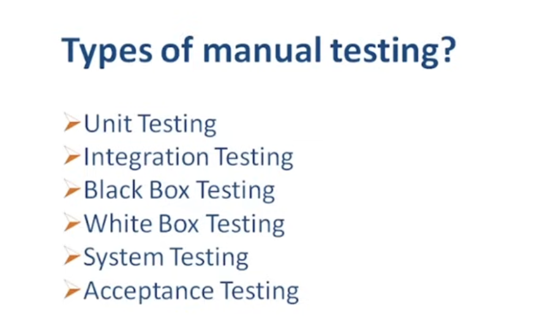

Manual Testing can be broadly classified into several categories:

### 3.1 Testing Methodologies (Techniques)

| Technique | Description |
| :--- | :--- |
| **Black Box Testing** | Testing without knowledge of internal code/structure. Focuses entirely on inputs and expected outputs. |
| **White Box Testing** | Testing with full knowledge of internal code and structure. Also known as Glass Box Testing. |
| **Gray Box Testing** | A hybrid approach — testing with partial knowledge of the internal workings. |

### 3.2 Levels of Testing

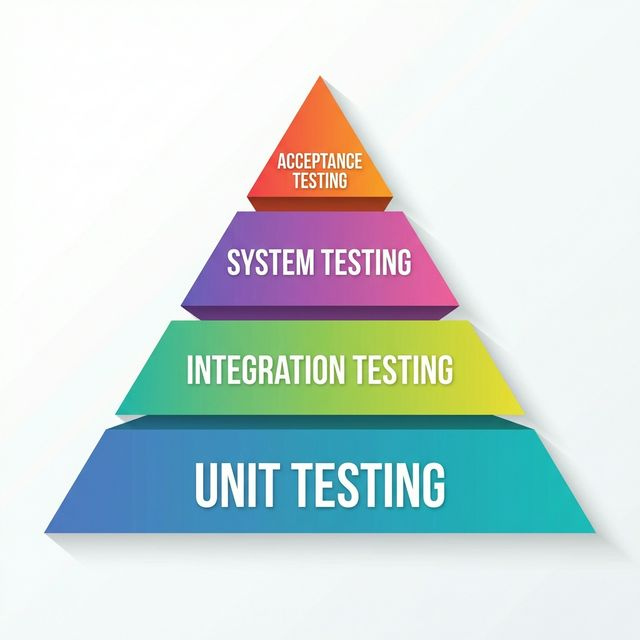

| Level | What Is Tested | Primary Owner |
| :--- | :--- | :--- |
| **Unit Testing** | Individual components or functions in isolation. | Developers |
| **Integration Testing** | Interactions between connected modules/services. | Developers + SDET |
| **System Testing** | The complete, integrated application end-to-end. | QA / SDET |
| **Acceptance Testing** | Whether the software meets business needs. | End users / Stakeholders |

**Acceptance Testing sub-types:**
* **Alpha Testing:** Performed by internal employees at the development site.
* **Beta Testing:** Performed by real users in their own environment.

#### 3.2.1 Testing Hierarchy in Detail

> **Conceptual Overview:** Imagine you're building a house.
>
> Unit Testing is checking each brick and beam as it's made. "Is this brick solid? Are these beams straight?" You're testing the smallest pieces individually.
>
> Integration Testing is checking that the walls and the roof connect properly. "Does the roof fit on these walls? Do the water pipes connect to the sink without leaking?" You're testing that the pieces work together in small groups.
>
> System Testing is walking through the entire finished house. You turn on every light, flush every toilet, open every window, and check if the whole house functions correctly as one unit.
>
> User Acceptance Testing (UAT) is when the future homeowner visits. They walk through the house and confirm: "Yes, the kitchen is where I wanted it. The master bedroom gets enough morning light. The house meets my expectations."
>
> So the testing hierarchy moves from tiny single parts → connected parts → whole system → user's final approval.

| Level | What Is Tested | Who Does It | Tools / Approach |
| :--- | :--- | :--- | :--- |
| **Unit Testing** | Individual functions, methods, or classes in isolation. | Developers (SDET may contribute to testable code design). | Jest, Mocha, JUnit. Mocking/stubbing dependencies. |
| **Integration Testing** | Data flow and interface between 2–3 components (e.g., API → database). | Developers + SDETs. | Postman, Playwright API testing (`request` fixture), REST Assured. |
| **System Testing** | Entire application — end-to-end user journeys (login → checkout → payment). | QA / SDET (primary owners). | Playwright, Selenium, Cypress. Performance tools (JMeter). |
| **UAT** | Complete system against real-world business scenarios. | End users, business stakeholders, product owners. | Usually manual, in a production-like environment. |

**The Test Pyramid principle:** Maintain many fast unit tests at the base, fewer integration tests in the middle, and a targeted set of slower system tests at the top. This keeps the overall suite fast and reliable.

> **Key Takeaway:** "Unit tests verify individual code functions. Integration tests check that multiple components work together correctly. System tests validate the entire application end-to-end. UAT confirms the software meets business needs from the user's perspective. As an SDET, integration and system test automation provide the highest-value fast feedback."

#### 3.2.2 System Testing vs. Integration Testing

> **Conceptual Overview:** Integration Testing is like testing whether the engine fits properly into the car frame, and whether the fuel line connects to the engine without leaking. You check that two or three big parts work together, but you don't drive the car yet.
>
> System Testing is like taking the fully assembled car out for a long test drive on real roads. You check everything together: engine, brakes, lights, air conditioning, music system – as one complete vehicle.
>
> So: Integration = checking connections between parts. System = checking the whole working product.

| Feature | Integration Testing | System Testing |
| :--- | :--- | :--- |
| **Scope** | Narrow — specific data flow between 2–3 components. | Wide — entire system with real database, browser, network. |
| **When** | After unit tests pass; runs per build / pull request. | After integration tests pass; nightly or per release candidate. |
| **Who** | Developers + SDETs. | QA / SDET primarily. |
| **Tools** | Postman, Playwright API (`request` fixture), REST Assured. | Playwright (browser), Selenium, Cypress, Appium (mobile). |
| **Environment** | Test environment with stubs or limited services. | Staging / pre-production mirroring production. |
| **Speed** | Faster — no browser rendering. | Slower — full UI rendering, real browser interactions. |
| **Defects Found** | Data mismatches, wrong API responses, contract violations. | UI layout issues, broken user flows, environment config errors. |

> **Key Takeaway:** "Integration testing verifies module-to-module communication (e.g., API ↔ database). System testing validates the complete application as a user would experience it. A healthy test strategy automates both layers for fast, layered feedback."

### 3.3 Testing Types (Functional vs. Non-Functional)

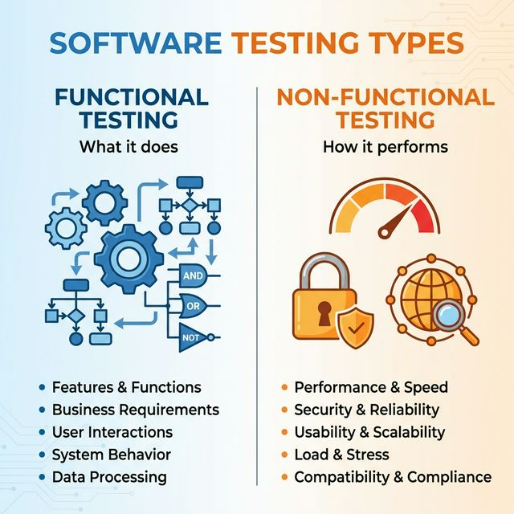

**Functional Testing** — Verifying **what** the software does:

| Type | Description |
| :--- | :--- |
| **Smoke Testing** | High-level check to confirm the build is stable enough for further testing. |
| **Sanity Testing** | Quick, focused check of specific functionality after a bug fix or minor change. |
| **Regression Testing** | Ensuring new changes haven't broken existing, previously working functionalities. |

**Non-Functional Testing** — Verifying **how** the software performs:

| Type | Description |
| :--- | :--- |
| **Performance Testing** | Checking responsiveness, stability, and speed under load. |
| **Usability Testing** | Checking how user-friendly and intuitive the application is. |
| **Compatibility Testing** | Verifying the app works across different browsers, OS, and devices. |
| **Security Testing** | Identifying vulnerabilities and ensuring data protection. |

### 3.4 Static vs. Dynamic Testing

| Aspect | Static Testing | Dynamic Testing |
| :--- | :--- | :--- |
| **Execution** | Code is **not** executed. | Code **is** executed. |
| **Methods** | Code reviews, inspections, walkthroughs, static analysis tools. | Running test cases and validating output against expected results. |
| **When** | Early — during requirements, design, or code review phases. | After a build is available. |

### 3.5 Positive vs. Negative Testing

| Aspect | Positive Testing | Negative Testing |
| :--- | :--- | :--- |
| **Approach** | "Happy Path" — valid inputs. | Invalid data, unexpected behaviour. |
| **Validates** | The system does what it's supposed to do. | The system handles errors gracefully (doesn't do what it shouldn't). |

### 3.6 Re-testing vs. Regression Testing

| Feature | Re-testing | Regression Testing |
| :--- | :--- | :--- |
| **Purpose** | Verify a specific bug fix. | Ensure existing features still work after changes. |
| **Execution** | Done before Regression testing. | Done after Re-testing is successful. |
| **Scope** | Only the failed test cases are re-run. | All related features are checked. |
| **Automation** | Difficult to automate (one-time fix). | Highly recommended for automation. |

### 3.7 Ad-hoc and Exploratory Testing

**Ad-hoc Testing:**

> **Conceptual Overview:** Imagine you just bought a brand new video game. You don't read the instruction manual, and you don't follow a checklist. You just pick up the controller, start mashing buttons, try to walk through walls, and jump off cliffs just to see what happens. You are relying entirely on your gut feeling to break the game.
>
> "Ad-hoc" literally means "created or done for a particular purpose as necessary." In QA, it means you have no test cases written down. You just open the app and use your human intuition to try and crash it.

* No formal test plan or documentation.
* Leverages the tester's domain knowledge to identify high-level defects quickly.
* Best used immediately after a new build is deployed for a rapid quality pulse-check.

**Exploratory Testing:**
* Simultaneous learning, test design, and test execution.
* More structured than ad-hoc — the tester actively explores, documents findings, and adapts the approach in real-time.

> **Key Takeaway:** "Ad-hoc testing relies on domain knowledge to surface obvious defects without formal scripts. It complements documented regression testing and is valuable as a first pass on new builds."

### 3.8 Usability Testing

> **Conceptual Overview:** Have you ever walked up to a glass door that has a big handle on it, so you pull it, but it turns out it's a "Push" door? Technically, the door works (Functional Testing passed), but the design is confusing and makes the user feel stupid. Usability testing is making sure the app doesn't have "push doors with pull handles."
>
> You aren't checking if the code works; you are checking if the design works for a human brain. Is the text too small? Are the buttons too close together? Is the checkout process too confusing?

* Validates the workflow is intuitive, accessible, and frictionless.
* Checks: text readability, button spacing, navigation flow, checkout clarity.
* A working application that frustrates the user is still a quality failure.

> **Key Takeaway:** "A feature isn't truly complete because it passes functional requirements. Usability testing ensures the workflow is intuitive and frictionless, because a technically correct app that frustrates users is still a failed product."

### 3.9 Maintenance Testing

Testing on software **already in production**.
* **Purpose:** Verifying the system after bug fixes, new features, or migrations.
* **Focus:** Ensuring updates haven't introduced "side-effect" regressions.

### 3.10 Experience-Based Testing

Relies on the tester's intuition and past knowledge.

| Technique | Description |
| :--- | :--- |
| **Error Guessing** | Predicting where developers commonly introduce mistakes. |
| **Monkey Testing** | Providing random, nonsensical data to test system resilience. |
| **Gorilla Testing** | Repeatedly and exhaustively testing one specific module. |

### 3.11 Globalization (i18n) vs. Localization (l10n)

| Aspect | Globalization (i18n) | Localization (l10n) |
| :--- | :--- | :--- |
| **Focus** | Technical support for different languages, formats, currencies. | Adapting the app for a specific region (e.g., RTL text for Arabic). |

### 3.12 Accessibility Testing (A11y)

Ensuring the application is usable by people with disabilities.
* **Focus:** Screen readers, high-contrast modes, keyboard-only navigation.

### 3.13 Compatibility Testing

Verifying the app works across different:
* **Browsers:** Chrome, Safari, Firefox.
* **Operating Systems:** Windows, macOS, Linux.
* **Mobile Devices:** iOS, Android.

---

## 4. Verification vs. Validation

> **Conceptual Overview:** Verification is like reading a recipe while you cook. You check each step: "Did I add two spoons of sugar exactly as written?" You're making sure you follow the instructions correctly.
>
> Validation is like tasting the dish after it's cooked. Does it actually taste good? Would someone else enjoy eating it? You're checking if you made the right dish that satisfies the person eating it.
>
> So: Verification = Are we following the instructions correctly? Validation = Did we make the right thing that works for the user?

| Aspect | Verification | Validation |
| :--- | :--- | :--- |
| **Core Question** | Are we building the product **correctly**? | Are we building the **correct** product? |
| **Focus** | Documents, designs, code, specifications. | The actual working software against real user needs. |
| **Activity Type** | **Static** — no code executed. Reviews, walkthroughs, inspections, static analysis. | **Dynamic** — code is executed. Unit tests, integration tests, system tests, UAT. |
| **When** | Early stages — requirements, design, test cases, code reviews. | After a working build is available. |

**User Acceptance Testing (UAT):** The final validation phase where real users or client representatives test the software to confirm it meets their business needs before go-live.

**Why both matter:**
* Skipping verification → you build the wrong thing beautifully.
* Skipping validation → you have a well-documented product that crashes on launch.

> **Key Takeaway:** "Verification ensures we are building the product correctly — it's checking documents and designs without running the software. Validation ensures we built the correct product — it involves executing the software and checking it meets user needs. Both are necessary for quality."

---

## 5. QA vs. QC

> **Conceptual Overview:** QA (Quality Assurance) is like the rules a restaurant creates to make sure every dish is good: chefs must wash hands, ingredients must be fresh, the oven must be at the right temperature. These rules exist before cooking starts and guide how the work is done.
>
> QC (Quality Control) is like the chef tasting the soup just before it goes to the customer and saying, "Yes, this is good" or "No, it needs more salt." It's about inspecting the finished product.
>
> So: QA = Process-focused (preventing defects). QC = Product-focused (finding defects).

| Aspect | QA (Quality Assurance) | QC (Quality Control) |
| :--- | :--- | :--- |
| **Focus** | The **process** used to build the software. | The **product** itself (the working software). |
| **Goal** | **Prevent** defects by improving the development process. | **Identify** defects in the finished or in-progress product. |
| **How** | Standards, checklists, audits, process reviews, training. | Executing test cases, running automation suites, inspecting outputs. |
| **When** | Throughout the entire SDLC — starting before development. | After a build or component is ready to be tested. |
| **Who** | Everyone on the team (developers, testers, managers). | Primarily the testing/QA team. |
| **Example** | Defining a mandatory code review policy before code merge. | Running a Playwright script to verify the login flow works. |

> In modern agile teams, SDETs contribute to **both** QA (process improvements, test strategies, linting rules) and QC (executing tests, reporting defects).

> **Key Takeaway:** "Quality Assurance is process-oriented — improving development practices to prevent defects. Quality Control is product-oriented — testing the actual software to find defects. Both are needed to deliver a high-quality product."

### 5.1 QA Activities Before Development Begins

Using a practical example — a team building a **"Forgot Password"** feature:

| Step | QA Activity | Value |
| :--- | :--- | :--- |
| **1. Requirement Analysis** | Review draft requirements and ask clarifying questions. E.g., "What happens if the email isn't registered?", "Should the reset link expire?", "How many requests per 10 minutes?" | Prevents defects from being born — makes requirements unambiguous. |
| **2. Acceptance Criteria** | Define testable conditions for "done". E.g., "Reset email sent within 10s", "Link expires after 30 min", "Non-registered emails show a generic success message (security)." | Removes ambiguity; gives developers a precise target. |
| **3. Test Scenario Design** | Outline high-level scenarios (not full test cases yet). E.g., "Verify email sent for valid user", "Verify expired link shows error." | Creates shared understanding and highlights coverage gaps early. |
| **4. Design Review** | Review technical design documents. E.g., "What if the database is down when validating the token?" | Catches design flaws early (verification). |
| **5. Environment & Data Prep** | Prepare test data (test user accounts), coordinate test email server setup. | Reduces delays when the build arrives. |

### 5.2 Key QA Deliverables (Pre-Development)

| # | Deliverable | Description |
| :--- | :--- | :--- |
| 1 | **Review Notes / Clarification Questions** | A list of unclear, missing, or contradictory aspects of the requirement. |
| 2 | **Acceptance Criteria** | Specific, testable conditions that must be met for the feature to be "done." |
| 3 | **High-Level Test Scenarios** | Short descriptions of what areas will be tested (blueprint for future test cases). |
| 4 | **Test Plan / Test Strategy** | Scope, testing types, environment needs, schedule, risks (lightweight in Agile). |
| 5 | **Detailed Test Cases** | Step-by-step cases with preconditions, steps, and expected results (refined once build arrives). |

> Writing test cases early means the moment a build is delivered, testing begins immediately — no scrambling.

---

## 6. Human-in-the-Loop (HITL) Testing

> **Conceptual Overview:** Think of the autopilot on a commercial airplane. The autopilot (automation) can fly the plane perfectly 99% of the time while the pilot drinks coffee. But if a massive storm suddenly appears, the autopilot pauses and alerts the human pilot to grab the steering wheel and make a judgment call.
>
> Automation is blind. Sometimes, an automation script can't tell if a picture looks weird or if a layout is ugly—it only checks the code. HITL is a testing system where the automated robot does all the boring, repetitive work, but pauses to ask the human QA engineer, "Hey, does this look right to you?" before moving on.

* Automation is **deterministic** — it cannot evaluate whether a layout "looks right" or a UX flow "feels intuitive."
* HITL designs the automated pipeline to **escalate** visual changes, subjective UX workflows, or ambiguous outputs to a human QA engineer for review.

> **Key Takeaway:** "I design Human-in-the-Loop test strategies where Playwright handles repetitive data validation, but the pipeline alerts me to manually review complex visual changes or highly subjective UX workflows."

---

## 7. Shift Left Testing

> **Conceptual Overview:** Imagine you're building a house.
>
> The old way: you build the entire house, then call the inspector. The inspector finds a crack in the foundation — but the house is already finished. You have to tear down walls to fix it.
>
> The new way (Shift Left): you call the inspector before you even pour the concrete. They check the soil, the steel rods, the blueprint. You fix issues when they're still tiny and cheap.
>
> Shift Left means moving testing activities to the left on the project timeline — earlier in the development process. The earlier you test, the earlier you find problems, and the less they cost to fix.

**Shift Left** means moving testing activities **earlier** in the SDLC timeline.

| Stage | Traditional QA (Testing Late) | Shift-Left QA (Testing Early) |
| :--- | :--- | :--- |
| **Requirements** | QA waits for final requirements. | QA reviews drafts, asks questions, writes acceptance criteria **before** development. |
| **Design** | QA has little involvement. | QA reviews UI mockups and technical designs for usability gaps and security concerns. |
| **Coding** | QA doesn't look at unit tests. | SDET helps developers write better unit tests, sets up static analysis (linters, type-checking). |
| **Integration** | QA tests after all pieces are merged. | SDET writes API contract tests and component tests that run on **every pull request**. |
| **System / E2E** | QA performs large manual testing cycles late. | SDET automates critical user journeys in CI; manual testing is reduced to exploratory sessions. |

**The cost of a defect over time:**
* Caught during **requirements review** → nearly free (a conversation).
* Caught during **development** → a few hours.
* Caught **after release** → thousands in hotfixes, lost trust, and revenue.

> **Key Takeaway:** "Shift Left testing means moving testing activities earlier in the SDLC. Instead of testing only after development, we validate requirements, designs, and code as soon as they're created. For SDET, this means writing automated checks — API tests, unit tests, static analysis — that run early and often, not just E2E tests at the release gate."

---

## 8. How to Perform Manual Testing?

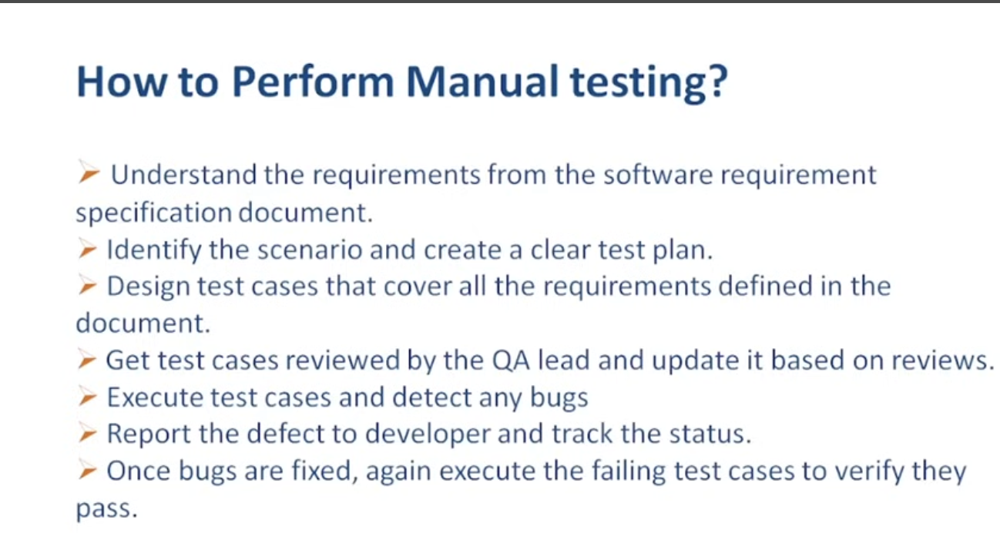

| Step | Description |
| :--- | :--- |
| **Analyze** | Understand the requirements and project scope. |
| **Plan** | Define the test strategy, resources, and schedule. |
| **Design** | Create detailed test cases and scenarios. |
| **Execute** | Perform tests manually and record results. |
| **Log** | Report defects and track them to resolution. |
| **Close** | Verify fixes and provide a final summary report. |

---

## 9. SDLC (Software Development Life Cycle)

The SDLC is a structured sequence of stages used to develop software — from the initial idea through delivery and ongoing maintenance.

### 9.1 SDLC Stakeholders

1. Business Analyst
2. Project Manager
3. Development Team
4. Quality Assurance Team
5. End User

---

### 9.2 SDLC Phases

| Phase | Description |
| :--- | :--- |
| **1. Planning** | Gathering requirements and defining the project scope. |
| **2. Analysis** | Evaluating requirements for feasibility and technical details. |
| **3. Design** | Creating system architecture and user interface blueprints. |
| **4. Implementation** | Writing the actual source code. |
| **5. Testing** | Verifying the software to find defects and ensure quality. |
| **6. Deployment** | The software goes live for users. |
| **7. Maintenance** | Fixing bugs, gathering feedback, and updating the system post-release. |

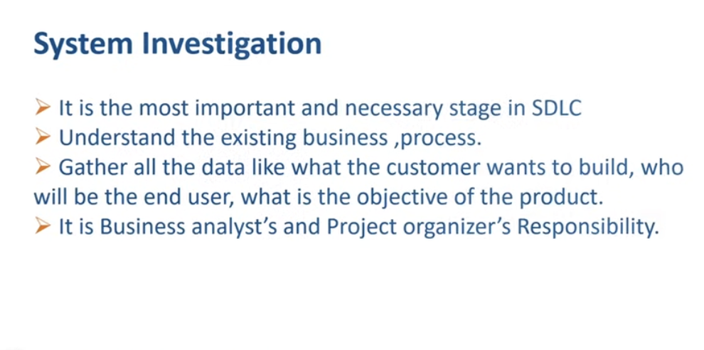

**Key documents used during Analysis:**

| Document | Description |
| :--- | :--- |
| **BRD** (Business Requirement Document) | High-level goals of what the business needs. |
| **SRS** (System Requirement Specification) | Detailed technical and functional requirements. |
| **FRD/FRS** (Functional Requirement Document) | Specific description of how individual features should work. |

---

### 9.3 SDLC Models

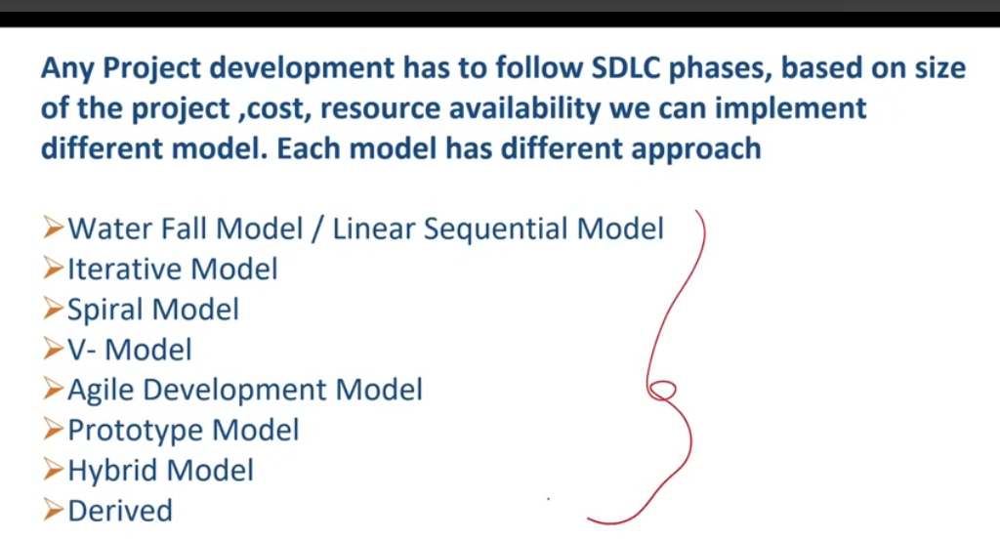

#### 9.3.1 Waterfall Model / Linear Sequential Model

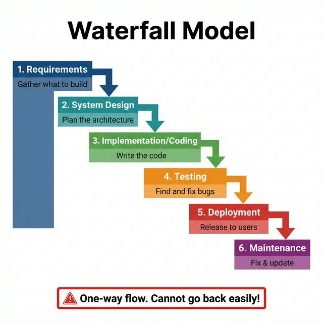
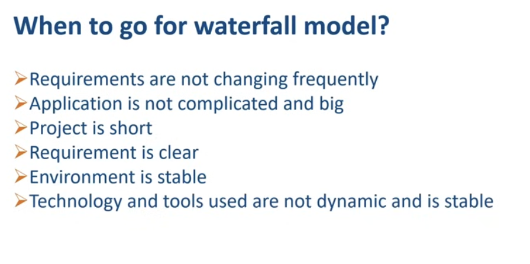
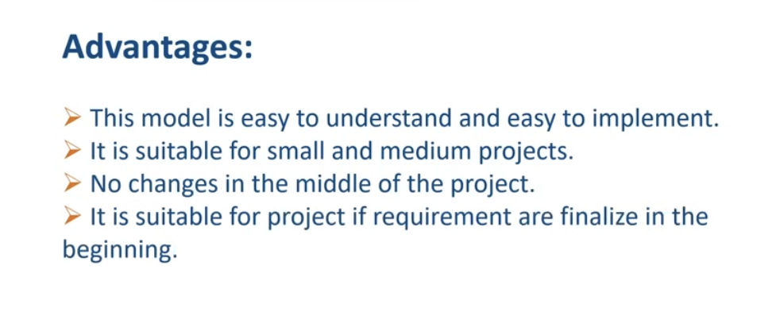
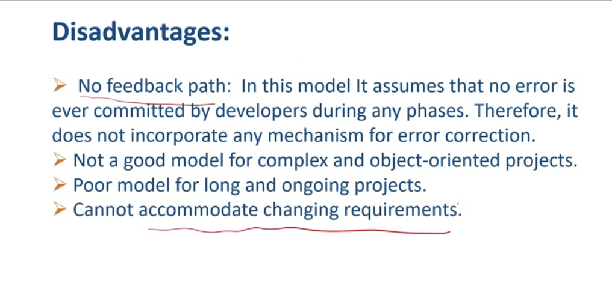

> **Conceptual Overview:** Development flows steadily downward through phases like a waterfall — each phase must be 100% completed before the next begins. Once a phase is signed off, there is no going back.

* **Flow:** Linear and sequential.
* **Best for:** Small projects with fixed, well-understood requirements.
* **Limitation:** Extremely rigid; not suitable for projects with evolving requirements.

#### 9.3.2 Iterative Model

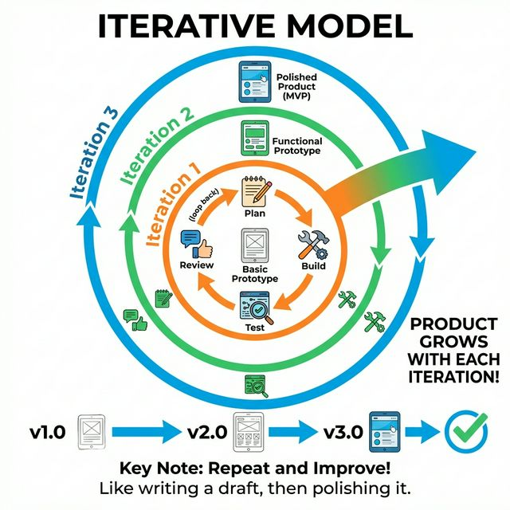

> **Conceptual Overview:** Instead of building the full system at once, you build a small part, then repeatedly enhance it in iterations — like writing successive drafts, each one more refined.

* **Flow:** Builds the system in small cycles.
* **Advantage:** Early detection of design flaws, flexible adaptation between iterations.
* **Limitation:** Can become complex for very large-scale systems.

#### 9.3.3 Spiral Model

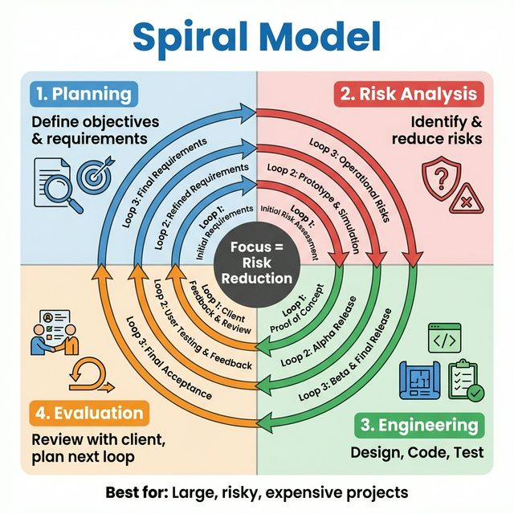

> **Conceptual Overview:** Imagine you're going on a treasure hunt in a dark forest. You don't just run straight in — that's risky. Instead, you take a small step forward, stop, look around for danger (like snakes or holes), plan your next step, then move again. You keep doing this: step, check for risk, plan, move. Each time you go a little deeper into the forest, but you're always watching out for problems. The Spiral model works just like that: build a bit, check for risks, plan the next bit, repeat. It's all about managing risk at every turn.

Introduced by **Barry Boehm (1986)**, the Spiral model combines iterative development with rigorous risk analysis. Each loop has four activities:

| Activity | Description |
| :--- | :--- |
| **1. Determine Objectives** | Define what this iteration should achieve. |
| **2. Identify & Reduce Risks** | Analyse technical, budget, and timeline risks — the heart of the model. |
| **3. Development & Testing** | Build and test the features for this iteration. |
| **4. Plan Next Iteration** | Review progress and plan the next spiral loop. |

**SDET relevance:**
* Risk-driven testing — the risk analysis phase directly determines what gets tested most rigorously.
* Testing is not a single phase; it's present in **every loop**.
* Common in safety-critical systems: banking, aerospace, medical devices.

#### 9.3.4 Waterfall vs. Spiral — Comparison

| Feature | Waterfall | Spiral |
| :--- | :--- | :--- |
| **Flow** | Linear, sequential. | Iterative, looping. |
| **Risk Analysis** | Little or none. Bugs found only during the testing phase. | Explicit risk analysis at every loop. Highest risks addressed first. |
| **Testing** | Only at the end, after all development is complete. | Continuous, integrated into each loop. |
| **Flexibility** | Rigid. Changing requirements post-design is very difficult. | Flexible. Adjustments after each loop based on feedback and risk. |
| **Customer Feedback** | Late — only after deployment. | Early and frequent — after each spiral loop. |
| **Best Suited For** | Small projects with fixed, well-known requirements. | Large, complex, high-risk projects (banking, aerospace, medical). |
| **Cost of Defects** | High — late detection means expensive fixes. | Lower — continuous testing catches defects early. |

> **SDET implication:** In Waterfall, you receive a massive code drop and must automate tests in one burst. In Spiral, you build automation incrementally, prioritizing the riskiest features first.

#### 9.3.5 V-Model (Verification & Validation Model)

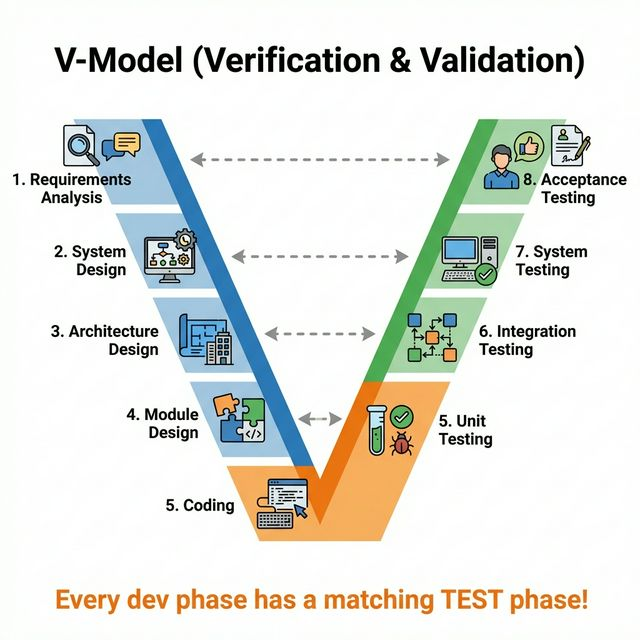

> **Conceptual Overview:** An extension of Waterfall shaped like a "V" — for every development phase on the left side, there is a corresponding testing phase on the right. Test planning happens **in parallel** with development, not after it.

* **Proactive:** Testing is planned from the very start.
* **Disciplined:** Each development phase has a matched validation phase (requirements → acceptance tests, design → integration tests, coding → unit tests).
* **Best for:** Projects with fixed, well-understood requirements where quality discipline is critical.

#### 9.3.6 Agile Development Model

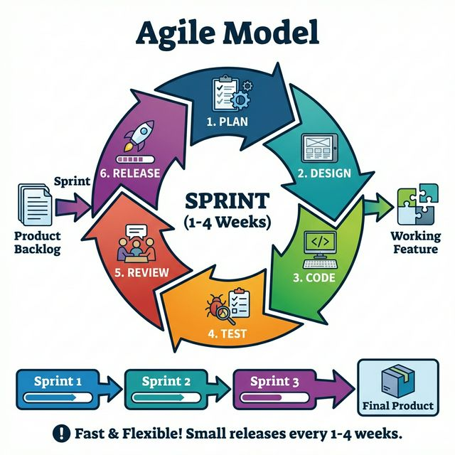

> **Conceptual Overview:** Imagine you want to build a custom bicycle. Instead of designing the whole bike on paper, ordering every single part, assembling it all at once, and only then letting the customer ride it (Waterfall), you do this:
>
> First, you build a basic frame with two wheels and a seat—a rideable scooter. You show it to the customer. They say, "I need handlebars higher and a softer seat." Next, you add those changes and also attach pedals. You show it again. Customer tries it: "Great! But the chain slips sometimes." You fix the chain in the next delivery.
>
> You deliver working pieces early and often, and you adapt based on real feedback after each tiny release. That's Agile: building software in small, working slices, getting feedback, and constantly improving.

Based on the **Agile Manifesto (2001):**

| Value | Agile Prioritises |
| :--- | :--- |
| Individuals and interactions | over processes and tools |
| Working software | over comprehensive documentation |
| Customer collaboration | over contract negotiation |
| Responding to change | over following a plan |

**Core mechanics:**
* Software is built in short, time-boxed cycles called **sprints** (typically 1–4 weeks).
* Each sprint delivers a **potentially shippable increment** of working software.
* After each sprint: demo → collect feedback → adjust the plan.

**SDET relevance:**
* Testing is **continuous** — no separate "testing phase" at the end.
* Shift-left in action: QA reviews user stories and writes acceptance criteria before coding.
* **Automation is essential** — regression testing every sprint makes it a necessity, not a luxury.
* Close daily collaboration with developers and product owners.

> **Key Takeaway:** "Agile delivers working software in short sprints with continuous testing and feedback. The focus is on people, working software, collaboration, and embracing change. For QA, this means testing happens continuously, and automation is crucial to keep up with frequent releases."

#### 9.3.7 Scrum Framework

> **Conceptual Overview:** You're part of a small film crew making a web series. Instead of writing the whole season, shooting everything, and releasing it a year later, you do this:
>
> You pick a 2‑week goal: "We'll shoot and edit Episode 1." Every morning, the crew stands together for 5 minutes to say what they did yesterday, what they'll do today, and what's blocking them. After 2 weeks, you screen Episode 1 to a test audience. They give feedback. You then look back on how the shoot went and agree to buy a better microphone next time. Then you pick the goal for the next 2‑week cycle: "Episode 2, with more outdoor shots."
>
> Each 2‑week cycle is a Sprint. The crew is a Scrum Team. That's Scrum: a structured rhythm of planning, daily syncs, frequent delivery, feedback, and reflection.

**The 3 Scrum Roles:**

| Role | Responsibility |
| :--- | :--- |
| **Product Owner (PO)** | Decides **what** to build. Manages and prioritises the Product Backlog. |
| **Scrum Master (SM)** | Coaches the team on Scrum practices, removes impediments. A servant-leader, not a manager. |
| **Development Team** | Cross-functional group that builds and tests the product. **QA/SDET is part of this team.** |

**The 5 Scrum Events:**

| Event | Description |
| :--- | :--- |
| **Sprint** | A fixed time-box (1–4 weeks) where a potentially shippable increment is created. |
| **Sprint Planning** | Team selects Product Backlog items and defines how to deliver them → output: Sprint Backlog. |
| **Daily Scrum (Stand-up)** | 15-minute daily sync: What did I do? What will I do? Any blockers? |
| **Sprint Review** | Team demos the working increment to stakeholders; feedback may change the Product Backlog. |
| **Sprint Retrospective** | Team reflects: What went well? What to improve? At least one actionable improvement for next sprint. |

**The 3 Scrum Artifacts:**

| Artifact | Description |
| :--- | :--- |
| **Product Backlog** | Single source of all work (features, bugs, technical tasks), prioritised by the PO. |
| **Sprint Backlog** | Subset of Product Backlog items selected for the current sprint + delivery plan. |
| **Increment** | Sum of all completed items at sprint end. Must meet the team's **Definition of Done**. |

**QA/SDET in Scrum:**
* Attend all Scrum events.
* During **Sprint Planning** — raise testing concerns, clarify acceptance criteria.
* During the **Sprint** — test features as soon as they're coded, not at the end.
* Own the **Definition of Done** for testing: all automated tests pass, new features covered, no critical defects open.
* During **Sprint Review** — may demo automated test reports alongside the feature demo.

> **Key Takeaway:** "Scrum structures Agile work into fixed Sprints with defined roles (PO, SM, Dev Team), events (Planning, Daily, Review, Retro), and artifacts (Product Backlog, Sprint Backlog, Increment). As an SDET, I'm a core part of the Development Team — automating tests and ensuring quality is built in, not added later."

#### 9.3.8 SAFe — Scaled Agile Framework

> **Conceptual Overview:** Scrum = A single small kitchen (one team) making pizzas in short cycles (sprints) and improving.
>
> SAFe = 50 kitchens (many teams) all making different parts of a huge festival meal. They need to coordinate so everything is ready at the same time, hot and tasty. SAFe is the set of rules, schedules, and communication methods that make this possible.
>
> When you have only one team, communication is easy. When you have 10 teams building the same big product (like a banking app), problems appear: teams depend on each other, releases can break if uncoordinated, and work may overlap. SAFe solves this by adding coordination layers above the single teams, without killing the agility of each team. Think of it like a traffic control system for many Agile teams.

**Key Building Blocks:**

| Concept | Description | SDET Relevance |
| :--- | :--- | :--- |
| **Agile Release Train (ART)** | A group of 5–12 Scrum teams working together on a common product — a virtual "super-team." | Your team belongs to an ART; you coordinate testing with other teams. |
| **Program Increment (PI)** | A large time-box (8–12 weeks) containing multiple Sprints. By PI's end, all teams deliver a working, integrated product increment. | Test planning aligns with PI goals; integration testing spans teams by PI end. |
| **PI Planning** | A 2-day planning event where all ART teams align goals and identify dependencies for the upcoming PI. | You speak up about testing dependencies: "If Team A's API isn't ready by Sprint 2, I can't test my team's dashboard." |
| **System Demo** | At the end of every Sprint (and PI), all teams demonstrate the integrated product as a whole. | Present test results, demonstrate cross-team feature integration, highlight integration defects. |
| **Inspect & Adapt (I&A)** | Large-scale retrospective at PI end — the entire ART reflects and improves. | Provide feedback on cross-team testing processes (e.g., "Integration testing started too late"). |

**Day-to-day for SDET in SAFe:**
* You remain part of a Scrum team with daily stand-ups, sprint planning, and retros.
* You additionally participate in ART-level events, especially PI Planning.
* You collaborate with other QAs on the ART to share test strategies, automation frameworks, and test data.
* Your automation suite runs against both your team's code **and** other teams' code in CI/CD to catch integration failures early.

> **Key Takeaway:** "SAFe scales Agile across many teams using an Agile Release Train. Teams work in a PI rhythm (8–12 weeks) with coordinated planning and integrated demos. As a QA, I'm still in a Scrum team but also coordinate testing across teams to ensure the entire product works smoothly."

#### 9.3.9 Agile vs. V-Model — Comparison

| Feature | V-Model | Agile |
| :--- | :--- | :--- |
| **Approach** | Sequential and linear. Each phase must finish before the next. | Iterative and incremental. Work in short sprint cycles. |
| **Phases Overlap** | No. Development on the left, testing on the right. | Yes. Coding, testing, and design happen continuously within each sprint. |
| **Testing** | Starts only after coding is complete, with phases matching development (unit, integration, system, UAT). | Continuous from day one. Every sprint delivers **tested**, working software. |
| **Customer Feedback** | Late — only after the product is built (UAT phase). | Early and frequent — at the end of every sprint (Sprint Review). |
| **Change Management** | Very rigid. Changes are difficult and costly after requirements sign-off. | Embraces change. The backlog can be reprioritised before every sprint. |
| **Documentation** | Heavy emphasis at every phase. | Values working software over comprehensive documentation. Just enough documentation. |
| **Risk Handling** | Risks identified early, but mitigation happens late. | Risks continuously identified and addressed in each sprint. Small failures are inexpensive. |
| **Team Structure** | Separate teams with hand-offs between phases. | Cross-functional: PO, SM, Developers, QA/SDET in one team. |
| **Delivery** | One big delivery at the end. | Small, frequent deliveries of working increments. |
| **Best For** | Fixed requirements, regulated industries (aerospace, medical). | Evolving requirements, fast-paced markets, user-facing applications. |

> **Key Takeaway:** "The V-Model is sequential with testing planned in parallel but executed only after coding. Agile is iterative, delivering tested software in short sprints with continuous feedback. Agile integrates QA from day one, enabling early automation and close developer collaboration."

#### 9.3.10 Prototype Model

> **Conceptual Overview:** Imagine you want a custom wedding cake. Instead of baking the final 5‑tier cake directly from a sketch and hoping the couple likes it, the baker first makes a small, sample cake with the same flavour and decoration style. The couple tastes it, says "More chocolate, less cream," and the baker adjusts. Only after they approve the sample does the baker build the final, expensive cake.
>
> That sample is a prototype — a quick, working model to test ideas and get feedback before building the real thing.

**Phases:**
1. Initial Requirement Gathering → basic, high-level ideas.
2. Quick Design → simplified UI or key features.
3. Build Prototype → fast, functional model for user interaction.
4. User Evaluation → users provide feedback.
5. Refine Requirements → update based on feedback.
6. Build Final Product → from clarified requirements.

**Two types:**

| Type | Description |
| :--- | :--- |
| **Throwaway Prototype** | A fast, disposable mock-up built only to understand requirements, then discarded. |
| **Evolutionary Prototype** | Continuously improved based on feedback until it becomes the final product. |

**SDET relevance:**
* Requirements are clarified before full development — fewer defects from misunderstood specifications.
* Exploratory testing on the prototype surfaces usability issues and logical gaps very early.
* In evolutionary prototyping, test automation must evolve constantly — a flexible design (e.g., Page Object Model) is essential.

#### 9.3.11 Hybrid Model

> **Conceptual Overview:** Imagine you're building a custom car. You love the speed and feedback of Agile's short test drives, but you also need the solid documentation and upfront planning of Waterfall for the engine and safety systems (which can't be "iterated" quickly without risk). So you mix them:
>
> For the car's chassis and engine, you follow a strict Waterfall plan with heavy documentation. For the interior dashboard and entertainment system, you use Agile sprints, showing the customer a new version every two weeks and adjusting based on their feedback.
>
> The final car is built using two different approaches at the same time, each chosen for the part they suit best. That's a Hybrid Model: combining two or more SDLC methodologies to get the best of both worlds.

**Common real-world scenarios:**

| Project Need | Approach |
| :--- | :--- |
| Banking app: regulated transaction engine + customer mobile app. | Waterfall for backend core, Agile/Scrum for frontend app. |
| Legacy enterprise modernisation: stable old modules + new microservices. | V-Model for legacy, Agile for new features. |
| Agile within sprints, but quarterly milestones with formal sign-offs at the programme level. | Agile at team level, Waterfall at programme level. |

**SDET relevance:**
* You may maintain two different testing rhythms on the same project.
* Formal test plans and traceability matrices for the Waterfall portion; lightweight test scenarios and rapid automation for the Agile portion.
* Integration testing between Agile and Waterfall components is critical.

#### 9.3.12 Derived Model

> **Conceptual Overview:** Imagine you own a restaurant and you've created a very successful recipe book that all your chefs follow. One day you decide to open a new pizza place. Instead of writing a completely new recipe book from scratch, you take the original book, keep the chapters on hygiene and kitchen safety, remove the pasta recipes, and add a whole new section on pizza dough and toppings. The new book is derived from the old one – it reuses what still works, discards what doesn't, and adds new things.
>
> In software, the Derived Model is when a team takes an existing SDLC process that worked on a previous project, modifies it to fit the new project's needs, and creates a "derived" custom process.

* Built from real-world experience, not theory.
* May combine Waterfall's documentation discipline, Agile's sprint cycles, and Spiral's risk-based test gates.
* Large organisations often have their own derived testing processes.

**SDET relevance:**
* When joining a new organisation, expect their own custom-derived model — no textbook model is followed exactly as written.
* You may be asked to improve the derived model by adding better automation strategies, shift-left practices, or enhanced test reporting.

> **Key Takeaway:** "Processes are not sacred — they should be adapted to the project, not the other way around."

#### 9.3.13 DevOps Model (Modern)

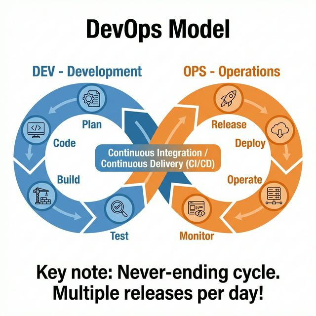

> **Conceptual Overview:** A continuous loop (∞) combining Development (Dev) and Operations (Ops) — constant coding, testing, and deployment with no hard phase boundaries.

* **Focus:** Automation, continuous integration, continuous delivery, and monitoring.
* **Capability:** Enables multiple releases in a single day.
* **SDET relevance:** Test automation is integral to the CI/CD pipeline; every commit triggers builds, tests, and potential deployment.

---

## 10. Build vs. Release

> **Conceptual Overview:** Imagine a car factory.
>
> A Build is when the factory assembles a car and rolls it off the production line. Now the car exists and can be started, but it's sitting in the factory yard. No customer has it yet.
>
> A Release is when the factory cleans that car, puts on the number plates, completes the paperwork, and hands it over to the customer. Now it's officially out in the world, being used.
>
> So: Build = the software is compiled and packaged. Release = the software is delivered to end users.

| Aspect | Build | Release |
| :--- | :--- | :--- |
| **What It Is** | Source code compiled and packaged into a runnable version. | A specific build that is fully tested, approved, and delivered to users. |
| **Who Does It** | Developers + CI/CD pipeline (automated). | DevOps, QA sign-off, Product Manager approval. |
| **Frequency** | Many per day (every commit may trigger a build). | Less frequent — scheduled (e.g., bi-weekly) or on stability confirmation. |
| **Stability** | May have bugs, may fail tests — an internal checkpoint. | Expected to be stable, tested, and production-ready. |
| **QA/SDET Role** | Tests specific builds; automation runs on every build in CI. | Provides the final "go / no-go" based on test results, coverage, and defect severity. |

**Typical flow:**
1. Developer commits code → CI creates **Build #105**.
2. Automated tests run on Build #105 → all pass.
3. QA performs exploratory testing on Build #105.
4. After several stable builds, the team decides **Build #112** will become **Release v1.3**.
5. Build #112 is deployed to production, tagged, and release notes are published.

> **Key Takeaway:** "A build is a compiled, runnable version created internally, often many times daily. A release is a specific build that has been fully tested, approved, and officially delivered to users. In QA, I run tests on every build to catch issues early and help decide when a build is stable enough to be released."

---

## 11. Project vs. Product

> **Conceptual Overview:** A project is like building a sandcastle for a competition. You plan it, build it, present it, and then it's done. Once the competition is over, you stop working on it.
>
> A product is like a garden. You plant it, water it daily, remove weeds, add new plants over time. It keeps growing and needs continuous care as long as people use it.
>
> So: Project = temporary, with a clear end. Product = ongoing, lives as long as users exist.

| Aspect | Project | Product |
| :--- | :--- | :--- |
| **Duration** | Fixed start and end date. | Continuous lifecycle. |
| **Focus** | Delivering a specific output (e.g., a website for an event). | Solving ongoing user problems (e.g., WhatsApp). |
| **Team** | Assembled for the project, then dispersed. | Dedicated, long-term team. |
| **Testing Approach** | Plan-driven, executed within the project timeline. | Continuous testing across releases, patches, updates. |
| **Examples** | Custom payroll system for one company → handover. | Microsoft Excel, Spotify, Slack. |

---

## 12. Product-Based vs. Service-Based Companies

### 12.1 Product-Based Companies

Build their **own products** to sell directly to users.

* **Focus:** Innovation, user experience, improving their own software.
* **Examples:** Google (Search, Gmail), Microsoft (Windows, Office), Meta (Facebook, Instagram), Amazon (Shopping, AWS).

### 12.2 Service-Based Companies

Provide **services** or build software for **other clients** (they work on projects).

* **Focus:** Delivering projects on time, meeting client-specific needs.
* **Examples:** TCS, Infosys, Accenture, Wipro, Cognizant.

---

## 13. Risk in Software Projects

**Risk** is the possibility of an adverse event that could negatively affect the project's timeline, budget, scope, or quality.

| Risk Type | Description |
| :--- | :--- |
| **Technical Risk** | Technology limitations, integration failures, performance issues. |
| **Schedule Risk** | Delays in delivery timelines. |
| **Cost Risk** | Budget overruns. |
| **Resource Risk** | Unavailability of skilled personnel or tools. |
| **Management Risk** | Poor decision-making, lack of leadership, scope creep. |
| **External Risk** | Regulatory changes, vendor issues, market shifts. |

---

## 14. Software Testing Life Cycle (STLC)

### 14.1 🔍 Simple Analogy
Planning a large wedding. You don't just wake up on the day and start cooking. You:

1. **First figure out the menu** (what to test).
2. **Decide who will cook what and when** (planning).
3. **Write detailed recipes** (test cases).
4. **Set up the kitchen** (environment).
5. **Cook and taste every dish** (execute and report issues).
6. **Finally, serve the guests and close the kitchen** (closure).

> That entire sequence is the STLC — a structured, phase‑by‑phase process that ensures nothing is left to chance.

---

### 14.2 💼 Professional Context
The Software Testing Life Cycle is a systematic process that describes every activity a QA team performs, from the moment a testing need is identified until the test cycle is formally closed. It runs parallel to the Software Development Life Cycle (SDLC) but focuses entirely on testing.

The STLC consists of 6 phases. In many standard models, Defect Reporting is embedded within the Test Execution phase. However, in practice, because defect management is so critical, many teams treat it as a distinct, continuous activity. This version uses your preferred structure, which separates it out for clarity.

---

### 14.3 📊 STLC Phases at a Glance

| # | Phase | Primary Objective | Key Deliverables / Outputs | Responsible |
|---|---|---|---|---|
| **1** | **Requirement Analysis** | Understand what to test, identify gaps, and map requirements to tests. | Requirements Traceability Matrix (RTM), Automation feasibility notes, Clarification list. | Tester / QA |
| **2** | **Test Planning** | Define how testing will be done: scope, resources, schedule, tools, risks. | Test Plan document, Test Strategy document. | Test Lead / Senior QA |
| **3** | **Test Case Development** | Create detailed test cases, test scripts, and test data. Baseline the test cases. | Baselined Test Cases, Test Scripts, Test Data. | Tester |
| **4** | **Test Environment Setup** | Prepare and verify the hardware, software, and data where tests will execute. | Ready test environment, Smoke test results. | Tester / DevOps |
| **5** | **Test Execution & Defect Reporting** | Run tests, log defects, retest fixes, and track bugs to closure. | Executed test cases (Pass/Fail), Defect reports, Updated RTM. | Tester |
| **6** | **Test Cycle Closure** | Evaluate testing completion, release readiness, and archive test assets. | Test Closure Report, Signed‑off release recommendation, Lessons learned. | Test Lead / QA team |

Now, a deeper look at each phase, including the specific responsibilities and key concepts you added.

---

### 14.4 Phase 1: Requirement Analysis
**Tester’s Responsibility:**
* **Study the requirement documents** – user stories, functional specifications, wireframes.
* **Identify the types of testing needed** – functional, UI, security, performance, etc.
* **Prepare the Requirements Traceability Matrix (RTM)** – a table that links every requirement to its corresponding test scenarios and later test cases. This ensures 100% coverage.
* **Perform Automation Feasibility Analysis** – decide which tests can and should be automated, and with what tool (e.g., Playwright for UI, Postman/Playwright for API).
* **Ask clarifying questions** – find ambiguities, missing edge cases, and missing error handling. This prevents defects from entering development.

#### Key Concept: Requirements Traceability Matrix (RTM)

**What it means:**
The RTM is simply a checklist that connects the features the client asked for (Requirements) to the tests you wrote (Test Cases). 

Think of it like a shopping list. If your partner asks you to buy "Milk, Eggs, and Bread" (Requirements), your receipt showing you bought them is the proof (Test Cases). The RTM is the document that puts the shopping list and the receipt side-by-side so you can prove you didn't forget anything. 

**Real-world Example:**
Imagine you are testing an E-commerce website. The business gives you two requirements:
1. Users must be able to add an item to the cart.
2. Users must be able to remove an item from the cart.

You write multiple test cases for these to make sure they work in different scenarios. The RTM looks like this:

| Req ID | Business Requirement | Test Case ID(s) | What the Test Does | Status |
|---|---|---|---|---|
| **REQ-01** | Add item to cart | TC-101   TC-102 | Add 1 item to empty cart   Add 99 items to cart (Max limit) | ✅ Pass   ❌ Fail |
| **REQ-02** | Remove item from cart | TC-103   TC-104 | Remove the only item in cart   Remove item when cart is already empty | ✅ Pass   ✅ Pass |

**Why it's important:** If the product manager asks, "Did we test the 'Remove item' feature?", you just look at the RTM and say "Yes, we ran TC-103 and TC-104, and they both passed." It guarantees **100% test coverage** so no requirement is missed.

---

### 14.5 Phase 2: Test Planning
**Test Lead / Senior QA Responsibility:**
* **Understand the project scope** – what are we testing and, equally important, what are we not testing.
* **Define scope of testing** – in‑scope and out‑of‑scope items.
* **Identify resources** – who will test, which tools, which environments.
* **Create schedules** – start and end dates for test design, execution, and closure.
* **List deliverables** – Test Plan, Test Cases, Defect Reports, Test Summary Report.
* **Decide the testing approach/strategy** – manual vs automated, testing levels (unit, integration, system, UAT), risk‑based testing priorities.
* **Effort estimation** – how many person‑days are required.

**Outcomes of Test Planning:**
* **Test Plan Document**: A project‑specific document that answers who, what, when, where, and how for testing. It includes scope, schedule, resources, risk, and entry/exit criteria.
* **Test Strategy Document**: A higher‑level, organization‑wide document that defines the general testing principles, standards, and test levels used across projects. 

---

### 14.6 Phase 3: Test Case Development
**Tester’s Responsibility:**
* **Design / script detailed test cases** – step‑by‑step with preconditions, test steps, test data, and expected results.
* **Review test cases** – peer review or lead review to catch gaps, improve clarity.
* **Update test cases** based on review feedback.
* **Baseline the test cases** – finalize and freeze the approved version. A baseline is the agreed‑upon reference version that will be executed. Any later changes require a formal update.
* **Create test data** – valid data (to check happy paths) and invalid data (to check error handling and boundary values).

#### Key Concept: Baseline Test Case
> The final, reviewed, and approved version of a test case, ready for execution. It is the version everyone on the team agrees to test against, ensuring consistency.

---

### 14.7 Phase 4: Test Environment Setup
**Tester / DevOps Responsibility:**
* **Set up the test environment** – configure servers, databases, browsers, mobile devices, and network.
* **Deploy the correct build** – the version of the software to be tested.
* **Execute a quick smoke test** – a shallow run of critical paths to confirm the environment is stable and the build is testable.
* **Document the test environment configuration** – so it can be recreated or debugged later.

#### Key Concept: Smoke Test
> A minimal set of tests that checks the core functionality is working (e.g., app launches, login works). If smoke tests fail, the build is rejected for further testing.

---

### 14.8 Phase 5: Test Execution & Defect Reporting
**Tester’s Responsibility:**
* **Execute test cases** as per the plan, following the baselined steps.
* **Compare actual results** with expected results.
* **Log defects** when a mismatch occurs, with clear and complete information.
* **Retest fixed defects** once the developer resolves them.
* **Perform regression testing** – re‑run critical test cases to ensure the fixes didn’t break anything else.
* **Update the RTM** with execution status (Pass/Fail/Blocked) and defect IDs.

#### Defect Reporting & Tracking (The Heart of This Phase)
A well‑written defect report includes:
* **Defect ID** – unique number (auto‑generated by tool).
* **Summary** – short, precise description of the bug.
* **Steps to Reproduce** – numbered, exact steps.
* **Expected Result vs Actual Result**.
* **Severity** – impact on the system (Critical, Major, Minor, Cosmetic).
* **Priority** – urgency to fix (High, Medium, Low).
* **Environment** – OS, browser, build version.
* **Attachments** – screenshots, logs, screen recordings.

*Tracking is done using tools like JIRA, Azure DevOps, Bugzilla, where each defect moves through a lifecycle: New → Assigned → Open → Fixed → Retest → Closed / Reopened.*

---

### 14.9 Phase 6: Test Cycle Closure
**Test Lead / QA Team Responsibility:**
* **Check exit criteria** – are all planned test cases executed? Are all critical/blocker defects closed? Is test coverage sufficient?
* **Prepare the Test Closure Report** – summary of what was tested, defects found, test coverage percentage, and any open risks.
* **Archive test artifacts** – test cases, test data, scripts, and reports for future maintenance and reuse.
* **Conduct lessons learned** – what went well, what should be improved. This feeds into future test planning.

---

### 14.10 🧪 Real‑World Walkthrough: “Forgot Password” Feature

#### 1. Requirement Analysis
* Read the user story: “User can reset password via email.”
* Ask: “What if email not registered?” “Should link expire?”
* Identify tests: valid email, invalid email, expired link, multiple requests.
* Create RTM with these scenarios mapped to the requirement.
* Automation analysis: the API part (send reset request) can be automated with Playwright request fixture; the UI flow can be automated later.

#### 2. Test Planning
* **Scope**: Forgot Password flow only.
* **Testing types**: Functional, Security (token expiry, enumeration), UI.
* **Resources**: 1 QA, Chrome & Firefox, Postman.
* **Schedule**: 2 days design, 3 days execution.
* **Risks**: Email delivery delay may block tests.

#### 3. Test Case Development
* **Write cases**:
  * **TC01**: Registered email → verify reset email received.
  * **TC02**: Unregistered email → verify generic message, no email.
  * **TC03**: Expired reset link → verify “Link expired” error.
* Review with peer. Baseline.
* **Test data**: `testuser@example.com` (valid), `fake@example.com` (invalid).

#### 4. Test Environment Setup
* Deploy build to staging. Configure MailHog to capture emails.
* **Smoke test**: open login page, click “Forgot Password” → page loads.

#### 5. Test Execution & Defect Reporting
* Run **TC01** → ✅ Pass.
* Run **TC02** → ❌ Fail. Actual: “Email not found”. This is a security risk (user enumeration). Log Defect #101 with severity High, priority High.
* Developer fixes it. Retest **TC02** → now ✅ Pass.
* Run **TC03** → ✅ Pass.
* **Regression**: login with new password, normal login, all pass.

#### 6. Test Cycle Closure
* **Exit criteria**: 100% test cases executed, 0 critical defects open.
* **Test Closure Report**: 48 test cases, 95% pass, 2 low‑priority defects deferred.
* Archive RTM, test cases, defect reports.
* **Lesson learned**: involve security review earlier in the design phase.

---

### 14.11 ❓ Why This Matters for a QA/SDET
**STLC is your daily job structure.** Every task – from asking a question about a user story to logging a defect to signing off a release – fits into this model.

* In **Agile**, the phases still exist but are compressed into each sprint. You will do analysis, planning, design, and execution in days, not weeks.
* As an **SDET**, involvement spans the entire STLC, with particular focus on automation feasibility, framework development, automated execution, CI/CD integration, and test infrastructure.
* But you also contribute to test design (what to automate) and environment setup (CI/CD configuration). A complete understanding of STLC is what makes you a professional tester, not just a script runner.

---

### 14.12 📝 How to explain STLC in one clear statement
> “The Software Testing Life Cycle is a structured six‑phase process that guides QA from the initial analysis of requirements through test planning, test case development, environment setup, execution and defect reporting, to final test closure. It ensures that testing is thorough, traceable, and repeatable. Even in Agile, these activities are performed continuously within each sprint.”

---

## 15. Test Plan vs Test Strategy

### 15.1 Simple Analogy

**Test Strategy** is like a company‑wide cooking rulebook that applies to all kitchens:
> "Every dish must be tasted before serving. We use only stainless steel utensils. All chefs must wash hands every 30 minutes."

This is a permanent, high‑level document that doesn't change for a specific wedding menu. It applies to all projects.

**Test Plan** is like the menu and schedule for a specific wedding:
> "For the Mehta wedding on 15th July, we need to cook 200 plates of biryani and 500 naan. The tasting will be done by Chef Ramesh on the 13th. Ingredients will arrive by the 10th."

This is a project‑specific, temporary document that changes for every new wedding.

**In short:**
- Strategy = what and how across **all** projects.
- Plan = who, when, where, and how much for **one** project.

---

### 15.2 Professional Comparison

| Parameter | Test Strategy | Test Plan |
| :--- | :--- | :--- |
| **What it is** | A high‑level, organization‑wide document that defines general testing principles, standards, and test levels. | A detailed, project‑specific document that describes how testing will be executed for a particular project. |
| **Scope** | Covers the entire organization or multiple projects. | Covers one specific project or release. |
| **Created by** | Senior QA Manager, QA Architects, or a central QA team. | Test Lead or Test Manager for that specific project. |
| **Frequency of change** | Static – changes rarely, only when organization‑level processes change. | Dynamic – created fresh for each new project or major release. |
| **Contents** | Testing objectives, Testing levels (unit, integration, system, UAT), Test design techniques (EP, BVA, etc.), Tools to be used (Playwright, Postman, JIRA), Defect management process, Risk management approach, Environment strategy. | Project scope (in‑scope / out‑of‑scope), Resources (who will test, which tools, which environments), Schedule (dates, milestones), Test deliverables (test cases, defect reports, closure report), Entry and exit criteria, Risks and mitigation specific to this project, Test data requirements. |
| **Answers the question** | "How do we test as a company?" | "How will we test this specific product?" |
| **Example** | "Our company uses a risk‑based testing approach. We test on Chrome, Firefox, and Safari. Regression tests are automated using Playwright. All defects go through JIRA." | "For the 'Forgot Password' feature, we will test on Chrome and Firefox only, using 2 testers over 5 days. Testing will start on 20th July. Entry criteria: all unit tests passed. Exit criteria: 100% critical test cases executed, zero Severity‑1 bugs open." |

---

### 15.3 Deep Dive: Test Strategy (The Master Rulebook)

This is the first document created when a QA organization matures. It is not project‑specific. It sets the standards that every project team will follow.

Typical sections of a Test Strategy:

* **Scope and Objectives** – overall quality goals.
* **Testing levels** – which levels will be applied (unit, integration, system, UAT).
* **Test design techniques** – which techniques are preferred (Equivalence Partitioning, Boundary Value Analysis, etc.).
* **Automation strategy** – which tools (Playwright, Selenium), what to automate, coding standards.
* **Defect management** – how bugs are logged, tracked, and closed.
* **Risk management** – how risks are identified, assessed, and mitigated.
* **Reporting** – how test results are communicated (daily status, test summary reports).
* **Environment strategy** – how test environments are provisioned and maintained.

> When you join a new company, you'll be handed (or expected to learn) the Test Strategy first. It tells you the rules of the house.

---

### 15.4 Deep Dive: Test Plan (The Project‑Specific Battle Plan)

A Test Plan is a project‑specific, living document that guides the entire testing effort for a particular release, feature, or sprint. It's owned by the Test Lead. It must answer:

- **Why** are we testing? (Objective)
- **What** exactly are we testing? (Scope)
- **Who** will test? (Resources)
- **When** will testing happen? (Schedule)
- **What** will be tested and how? (Approach)

In Agile, the Test Plan might be a lightweight, living document (e.g., a Confluence page), but the thinking behind each section remains identical.

#### Mandatory Sections of a Test Plan

| # | Section | Description | Example (Forgot Password feature) |
| :--- | :--- | :--- | :--- |
| 1 | **Introduction** | Brief overview of the project/feature being tested and why this Test Plan exists. | "This Test Plan outlines the testing approach for the Forgot Password feature of the XYZ Banking App. Its purpose is to ensure a secure and reliable password reset experience." |
| 2 | **Objective of Testing** | The specific quality goals. What are we trying to achieve? | "Verify that registered users can reset their password via email securely. Ensure no user enumeration. Validate token expiry works correctly." |
| 3 | **Scope of Testing** | In‑Scope: features and user journeys to test. Out‑of‑Scope: what will NOT be tested and why. | In‑Scope: Forgot Password UI, API, email delivery, token expiry, error messages. Out‑of‑Scope: Third‑party email server reliability (covered by separate SLA). |
| 4 | **Items to be Tested** | Concrete list of testable items, often referencing requirements or user stories. | REQ‑01: Forgot Password link on login page. REQ‑02: Reset email delivery. REQ‑03: Token validation and expiry. REQ‑04: Error handling for invalid emails. |
| 5 | **Resources & Responsibilities** | Names or roles of team members and what they are responsible for. | Test Lead: Priya (planning, closure). Tester 1: Ramesh (UI tests, defect logging). SDET: Anjali (API automation, CI integration). |
| 6 | **Schedule & Milestones** | Start/end dates for each test phase, milestones, and deadlines. | Test Design: 20‑22 July. Environment Setup: 23 July. Test Execution: 24‑28 July. Closure: 29 July. |
| 7 | **Testing Approach** | How testing will be performed: testing levels, test design techniques, automation vs manual, risk‑based priorities. | Functional testing on Chrome, Firefox. API testing via Playwright. Test design using Equivalence Partitioning and BVA. Automation for critical paths. |
| 8 | **Entry Criteria** | Conditions that must be met before testing begins. | Build deployed to staging. All unit tests passed. Test data created. RTM ready. |
| 9 | **Exit Criteria** | Conditions that must be met to declare testing complete. | 100% of critical test cases executed. Zero Severity‑1 defects open. Test coverage ≥ 95%. All automation scripts passing in CI. |
| 10 | **Test Deliverables** | Documents and artifacts to be produced. | RTM, Test Cases, Defect Reports, Test Execution Report, Test Closure Report. |
| 11 | **Test Environment** | Specific hardware, software, browsers, devices, and test data needed. | Staging server (URL: staging.xyz.com), Chrome v120, Firefox v118, MailHog for email capture. |
| 12 | **Risks and Mitigation** | Specific project risks and how to handle them. | Risk: Email delivery delay may block tests → Mitigation: Use MailHog to intercept locally. Risk: Third‑party token API unstable → Mitigation: Mock API in lower environments. |
| 13 | **Communication Plan** | How and when status is reported. | Daily status update in Scrum stand‑up. Weekly Test Summary Report emailed to stakeholders. |

---

### 15.5 Why This Distinction Matters for a QA/SDET

In an interview or conversation, mixing up these two documents shows a lack of fundamental knowledge.

As an SDET, you'll mostly interact with the Test Plan of your specific project (your sprint, your feature). But the Test Strategy defines which automation framework you'll use (Playwright), coding conventions you must follow, and how defects are logged.

- The **Test Strategy** empowers you to make decisions.
- The **Test Plan** tells you what to do tomorrow.

In small companies or startups, there might be no formal Test Strategy document, but the senior QA will still have a mental strategy. In large enterprises, both documents are mandatory and audited.

> **Key Takeaway:** "A Test Strategy is a high‑level, organization‑wide document that defines the general testing principles, tools, and standards. It's like a company rulebook for quality and changes rarely. A Test Plan is a project‑specific document that details the exact scope, schedule, resources, and entry/exit criteria for testing a particular product. The strategy answers 'How do we test as a company?' and the plan answers 'How will we test this project?' Both work together: the strategy sets the guidelines, and the plan applies them to a real situation."

---

## 16. Test Design Techniques

These are **test design techniques** — systematic ways to decide which test data to use so you can find bugs efficiently. They are mentioned in both the Test Strategy (as the company's preferred techniques) and the Test Plan (as the techniques chosen for this project). They are executed during Test Case Development (Phase 3 of STLC).

---

### 16.1 Equivalence Partitioning (EP)

> **Simple Analogy:** Imagine a roller coaster that only allows people between 120 cm and 200 cm tall. Testing every single height (1 cm, 2 cm, 3 cm…) would take forever. Instead, you split the heights into groups that behave the same:
> - **Too short (invalid):** below 120 cm → all rejected.
> - **Valid:** 120 cm to 200 cm → all allowed.
> - **Too tall (invalid):** above 200 cm → all rejected.
>
> You test one value from each group instead of testing 300 values. That's EP.

**Definition:** Divide input data into equivalence classes — groups expected to be treated the same way by the system — and test one representative from each class.

---

### 16.2 Boundary Value Analysis (BVA)

> **Simple Analogy:** Developers often make mistakes at the **edges** of those groups (like `>=120` instead of `>120`). So you test right at the boundaries:
> - 119 cm (just below valid)
> - 120 cm (exactly the minimum)
> - 200 cm (exactly the maximum)
> - 201 cm (just above valid)

**Definition:** Test at the extreme edges of the equivalence partitions. Bugs love boundaries — especially off‑by‑one errors.

#### Professional Comparison

| Technique | What it is | How to apply | Example (Age field, valid 18–60) |
| :--- | :--- | :--- | :--- |
| **Equivalence Partitioning (EP)** | Divide input data into valid and invalid partitions. Each partition is treated identically by the system. Test at least one value per partition. | Identify all possible inputs. Group into valid and invalid classes. Pick one representative from each. | Valid: 18–60 → test with 30. Invalid <18 → test with 10. Invalid >60 → test with 70. |
| **Boundary Value Analysis (BVA)** | Test at the exact boundaries and just inside/outside them. Defects often lurk at boundaries (off‑by‑one errors). | For each boundary, test: boundary‑1, boundary, boundary+1. | Lower boundary 18: test 17, 18, 19. Upper boundary 60: test 59, 60, 61. |

**Why these matter for a QA/SDET:**

* They reduce the number of test cases dramatically (from infinite to a handful) while finding the most critical bugs.
* They are the most frequently asked test design techniques in interviews.
* In automation, you parameterise test data using EP/BVA values — e.g., a Playwright test that runs the same login flow with a CSV of boundary values.
* They apply not just to numbers but also to strings (min/max length), dates, file sizes, etc.

---

### 16.3 Real‑World Example: Forgot Password – Email Field

**Requirement:** Email must be 6–50 characters long, contain "@", and have a valid domain.

**EP classes:**
- **Valid:** email with 6–50 chars, contains "@", valid domain (e.g., `test@example.com`)
- **Invalid:** less than 6 chars (`a@b`), more than 50 chars, no "@", invalid domain, empty field.

**BVA for length:**
- 5 chars (just below min), 6 chars (min), 7 chars (just above min)
- 49 chars (just below max), 50 chars (max), 51 chars (just above max)

You would combine EP and BVA to build a lean but powerful test data set.

> **Key Takeaway:** "Equivalence Partitioning divides input data into groups that the system treats the same, so we test one value per group instead of all. Boundary Value Analysis focuses on the edges of those groups — just inside and outside the limits — because that's where off‑by‑one errors hide. Together, they let us design the minimum number of test cases with maximum bug‑finding power."

---

### 16.4 Decision Table Testing

#### Simple Analogy
Imagine a restaurant's discount policy:
*   If a customer orders more than ₹1000 AND is a premium member → 20% discount.
*   If a customer orders more than ₹1000 BUT is not a premium member → 10% discount.
*   If a customer orders ≤₹1000 AND is a premium member → 5% discount.
*   If a customer orders ≤₹1000 AND is not a premium member → no discount.

Testing each condition separately might miss combinations. A Decision Table maps all possible combinations of conditions and their expected outcomes so you don't miss any scenario.

#### Professional Context
A Decision Table is a systematic way to represent complex business rules with multiple conditions. It ensures full combination coverage.

**Structure:**
*   **Conditions (inputs):** the factors that matter.
*   **Actions (outputs):** what the system should do for each combination.

**Example: Loan Eligibility**

| Rule # | Condition 1: Salary > ₹30,000? | Condition 2: Existing loan? | Action: Loan Approved? |
| :--- | :--- | :--- | :--- |
| 1 | Yes | No | Yes |
| 2 | Yes | Yes | Maybe (needs review) |
| 3 | No | No | No |
| 4 | No | Yes | No |

You create test cases for each column (each rule). Number of columns = 2 conditions → 2² = 4 combinations. Every combination is tested.

**Why it matters for QA/SDET:**
*   Catches logic bugs that happen only in specific combinations.
*   Used for authorization, pricing, feature flag toggles, complex business rules.
*   As an SDET, you can parameterise these combinations in Playwright test data arrays (e.g., run the same test with multiple input sets from the decision table).

---

### 16.5 Error Guessing

#### Simple Analogy
Imagine you're a car mechanic who's seen thousands of cars. You've never seen the official test manual for this new car model, but you already know to check the brakes, the battery, and the spark plugs – because your experience tells you those are the weak spots.

That's Error Guessing: using experience and intuition to guess where bugs are likely hiding, and designing test cases specifically for those areas.

#### Professional Context
Error Guessing is an informal, experience‑based test design technique. It has no fixed rules. You list scenarios based on:
*   Past defects in similar applications.
*   Common developer mistakes (off‑by‑one errors, missing null checks, case‑sensitivity issues).
*   Tricky situations (leaving fields blank, pressing back button mid‑flow, refreshing during a transaction).

**Example list of error guesses for a Login page:**
*   Submitting the form by pressing Enter with an empty field.
*   Copy‑pasting password with extra spaces.
*   Rapidly double‑clicking the Login button (two requests).
*   Using a very long email address (500 characters).
*   Unicode characters in the email.
*   Switching tabs and coming back after session timeout.
*   Submitting after the browser’s auto‑fill inserted wrong data.

**How QA/SDET uses it:**
*   In manual testing, error guessing is used during exploratory sessions.
*   In automation, experienced SDETs add "chaos" test cases based on their error guesses – e.g., a Playwright script that sends two parallel login requests.
*   It complements systematic techniques (EP, BVA) with real‑world cunning. It's not a replacement; it's a power‑up.

---

### 16.6 Summary of Techniques

| Technique | When to use | What it does |
| :--- | :--- | :--- |
| **Equivalence Partitioning** | When inputs can be grouped. | Reduces test count by picking one value per group. |
| **Boundary Value Analysis** | Together with EP. | Focuses on the edges of partitions. |
| **Decision Table** | When there are multiple conditions/combinations. | Ensures all combos are tested. |
| **Error Guessing** | Always, as a supplement. | Uses experience to target likely bugs. |

> **Explanation:** Test design techniques are systematic methods to select test data and scenarios. Equivalence Partitioning and Boundary Value Analysis are great for input validation. Decision Table Testing handles complex business rules with multiple conditions. Error Guessing uses tester experience to find defects that systematic methods might miss. In practice, we combine them: use EP/BVA for field validations, decision tables for business logic, and error guessing for exploratory edge cases.

---

## 17. Writing Effective Test Cases (Positive & Negative)

### 17.1 Simple Analogy
Think of a driving test. The examiner has a checklist:

- **Positive test:** "Drive straight, stop at the red light, signal, park correctly." These check that a normal, good driver can pass.
- **Negative test:** "What happens if you don't wear a seatbelt? What if you turn without signalling? What if you accelerate through a red light?" These check that the system (the car, the law) correctly catches and handles wrong behavior.

In software, positive test cases check that the system works with valid, expected inputs. Negative test cases check that the system gracefully rejects invalid, unexpected, or malicious inputs. Both are essential — one proves the system does its job; the other proves it doesn't break when things go wrong.

### 17.2 Professional Context
A test case is a single, detailed instruction that describes what to test, how to test it, and what the result should be. Writing effective test cases is the core manual testing skill — clear, repeatable, and unambiguous.

A standard test case template (fields you fill):

| Field | Description |
| --- | --- |
| **Test Case ID** | Unique identifier (e.g., TC‑LOGIN‑01) |
| **Test Scenario** | The high-level group or functionality (e.g., "Login" or "Authentication") |
| **Test Case Title** | The specific test objective (e.g., "Verify successful login with valid credentials") |
| **Type** | Positive (valid inputs) or Negative (invalid/unexpected inputs) |
| **Priority** | Execution order priority (High / Medium / Low) |
| **Severity** | Impact of a defect in this area (Critical / Major / Minor) |
| **Requirement Reference** | Which user story or requirement it covers (e.g., REQ-101) |
| **Pre-conditions** | What must be true before you start (e.g., "User is registered. Login page is loaded.") |
| **Test Steps** | Numbered actions you take |
| **Test Data** | Specific inputs used (e.g., "Email: test@example.com, Password: Pass@123") |
| **Expected Result** | What the system should do after each step |
| **Post-condition** | System state after execution |
| **Actual Result** | Filled after execution (what actually happened) |
| **Status** | Pass, Fail, Blocked, Not Executed |
| **Comments** | Any notes, screenshots, or defect IDs |

### 17.3 Positive Test Cases
**Definition:** A test case that uses valid, correct inputs and expects the system to perform its intended function — the "happy path".

**Purpose:**
- Confirms that the main functionality works.
- Builds confidence that the feature delivers business value.

**Example: Login feature**

| Field | Value |
| --- | --- |
| **Test Case ID** | TC‑LOGIN‑01 |
| **Test Scenario** | Login & Authentication |
| **Test Case Title** | Verify successful login with valid credentials |
| **Type** | Positive |
| **Priority** | High |
| **Severity** | Critical |
| **Requirement Reference** | REQ-AUTH-01 |
| **Pre-conditions** | User is registered with email "user@test.com" and password "Strong@123". Login page is open. |
| **Test Steps** | 1. Enter "user@test.com" in the email field. 2. Enter "Strong@123" in the password field. 3. Click "Login". |
| **Test Data** | Email: user@test.com, Password: Strong@123 |
| **Expected Result** | User is redirected to the dashboard. A welcome message with the user's name appears. No error messages shown. |
| **Post-condition** | User session is created and active. |
| **Actual Result** | |
| **Status** | Not Executed |
| **Comments** | |

**Other positive examples for the same login:**
- Login with "Remember Me" checked — session persists after browser close.
- Login using "Enter" key instead of clicking button.
- Login with an email containing special characters (if allowed, like "user+alias@domain.com").

### 17.4 Negative Test Cases
**Definition:** A test case that uses invalid, unexpected, or empty inputs and expects the system to reject them gracefully — no crashes, clear error messages, no security leaks.

**Purpose:**
- Prevents application crashes and ugly error pages.
- Ensures data integrity (wrong data shouldn't be accepted).
- Improves security and user experience under misuse.

**Example: Login feature – invalid password**

| Field | Value |
| --- | --- |
| **Test Case ID** | TC‑LOGIN‑02 |
| **Test Scenario** | Login & Authentication |
| **Test Case Title** | Verify error message on wrong password |
| **Type** | Negative |
| **Priority** | High |
| **Severity** | Major |
| **Requirement Reference** | REQ-AUTH-02 |
| **Pre-conditions** | User is registered. Login page is open. |
| **Test Steps** | 1. Enter valid email "user@test.com". 2. Enter wrong password "WrongPass". 3. Click Login. |
| **Test Data** | Email: user@test.com, Password: WrongPass |
| **Expected Result** | Error message displayed: "Invalid email or password." User remains on login page. Password field is cleared. No account lockout after one attempt (if policy allows). |
| **Post-condition** | User session is not created. |
| **Actual Result** | |
| **Status** | Not Executed |
| **Comments** | |

**Other negative examples for login:**
- Empty email and empty password → "Email is required."
- Invalid email format (missing @) → "Please enter a valid email."
- SQL injection attempt (' OR '1'='1) → system rejects, no database error exposed.
- XSS attempt (``) → script not executed.
- Very long email (5000 characters) → system rejects with length error.
- Disabled account login → "Your account has been disabled."

### 17.5 How to Write Effective Test Cases – 7 Golden Rules
1. **One test case, one objective.** Don't test multiple things in a single case. If you test "login" and "forgot password" in one case, you'll get confusing results.
2. **Clear, step‑by‑step instructions.** Imagine someone else executing it who has never seen the feature.
3. **Exact test data.** Never write "valid email" — write user@example.com. Exact values make tests repeatable.
4. **Unique and independent.** Each test case should be runnable on its own, without depending on other test cases.
5. **Self‑contained preconditions.** List everything needed before starting (user created, browser open, DB state).
6. **Measurable expected result.** "Should work" is useless. Write exactly what you expect to see: "Dashboard page loads. URL contains /dashboard. Greeting 'Hello, John' appears in top right."
7. **Both positive and negative.** Always complement happy path with at least two error scenarios.

### 17.6 Meaning
> “A test case is a documented set of steps, data, and expected results designed to verify a specific feature. Positive test cases use valid inputs and expect success; they prove the system does what it's supposed to. Negative test cases use invalid or unexpected inputs and expect the system to reject them safely with clear messages; they prove the system doesn't break under misuse. Effective test cases are independent, have exact data, clear preconditions, and a measurable expected result. They are the foundation of both manual and automated testing.”

### 17.7 Test Case Design Workflow

To design effective test cases, a tester should follow these sequential steps:
1. **Understand the Requirements:** Thoroughly analyze the Software Requirement Specification (SRS) or Product Requirements Document (PRD).
2. **Identify Test Scenarios:** Determine high-level scenarios and user flows that need validation.
3. **Design the Test Cases:** Draft individual test cases detailing preconditions, steps, test data, and expected results.
4. **Review the Test Cases:** Conduct peer reviews or lead reviews to ensure accuracy, coverage, and clarity.
5. **Update Test Cases:** Refine and optimize the test cases based on feedback received during the review.

### 17.8 Best Practices for Creating Good Test Cases

To ensure test cases are effective and maintainable, keep these guidelines in mind:

*   **Simplicity and Transparency:** Test cases should be simple, transparent, and easy for any team member to understand and execute.
*   **Traceability:** Every test case should be traceable and linked to a specific Requirement ID via the **Requirements Traceability Matrix (RTM)**.
*   **Conciseness:** Keep test cases brief and focused, containing only necessary and valid steps.
*   **Balanced Coverage:** Implement a combination of both **positive** and **negative** testing techniques.
*   **Maintainability:** Design test cases so they are easy to update when application requirements change.
*   **Usability Focus:** Incorporate usability aspects to ensure the application is user-friendly.
*   **Performance Considerations:** Cover basic performance testing, such as multi-user concurrency and capacity limits.
*   **Security Checkpoints:** Address critical security aspects including user permissions, session management, and access logs.

### 17.9 Detailed Breakdown of Test Case Fields

#### Core Fields
*   **Test Case ID:** A unique identifier for each test case. Following a naming convention (e.g., `TC_Project_Module_001`) helps in tracking and organization.
    *   *Example:* `TC_Yahoo_Inbox_001`
*   **Test Scenario:** Any high-level functionality that can be tested (e.g., "Login" or "Authentication"). It represents a collective set of test cases which helps the testing team determine the positive and negative characteristics of the project. Test scenarios are derived from test documents such as:
    *   **BRS (Business Requirement Specification):** A high-level document describing the business needs and what the final product should achieve from a client/business perspective.
    *   **SRS (Software Requirement Specification):** A detailed technical document that translates BRS into specific functional and non-functional requirements for the development team.
*   **Test Case Title:** A concise description of the specific objective this test case aims to verify (e.g., "Verify successful login with valid credentials").
*   **Type:** The nature of the test case, typically `Positive` (valid inputs/happy path) or `Negative` (invalid/unexpected inputs).
*   **Priority:** The importance of the test case, which serves as a parameter to decide the execution order and how fast associated defects should be fixed.
*   **Severity:** The potential business or technical impact a defect in this area would have on the system (e.g., Critical, Major, Minor).
*   **Requirement Reference:** The specific requirement this test case covers. This is often a **BRD** (Business Requirements Document - high-level business needs), **SRD** (Software Requirements Document - detailed functional requirements), or in Agile, a User Story ID (e.g., US-101) or Requirement ID (e.g., REQ-AUTH-01).
*   **Pre-conditions:** Prerequisites or conditions that must be met before executing the test case.
*   **Test Steps:** Numbered actions required to execute the test. Each step is marked pass or fail based on the comparison between expected and actual outcomes.
*   **Test Data:** The specific inputs, accounts, or configurations created or selected to satisfy the execution preconditions and execute the test steps.
*   **Expected Result:** The correct, expected outcome of the system after executing the test steps, as per the customer requirements. This is usually defined in the **SRS** or **FRS (Functional Requirement Specification)**.
*   **Post-condition:** Conditions that need to be achieved once the test case is successfully executed.
*   **Actual Result:** The observed system behavior after executing the test case. Based on the comparison between this and the expected result, the status is set.
*   **Status:** The final outcome (`Pass`, `Fail`, `Blocked`, `Not Executed`). If the actual and expected results match, the status is Passed. If they differ, it is Failed, and the defect goes through the bug life cycle.
*   **Comments:** Additional context, screenshots, or defect IDs that help the team.

#### Metadata & Tracking Fields
*   **Project Name:** Name of the project the test cases belong to.
*   **Module Name:** Name of the specific module or feature area under test.
*   **Reference Document:** Path or links to the reference documents (such as Requirement Document, Test Plan, Test Scenarios).
*   **Author (Created By):** Name of the tester who created the test cases.
*   **Date of Creation:** When the test cases were created.
*   **Reviewed By:** Name of the peer/lead who reviewed the test cases.
*   **Date of Review:** When the test cases were reviewed.
*   **Executed By:** Name of the tester who executed the test case.
*   **Date of Execution:** When the test case was executed.

### 17.10 Why Test Cases Matter (and the Risks of Omitting Them)

Skipping the creation of documented test cases is a common pitfall in software development. Here is why documenting them is critical and what happens when they are ignored:

#### Risks of Not Writing Test Cases
1.  **Inconsistent and Non-Repeatable Testing:** Without a step-by-step guide, testers will test differently every time, leading to missed bugs and inconsistent quality.
2.  **Poor Regression Coverage:** When code is updated, it is easy to forget to re-verify older features. Without a test suite, regression bugs will inevitably slip into production.
3.  **Knowledge Silos ("Key Person Dependency"):** If only one person knows how to test a feature, the team is blocked if that person leaves or is unavailable.
4.  **No Clear Definition of "Done":** Without structured test cases linked to requirements, there is no objective way to measure test coverage or know when a release is ready.
5.  **Difficulty in Automation:** Manual test cases serve as the blueprint for automation scripts. Without them, writing automation is chaotic and prone to design flaws.

#### Key Benefits of Writing Test Cases
*   **Ensures Full Coverage:** Maps tests directly to requirements (via the Requirements Traceability Matrix), ensuring every feature is fully validated.
*   **Improves Defect Tracking:** Provides a clear baseline to document exactly what failed, making it much easier for developers to reproduce and fix issues.
*   **Facilitates Team Collaboration:** Allows new team members, developers, or external stakeholders to execute tests with minimal training.
*   **Saves Time in the Long Run:** Clear preconditions and exact test data prevent confusion and execution delays during crunch times.

### 17.11 Comprehensive Test Case Example: Facebook Login

**Project Name:** Facebook  
**Module Name:** Login & Authentication  
**Reference Document:** FB_Auth_BRS_v1.2  
**Author:** Senior QA  
**Date of Creation:** 2026-06-17  
**Date of Review:** 2026-06-17  

| Test Case ID | Test Scenario | Test Case Title | Type | Priority | Severity | Requirement Reference | Pre-conditions | Test Steps | Test Data | Expected Result | Post-condition | Actual Result | Status | Comments |
| :--- | :--- | :--- | :--- | :--- | :--- | :--- | :--- | :--- | :--- | :--- | :--- | :--- | :--- | :--- |
| **TC_Fb_Login_001** | Login & Auth | Verify successful login with a valid email address and password. | Positive | High | Critical | REQ-AUTH-01 | 1. Device has active internet connection. 2. User is on the Facebook login page. | 1. Enter valid email in the "Email or phone number" field. 2. Enter valid password in the "Password" field. 3. Click on the "Log In" button. | **Username:** testuser@email.com **Password:** ValidPass123! | User should be successfully authenticated and redirected to their Facebook homepage/newsfeed. | User session is created and active. | | Not Executed | |
| **TC_Fb_Login_002** | Login & Auth | Verify successful login with a valid phone number and password. | Positive | High | Critical | REQ-AUTH-01 | 1. Device has active internet connection. 2. User is on the Facebook login page. | 1. Enter valid phone number in the "Email or phone number" field. 2. Enter valid password in the "Password" field. 3. Click on the "Log In" button. | **Phone:** +1234567890 **Password:** ValidPass123! | User should be successfully authenticated and redirected to their Facebook homepage/newsfeed. | User session is created and active. | | Not Executed | |
| **TC_Fb_Login_003** | Login & Auth | Verify login failure with valid email but incorrect password. | Negative | High | Major | REQ-AUTH-02 | 1. Device has active internet connection. 2. User is on the Facebook login page. | 1. Enter valid email. 2. Enter incorrect password. 3. Click "Log In". | **Username:** testuser@email.com **Password:** WrongPass! | System should reject the login attempt and display an error message: "The password you've entered is incorrect." Password field should be cleared. | User session is not created. User remains on login page. | | Not Executed | |
| **TC_Fb_Login_004** | Login & Auth | Verify login failure with unregistered email/phone number. | Negative | High | Major | REQ-AUTH-02 | 1. Device has active internet connection. 2. User is on the Facebook login page. | 1. Enter unregistered email/phone. 2. Enter any password. 3. Click "Log In". | **Username:** unknown@email.com **Password:** AnyPass123 | System should reject login and display: "The email address or mobile number you entered isn't connected to an account." | User session is not created. | | Not Executed | |
| **TC_Fb_Login_005** | Login & Auth | Verify login behavior when both fields are left empty. | Negative | Medium | Minor | REQ-AUTH-03 | 1. Device has active internet connection. 2. User is on the Facebook login page. | 1. Leave email field empty. 2. Leave password field empty. 3. Click "Log In". | *None* | System should highlight the fields in red and display a validation error asking the user to enter their credentials. | User session is not created. | | Not Executed | |
| **TC_Fb_Login_006** | Login & Auth | Verify login failure with invalid email format. | Negative | Medium | Minor | REQ-AUTH-03 | 1. Device has active internet connection. 2. User is on the Facebook login page. | 1. Enter email in invalid format. 2. Enter any password. 3. Click "Log In". | **Username:** testuser.email.com (missing @) **Password:** AnyPass | System should display a validation message: "Please enter a valid email address or mobile number." | User session is not created. | | Not Executed | |
| **TC_Fb_Login_007** | Login & Auth | Verify system handles SQL Injection attempts in the email field. | Negative | High | Critical | REQ-SEC-01 | 1. Device has active internet connection. 2. User is on the Facebook login page. | 1. Enter SQL injection payload in the email field. 2. Enter any password. 3. Click "Log In". | **Username:** `admin' OR '1'='1` **Password:** AnyPass | System should safely sanitize the input and reject the login attempt with a standard invalid account error. No database errors should be exposed. | User session is not created. DB remains secure. | | Not Executed | |
| **TC_Fb_Login_008** | Login & Auth | Verify system handles Cross-Site Scripting (XSS) attempts in input fields. | Negative | High | Critical | REQ-SEC-01 | 1. Device has active internet connection. 2. User is on the Facebook login page. | 1. Enter XSS payload in email or password field. 2. Click "Log In". | **Username:** `` **Password:** AnyPass | System should safely sanitize/encode the input and reject the login without executing the script. | User session is not created. | | Not Executed | |
| **TC_Fb_Login_009** | Login & Auth | Verify login using the "Enter" key instead of clicking the Log In button. | Positive | Medium | Minor | REQ-AUTH-04 | 1. Device has active internet connection. 2. User is on the Facebook login page. | 1. Enter valid email. 2. Enter valid password. 3. Press the "Enter" key on the keyboard. | **Username:** testuser@email.com **Password:** ValidPass123! | User should be successfully authenticated and redirected to their Facebook homepage. | User session is created and active. | | Not Executed | |

### 17.12 Comprehensive Test Case Example: Google Account Login

**Project Name:** Google  
**Module Name:** Authentication (Single Sign-On)  
**Reference Document:** GOOG_Auth_BRS_v2.0  
**Author:** Senior QA  
**Date of Creation:** 2026-06-17  
**Date of Review:** 2026-06-17  

| Test Case ID | Test Scenario | Test Case Title | Type | Priority | Severity | Requirement Reference | Pre-conditions | Test Steps | Test Data | Expected Result | Post-condition | Actual Result | Status | Comments |
| :--- | :--- | :--- | :--- | :--- | :--- | :--- | :--- | :--- | :--- | :--- | :--- | :--- | :--- | :--- |
| **TC_Goog_Login_001** | SSO Auth | Verify successful login with a valid Gmail address and password. | Positive | High | Critical | REQ-SSO-01 | 1. Device has active internet connection. 2. User is on the Google Sign-in page. | 1. Enter valid email in the "Email or phone" field. 2. Click "Next". 3. Enter valid password. 4. Click "Next". | **Email:** testuser@gmail.com **Password:** ValidPass123! | User should be successfully authenticated and redirected to their Google Account dashboard or requested service (e.g., Gmail). | User session is created and active across Google services. | | Not Executed | |
| **TC_Goog_Login_002** | SSO Auth | Verify successful login with a registered phone number. | Positive | High | Critical | REQ-SSO-01 | 1. Device has active internet connection. 2. User is on the Google Sign-in page. | 1. Enter valid registered phone number. 2. Click "Next". 3. Enter valid password. 4. Click "Next". | **Phone:** +1234567890 **Password:** ValidPass123! | User should be successfully authenticated and redirected to their destination. | User session is created and active. | | Not Executed | |
| **TC_Goog_Login_003** | SSO Auth | Verify system behavior with an unregistered email address. | Negative | High | Major | REQ-SSO-02 | 1. Device has active internet connection. 2. User is on the Google Sign-in page. | 1. Enter an unregistered email address. 2. Click "Next". | **Email:** unknownuser99@gmail.com | System should halt the flow and display: "Couldn't find your Google Account." Password field should not be shown. | User session is not created. | | Not Executed | |
| **TC_Goog_Login_004** | SSO Auth | Verify login failure with valid email but incorrect password. | Negative | High | Major | REQ-SSO-02 | 1. Device has active internet connection. 2. User is on the Google Sign-in page. | 1. Enter valid email and click "Next". 2. Enter incorrect password. 3. Click "Next". | **Email:** testuser@gmail.com **Password:** WrongPass! | System should reject the attempt and display: "Wrong password. Try again or click Forgot password to reset it." | User session is not created. | | Not Executed | |
| **TC_Goog_Login_005** | SSO Auth | Verify system behavior when the email field is left empty. | Negative | Medium | Minor | REQ-SSO-03 | 1. Device has active internet connection. 2. User is on the Google Sign-in page. | 1. Leave "Email or phone" field empty. 2. Click "Next". | *None* | System should highlight the field and display a validation error: "Enter an email or phone number." | User session is not created. | | Not Executed | |
| **TC_Goog_Login_006** | SSO Auth | Verify login failure with invalid email format. | Negative | Medium | Minor | REQ-SSO-03 | 1. Device has active internet connection. 2. User is on the Google Sign-in page. | 1. Enter email with invalid syntax (e.g., missing '@'). 2. Click "Next". | **Email:** testusergmail.com | System should display a validation message: "Enter a valid email or phone number." | User session is not created. | | Not Executed | |
| **TC_Goog_Login_007** | SSO Auth | Verify system handles SQL Injection attempts in the email field. | Negative | High | Critical | REQ-SEC-01 | 1. Device has active internet connection. 2. User is on the Google Sign-in page. | 1. Enter SQL injection payload in the email field. 2. Click "Next". | **Email:** `admin' OR '1'='1` | System should safely sanitize the input and display the standard "Couldn't find your Google Account" error without exposing DB details. | DB remains secure. | | Not Executed | |
| **TC_Goog_Login_008** | SSO Auth | Verify system handles Cross-Site Scripting (XSS) attempts. | Negative | High | Critical | REQ-SEC-01 | 1. Device has active internet connection. 2. User is on the Google Sign-in page. | 1. Enter XSS payload in the email field. 2. Click "Next". | **Email:** `` | System should sanitize/encode the input, reject the attempt, and prevent script execution. | System remains secure. | | Not Executed | |
| **TC_Goog_Login_009** | SSO Auth | Verify login using the "Enter" key for navigation. | Positive | Medium | Minor | REQ-SSO-04 | 1. Device has active internet connection. 2. User is on the Google Sign-in page. | 1. Enter valid email and press "Enter". 2. Enter valid password and press "Enter". | **Email:** testuser@gmail.com **Password:** ValidPass123! | Flow should proceed to the next step identically to clicking the "Next" buttons, resulting in successful authentication. | User session is created and active. | | Not Executed | |

### 17.13 Test Scenario vs Test Case

#### Simple Analogy
Test Scenario is like a chapter title in a book.
*Example:* “Chapter 3: User Login.”
It tells you what area the chapter covers, but doesn't give you the lines of dialogue or action.

Test Case is like a single scene script inside that chapter.
*Example:* “Scene 1: Hero enters the room, presses the red button, and the lights turn on.”
It gives step‑by‑step instructions and tells you exactly what should happen.

So:
*   **Test Scenario** = broad area / goal of testing.
*   **Test Case** = detailed steps, data, and expected outcome.

One scenario can contain many test cases.

#### Professional Definition

| Feature | Test Scenario | Test Case |
| :--- | :--- | :--- |
| **What it is** | A high‑level statement describing a feature or user journey to be tested. | A detailed document with exact steps, data, preconditions, and expected results. |
| **Answers the question** | “What are we testing?” | “How do we test it, step by step?” |
| **Number of items** | Few (one scenario covers many test cases). | Many (each scenario produces multiple test cases). |
| **Detail level** | Low. One‑line summary. | High. All steps, data, expected outcomes. |
| **Created by** | Test Lead, QA, or Business Analyst during early planning. | QA / Tester during Test Case Development (STLC Phase 3). |
| **Example (login)** | “Verify that registered users can log in.” | “1. Open login page. 2. Enter valid email. 3. Enter valid password. 4. Click Login. Expected: Dashboard appears.” |

> **Key point:** You cannot “execute” a test scenario. It’s just a statement. You execute test cases, one by one.

#### Real Examples – Login Feature
Let’s take the exact login feature we’ve been working with and show scenarios vs cases.

**Test Scenario 1**
Title: Verify successful login of registered users.
*This scenario groups all positive login tests. Under it, you write test cases:*
*   TC‑LOGIN‑001 – Login with valid email and password.
*   TC‑LOGIN‑002 – Login with “Remember Me” checked.
*   TC‑LOGIN‑003 – Login using the “Enter” key instead of clicking the button.

**Test Scenario 2**
Title: Verify error handling for invalid login attempts.
*This scenario groups all negative login tests. Under it, you write:*
*   TC‑LOGIN‑004 – Wrong password.
*   TC‑LOGIN‑005 – Unregistered email.
*   TC‑LOGIN‑006 – Empty email and password.
*   TC‑LOGIN‑007 – Invalid email format.
*   TC‑LOGIN‑008 – SQL injection attempt.
*   TC‑LOGIN‑009 – Account lockout after 5 failed attempts.

**Test Scenario 3**
Title: Verify login page UI and responsiveness.
*   TC‑LOGIN‑010 – Verify “Login” button color and size on Chrome.
*   TC‑LOGIN‑011 – Verify error messages appear in red below the field.
*   TC‑LOGIN‑012 – Verify page renders correctly on a mobile screen (responsive).

#### How This Looks in a Test Management Sheet
Option A: Use a “Test Scenario” column (recommended for traceability).

| TC‑ID | Test Scenario | Test Case Title | Type | Preconditions | Steps | Expected Result |
| :--- | :--- | :--- | :--- | :--- | :--- | :--- |
| TC‑LOGIN‑001 | Verify successful login of registered users | Login with valid credentials | Positive | ... | ... | ... |
| TC‑LOGIN‑002 | Verify successful login of registered users | Login with “Remember Me” | Positive | ... | ... | ... |
| TC‑LOGIN‑004 | Verify error handling for invalid login attempts | Wrong password | Negative | ... | ... | ... |
| TC‑LOGIN‑005 | Verify error handling for invalid login attempts | Unregistered email | Negative | ... | ... | ... |

#### Common Beginner Confusion

| Confusion | Clarification |
| :--- | :--- |
| **“Is a Test Scenario the same as a Test Case Title?”** | No. The scenario title is broad. The test case title is specific and says exactly what that one test checks. |
| **“Can one test case cover multiple scenarios?”** | No. Each test case belongs to exactly one scenario. If a test covers two things, split it into two test cases. |
| **“Do I execute a Test Scenario?”** | No. You only execute test cases. The scenario is a heading that groups them. |
| **“In Agile, do we still write scenarios?”** | Yes, but they may be called “Testable User Stories” or “Epics”. The mindset is identical. |

#### How Scenarios Connect to Other STLC Artifacts
**Requirements → Scenarios**
During Requirement Analysis (STLC Phase 1), you read a requirement and list the test scenarios that cover it.

**Scenarios → Test Cases**
During Test Case Development (STLC Phase 3), each scenario is broken into detailed test cases with steps and data.

**Scenarios in RTM**
Your Requirements Traceability Matrix maps Requirement → Test Scenario → Test Cases, giving you full coverage visibility.

> **Summary:** A Test Scenario is a high‑level description of what to test — a feature or a user path. It doesn’t contain steps or data. A Test Case is a detailed, step‑by‑step instruction with exact inputs, expected results, and preconditions. One scenario produces many test cases. Scenarios help plan coverage; test cases are the execution units.

#### Example Exercise
Two Test Scenarios (just the titles). For each scenario, write two Test Cases (just the titles, not the full steps).

**Scenario 1: Verify successful password reset via email.**
*   TC‑FP‑001: Reset with valid registered email.
*   TC‑FP‑002: Reset with valid email and verify the new password works for login.

**Scenario 2: Verify error handling for invalid reset attempts.**
*   TC‑FP‑003: Reset with unregistered email.
*   TC‑FP‑004: Reset with expired token.
