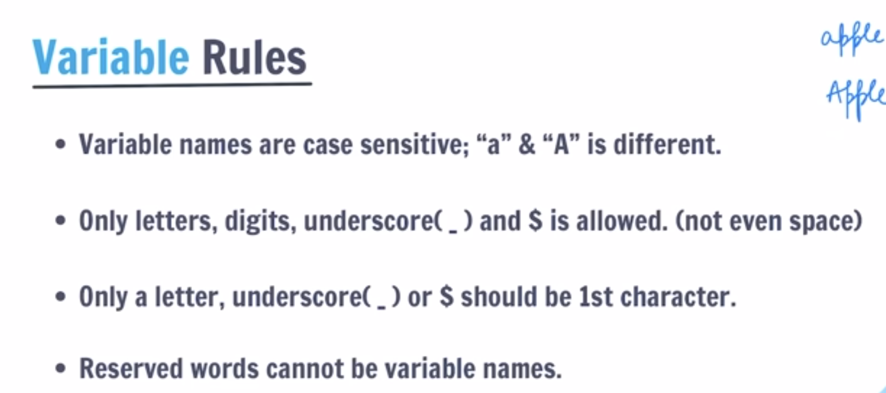

1. What is JavaScript?
Answer:JavaScript is a programming language that is used to create dynamic and interactive web pages. It is a high-level, interpreted programming language that is used to add functionality to web pages. It is a client-side programming language that is used to create dynamic and interactive web pages.   

- JavaScript is a high-level, interpreted programming language primarily used to make web pages interactive and dynamic. It was created by Brendan Eich in 1995 at Netscape.
- Where it runs: Originally designed to run in web browsers, JavaScript now also runs on servers (via Node.js), mobile apps, desktop applications, and even IoT devices.
- Core features: It supports object-oriented, functional, and event-driven programming styles. It's dynamically typed, meaning you don't need to declare variable types explicitly.
- ECMAScript — mention that JavaScript follows the ECMAScript standard (ES6/ES2015+)
- Role in web development: It's one of the three core technologies of the web alongside HTML (structure) and CSS (styling). JavaScript handles the behavior and logic layer.
____________________________________________________________________________________
2. Variables
- What is a variable?
- A variable is a container for storing data.
- In JavaScript, variables are declared using the var, let, or const keywords.
- let is the preferred way to declare variables in modern JavaScript.
- const is used to declare variables that cannot be reassigned.
- var is the older way to declare variables and is not recommended for use in modern JavaScript.

- Syntax:
- let variableName = value;
- const variableName = value;
- var variableName = value;

- Example:
let name = "John";
const age = 30;
var city = "New York";

console.log(name);
console.log(age);
console.log(city);

## Visual Guides

________________________________________________________________________________